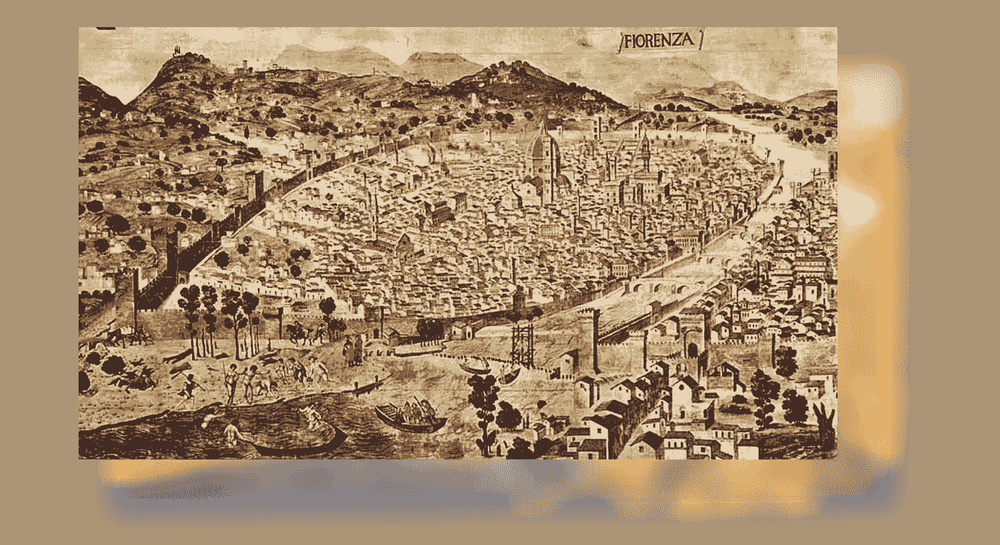
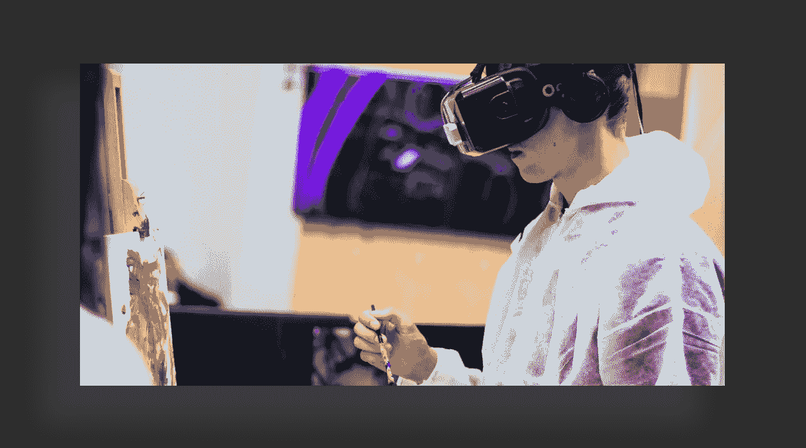
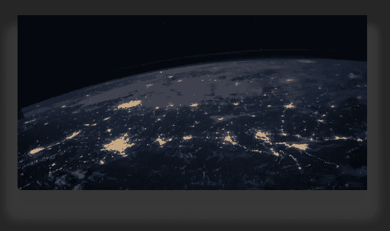

# 创造性思维需要的地方。

> 原文：<https://medium.com/swlh/the-place-creative-minds-need-d25d8860b003>

## 什么能激励我们找到发挥创造力的最佳地点。

*(本帖节选自《人才币》随笔，可在此阅读***。)**

*在这个社交媒体混乱、广告和流行语充斥的时代，真的有一个地方可以让好奇和雄心勃勃的创意人员去，在智力和经济上创造和繁荣，就像过去的一些伟大时代告诉我们的那样吗？*

*真的有一个地方欢迎来自各行各业的各种技能的个人和团体，阿尔法和被驱逐者，创造者和思想家……把他们聚集在一起进行合作、交流和发现吗？*

****发挥我们这一代人巨大潜力的地方？****

*像这样的地方不仅是逃避困惑带来的无聊和浪费精力的完美避难所，也是思想、创造和新事物的大熔炉，如果酿造得当，可以带来改变。*

*我们有些人在尝试，但我们都需要灵感。*

*所以，让我们想象一下，创造力和智力创新的完美环境会是什么样子。感觉如何，如何运作。*

*在这里，我们可以尽情地乐观和睁大眼睛。想象力没有限制。*

*创造的完美环境是什么样的？*

*我们可以从过去的一个真实生活的例子开始，一个伟大的时代，它在很长一段时间里一直是我们灵感的源泉。*

> ****文艺复兴时期。****

*具体来说，就是使文艺复兴成为可能的环境，一个成为其世界繁荣核心的地方，甚至现在仍被视为一个神奇的地方:**15 世纪的佛罗伦萨**。*

**

*是什么让它如此特别？*

*就像任何事情一样，许多是答案，许多是历史学家，他们希望关注复杂环境的不同方面，这些复杂环境使这座城市在正确的时间成为创新爆发的正确地点。*

*但是如果我们想简化原因，我们可以这样说:*

1.  *佛罗伦萨是一座新财富之城。新一代极其富有的资产阶级来到了公共生活的最前沿，准备挑战旧贵族并塑造对他们有利的时代。银行家是这一事件的核心。一个极其足智多谋的银行家家族在佛罗伦萨掀起了一场风暴，并开始统治它。他们是美第奇家族，部分是因为他们开明的统治，这座城市才发展到今天的高度。*
2.  *佛罗伦萨是富裕城市网络的一部分。没有人能独当一面。当时，国际商业贸易蓬勃发展，银行业正在彻底改变欧洲，迅速成为西方文明最强大的力量。人才和思想四处传播，传播到已经是他们繁荣的沃土的地方。佛罗伦萨处于一个绝佳的位置，可以利用这一切。*
3.  ***有钱就需要地位**。非贵族阶级积累财富意味着他们努力竞争地位、认可和声望。他们有很多钱花在享乐、聚会、宫殿上，并在世界各地寻找艺术家来围绕他们，创作美丽的作品来炫耀。他们投资新业务和技术创新。他们为新的自由主义法律游说，并进入政界。*
4.  ***古代经典**被重新发现。由于逃离东罗马帝国穆斯林入侵的难民，欧洲经历了一波对最伟大的古代文明的新热情，这变得更加理想化。法律、文本、服装风格、小说、诗歌和艺术征服了那个时代的思想和心灵。考古学家和探险者被他们的赞助人派去寻找被遗忘的地方和宝藏。激发这个时代的理想是对公共生活、秩序、美丽和荣耀的热爱。*
5.  *佛罗伦萨很小。最后，所有这些想法要想实现，不同技能和不同生活方式的人必须融合在一起。佛罗伦萨让这一切变得如此完美:艺术家和工匠们挤满了街道，就在大银行和贸易公司的拐角处。富有的赞助人和他们的艺术家住在一起，而艺术家又和他们的员工混在一起。政治家是诗人。战士是哲学家。*

*因此，这些特点使佛罗伦萨成为创新和文化成就的完美之地。当然，这总是与个人天赋有关，但这些是一个让天赋得以实现的地方的特征。*

*我现在看不到它发生。*

*然而，我认为这种罕见的巧合的情况是在我们现在的皮肤下再次酝酿，佛罗伦萨实验可以重复，如果这些情况得到帮助。*

*得出一些结论，我们完美的地方需要:*

1.  ***一种新的经济或产业产生了新一代的财富，一种新的赚钱方式。***
2.  ***一个庞大的交流和创新网络的一部分。***
3.  *是那些想把财富花在艺术、文化、创新和美容上的人居住的地方，因为广泛的认可和声望对他们来说非常有价值。*
4.  *重新发现被遗忘的理想，重新激发公众的热情。激发雄心、和谐和进步的怀旧之情。*
5.  ***成为一个联系紧密的社区，不同的个人和企业在这里相遇、合作、交流和相互提高。基本上，是生产力的狂欢。***

*当然，它需要吸引人才，让他们去试验、创新和创造价值。*

*这是给创意产业一个新的开始所需要的。让艺术家和企业独立成长，达到新的高度。我认为这些元素现在对我们来说是可用的。想一想:*

1.  ****一种新的经济或产业，产生了新一代的财富，一种新的赚钱方式。—*** 密码革命就是这么回事。创造价值的新方法，以及准备席卷全球的新一代财富。*
2.  ****一个庞大的交流和创新网络成为其中的一部分。—*** 这场商业和金融革命将 Playfold 置于一个跨越全球和各行各业的思想、资源和人才的大网络之中。*
3.  *是那些想把财富花在艺术、文化、创新和美容上的人居住的地方，唯一的理由是广泛的认可和声望对他们来说非常有价值。——这一代新人必须证明自己，向前辈挑战聚光灯。尤其是品牌，正在寻找新的方式来接触在线受众，这既是更好的时间和金钱投资，也是提高他们声誉而不是玷污它的东西。*
4.  *重新发现被遗忘的理想，重新激发公众的热情。一种激发雄心、和谐与进步的怀旧 *。*——这是 Playfold 的文化层面。我们这一代人需要和渴望的东西。我们已经生活在一个怀旧和文化混乱的时代，这只是因为当前社会群体的焦虑和分裂而加剧。进步可以来自对旧思想的重新利用，现在正是这样做的最佳时机。如果人们知道居住在一个激动人心的地方意味着什么。如果发挥你的才能真的能让你谋生，给你机会改变世界。如果思想和创造得到高度重视。如果对社区和每个成员，从大到小，都有广泛的爱和承诺。这样一个地方可以将原本浪费的能量和潜力转化为有用的应用。自我发展的进步。*
5.  *成为一个联系紧密的社区，不同的个人和企业在这里相遇、合作、交流和相互提高。基本上，是生产力的狂欢。——这样的地方必须在参与者之间打造新的关系。从前所未有的地方寻找和提取价值，以前所未有的方式回报，以前所未有的质量创造。*

*简而言之，这就是[play fold](https://medium.com/u/69bd8867531b?source=post_page-----d25d8860b003--------------------------------)社区。这是我们的目标，也是我们的灵感。*

**

*想象一个地方，它欢迎人们有事情可做，有东西可看，有前所未有的机会。 ***一个给人们创新的、令人兴奋的、激发智力的体验的地方，没有其他内容平台的约束和可预测性。各种各样的艺术家聚集在一起提供他们的创作，受到新工具的启发，尝试并承担风险，因为他们知道承担风险可以获得丰厚的回报。(这些新工具在一种称为“折叠”的数字格式中被共同使用，这将在下一篇文章中讨论)。****

*在这个地方，人们不仅被娱乐和文化产品所吸引，而且当他们分享、购买、帮助和自己创造东西时也会得到回报。他们越积极地做有益于社区的事情，就越能得到代币。*

*因此，他们被鼓励保持价值在系统中循环，他们更自由地决定他们愿意在艺术和内容上花费的频率和金额。作为一个活跃而紧密的社区的一部分，他们会有一种自我价值感和成就感。作为重要事情的一部分。*

**

*艺术家和创作者梦想有这样一个地方。在某个地方，他们可以尝试提供自己独特的视角来谋生。在这里，他们可以在一个地方与他们的观众充分互动和联系，而不必分散在整个网络上。*

****他们作为创作者的权利受到保护的地方。*** 在那里，他们的作品没有被稀释，而是可以在网上无限复制的物品，而是真正有价值的有编号的东西。与观众的金融关系是直接、透明、低成本的，没有欺诈或其他邪恶的伎俩。*

*中小型出版商可以努力夺回失去的 20 年的增长，并有机会通过互联网分销水平恢复到互联网前的收入水平。回到现状，只有他们给市场带来的价值才是决定他们成功与否的因素。他们是独立的，不依靠广告或特殊客户生存。*

*这些新的工具可以让他们以无与伦比的自由和潜力进行创作，而这些工具正是让佛罗伦萨如此特别的 21 世纪的翻版。艺术家和工匠的合作，人们混合他们的手艺，提供工具，提供服务，共同发展。*

*想象一下软件提供商、数字工具制造商、票务公司、许可和推广服务、活动组织者等等，他们都为艺术家和出版商提供专业知识，一起工作、探索并达到新的高度。*

*这个创意市场将是下一个改变世界的想法的完美沃土。*

**

*当然，在这个地方会有赞助人、投资者、高尚的创意赞助商，他们这样做不仅仅是为了世俗的回报，而是因为社区的钦佩和赞扬对他们来说是一种同样有价值的货币。*

*这些是 ***品牌，长期以来一直在寻找一种更高效、更廉价的方式来接触网上的年轻受众，让他们喜欢并传递他们的信息。****

*他们会通过赞助艺术家、创意和活动来做到这一点。向人们提供内容和其他体验，通过彩票、游戏和赠送方式赠送代币和其他礼物。*

*这将是它们新的猎场。一片新的土地让他们繁衍生息。*

*而不是像广告和商业广告那样让观众不高兴，最终结果将是每个人的体验大大改善。*

*这种终极抱负推动了 Playfold，同时也坚定了一个信念，即这样一个独立的环境只能与自己的经济共存。*

*感谢您的阅读！*

*一场伟大的创造性思维运动正在汇集，我想阅读你们的想法和抱负。*

*如果你喜欢，请跟随我和[play fold](https://medium.com/u/69bd8867531b?source=post_page-----d25d8860b003--------------------------------)。*

**

## *这篇文章发表在 [The Startup](https://medium.com/swlh) 上，这是 Medium 最大的创业刊物，拥有 282，454+人关注。*

## *在此订阅接收[我们的头条新闻](http://growthsupply.com/the-startup-newsletter/)。*

**

*✌🏻*