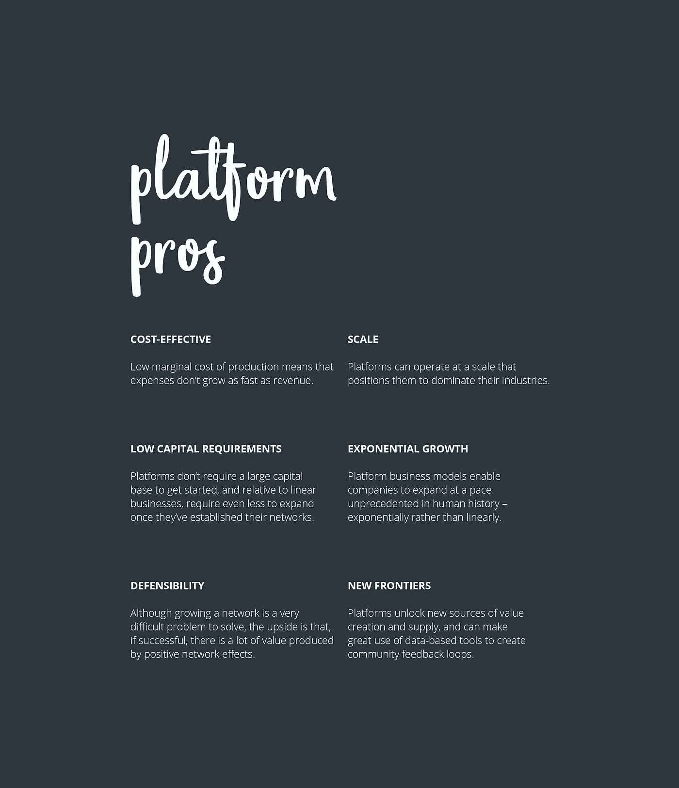
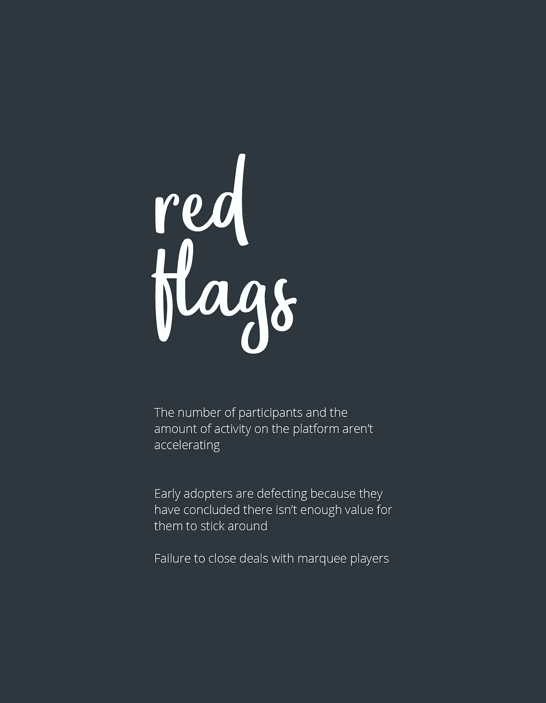
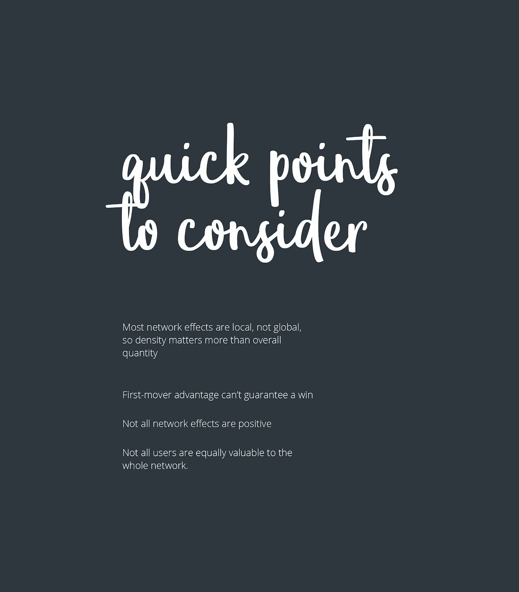

# 站台边缘

> 原文：<https://medium.com/swlh/the-platform-edge-dbc541320fa7>

没有一个行业和地区能够免受平台带来的破坏。它们已成为全球经济的核心部分，其影响力只会随着时间的推移而增长。虽然软件可能开启了数字革命，但平台正在吞噬世界。全球市值最大的公司有:苹果、Amazon.com、Alphabet、微软、脸书和阿里巴巴。2017 年，全球有 53 家初创公司获得了估值 10 亿美元或以上的独角兽地位。其中的[大部分](https://pitchbook.com/news/articles/unicorn-class-of-2017-25-startups-and-counting)也是平台业务。

# 虚拟基础设施

平台构建基础设施和工具来支持和发展网络化市场或社区，而不是投资生产和在一个屋檐下聚集大量资源(供应链作为商业价值的中央聚集器)。正是这些网络将企业和个人联系起来，使他们能够相互交换价值。

编排这些大型网络带来了新的挑战。传统工具虽然与线性业务相关，但不能用于理解或分析这些公司，这些公司在不同的商业模式下运营，并受到技术的推动(例如，更强大的芯片、互联网、万维网、宽带通信、编程语言/操作系统、云)。反过来，平台重新配置了价值创造、价值消费和质量控制，并通过将资产与价值脱钩、重新中介市场和整合市场，改变了整个商业格局。

回到基础，平台帮助有价值的东西交换的当事人(有形的或无形的；商品、服务或社交货币)找到对方，聚在一起，做一笔交易。不要让这个简单的定义欺骗了你，让你认为平台的商业潜力很低。相反，投资者一直在寻求识别和支持他们认为有潜力主导整个行业的平台。

很明显，无论你是投资者、企业家还是消费者，都不能忽视平台——我们被它们包围着，使用它们，投资它们，与它们竞争。

# 平台类型

平台分为两类:交流平台和创客平台。

交易平台主要通过优化消费者和生产者之间的直接交易来提供价值(如优步、阿里巴巴)。这些应该集中在建立流动性市场，有足够的供应和需求重叠。

创客平台通过让生产者创造互补产品并向大量受众广播或分发来创造价值(如 iOS、YouTube)。他们更注重有机地打造“明星”，然后这些明星可以在这些网络中充当强大的观众吸引力。由于创客平台的核心交易有一个广播范式——生产者创造一些东西并将其发送给许多人——生产者和消费者之间不需要直接互动。

# 成功的平台

虽然创建成功的平台业务没有通用的方法，但我们可以看看在试图理解和分析平台时应该考虑的主要因素。以下见解是从最近关于这个主题的三本书整理而来的，即:*平台革命*(作者杰弗里·帕克、马歇尔·范·阿尔斯廷和桑吉特·保罗·乔达里)*媒人*(作者大卫·s·埃文斯和理查德·l·施马伦塞)和*现代垄断*(作者亚历克斯·莫泽德和尼古拉斯·l·约翰逊)。

**有什么摩擦？**

当摩擦阻碍市场参与者轻松、直接地相互交易时，平台的机会通常就会出现。如果没有重大的摩擦需要解决，无论一个平台的技术有多好，都很难找到投资的理由。

尽早确定哪类参与者将从消除摩擦中获益最大至关重要。这些早期客户通常有能力指导增长战略，从而以一种重要的方式塑造平台。

记住时机也很重要；不仅仅是*解决了什么*摩擦，*何时解决*摩擦可能是一个平台成功的决定性因素。

**核心交互是什么？**

简而言之，所有平台都做两件事:降低交易成本，实现互补产品或服务的创新。获得正确的核心交互是平台设计中最重要的部分，因为平台需要它的用户一遍又一遍地重复这个过程来产生和交换价值。仔细观察平台是如何设计的，可以提供成功可能性的线索。

虽然多个平台可能会处理相同的摩擦，但它们处理核心交互的方式可以形成利基(例如，针对现有网络中服务不足的群体)，从而在竞争中获得优势。

成功的平台始于持续为用户创造高价值的单核交互。平台创业公司的创始人可能犯的最大错误之一是试图从一开始就建立多个核心交易。这些新的交互可以放在顶层，但是只有在核心交互被细化之后。

**鸡还是蛋？**

依赖于两种或两种以上类型用户(如创作者和消费者)的平台经常面临“协调问题”，其中任何一组都不会同意使用该服务，除非另一组也同意。这往往发生在媒人/交换平台上；如果其他人不出现，一个群体就没有产品。

回想起来，解决先有鸡还是先有蛋的问题总是看起来很容易。事实上，这是任何企业面临的最困难的问题之一。当新用户参与平台的价值超过参与的成本时，平台克服了先有鸡还是先有蛋的问题。(发生这种情况的点称为临界质量。)一旦一个平台的规模超过临界规模，网络效应就会累积，并帮助企业获得大部分市场份额。

**‘如果你建造了它，他们就会来’**

每个平台都必须有一个策略来达到临界质量。创始人必须对所涉及的挑战持现实态度，并制定策略，在投资耗尽或平台声誉受损之前，以正确的比例获得足够多的正确参与者。

平台企业家犯的最大错误之一是信奉“如果你建立了它，他们就会来”的谬论，因为除非合适的参与者加入，否则平台不会为任何人产生任何价值。一旦一个平台或任何企业获得了低于标准的声誉，就很难修复。

**人越多越开心**

网络效应是一把双刃剑。推动增长的同样的网络效应也使平台更难建立。积极的网络效应是平台企业价值创造和竞争优势的主要来源。最大限度地减少负面网络效应的关键是高质量的监管。

**做大还是回家**

平台业务的真正好处以非常大的规模出现。大多数平台要么做大，要么根本不成功。光有技术是不够的，尤其是在没有其他用户参与的情况下，平台几乎没有价值。

**数据层**

对于任何寻求建立和维护平台的组织来说，持续改进数据采集和分析方法都是一项重大挑战。平台的数据获取策略是什么样的，有可能如何发展？

**钱钱钱**

创始人应该从第一天起就考虑潜在的货币化战略，并规划他们的设计决策，以便尽可能长时间地保持尽可能多的货币化选择。由于先有鸡还是先有蛋的问题，平台通常不会立即产生收入，但随着平台网络的增长，收入应该远远超过成本。

要知道多边平台并不坚持传统经济学的逻辑。传统经济学认为，以低于成本的价格销售产品永远无利可图；多方面的经济学表明，实际上，即使向客户付费而不是向他们收取任何费用也是有利可图的。

**保持敏捷**

虽然所有企业都应该从市场中学习并对市场做出反应，但这对于多边平台尤为重要。达到临界质量是一个特别困难的问题，通常需要根据参与者的实际行为来调整初始计划。

不可避免的是，参与者会以创业者从未预料到的方式使用这个平台。平台设计者应该总是为偶然的发现留有余地，因为用户经常引领设计向何处发展。

**用户活动**

一般来说，用户承诺比用户获取更重要。重要的是活跃度——平台用户体验到的令人满意的互动的数量和比率——因此，平台必须通过构建参与激励来吸引用户。互动的成功吸引了活跃的用户，从而促进了积极的网络效应的发展。注意任何发展中平台业务的“漏桶”问题，即需要不断引入新用户来满足需求，因为现有客户不断离开。

**观察你测量的东西**

度量平台应该关注不同的生命周期。

在创业阶段，平台应集中精力跟踪平台上的核心交互(包括流动性、匹配度和信任度)。一个平台的目标不仅仅是增加参与者和互动的数量；它还必须采取措施鼓励可取的互动，阻止不可取的互动。

在增长阶段，关注可能影响增长和增强价值创造的指标(例如，用户群各部分的相对规模、生产者和消费者的终身价值以及销售转换率)。

在成熟阶段，通过识别为用户创造价值的新方法，以及识别来自竞争对手的战略威胁，查看推动创新的指标。成熟的平台通常会朝着更加开放的方向发展。这需要对流程进行持续评估和调整，以确保平台内容和服务价值始终保持高质量。

## 这篇文章发表在 [The Startup](https://medium.com/swlh) 上，这是 Medium 最大的创业刊物，有+ 370，771 人关注。

## 订阅接收[我们的头条新闻](http://growthsupply.com/the-startup-newsletter/)。

