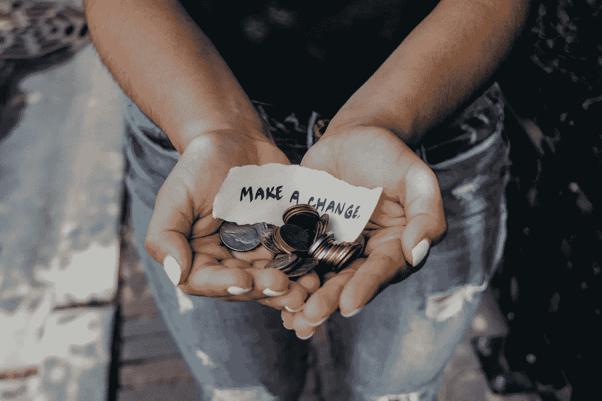
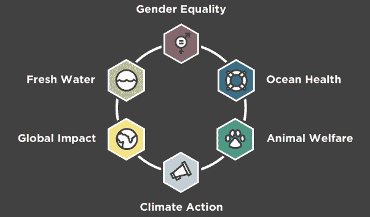

# 真正影响投资的平台

> 原文：<https://medium.com/swlh/the-platform-for-true-impact-investing-102fc704ddd2>

社会影响投资(SIIs)、ESG 或影响投资旨在实现两件事:

1.  社会目标
2.  财务报告

**影响力投资**这个术语相对较新，可以追溯到 2007 年意大利洛克菲勒中心，当时几位从业者聚集在一起，定义一种能够产生超过财务回报的新投资方法。从那时起，政府组织、非政府组织和金融机构都在讨论和使用这种投资方法。

在过去十年里，它确实改变了投资管理和慈善事业。

投资可以面向社会倡议或整体社会事业。现在，你可以创建和定制你的投资组合，以反映你深深关心的事业。

在你的投资组合中，有一些潜在的投资，你会发现它们的商业实践的公司摘要，以及它们的影响摘要，概述了你对它们的基金或业务的投资将解决这个社会问题。

时任美国总统巴拉克·奥巴马于 2012 年将《就业法案》签署成为法律，这是一项具有里程碑意义的法律，允许小额投资，取消了古老的行业最低限额。

# **为什么这很重要？**

现在你可以随时随地将两者合并，只需 5 美元。

*   [**新日影响力投资**](https://newdayimpact.com/how-to-invest/) 拥有完全定制的投资组合，专注于由[联合国可持续发展议程](https://www.un.org/sustainabledevelopment/development-agenda/)引领的一些关键议题。
*   [**Newday**](https://newdayimpact.com/how-to-invest/) 是一个伟大、便捷和用户友好的平台，它利用了许多传统金融公司没有利用的东西——创建整体的可持续投资组合。
*   千禧一代关心对社会负责的投资，这很重要，因为这一代人意识到重大的全球挑战，并在寻找创造直接影响的方法。
*   根据[美国 SIF，影响力投资从 2012 年到 2016 年增长了 135%，在 2016 年到 2018 年间增长了 38%](https://www.ussif.org/files/2018%20_Trends_OnePager_Overview%282%29.pdf)。

## **下面是** [**纽迪的作品集**](https://newdayimpact.com/global-impact-investment-portfolio/) **看起来是什么样子:**

影响力投资是*一旦*想到一种你必须“牺牲”的投资方式。为了社会影响而牺牲投资回报，这完全不是事实。

事实上，从 1990 年 5 月到 2018 年 3 月，包括股息在内，摩根士丹利资本国际 KLD 400 社会指数(衡量社会责任投资者的指数)每年都比标准普尔 500 指数高出 0.5%。

随着社会责任成为一个关键问题，该行业的预计增长将在未来十年继续增长，并成为投资的主要力量。

*最初发表于*[T5【www.quora.com】](https://qr.ae/TUhzAz)*。*

## 这篇文章发表在 [The Startup](https://medium.com/swlh) 上，这是 Medium 最大的创业刊物，有+391，714 人关注。

## 在此订阅接收[我们的头条新闻](http://growthsupply.com/the-startup-newsletter/)。

