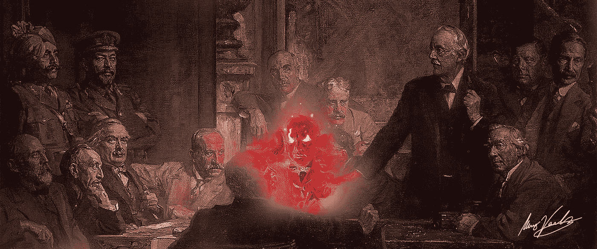
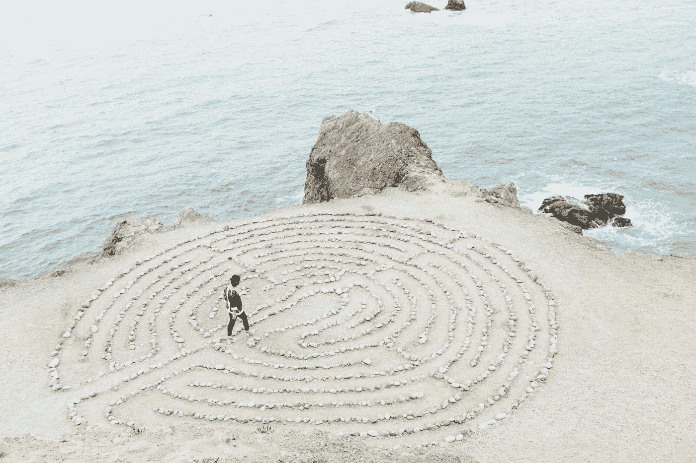

# 情感思维的力量。

> 原文：<https://medium.com/swlh/the-power-of-an-emotional-mind-5da2f23ae1c6>

> 我们不想成为我们不参与的无形游戏中的傀儡。而理性思考似乎是我们最好的出路。但是它有一个很大的限制…

进步的核心一直是这样一个信念，即为了进化，我们需要了解自己。我们的思想，我们如何思考以及为什么思考，所以我们可以注意到这一点，并以更好的方式存在。一种**哲学**的有条不紊的学说。虽然在上个世纪左右，哲学已经成为人类进步的产物，它的力量被精神分析学、社会学和神经科学等“硬科学”彻底侵蚀，尽管自从后现代主义的吞噬风暴开始肆虐以来，没有出现过值得广大群众感兴趣的创新火花，但哲学的目的在今天仍然是必要的和有效的。

特别是在西方，我们对自己的理性感到自豪和敬畏。逻辑思维是推动我们前进的动力，而讽刺的是，来自哲学的内省却在优先考虑的事情中退居二线。

即使逻辑是我们最糟糕和最好的本能之间的持续斗争，一场我们经常输掉的战斗，我们仍然相信纯粹的理性赋予我们在社会中迅速和独立行动的能力，尽我们的一份力量。这很好。我们被教导要成为社会的一部分，为了我们自己和每个人。我们被教导批判性思维。

批判性思维是一门艺术，一种需要掌握的技能。就像义务教育中的大多数其他科目一样，它经常被教授足够的深度和足够的信念来获得资格。你学 ***刚好够*** 数学， ***刚好够*** 历史。 ***刚好够*** 的逻辑。

在技术时代，每个人都在用同样半心半意的批判性思维表达自己，很容易感觉到清醒的理性主义者和无知的穴居人之间的史诗般的战斗，理性的名字被高举。对方被耍了，他们太傻了，注意不到。如果你想清楚了，你会站在我们这边的。逻辑是通往美好未来的唯一途径。

**进步是冰冷的。**

企业需要精明地经营，精明意味着一个连续的理性计算链。科学应该冷静公正地进行，否则结果会被认为是无效的。

但是就像迷信和精神错乱的启示会导致迫害一样，完全被无定形的理性束缚的时代会导致愤世嫉俗和痛苦。

我们理所当然地厌倦了媒体、政府、企业和宗教操纵我们的情绪。为了销售广告而放大和扭曲强烈情绪的社交媒体平台。将我们销售产品的本能货币化的广告。我们不想成为我们不参与的无形游戏中的傀儡。而理性思考是我们最好的出路。

# 伤害还是和谐

我们为换取理性而要付出的代价，不能是对我们感性本质的破坏。这也是一条导致压迫和绝望的道路。也许这是我们最危险的逻辑缺陷的最明显的例子，那就是我们绝对地思考。

我们已经进化了数百万年来拥有情感。它们服务于一个真正的目的，在我们身上，就像所有其他有知觉的生物一样。

情绪是感知的窗口。

我们大脑接收和储存新信息的唯一方式。它们是我们看待世界的方式。即使是最理性的生物，在进行最平凡的机械活动时，比如一个实验室助手在深夜对灰尘样本进行编目，也会将他们所做的事情感知并存储为触发信息记忆的**情感线索**。

我们有一个情感的字母表，可以组合成无数的单词、句子和复杂的杰作。而我们存在的每一个瞬间，都被感知为核心情感的复杂马赛克。

换句话说，我记得在一个阳光明媚的下午走在摄政街上的细节，因为我记得将我与那一刻联系起来的情感反应链。我记得我身后的太阳光环，交通的气味，建筑物的强大优雅，人们的身体快速通过。**情绪是获取数据的关键。**

就像理性思维一样，感性思维也需要被当成一种技能来掌握。一种武术。

这是有充分理由的。

不仅关闭 50%的自我是愚蠢和错误的，而且情感思考实际上提高了我们对周围世界的批判性理解。

在一天结束的时候，我们不一定会试图将现实感知为一个冰冷、无目的的数据集。我们只是想尽可能清楚地理解它，而不是成为我们环境的受害者。出于这个原因，本能、创造力、情商和精神求知欲可以打开许多横向思维方式的大门，它们可以被添加到任何基本的理性思维中，带它到它甚至梦想不到的地方。

想象力增加了你从任何给定问题的所有可能变量中预测正确结果的机会。情感智慧帮助你理解周围的人，预测他们将如何行动或在某种情况下如何行动，即使你不知道所有的事实。灵性是一种朝向正念的奋斗，我个人找不到比这更适合思维清晰的头脑的了。

你的直觉知道一些强大的、古老的潜意识真理，这些真理表面上很难把握。生活中的一些基本问题，如生存和幸福，大多总是在潜意识中得到解决，即使是现在，它们也可能最好留在那个领域。即使是现在，当同样的问题以更复杂的形式呈现在我们面前时，比如商业谈判或政治斗争。

社会不是机器。进步不一定要冷淡。

> “我认为想象力比知识更重要。因为知识是有限的，而**的想象力**拥抱整个世界，刺激进步，催生进化。”
> 
> 阿尔伯特·爱因斯坦

我们不必是只跟随感觉和本能的幼稚野蛮人。我们也不能成为无情的机器，完全不关心周围环境的情感内涵。这两种都是极其危险的失明形式。

毕竟，我们是和人类打交道的人类。只要是这样，我们就需要在头脑中有一个完整的画面。

所以在森林里漫步，阅读一些意识流，思考树枝上树叶的永恒对称。我们追求的是和谐。逻辑和直觉之间的平衡有一种强大的美。两种互相授权的武器。

找到他们两个。两者兼得。

这就是它的美妙之处。

# 感谢您阅读本文！

# 如果你喜欢，请在[媒体](https://medium.com/u/504c7870fdb6?source=post_page-----5da2f23ae1c6--------------------------------)和[马库斯·凡德亚](https://medium.com/u/a591af746ad5?source=post_page-----5da2f23ae1c6--------------------------------)上关注我，在 [INSTAGRAM](http://INSTAGRAM.COM/MARCUS_VANDEA) 和 [TWITTER](http://TWITTER.COM/MARCUSVANDEA) 上关注我。

# ✌🏻

## 这篇文章发表在 [The Startup](https://medium.com/swlh) 上，这是 Medium 最大的创业刊物，拥有 336，210 多名读者。

## 在此订阅接收[我们的头条新闻](http://growthsupply.com/the-startup-newsletter/)。

