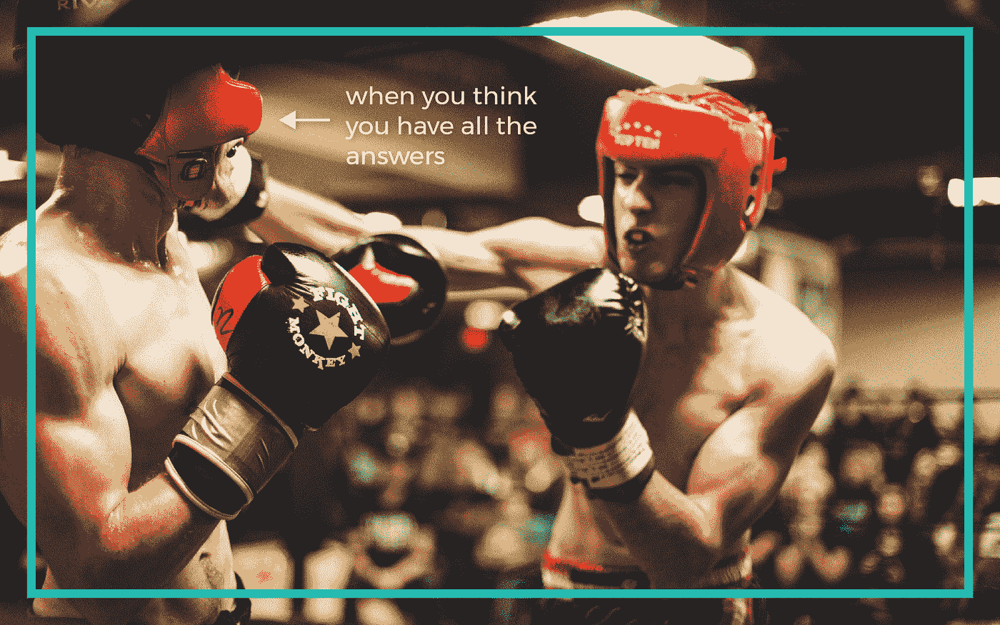
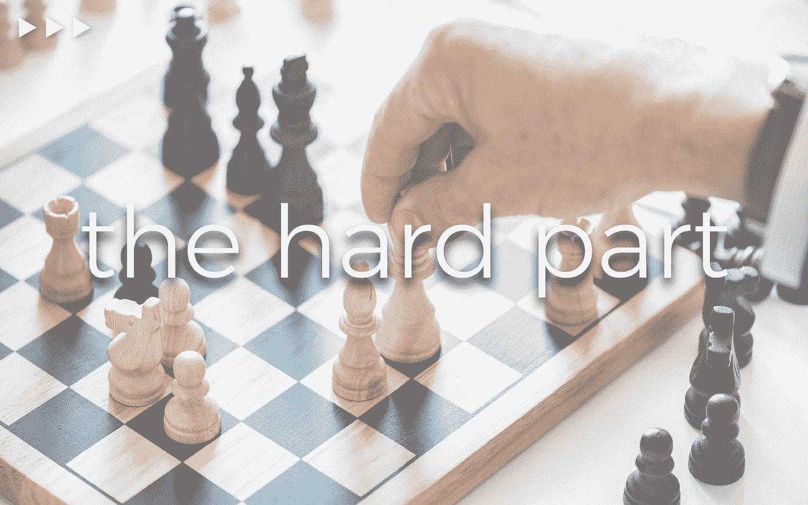

# 冲突的力量——马斯克、乔布斯、迪士尼和雷伊·达里奥如何对抗失败

> 原文：<https://medium.com/swlh/the-power-of-conflict-how-musk-jobs-disney-and-ray-dalio-fight-failure-cbab02fb6136>

Photo by [Serge Kutuzov](https://unsplash.com/photos/meqVd5zwylI?utm_source=unsplash&utm_medium=referral&utm_content=creditCopyText) on [Unsplash](https://unsplash.com/search/photos/batman?utm_source=unsplash&utm_medium=referral&utm_content=creditCopyText)

你有没有注意到，几乎每一个超级英雄都经历过某种可怕的创伤，然后才变成非凡的人？钢铁侠被绑架了。蝙蝠侠目睹了他的父母被谋杀。神奇女侠的阿姨和蜘蛛侠的叔叔也是如此。这种转型创伤似乎也发生在现实世界中。一些有史以来最伟大的创新者在他们的职业生涯中面临重大失败。

最近，当我听亿万富翁投资者雷伊·达里奥描述在看似非常有前途的早期职业生涯后彻底破产时，我产生了这个想法。当他在描述不得不向他父亲借小额贷款来支付家庭当月账单的痛苦时，我意识到，达利奥的故事——适度的成功、彻底的失败，然后是史诗般的创新——其实并不那么独特。埃隆·马斯克(Elon Musk)在度蜜月时被董事会解雇。史蒂夫·乔布斯被踢出苹果公司。华特·迪士尼的第一家动画工作室彻底破产了。

这是怎么回事？失败是改变世界的成功的必要前提吗？仅仅是尝试没人尝试过的事情的成本吗？我们是不是都应该毁掉当前的项目，这样我们就能从失败中获得经验？当然不是。对你来说幸运的是，我们可以从别人的失败中吸取教训，而不必自己经历如此剧烈的痛苦。

这些创新偶像都知道他们没有所有的答案。他们学会了谦逊。这是一个普遍的问题。心理学家一次又一次地发现，大多数人都极大地高估了自己的知识。我们的大脑，就像某些社交媒体网站一样，充满了假新闻。根据不好的信息做决定会导致不好的结果。你失去了你的财富。你会失去你的公司。

Photo by [Hermes Rivera](https://unsplash.com/photos/qbf59TU077Q?utm_source=unsplash&utm_medium=referral&utm_content=creditCopyText) on [Unsplash](https://unsplash.com/search/photos/boxing?utm_source=unsplash&utm_medium=referral&utm_content=creditCopyText)

这种彻底的失败是令人痛苦的。大部分人都没有从中恢复过来。但像马斯克和达利奥、迪士尼和乔布斯这样的人，他们又回到了竞技场。他们竭尽全力避免过去的错误。当你对上次让你陷入困境的想法(你自己的想法)彻底怀疑时，只有一件事可以降低你失败的风险——寻求他人的意见，尤其是那些与你意见相左的人。

毫无疑问，乔布斯和马斯克因在冲突中传递创造力而闻名。但是鼓励不同的观点并不意味着你必须发展出令人讨厌的名声。在他的书 [*原则*](https://www.amazon.com/Principles-Life-Work-Ray-Dalio/dp/1501124021/ref=sr_1_1_sspa?ie=UTF8&qid=1529584508&sr=8-1-spons&keywords=principles&psc=1) 中，达利奥称他有意寻求不同意见的过程为“深思熟虑的分歧”有四个步骤可以鼓励深思熟虑的、不会演变成无益冲突的分歧:

**找专家**

深思熟虑的分歧始于寻找与你观点不同的人*和*彼此观点不同的人。但关键不是从街上随便找个人，而是找到可信的人——那些你认为其观点对手头的主题有价值的人。收集这些不同的观点有点像购买共同基金，而不仅仅是一家公司的股票。多样化你的观点，就像多样化你的投资组合一样，减少了你失败的风险，而没有太多的负面影响。

**有对话**

下一步是召集这些专家。当然，除了单独征求每个专家的意见，你会得到一些价值，但是如果你能让他们彼此交谈，你会得到更多。

**设定基本规则**

所以你让一群专家在一个房间里互相争论。这可能会很糟糕。不要让对话演变成一场大喊大叫的比赛，重要的是在对话开始时制定基本规则:

*   从重申你们来到这里的原因开始。每个人都应该为你和你的团队着想。
*   选择一种形式，让每个人都有平等的机会分享他们的意见。
*   指定一名主持人。这可能是你或另一个非专业的第三方，他们可以确保每个人都理解对话中提出的所有要点，并有机会做出回应。

Photo by [rawpixel](https://unsplash.com/photos/Cmerk5uR1WI?utm_source=unsplash&utm_medium=referral&utm_content=creditCopyText) on [Unsplash](https://unsplash.com/search/photos/chess?utm_source=unsplash&utm_medium=referral&utm_content=creditCopyText)

**决定**

现在是困难的部分——决定。做决定是人类大脑从事的最耗费脑力的活动之一，所以毫不奇怪我们会尽一切努力去避免做决定。我们的大脑试图逃避决策工作的最阴险的方式之一是通过投票来“决定”。在工作环境中，投票决定经常被掌权者用作一种方式来逃避决定以及对其后果的任何责任——相当棘手。投票会导致一些非常糟糕的结果。每个人可能生来平等，但他们一生中发展的专业技能并不平等。

*   与其投票，不如从定义你做决定的原则开始。你试图最大化的价值观是什么？
*   第二，对你觉得更可信的意见给予更大的权重。让每个人都能够根据过去的表现在不同的专业领域给彼此打分。达利奥的另一个建议是:可信的人是那些已经成功并能告诉你为什么成功的人。
*   最后，做决定。向你召集的团队解释你的理由，但要为这个决定承担个人责任。

对许多成功的创新者来说，获得谦逊是一个转变的时刻。大多数人通过难以置信的失败，艰难地学会了谦逊。但是他们站在了另一边，拥有一种超能力——比其他人做出更好决定的能力。如果你能做出比别人更好的决定，你会成功吗？当然啦！幸运的是，你不必努力失败就能成为决策型超级英雄。你只需要学习深思熟虑的艺术，像冠军一样战斗。

*原载于*[*innovate everything . io*](https://innovateeverything.io/the-power-of-conflict-how-musk-jobs-disney-and-ray-dalio-fight-failure/)

## 这篇文章发表在 [The Startup](https://medium.com/swlh) 上，这是 Medium 最大的创业刊物，拥有 337，320 多名读者。

## 在这里订阅接收[我们的头条新闻](http://growthsupply.com/the-startup-newsletter/)。

