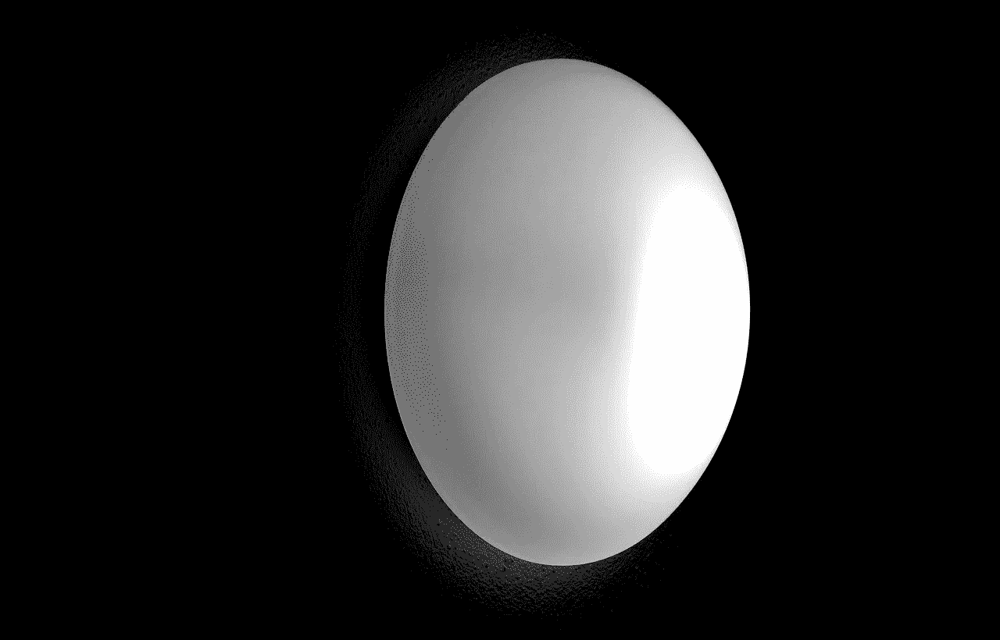

# 创造和保持空间的力量

> 原文：<https://medium.com/swlh/the-power-of-creating-and-holding-space-1090eeba0b4c>

## 说你有压力并不准确。

你真正的样子是害怕。

怕疼。

害怕失败。

害怕被拒绝。

害怕不确定。

每一次压力经历背后都隐藏着一个恐惧的故事。

顺便说一句，你的恐惧故事可能与你周围实际发生的事情有关，也可能无关。所以才叫故事。

当你有压力时，一切都会加速。

心率。

呼吸。

思想。

演讲。

身体和大脑对你脑海中的恐惧故事做出反应。

这没关系。这是自然的。

但并不总是有帮助的。

它会让你寻找最近的出口。

需要修理的东西。

有地方可逃。

一个可以藏身的地方。

要责备或反抗的人。

你的思想和情感被劫持了。

在这种情况下，你可能会选择只会让问题变得更糟的行动。

或者选择完全不行动。

此外，压力是会传染的。

它会在一个团体或团队中迅速传播。有时通过整个组织。

现在我们有了很多人出于恐惧故事而行动的累积效应。在大多数情况下，这不是一件好事。

解决方法在于创造和保持空间的简单行为。

很简单，但不容易。掌握这种强有力的冲击和影响需要练习。旧习惯必须改掉。旧行李丢弃。

**你必须练习觉知。**这是一种无需判断就能注意到的技巧，在你对压力产生的冲动采取行动之前，你正处于一个恐惧的故事和压力的状态中。

**你必须练习正念。这是一种创造内心空间的技巧，通过专注于你的呼吸，平静你的头脑，放慢速度，让你看得更清楚。**

你必须练习意图。这是一种利用新空间从你更深层次的智慧和价值观中汲取的技能，这样你就可以选择你的反应，而不是对压力做出反应。

在压力较低的情况下开始学习可能会有所帮助，你可以通过与导师或给你反馈并鼓励你进步的人合作来加快学习过程。

一旦你学会了为自己创造空间，并冷静、果断地做出反应，并采取正确的行动，你就会对周围的人产生强大的影响。

就像压力一样，平静、自信和连贯的反应是会传染的。在某种意义上，你成为了风暴的中心。人们会在困难的情况下向你求助，并依靠你抵抗情绪和噪音的能力。

反过来，他们会将精力投入到更优雅、更有效的危机解决方案上，不管是什么样的危机。尽管人们倾向于相信这种方法可能会减慢速度，但事实恰恰相反。

这就是你为别人保留空间的方式。这是一份你可以分享的美好礼物，可以赢得深深的感激和尊重。

作为一名领导者，有许多实用的技能可以帮助你增值。这个可能不那么明显。

与其说是*做*，不如说是*做*的一种方式。然而，它具有独特的价值，可以放大你学到的所有其他*做*的技能，因为它创造了你需要有效运用它们的精神和情感空间。

现在你也为其他人提供了施展智慧和天赋的空间。反过来，他们学会为他人保留空间，这是你刚刚创造的许多新空间，在那里各种各样的好事都可能发生。

最终，它会蔓延到你生活的其他领域，然后是他们的生活，现在你只是让这个世界变得更美好。

减法乘。

> 当你看到的不是你失去了什么，而是你在为新事物创造空间中获得的一切时，放手会变得更容易—重命名 Vullings

*原载于 2018 年 3 月 28 日*[*soul2work.com*](https://soul2work.com/2018/03/the-power-of-creating-and-holding-space/)*。*

## 这个故事发表在 [The Startup](https://medium.com/swlh) 上，这是 Medium 最大的创业刊物，拥有 310，032+人关注。

## 在这里订阅接收[我们的头条新闻](http://growthsupply.com/the-startup-newsletter/)。

