# 早期测试版用户的力量

> 原文：<https://medium.com/swlh/the-power-of-early-beta-users-b1cf08317721>

## 在不到一个月的时间里，用户从 0 增加到 2500

什么被认为是成功的产品？

满足客户生活中的需求并帮助他们更加成功。

如果你想成功推出一个 MVP，获得牵引力，并最终打造一个有价值的产品，你应该在开始打造产品之前就找到你的潜在客户，并与他们合作。

只有一个问题:如何找到早期用户并获得反馈？

在不到一个月的时间里，我们在 Infinity 网站上成功吸引了超过 2500 名早期订户**，我想和大家分享一下我们采取的具体步骤。**

# **客户开发和产品开发一样重要**

**我们一直宣扬的一条建议是:**从你自己的问题中产生想法，并验证其他人是否也有同样的问题。****

**我们经营着一家数字营销机构，在那里我们与一个 20 多人的团队同时为多个客户管理几个项目。**

**我们努力寻找一种工具，它能给我们一个清晰的工作流程概览和足够的灵活性来组织我们需要的一切，从客户的项目到我们的内部流程。**

**在做了彻底的市场调查后，我们意识到我们可能发现了一个值得认真对待的问题。**

**我们有了解决方案的愿景，并聘请了一家 UI/UX 代理公司来帮助我们设计概念和引人注目的品牌。**

**我们知道我们需要与不属于我们的其他人一起验证这个想法，所以我们创建了几种类型的客户角色来联系:**

*   **创始人和 C-Level 高管**
*   **项目经理和团队领导**
*   **营销人员和创意人员**
*   **软件开发人员和产品团队**

**我们使用了 Hubspot 的[客户角色模板。](https://offers.hubspot.com/persona-templates)**

**我们通过在 Linkedin 上与相关人员联系，并就一些行业问题、工具、黑客等进行随意的交谈，完全手动开始了我们的线索生成过程。**

**一旦我们觉得某人足够感兴趣，我们就会给他们发一份我们设计理念的互动演示，这样他们就能知道我们在做什么，工具是如何工作的。**

**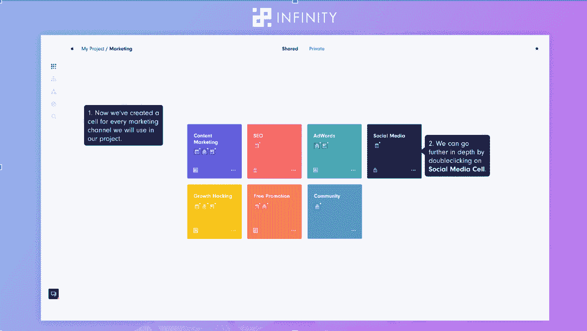**

***This is a* [*presentation of an old Infinity concept*](https://docs.google.com/presentation/d/136APtrVIXCLFELsl5fIluWHZrj_t7VxCmQVS1GEWFIc/edit)*.***

**在他们看过演示后，我们会要求他们填写一份快速调查，以了解我们的产品是否有潜力变得足够好，让他们真正购买和使用它。我们的问题简明扼要。**

**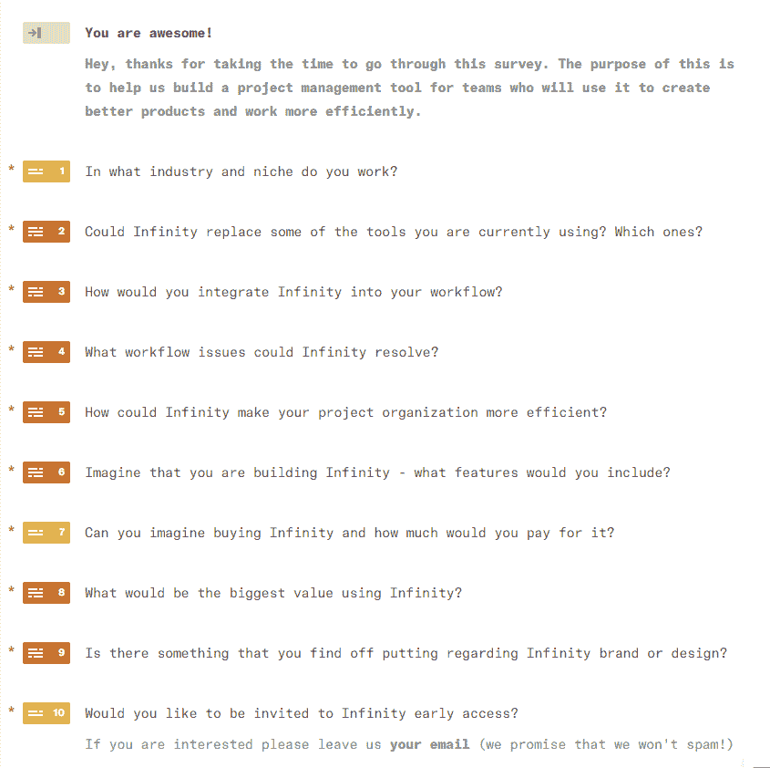**

**Typeform 对于这项任务来说非常方便，因为它易于使用(对我们和调查参与者来说都是如此),并且有一个很棒的仪表盘，您可以在那里跟踪和过滤答案。**

**谈到我们用于开展外联的 lead gen 渠道，除了 Linkedin，我们还联系了在 Quora、ProductHunt 和一些目标受众活跃的脸书团体上找到的相关人员。**

**我们已经使用 ProductHunt 找到了最相关的人，他们以前喜欢、分享或投票支持类似于 Infinity 的工具。**

**如果你对接触大玩家感到紧张，不要。**

**我们注意到的一件事是，像 Hotjar 或 Typeform 这样的成功创业公司的创始人非常乐于分享他们的观点并给出建议。**

**大多数接受调查的人对购买该工具、替换他们使用的其他工具以及留下他们的电子邮件以获得测试版的问题做出了肯定的回答。**

**对我们来说，概念验证是成功的！**

**是时候创建一个登录页面并开始开发产品了。**

# **为成功的运动奠定基础**

****病毒循环****

**你可以获得鼓舞人心的“增长黑客”想法的一些最好的地方是创始人和企业家分享他们自己经验的社区。**

**确保你是 [SaaS 成长黑客](https://www.facebook.com/groups/SaaSgrowthhacking/)、 [BAMF 脸书群](https://www.facebook.com/groups/growthmarketers)、[流量&文案](https://www.facebook.com/groups/trafficandcopy/)以及类似社区的成员。**

**这些地方是我们发现[病毒循环](https://viral-loops.com)的地方，这是一个非常棒的推荐营销软件，有非常有趣的用例。**

**对我们来说，最有吸引力的是 Robinhood 的预发布活动，它甚至在发布之前就为他们赢得了 100 万用户。**

**我们感到受到了挑战。**

**我们喜欢这个特别活动的一点是，它指出了对错过的恐惧和排他性。**

**为了从此次活动中获得最大收益，我们需要让我们的激励措施尽可能具有吸引力。**

**这个想法是提供一个独家和有限的封闭测试，并对顶级推荐额外奖励。**

**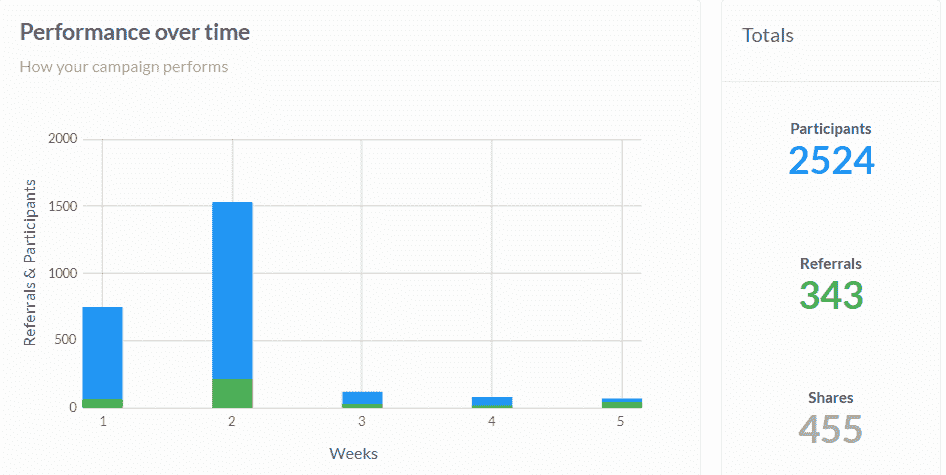**

**活动是如何运作的？**

**在访问者订阅了早期测试版后，他们会被放在一个等待名单上。**

**然后，他们获得自己独特的推荐，在社交媒体上或通过电子邮件分享。**

**当他们的推荐人与 Infinity 签约时，他们在等待名单上的位置会提高，有更大的机会提前进入并赢得奖励。**

**建立病毒循环非常简单:粘贴几行代码，在你的登录页面上添加一个 CTA 按钮，并根据你的需要定制活动内容。就是这样！**

****登陆页面****

**人们喜欢干净、吸引人的登录页面。**

**我们花了一些时间来使我们的设计独一无二，并编写引人注目的内容。**

**当谈到登录页面内容时，最重要的事情之一是要有一个与您的受众相关的明确的价值主张。**

**我们利用内部沟通数据和调查数据来了解如何最好地传达我们的解决方案。**

**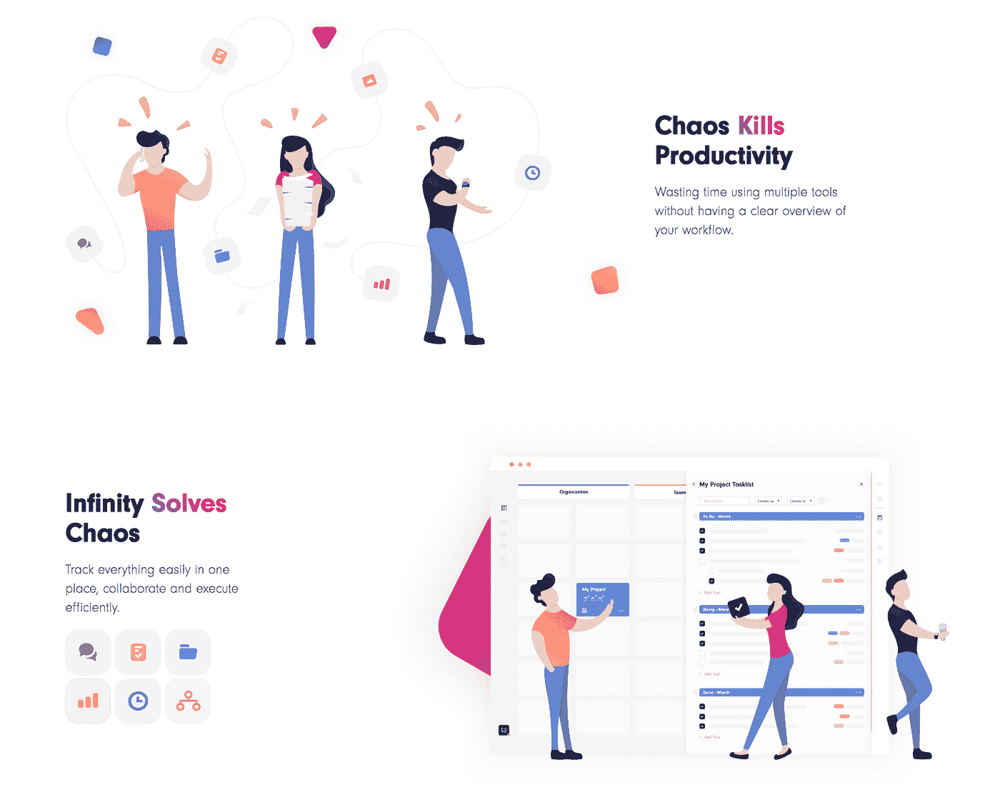**

**当你在建立一个 SaaS 时，快速解释你的产品的最好方法之一是一个解释者视频，所以我们在我们的登陆页面上增加了一个。**

**除了病毒循环之外，我们希望有一个选项来支持我们的订户并与他们实时交谈，所以我们添加了对讲机。**

**除了能够与你的访客即时沟通，通过 Intercom 你可以根据几个标准来划分用户的电子邮件，并通过点滴活动吸引他们。**

**简单回顾一下我们在开始促销活动之前所做的事情:**

*   **[登陆页面](https://startinfinity.com/)**
*   **[解说视频](https://www.youtube.com/watch?v=33alA_Gf68Q)**
*   **[病毒循环](https://viral-loops.com/)**
*   **[对讲机](https://www.intercom.com/)**

**现在是时候开始宣传我们的故事并结束测试活动了。**

# **推广封闭测试版**

**对我们来说，由脸书广告支持的 BetaList、Medium 和 ProductHunt 是完美的组合。**

****测试列表****

**我们非常渴望看到我们的目标观众会如何评价我们的努力，所以我们开始寻找合适的渠道。**

**选项很多，但在 Reddit、Quora 和其他社区上做了一些挖掘后，我们决定尝试 BetaList。**

**为什么？**

*   **我们读到了成功的(和最近的！)案例研究**
*   **巨大的月流量(通过 SimilarWeb 检查)**
*   **人们经常留下评论和反馈**
*   **价格是合理的**

**我们选择了 129 美元的套餐，这样就不用排队了。**

**它得到了回报。**

**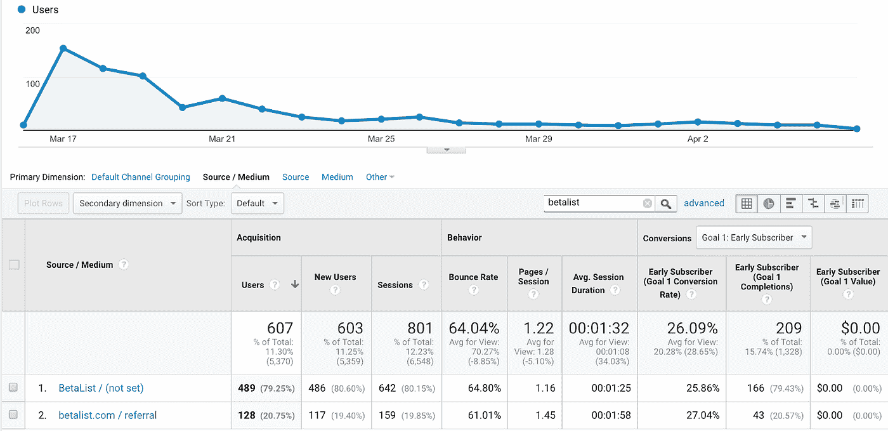**

**以下是**前 20 天**的结果:**

*   **登录页面访问者:607**
*   **封闭测试版用户:209**
*   **转化率:26%**

**我们被 BetaList 的用户转化率震惊了。**

**除了良好的指标，BetaList 还是一个不错的选择，还有一个原因:它给了我们一个想法，增加了一种与观众沟通的方式。**

****中等****

**就在 BetaList 提交后的一天，我们看到有人发表评论问*“它和 Trello 有什么不同或者更好？”*。我们被要求重新分析我们的价值观，这激励我们写了一篇关于它的文章:[“Infinity 比 Trello 更好吗？”。](/infinitypm/is-infinity-better-than-trello-3b8ef7437022)**

**我们还没有准备好博客版块，所以我们决定[在媒体](https://help.medium.com/hc/en-us/articles/115004681607-Create-publication)上创建一个出版物并发布在那里。20 天的结果让我们吃惊:**

**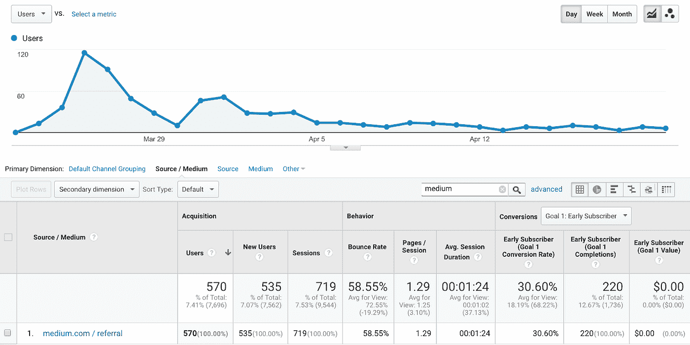**

*   **登录页面访问者:570**
*   **封闭测试版用户:220**
*   **转化率:30%**

**中等指标:**

*   **文章浏览量:3896**
*   **读数:1372**
*   **关注者:39 人**

**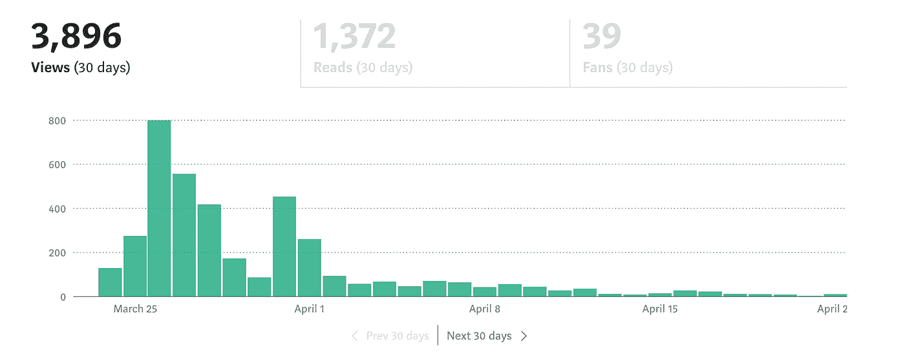**

**除了获得流量，对我们第一个媒体帖子的反应激励我们继续运营一个透明博客，作为与我们的观众交流的一种方式。**

****付费推广****

**我们用来支持文章和登陆页面推广的付费渠道是脸书和一些 Adwords 的实验。**

**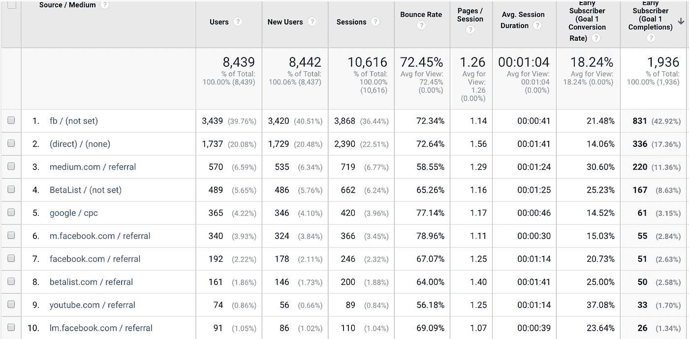**

*   **登陆页面访问者:大约。4000**
*   **封闭的测试版用户:大约。1000**
*   **转换率:大约。25%**
*   **花费:大约。$1600**

**我们过去投放了很多脸书广告，这些是我们见过的最棒的结果。**

**正如你可能注意到的，转换率远非所有渠道的平均水平，所以从逻辑上讲，我们可以把这个数字归功于一个好的登录页面。**

**永远投资在你的登陆页面上。**

****谷歌广告****

**谈到早期的 Adwords 活动，我们强烈建议的一件事是[对你自己的品牌名称](https://www.poweredbysearch.com/blog/8-reasons-why-you-should-bid-on-your-brand-name/)进行投标。**

**当活动开始时，我们知道人们会开始在谷歌上寻找我们。**

**问题是，我们的品牌名称是“Infinity ”,这个短语非常有竞争力，所以我们希望从一开始就帮助谷歌在结果中提高我们的位置，并开始为品牌短语运行一些 Adwords 广告。**

****ProductHunt****

**你大概能猜到我们尝试的下一个推广渠道:ProductHunt。**

**这是一个非常棒的创业和新产品社区。**

**但是有一件事你应该记住:你只有一次机会发布 ProductHunt。**

**如果你有信心你的产品是创新的，并充分发挥其潜力，你可能会有机会。否则，你应该忍住，专注于发展。**

**尽管如此，还是有一种方法可以在正式发布之前向社区推广你的产品，并确保在你准备好之前没有人*追捕*—[发货(按产品追捕)](https://www.producthunt.com/ship)。**

**Ship 是我们用来宣布即将推出的产品和扩大邮件列表的工具。它可以为您提供各种选项，完全取决于您选择的软件包。**

**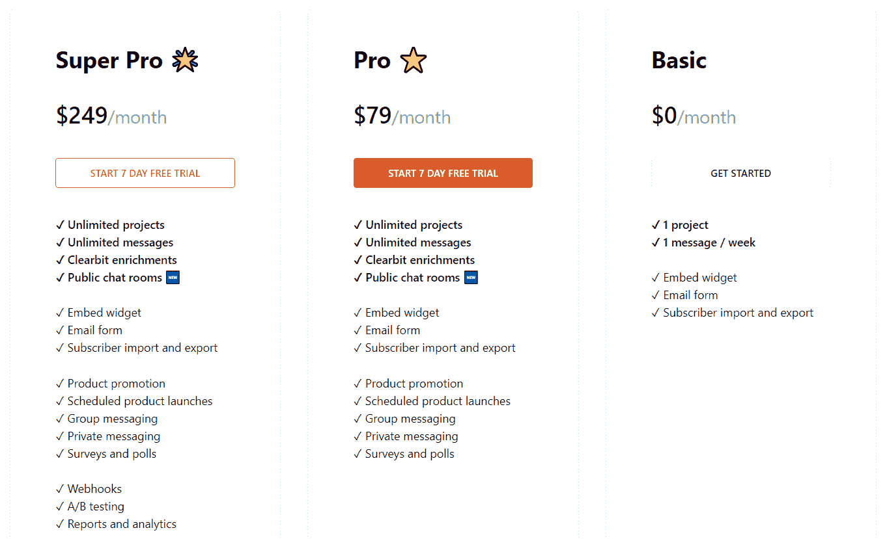**

**我们选择了职业计划。**

**如何开始:**

1.  **转到您的 ProductHunt 个人资料的 Ship 部分，注册 Ship 并留下一些关于您的项目的基本信息。**
2.  **选择定价方案。**
3.  **用一个吸引人的设计和几句指出你产品主要价值的话来定制你即将到来的登陆页面。**
4.  **设置启动时间**

**仅此而已。**

**结果呢？ **436 名订户。****

**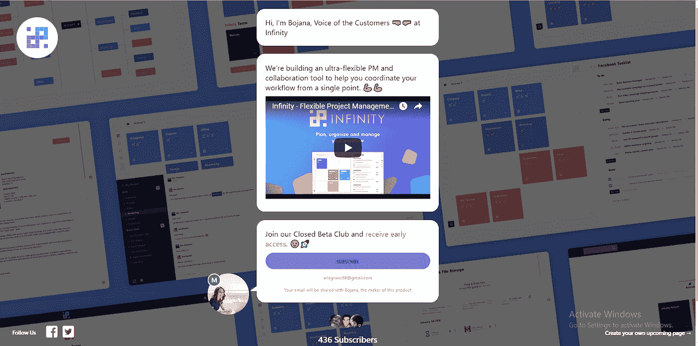**

# ****快速总结一下****

*   **投资登陆页面设计和内容是值得的。**
*   **病毒循环是一个伟大的选择，因为它产生了大量的份额和直接流量。**
*   **BetaList 有一个很棒的早期用户社区，他们喜欢尝试新事物。**
*   **中型博客是一个很好的选择，它也可以向中型用户推广你。**
*   **ProductHunt 有一个对新东西真正感兴趣的产品人员社区。**
*   **脸书广告能以较低的成本迅速吸引和转化早期订户。**
*   **使用 AdWords 为你的品牌名称制作广告，这样人们就能找到你。**

**为了获得更多的动力来继续我们的工作，我们将病毒循环与 Slack 集成在一起，以便在每次有新用户注册时通知整个团队。**

**我们称这个渠道为#激励者。**

**当你不得不静音这个频道时，你知道事情进展顺利:)**

# **这一切都是为了收集反馈**

**经验告诉我们，与客户合作是打造他们想要的产品的关键。**

**这就是为什么我们的目标是尽可能多地谈论和收集反馈。**

**为此，我们使用对讲机。**

**我们通过电子邮件发起了“滴滴”活动，在邮件中我们询问了订户**他们为什么要注册** Infinity？**

**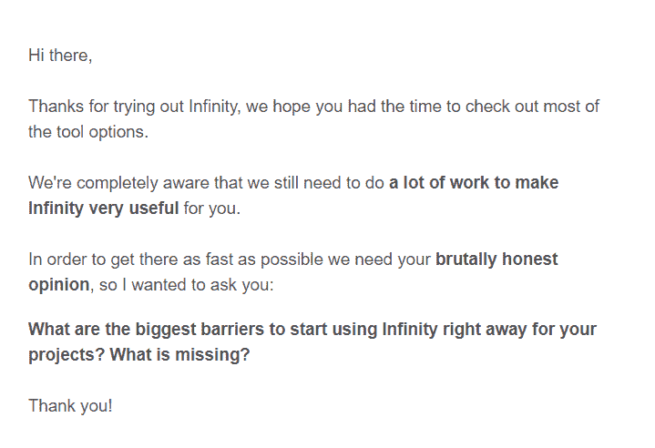**

**像这样简单的问题给了我们很多重要的数据，比如:**

*   **他们目前使用什么工具？**
*   **为什么他们对无穷大感兴趣？**
*   **他们目前的问题是什么？**
*   **他们在寻找什么解决方案？**
*   **还有更多…**

**此外，我们真的致力于与人们交流，深入讨论特定功能，并验证我们的功能提案和展示设计。**

**这封邮件的邮件性能是可怕的。我们有大约 55%的打开率和 20%的回复率，这导致了 300 多次对话。**

**现在，我们真正了解了谁是我们的客户，他们想要解决什么问题，以及如何与他们沟通。**

**我们用来获取客户反馈的其他工具:**

****精明****

**因为我们已经有了很多功能和集成的想法，我们需要**更好地理解并优先考虑我们的用户**想要什么。通过实施反馈管理工具 Canny，我们增加了一个[功能&集成](http://feedback.startinfinity.com/)部分。**

**这是一个简单的仪表板，用户可以对集成进行投票，留下评论和报告错误。**

**此外，这是一个很好的方式来建立一个社区，并向他们展示我们的团队是透明的，并致力于构建一个伟大的产品。**

**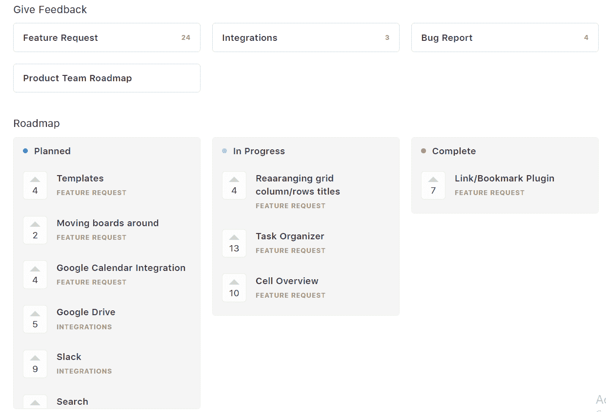**

# **现在我们知道如何创造价值**

**总而言之，我们已经认识到，如果我们**倾听用户的意见并适应他们的需求**我们就能创造出对市场产生影响的产品。**

**我们正努力:**

*   **了解我们应该构建的最重要的功能是什么。**
*   **集成我们的用户已经在使用的工具，这样他们可以很容易地切换到一个新的工具。**
*   **改进我们的信息和定位，让我们的受众能够认识到 Infinity 的价值。**

# **你自己看吧**

**目前，Infinity 处于封闭测试阶段，我们计划在 2018 年 10 月全面推出。**

**目前，我们正在构建该产品的第三个版本，如下所示:**

**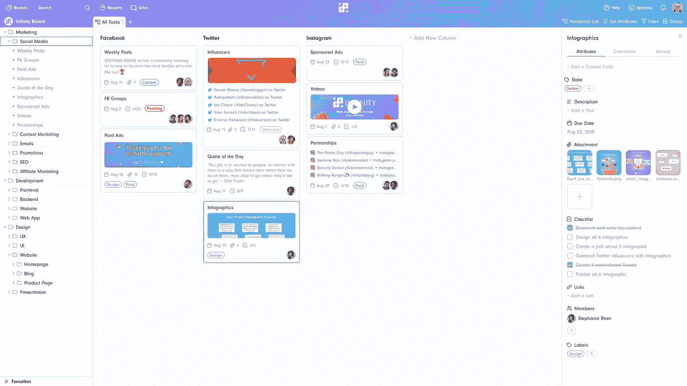**

**我们一直在努力改进，我们非常乐意与您分享我们的经验。**

**对我们目前所做的感兴趣吗？自己去看看吧。**

**如果您想尽早访问，[请访问我们的主页](https://startinfinity.com)。**

**希望这篇文章对你有帮助。**

****

## **这篇文章发表在[《创业](https://medium.com/swlh)》上，这是 Medium 最大的创业刊物，有+365，945 人关注。**

## **在这里订阅接收[我们的头条新闻](http://growthsupply.com/the-startup-newsletter/)。**

****