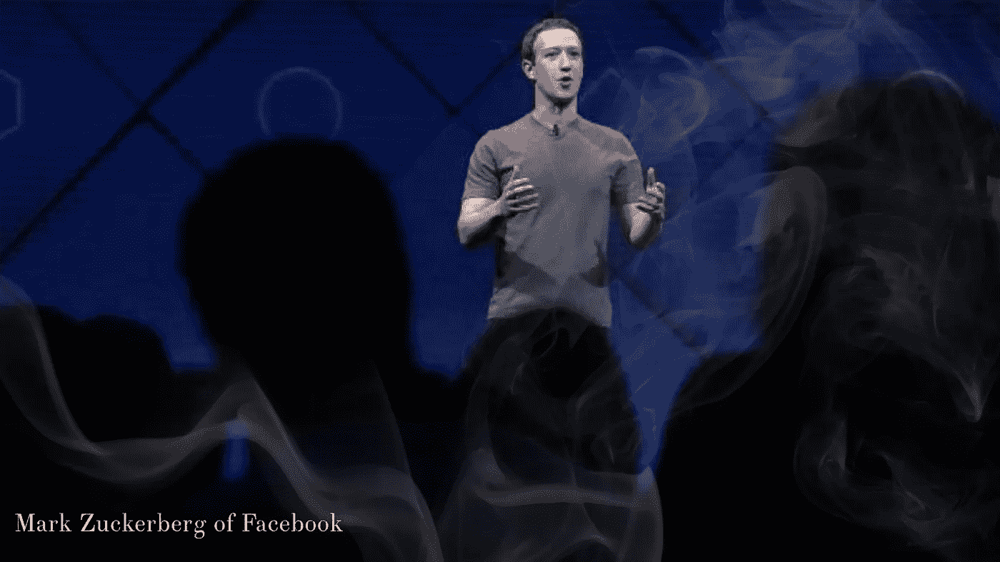

# 面对严酷事实的力量

> 原文：<https://medium.com/swlh/the-power-of-facing-hard-truths-1fffcc701a62>

将近 20 年前，我收到了我所希望的最好的领导建议。

从那以后它就变得无比珍贵。

我们刚刚从 Mission Ventures 那里筹集了 1000 万美元，当时我还是一名年轻且缺乏经验的首席执行官。

我的律师和我正在准备我的第一次董事会议。董事会里有 4 个要求很高的风投，我们没有任何犯错的余地。

当我们完成准备工作时，她对我说:“在你管理这家公司时，我有一条建议给你，‘别惊讶，杰夫！’"

她继续解释说，大多数企业家都有推迟传递坏消息的自然倾向。直到为时已晚。直到所有人都震惊，惊讶，酸酸的。

她说，“杰夫，如果事情进展不顺利，如果你看到问题即将出现，那么你必须尽快让你的投资者知道。你会赢得他们的信任，获得可信度。在问题变得无法解决之前，你们会一起找到解决方案。”

成功的企业家看到了承认什么是不可行的，并尽快这样做的智慧。然后，作为领导，更新相关团队。这是以不舒服、失望或尴尬为代价的。

这种方法将痛苦放在前面和中心，并让每个人都处于“真实世界”中。因为，事实是，大多数企业家很难承认坏消息和危险信号的现实。

> 面对你的企业在任何特定时刻的真实情况是至关重要的。

就像看一场慢动作火车事故一样，世界刚刚见证了马克·扎克伯格、雪莉·桑德伯格和脸书与隐瞒残酷事实的残酷现实的碰撞。他们提供了一个令人震惊的例子，说明如何把一个大问题变成一场灾难。

事后看来，失败的公司可以追溯到真正的担忧被忽视或忽略的临界点。坏消息被边缘化，而强劲的报告和感觉良好的乐观情绪占据了上风。

他们说，“马后炮是 20/20”。的确如此，但这也是一种逃避。

对实时结果的诚实评估也接近 20/20。

年轻的公司如何成长为卓越的公司，就在于此时此地诚实而透明地运营。这是强大的大公司保持其地位的方式。伟大的领导者就是这样升到顶峰的。

问题是，大多数年轻的企业家领袖没有勇气在真相大白的那一刻面对残酷的现实。

你越早学会接受和沟通你的事业的真相；这意味着好的，坏的，丑陋的，你会越快发现自己更接近你想要的地方。

记住，“*没有惊喜，杰夫！*

## 这篇文章发表在《T4》杂志《创业》(The Startup)上，这是 Medium 最大的创业刊物，有 311，185 人关注。

## 在这里订阅接收[我们的头条新闻](http://growthsupply.com/the-startup-newsletter/)。

