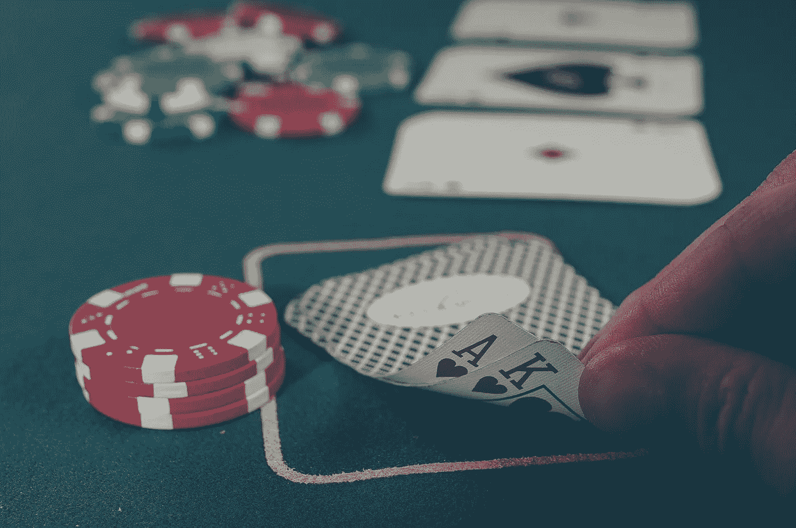

# 全押的力量

> 原文：<https://medium.com/swlh/the-power-of-going-all-in-e98e2f8d80f0>

Photo by [Michał Parzuchowski](https://unsplash.com/photos/GikVY_KS9vQ?utm_source=unsplash&utm_medium=referral&utm_content=creditCopyText) on [Unsplash](https://unsplash.com/search/photos/poker?utm_source=unsplash&utm_medium=referral&utm_content=creditCopyText)

在扑克和生活中，全押会产生强大的心理效应。

当你全押时，你把所有的钱都押在你现在的手上。你只有这一次机会。

如果你赢了，你就赢了一切。

如果你失去了，你就失去了一切。

要做到这一点，你要么需要自信。或者，你需要绝望到没有别的选择。

生活中也是一样的道理。

如果你把所有的注意力都放在一个项目上，你要么非常自信，确信它会成功。或者，你已经没有其他选择了。

两者孰轻孰重并不重要。

不管怎样，你都将收获全押的好处。

# 一心一意。

当你全押的时候，你会不可避免地让自己进入 100%专注于一件事情的状态。

不管付出什么代价，你都要勇往直前。

毕竟你没有别的选择。

在你的后脑勺没有别的选择在等着你。无处可归。没有立即的解决方法来解决你的情况。

这意味着你唯一需要考虑的是如何将你的目标变成现实。

最终，你会找到解决办法的。

如果你继续寻找的话。

# 害怕失败。

在全押的情况下，失败意味着失去一切。这意味着你将不得不从头开始。这意味着你将没有简单的解决方法。

自然会吓得要命。

但是这种恐惧对你的影响，是在你自己的控制之中的。

你可以让它麻痹你。在这种情况下，你的恐惧会变成现实。

因为你不能投入将你的项目变成现实所必需的工作，你会失去一切。

但是还有另外一种选择，它能为你做什么。

你可以控制这种恐惧。

你可以把它变成你最大的成功动力。找到使用它的方法，它会给你继续前进所需的能量。

它会迫使你保持专注。

它会给你方向感。

它将成为你所有决定的指南。

> 战胜你的恐惧，它会变成你最大的盟友。

# 最大限度地利用你的资源。

许多人认为他们生活中的主要问题是他们没有在合适的环境中实现他们的目标。

他们对生活赋予他们的卡片感到失望。他们不断通过，直到他们花光了钱。

**这个战略的核心是什么？**

什么都不做，直到上帝给他们更好的卡片。

不出所料，这种策略从未奏效。生活中没有什么会自己变得更好。

当你全力以赴时，你是在以最有效的方式使用你的资源。

你实际上是在说:

> “好吧。我只有这些了。我要么赢得这场比赛，要么死也不尝试。”

不要抱怨你的处境有多糟糕。

不希望有更好的环境。

不希望奇迹发生。

相反，你在强迫自己采取行动。强迫自己玩生活赋予你的牌，并充分利用它们。

利用你所有的资源。专注于单个项目。全力以赴做那个项目。

其他都是无为。

无力承诺。

对外部环境的依赖。

# 结论:

愿意在一个项目上全力以赴的人和被恐惧吓呆的人之间有很大的区别。

那些愿意全力以赴的人，正在把自己投入到一种不可动摇的承诺的心态中。这些人正在利用一切可以利用的资源，将他们的目标变成现实。

他们接受输赢的局面。

他们将对失败的恐惧转化为最大的动力。

他们把所有的注意力都集中在一个目标上。

结果，他们获得了继续前进的能力。不管发生什么，他们不可动摇的承诺驱使他们走向。

最后，只剩下一个问题要问了。

你呢？

你愿意全押吗？

如果你觉得这篇文章有用，请👏并与你的朋友分享。记住，你最多可以鼓掌 50 次——这对我真的很重要。

**您也可以通过** [**点击这里**](https://mailchi.mp/b0d1e1fba452/struggle-first-thrive-later) **免费订阅我的时事通讯。**

## 这篇文章发表在 [The Startup](https://medium.com/swlh) 上，这是 Medium 最大的创业刊物，有 312，043+人关注。

## 在此订阅接收[我们的头条新闻](http://growthsupply.com/the-startup-newsletter/)。

