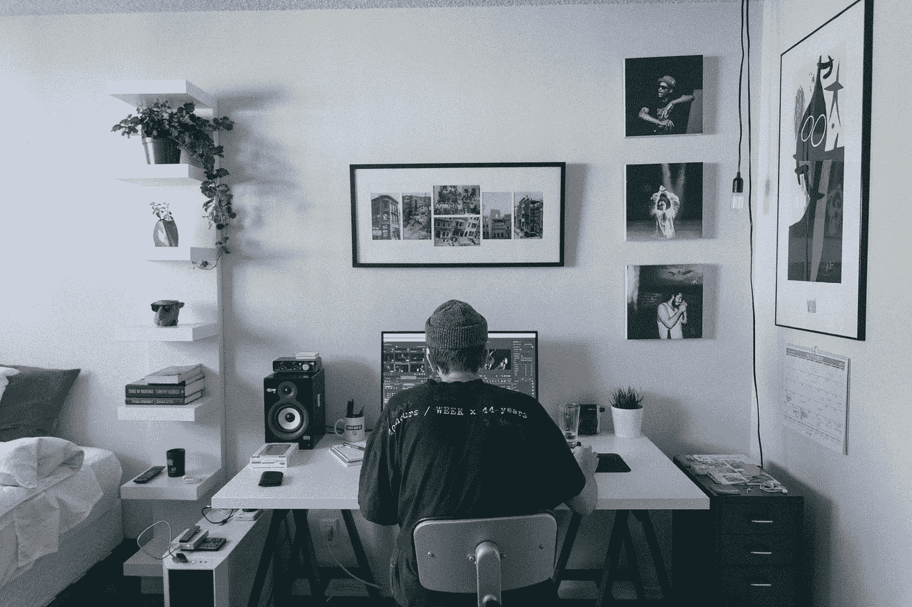

# 挠自己痒痒的力量

> 原文：<https://medium.com/swlh/the-power-of-scratching-your-own-itch-75f8cc59e7>

## 为了制造一个成功的产品，你也必须使用它

Originally published on [**JOTFORM.COM**](http://jotform.com)

最好的商业想法通常来自个人需求。

以彼得·拉哈尔为例，他是 RXBar 的首席执行官和联合创始人，该公司是他和好友贾里德·史密斯在父母的地下室创办的。