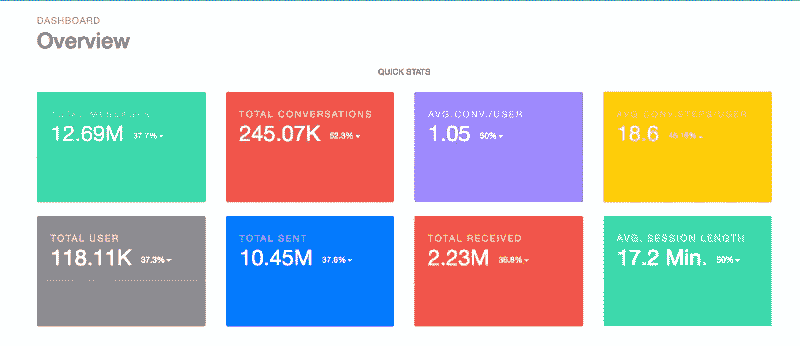
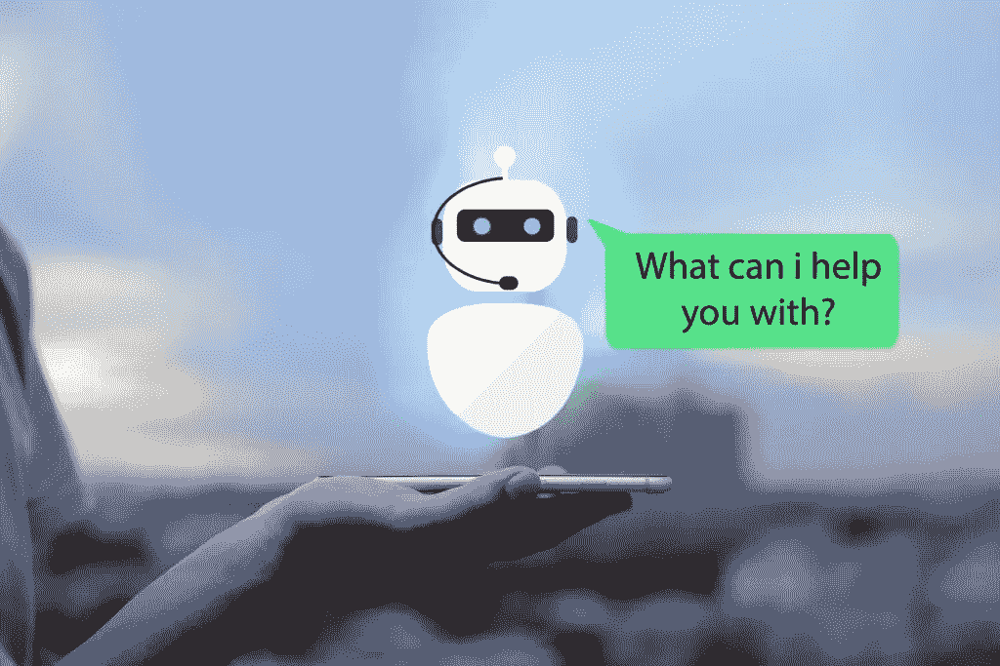
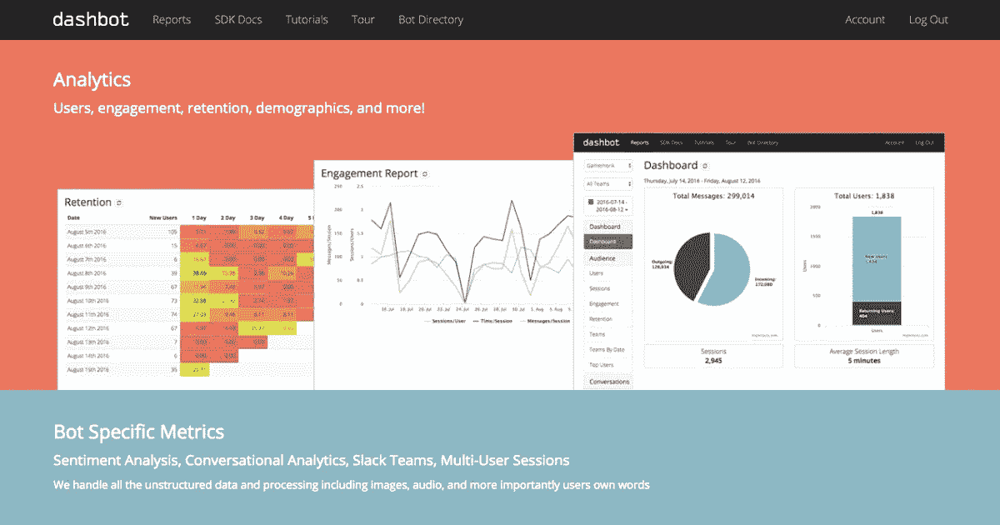

# 聊天机器人度量和分析实用指南

> 原文：<https://medium.com/swlh/the-practical-guide-to-chatbot-metrics-and-analytics-2a734064e833>

这些天我有一种感觉，无论我走到哪里，都会遇到一个聊天机器人:有些很棒，有些还行，但很多完全没有意义。

这是无可避免的:聊天机器人无处不在，似乎(几乎)每个人都想要一个。

> 根据研究， [80%的企业](http://uk.businessinsider.com/80-of-businesses-want-chatbots-by-2020-2016-12)打算在 2020 年前后实施一个。

然而，这些公司中的许多人承认，他们首先不确定如何衡量他们的聊天机器人的效率。

也许这并不奇怪[聊天机器人](https://blog.growthbot.org/chatbots-were-the-next-big-thing-what-happened)的崛起对一些人来说是一条崎岖不平的道路。虽然一些公司在采用聊天机器人方面取得了巨大成功，但其他公司在尝试中却遇到了挫折或失败。

一些聊天机器人一帆风顺，而另一些却一落千丈。

那么，你如何确保你投资的聊天机器人是成功的而不是失败的呢？那么，你可以像对待其他业务一样对待它:衡量、衡量、衡量——然后做出相应的调整。

以下是您需要注意的关键指标和 KPI:

## 用户总数

这是你的面包和黄油度量。它会给你用户总数，并显示你的聊天机器人已经暴露的数据量。反过来，这将提供关于市场规模和你的聊天机器人整体成功的关键信息。

你可以通过将聊天机器人用户进一步分组，如**活跃用户、参与用户和新用户，来深入研究这个指标。**

## 收入增长

这里还有另一个重点:你的聊天机器人真的为你赚钱了吗？

有很多方法可以评估你的机器人对收入的影响，这取决于你的机器人的目的。你应该记住，一个表现不佳的机器人会对你的其他财务状况产生连锁反应。

衡量客户服务机器人收入增长的最明显的方法是通过确定与雇佣一个 24/7 客户服务团队相比你节省了多少钱。

但这本身还不够:你还需要考虑机器人在完成分配给它的客户服务方面做得如何。

这就是自助服务费率和 NPS 分数的来源。

## 自助费率

这个指标可以帮助您识别在没有任何人工输入的情况下从聊天机器人中获得他们想要的东西的用户数量。例如，如果你的聊天机器人的目标是销售一种特定的产品，你将测量实现这一目标的用户互动的百分比。

您的自助服务费率将与您的收入增长密切相关，例如，您的聊天机器人通过做它打算做的事情为您节省了多少钱？您的自助费率越高越好。

## 满意率

你的用户对你的聊天机器人的表现满意吗？为什么不问他们？

你可以通过使用许多人认为“唯一值得知道的度量”来做到这一点，即。净推介值(NPS): *“在 1-10 分的范围内，您向朋友/同事推荐我们的聊天机器人的可能性有多大？”*NPS 为您提供了一把了解客户体验的钥匙，从而了解您的聊天机器人的性能。

另一种计算用户满意度的方法是通过定制的离职调查。你可以保持简单(*“机器人表现好吗？”—是或否*)，或者邀请更详细的回答。

## 用户交互

用户交互的总数(而不是用户数)提供了一个基本而可靠的指标，可以更好地掌握聊天机器人的性能。

一个聊天机器人可能有很多用户，但交互量很少，或者有少量用户经常与之交互。

如果谈话不是连续的，你就不能保证它的有效性；另一方面，持续一段时间的对话将允许你测量进出信息的数量，给你一个提示，告诉你这个聊天是否有用。

对话统计提供了另一种跟踪聊天机器人性能的关键方法。不同类型的对话的数量(例如，新对话、对话总数)反映了聊天机器人在特定时间段内的使用情况。

这有助于您确定用户的再次参与时间和行为。然后，您可以使用这些统计数据来增强您的聊天机器人，并使其符合用户的要求。

## 有机用户

当一个聊天机器人不断出现，恳求我们使用它时，这是超级烦人的。因此，如果用户在没有提示的情况下自动返回，这是一个很好的迹象，也是一个值得考虑的指标。“有机”用户是带着目的进来的；你可以通过用户发起的消息来衡量他们的数量，而不是机器人。

## 目标完成率(GCR)

理想情况下，聊天机器人不仅应该有一个目标，而且应该有一个明确的目的。记住，一个在一件事情上做得很好的聊天机器人比一个在很多事情上做得很差的聊天机器人要有用得多。T

在此基础上，GCR 获得了成功参与的百分比。它通过跟踪有多少对话实现了你的机器人的目标来做到这一点。例如，如果你的聊天机器人出现在一个电子商务网站上，GCR 可能与该网站上促成销售的对话数量有关。

## 激活率

这是用户用与你的商业目标相关的问题或答案回复聊天机器人消息的比率。例如，当用户给出他们眼睛的颜色时，一个设计来提供化妆技巧的聊天机器人会收到一个激活率。

## 回落率(FBR)

聊天机器人有时会失败，但这是偶尔发生还是经常发生？这就是 FBR 的衡量标准。FBR 是聊天机器人失败或接近失败的次数的百分比。

## 困惑触发

即使拥有最复杂的自然语言处理能力的机器人也不能理解用户说的每一句话。混淆触发器是一个有用的指示器，可以帮助你找出聊天机器人需要改进的地方和方式。有不同类型的触发器:例如，聊天机器人不能理解评论；或者用户发送了一条或多条超出聊天机器人权限的消息；或者机器人需要在交互失败后将任务委托给客户服务代理。

这些触发器中的每一个都会告诉你一些关于聊天机器人性能的信息。混淆率的测量方法如下:

混乱率=聊天机器人不得不后退的次数/收到的消息总数。

## 保留率

保留率表示在特定时间段内返回聊天机器人的用户百分比。这个时间跨度取决于机器人的目的。例如，一个健身聊天机器人将需要每天的互动，并将受益于对其每天保持的分析。

## 人工智能和机器学习率

你的聊天机器人的人工智能有多强？您可以通过检查您的机器人正确理解的用户问题的百分比来衡量这一点。

具有强大机器学习的代理将能够不断运行自己的差距分析，以突出潜在的改进领域。

最成功的聊天机器人是那些不断修正、调整和迭代他们的对话流以回应用户的人。

这就是 [Hubspot 的聊天机器人生成器](https://www.hubspot.com/products/crm/chatbot-builder)派上用场的地方:你可以验证你的线索，允许你的潜在客户与销售人员预约会议，或者通过聊天机器人的 24/7 在线支持确保你的客户始终满意。

# 机器人分析的最佳工具

## [仪表板机器人](https://www.dashbot.io/)

Dashbot 是最大和最知名的聊天机器人分析平台之一。它让您可以跟踪各种指标，如留存率和参与度、对话分析和用户行为。

Dashbot 还允许您使用特定于 bot 的指标来更深入地了解您的用户正在进行的对话。例如，情绪分析为您提供了用户情绪的高层次视图，而对话漏斗则显示了用户在不同时间间隔问了哪些问题，以及对话将如何发展。

**简而言之:** Dashbot 在更好地理解对话方面很强。

## [僵尸分析](https://botanalytics.co/)

僵尸分析是追踪个人用户的最佳工具。它的仪表盘显示了用户的生命周期，记录了每次对话的时长和日期，以及每个用户的对话次数。这有助于找出你的聊天机器人的哪些用户是最活跃的。

该平台还通过提供每次对话的文字记录来进行深度用户登录。

**简而言之:**僵尸分析最适合追踪用户的生命周期

## [聊天基地](https://chatbase.com/)

在今年的[谷歌](https://www.crunchbase.com/organization/google/) I/O 大会上，谷歌[悄悄推出了一个名为](https://beta.techcrunch.com/2017/05/17/google-chatbase-chatbot-analytics/) [Chatbase](https://chatbase.com/) 的新聊天机器人分析平台，该平台是在该公司的内部研发孵化器 Area 120 内开发的。

谷歌的聊天机器人分析平台 Chatbase 提供了更容易分析和优化聊天机器人的工具。这包括让 bot 构建者能够了解什么可以增加客户转化率，提高 bot 的准确性，并创造更好的用户体验。这些数据可通过分析仪表板获得，开发人员可以在其中跟踪特定指标，如活跃用户、会话和用户保留率。这些见解给出了机器人健康的总体情况。

仪表板还允许 bot 创建者跨平台比较 bot 的指标，以查看某些平台是否需要额外的优化。

**简而言之:** Chatbase 最适合一系列易于访问的优化工具。

*原载于*[*blog.growthbot.org*](https://blog.growthbot.org/the-practical-guide-to-chatbot-metrics-and-analytics)*。*