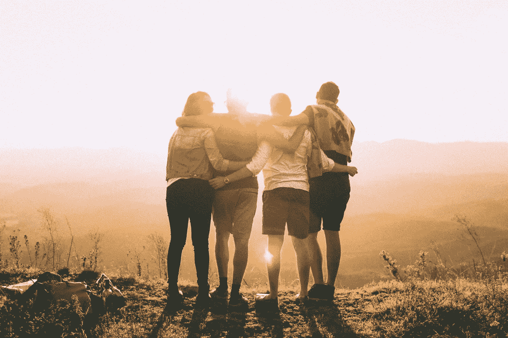

# 换位思考的实践:多关注我们，少关注我

> 原文：<https://medium.com/swlh/the-practice-of-empathy-focusing-more-on-we-and-less-on-me-7c4ca7820582>

Better Together (Credit: Helena Lopes)

重新学习你认为你已经知道的东西永远不会太迟。

最近几年，我体验到了一种巨大的力量，这种力量来自于我生活中更加完整和有意识的感恩实践。我一直认为自己很幸运，很幸运，很幸运能拥有生活中所拥有的一切；出生在享有特权和相对安全、有保障和…