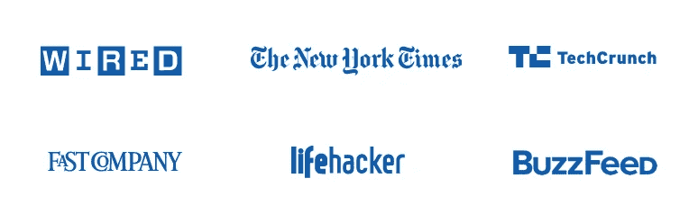
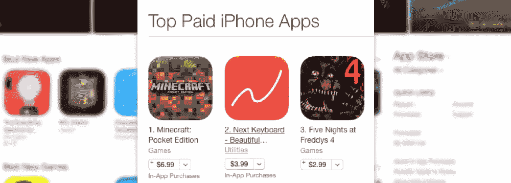
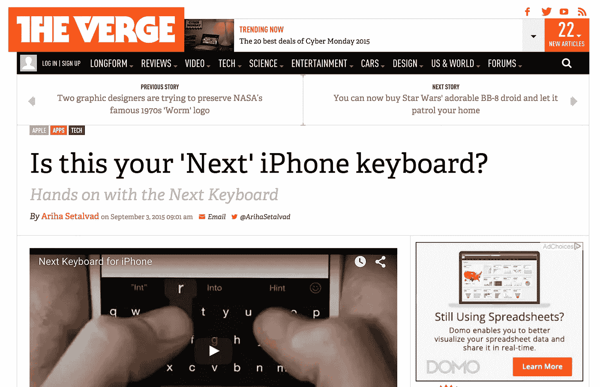
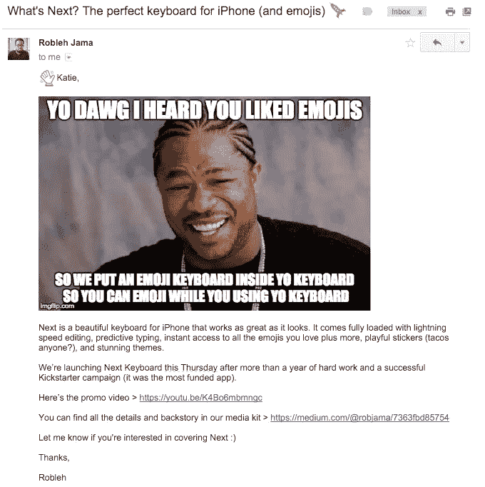
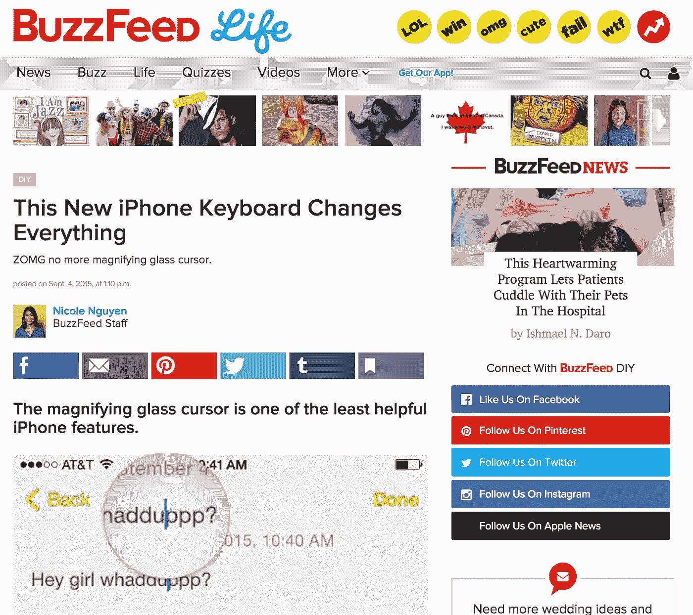
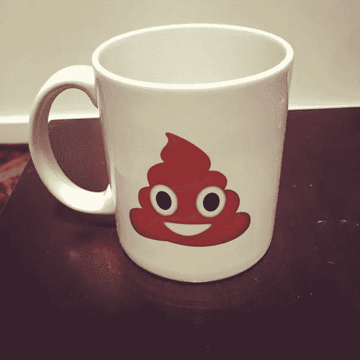
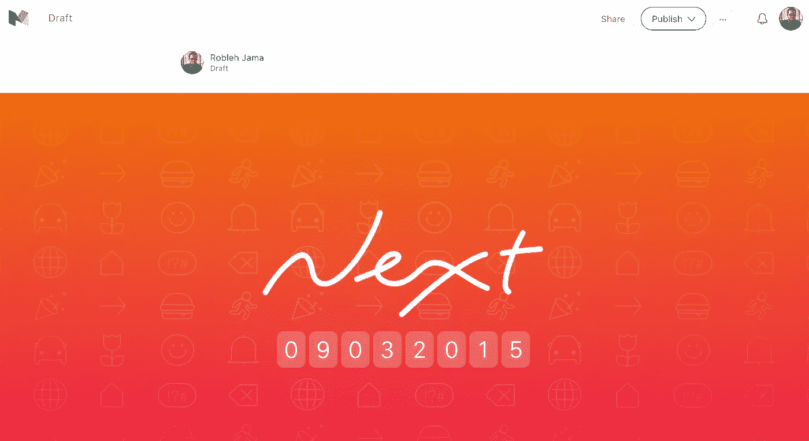

# 新闻稿已经作废了。这是它的替代品

> 原文：<https://medium.com/swlh/the-press-release-is-dead-here-are-its-replacements-f0a0a27d6549>

## 获得结果的非常规公关的 3 个技巧

所以，你的应用程序刚刚被批准应用商店。恭喜你！

现在怎么办？

你说，“我得获取用户， ***咄*** ”

同意！

所以，在你把链接发给你的妈妈和哥哥之后，你意识到你必须找到一种更有效的方式来让你的应用出现在人们面前。

你最初的下载非常重要。它可以帮助你的应用程序在排行榜上攀升。

***注意:如果你已经对使用公共关系来发布你的应用很感兴趣，跳到标题为“1。让它有新闻价值”。***

显然，你最好在构建应用时考虑增长。这意味着当你优先考虑功能和生产你的产品时，记住你的营销策略。

然而，如果你现在正在读这篇文章，那可能已经太晚了。

搞清楚用户获取的最佳时间是六个月前，那时你有了自己的公司或应用的想法。下一个最好的时间就是现在。

Next Keyboard reaches #2 on the App Store

我们花了五年时间来研究如何推动我们应用的可持续下载。公关只是拼图的一部分。我们每天都在学习很多东西。我们最近通过 [Next Keyboard](http://www.nextkeyboard.co) 在 App Store 上排名第二，我们将在简讯中分享我们[是如何做到的。](http://tinyhearts.us1.list-manage1.com/subscribe?u=84fde4ba68e9a71fe365ad6bf&id=57d63464d5)

在这篇文章中，我们的建议是你使用公共关系作为分发你的应用程序的一种方式，这并不意味着在每个博客上发布一篇新闻稿。我们还将向您展示如何以不同的方式做到这一点。让我们开始吧:

## 喜欢你目前读到的吗？[加入我们不常见的简讯](http://bit.ly/1kp6lTN)，了解“如何在 App Store 上被发现”和“如何制造人们喜爱的产品”等内容。

# 我们为什么选择公关？

首先，公关不受资本约束的限制。它在预算上是容易的。即使你没有大把的现金，你也可以用忙碌来弥补——时间和精力。

媒体报道往往先于下载量的增长。

因此，即使你的营销团队非常忙，或者你根本没有营销团队，你也可以为你自己和你的应用获得媒体报道。(我们经常用自己和客户的应用程序来做这个练习。)

当我们制定我们的新闻推广计划时，我们倾向于两个类别:一般出版物(例如，像 The Verge、Mashable、Lifehackeretc 这样的网站。)和目标博客——这取决于产品吸引哪些受众。我们认为一般的出版物会有大量的临时用户，而目标博客会有少量的好奇用户。这是一种健康的平衡。

公关执行起来也很简单。如果你在一家资源紧缺的公司创造产品(这种情况发生在所有级别的公司，无论大小)，而且你没有分配到公关或营销资源，你可以卷起袖子自己做。

这里有一些我们用来脱颖而出的策略。你不需要公关人员，甚至不需要新闻稿来执行这些:

# ***1。使其具有新闻价值***

你可以联系 100 名新闻记者，却得不到任何回复。

为什么？

因为你的产品和你的故事不够有新闻价值。我不想打断你，但是媒体是在故事驱动的注意力经济中运作的。

你必须让你推销的东西对记者或作家有吸引力。

这就是为什么耸人听闻的，有争议的，引发愤怒的故事表现如此之好。(这也是为什么亚马逊的项目经理们会在实际生产产品之前写一份新闻稿。)

对我们来说，我们的产品 [Next Keyboard](http://www.nextkeyboard.co) 在默认情况下并没有特别大的争议。我们也不打算走噱头、耸人听闻的路线。

然而，我们确实有一些其他的方式来发展我们的故事。例如，[我们在 Kickstarter](https://www.kickstarter.com/projects/robjama/next-keyboard-the-perfect-keyboard-for-iphone) 上筹集了资金，并在短时间内成为资金最多的应用。

 [## Next Keyboard 如何成为 Kickstarter 上资金最多的应用

### 查看我们的博客并加入我们的时事通讯，了解诸如“如何在 App Store 上被发现”和“如何……

medium.com](/p/ada26c4384d1) 

总的原则是让你看看你已经达到的任何里程碑，这将使别人说，“酷。”和你的朋友谈论这件事，看看什么引起了他们的注意。

证明你已经有了牵引或者兴趣，故事就变得更有新闻价值了。

分享一些你的过程，可能是不寻常的，有新闻价值的。对我们来说，我们开发我们的应用程序有着紧密的反馈循环，并有来自我们的 Kickstarter 社区以及 Reddit、Designer News 和 Product Hunt 社区的大量参与。

你不可能达到 100%的媒体覆盖率。例如，当我们为我们的 Kickstarter 活动做宣传时，我们发现 Lifehacker 和 The Verge 没有写 Kickstarter 活动。

不要让它阻止你的动力。坚持不懈。(The Verge [在我们推出](http://www.theverge.com/2015/9/3/9252423/next-keyboard-app-iphone-ios8)的时候覆盖了我们！)

# ***2。使用电子邮件以不同的方式推销和发送电子邮件。***

我们对 Next Keyboard 的推介简短而甜蜜。只有五句话。注意没有新闻稿:

> 主题:下一步是什么？iPhone 的完美键盘🚀
> 
> 你好，记者，
> 
> 我有一些令人兴奋的消息要和你分享。经过一年多的努力和成功的 Kickstarter 活动(是获得资金最多的应用程序)，我们将于本周四发布 Next Keyboard。
> 
> 下面是 https://youtu.be/K4Bo6mbmngc 的宣传片视频>
> 
> 你可以在我们的媒体工具包中找到所有细节>[https://medium.com/@robjama/7363fbd85754](/@robjama/7363fbd85754)
> 
> 让我知道你是否仍然准备好覆盖它:)最新的测试版正在审查中，但一旦它被批准，我会尽快给你。
> 
> 谢谢，
> 
> 罗布莱

看看吧，超级简单。记者没有时间阅读你的电子邮件，所以不要花太多时间来精心制作。 ***花时间编辑删减。不要浪费邮件的主题或第一行。***

一些关键要素:

*   主题:让它接近你为文章设想的标题。
*   关于:你在推出什么？
*   有新闻价值的证据:Kickstarter 运动。
*   CTA:让我知道你是否准备好报道它。

## 喜欢你目前读到的吗？[加入我们不常见的简讯](http://bit.ly/1kp6lTN)，了解“如何在 App Store 上被发现”和“如何制造人们喜爱的产品”等内容。

# ***3。超越电子邮件推销。***

电子邮件不应该是获得关注的唯一方式。不会转化好的。

对于初学者来说，探究一下谁以前报道过与你的产品类似的东西。知道谁会关心它。知道这些人代表什么，他们是如何被激励的。看看他们最受欢迎的帖子是什么。知道你在向谁推销，以及他们个人对什么感兴趣。

Email to BuzzFeed writer

例如，当我们与 BuzzFeed 连接时，我们知道他们的作者在 gif 和 memes 方面很流利。所以我们想，用那种格式给她寄点东西吧。[成功了](http://www.buzzfeed.com/nicolenguyen/youre-just-my-type)！他们最终写下了下面这张超级搞笑的 GIF 图片。

即使在电子邮件中，也要增加趣味。发送超出你的产品的东西。

作家或记者是人。让他们微笑。要真诚。

当你设计好你的电子邮件后，列出你最喜欢的五个博客。它们可以是面向临时用户的普通出版物，也可以是面向好奇用户的目标博客。

电子邮件营销的缺点是每个人都在做。这就是为什么我们尝试用其他话题引子——比如实物产品。

Poop emoji mug

例如，我们给一位报道 Mashable 技术的作家发了一个便便表情杯，这是我们为 Kickstarter 活动制作的。她的同事几天后写了关于我们的文章。多么有趣的巧合。

# **4*。在 Medium.com*T5 发布您的媒体工具包**

通常，媒体工具包是 Dropbox 中的概况介绍、文本文件和图像或 pdf 的文件夹。

真是太*无聊了*。

在*Medium.com*上托管您的媒体工具包有几个好处:

*   可以编辑！因此，如果你想到一个更好的标题或角度，或者需要更新任何信息，你可以轻松地做到这一点，而不必发送一堆新的电子邮件。
*   Medium.com 也设计得很好，很漂亮。因为写手不用下载任何东西，所以很方便。他们也很容易复制粘贴。
*   作家们习惯于阅读 Medium.com 的作品，你的媒体工具包看起来就像一篇博文。太棒了。您可以在工具包中嵌入视频链接。如果你想附加任何高分辨率图像或 gif，或者更大类型的文件，你也可以链接到 Dropbox。
*   这只是一个网址，它让 blogger 的工作变得简单了一些。

我们向很多客户推荐这个想法。他们喜欢它。

你可能想让你的媒体工具包不公开，只为作者保留内容。

再说一次，至少，Medium.com 是展示你的新闻的一种不同的方式。 ***它能让你以不同的方式做事情*** 。最重要的是，你可以在他们已经熟悉并使用的平台上分享新闻。

当你把一个作家的文章需要的所有东西都放在一个地方，他们会喜欢的。他们会感激你的。这增加了你获得关注的机会。

**示例:下一个键盘媒体套件:**[https://medium.com/@robjama/7363fbd85754](/@robjama/7363fbd85754)

## 听起来很简单，对吧？

去吧！

如果你在给记者发了 20 封冷冰冰的邮件后没有任何动力，你应该重新审视你的信息和故事。也许它需要更引人注目。

回到你的流程，看看是什么让你与众不同。如果你很无聊，看看如何用你的信息给事情增添一点趣味。如果你对自己真正相信的事情有不同寻常的立场，那就更大声地表达出来。

当你在整理你的媒体工具包时，记住你不是在为自己写作。你是在为记者和他们的读者写作。为了得到媒体的关注，你必须把你的注意力从你的产品转移到对他们有帮助的东西上。或者，至少，送他们一些能让他们微笑的东西。公关的核心是关系——精心培育和建立关系。

# 如果你喜欢这篇文章，你可能也会喜欢:

 [## 这是官方消息:我们开始营业了

### 是的，我们做客户工作

medium.com](/p/5db9bffdfa88)  [## Medium.com 主办的新闻资料袋:如何使博客的生活更容易

### 过去，新闻资料袋是存放在 Dropbox 中或附加的概况介绍、文本文件、图像或 pdf 的文件夹…

medium.com](/p/10962dc3f04e) 

## Robleh Jama 是获奖产品工作室 [Tiny Hearts](http://www.tinyhearts.com/) 的创始人。他们生产自己的产品，如 [Next Keyboard](http://www.nextkeyboard.co) 、 [Wake Alarm](http://www.tinyhearts.com/wake) 和[Quick Fit](http://www.tinyhearts.com/quickfit)——以及为特定客户生产的产品，如 Plantronics 和 Philips。

## [查看我们的博客](http://blog.tinyhearts.com)和[加入我们的时事通讯](http://bit.ly/1kp6lTN)，了解诸如“如何在 App Store 上被发现”和“如何制造人们喜爱的产品”之类的事情。

**如果你喜欢这篇文章，请推荐，帮助别人找到！**

