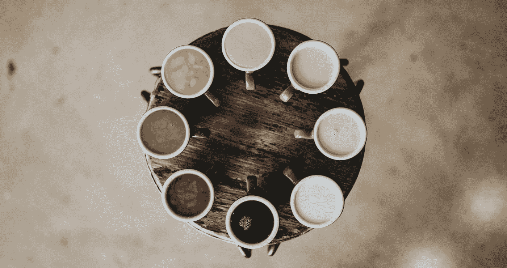
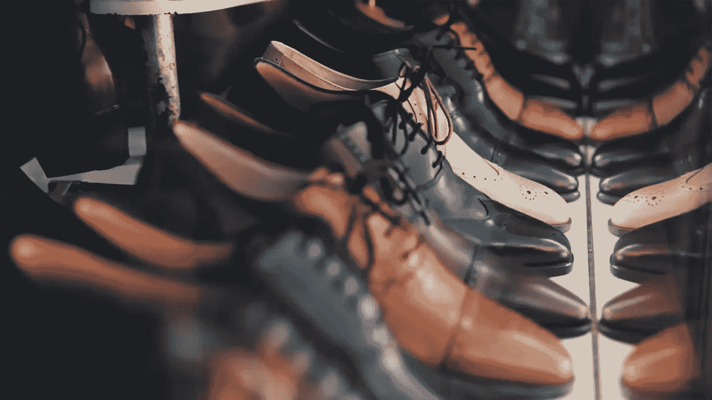

# 有太多选择的特权

> 原文：<https://medium.com/swlh/the-privilege-of-having-too-many-choices-63ee8a22da7e>

你可以选择是否阅读这篇博文。简单的选择，对吧？或者你可以选择阅读同一主题的 100 篇博客文章中的一篇。那，选哪个呢？

我相信你很熟悉这种选择太多的感觉。我们对选择的悖论并不陌生。我们的目标都是寻找替代方案来最大化我们的幸福。然而，大多数时候，有了丰富的选择，它会变成一种负担，而不是快乐。

> 当人们有太多选择时，他们会做出糟糕的选择—托姆·布朗

# **害怕错过**

随着选择数量的增加，收集信息和做出正确决策所需的努力也在增加。过多的选择会导致疲劳，并使人们对体验感到不满意。

当我需要一台新的笔记本电脑，运动鞋，合适的健康保险，加入健身房，最重要的是，做出人生决定时，我发现自己处于这种情况。当我有太多选择时，我不仅会感到精神疲惫，而且，一旦我做出决定，我经常会感到焦虑，觉得我可能错过了一些重要的东西。

> *“学会选择很难。学会做好选择更难。在一个充满无限可能的世界里，学会做出正确的选择更难，或许太难了。”—巴里·施瓦茨*

# **可能性的可能性**

丹麦哲学家索伦·克尔凯郭尔提出，焦虑与可能性的可能性联系在一起。当可能性变得太大时，这种焦虑会让我们拒绝承认。

这正是发生在我身上的事，当时我想申请健身房的会员资格。由于选择过多，当我面对如此多的选择时，我开始否认我想要什么，并决定等待。我等待和保留选择的需要和渴望远远大于决定，这变成了一种困扰。我花了几个小时和几天去寻找和比较，直到我筋疲力尽并说服自己放弃。

> “我们的生活总是表达我们主导思想的结果。”—索伦·克尔凯郭尔

# **选择能好的**

心理学家、《选择的悖论》一书的作者巴里·施瓦茨认为，有时候选择可能是好的，但大多数人发现如今可供选择的荒谬数量令人无法承受。当我不能有效地处理太多的选择时，我变得有些麻痹，这降低了我的生产力和进步。

施瓦茨还提到，增加的选择会让我们不快乐，因为我们往往会经历后悔、自责、机会成本和高期望的增加。当你将所有这些选择与不合理的高标准结合起来时，一个人可能会长期悲伤和抑郁。

> 快乐的秘密是低期望—巴里·施瓦茨

# **特权**

然而，尽管选择可能具有挑战性，但我认为我们必须认识到这样一个事实，即我们的祖先在过去没有这种特权。他们被限制在很少或没有选择，并被剥夺了选择的自由。 ***一旦我们从这个角度来看，我们应该感到幸运的是，我们有自由根据我们是谁以及我们将来想成为谁来创造我们的生活。***

事情是这样的:你不能有意识地选择你的意图，直到你意识到你个性的不同方面。如果你没有意识到自己，无论你多么希望你的生活朝着一个特定的方向前进，你都会发现它最终会朝着另一个方向前进。

> “能够选择自己的工作是一种特权。”—安东·尤金

因此，首先，我们需要与我们存在的核心保持联系，在做出选择时要意识到我们人格的重要方面。

其次，我们需要改变我们对现有选择的态度，接受“足够好”的想法。

第三，这是我学到的最重要的一课， ***以自己为中心。***

# 集中你自己

当你处于焦虑、担心和恐惧的状态时，你很少能做出好的决定。你在评估每一个选择时所带来的 [*意识*](https://ye-chen.com/is-self-consciousness-a-bad-thing/) 的好坏，影响着后面的每一个行动和思想。当你固执地坚持自己的选择时，肯定会导致压力、糟糕的决定、不满甚至抑郁。

此外，当你疲劳或有压力时，试着通过只根据一两个因素做出选择来保存你的精神能量，而忽略所有其他做出最佳决定的重要决定因素。关键是做选择时要“ ***冷静*** ”你的神经系统基本上要“ ***冷静*** ”。

在评估过程中， ***检查你自己，后退一步*** 参与让你集中注意力的活动，如冥想、锻炼、瑜伽、听音乐、绘画或任何其他诱导平静和流畅状态的爱好。

你的旅程最终是为了创造你热爱的生活，这代表了你的理想和目标。 ***你的选择反映了你的本质*** ，你应该把它们作为一种工具来展示你的个人力量和你想留下的遗产。

*原载于 2018 年 4 月 2 日*[*ye-chen.com*](https://ye-chen.com/the-privilege-of-having-too-many-choices/)*。*

## 这个故事发表在 [The Startup](https://medium.com/swlh) 上，这是 Medium 最大的创业刊物，拥有 312，043+人关注。

## 在这里订阅接收[我们的头条新闻](http://growthsupply.com/the-startup-newsletter/)。

