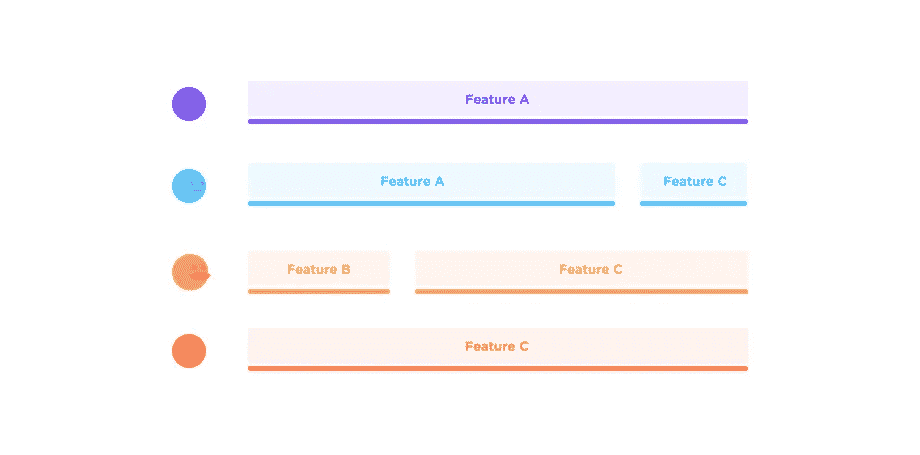
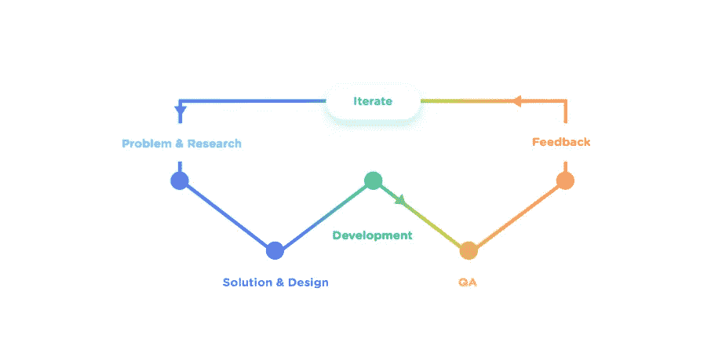
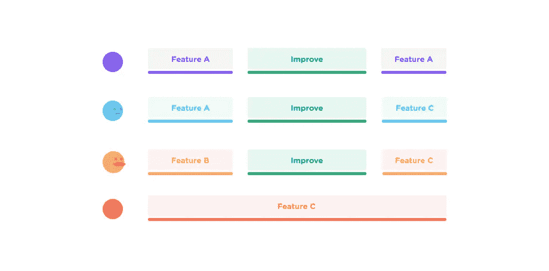

# “路线图优先”团队的问题是

> 原文：<https://medium.com/swlh/the-problem-with-roadmap-first-teams-21775e9d4c31>

无论您的团队是使用敏捷、瀑布还是其他开发方法，您都很可能有一个路线图。

路线图是一个很好的工具，可以帮助团队成员回答一些非常重要的问题，例如他们应该做什么，他们有多少时间来完成它，以及他们和团队的下一步是什么。它们也是所有团队成员之间一个很好的沟通和同步渠道。

路线图通常是这样的:

对于单个成员来说，一项成就意味着完成一项任务，然后进入下一项任务。完成的任务是进步的好迹象，对于负责它的人和整个组织都是如此。

当路线图，而不是用户，成为驱动团队的东西时，问题就开始了。我称之为**‘路线图第一团队’**。在路线图优先团队中，开发周期如下所示:

这对团队精神很有好处，因为有很多任务，年终清单会显示我们已经做了很多。但是它没有告诉用户满意度，即使在完成 50 个任务后，用户仍然很有可能一点也不开心。例如，核心功能可能有问题，UX 可能不一致，或者网站可能加载太多。

当这种情况发生时，路线图驱动的团队不会只是说‘伙计们，等等，我们的产品加载真的很慢，很多用户会感到沮丧。让我们用接下来的两个月来改进我们过去的版本。相反，如果没有简单的解决方法，他们会转移到下一个任务，并按计划继续开发过程...他们会说‘它并不完美，但确实有效。现在我们有更重要的事情——我们必须在 12 月前发布特性 A。新的特性会一直出现，这种团队会一直追逐它们。他们的产品通常最终会成为没有人喜欢使用的全功能产品。

在一个路线图第一的团队中，缺少的环节是**的迭代。**

迭代对于改进不够好的解决方案至关重要。他们在收集反馈后出现，并允许团队改进。在**“用户第一团队”**中，下一步要做的事情实际上是由这个问题决定的:“我们下一步要做什么才能让用户最满意？”。很多时候，不一定是开发一个完全新的东西，实际上是在改进现有的。

因此，路线图变得更加灵活。任务可以随时添加、移动或删除，并通过计算每项任务带来的成本和价值进行排序。

只有当核心功能成为团队的主要焦点，迭代和改进成为团队文化的一部分时，伟大的产品才会诞生。关键是增加价值，而不仅仅是将清单上的更多项目标记为“完成”。

## 这个故事发表在 [The Startup](https://medium.com/swlh) 上，这是 Medium 针对企业家和初创公司的领先出版物。

# 加入+12，417 名[在此](http://growthsupply.com/the-startup-newsletter/)获得头条新闻的人。

