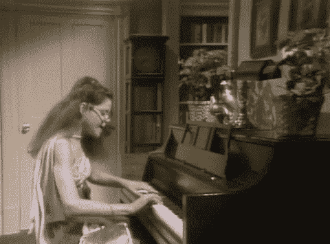
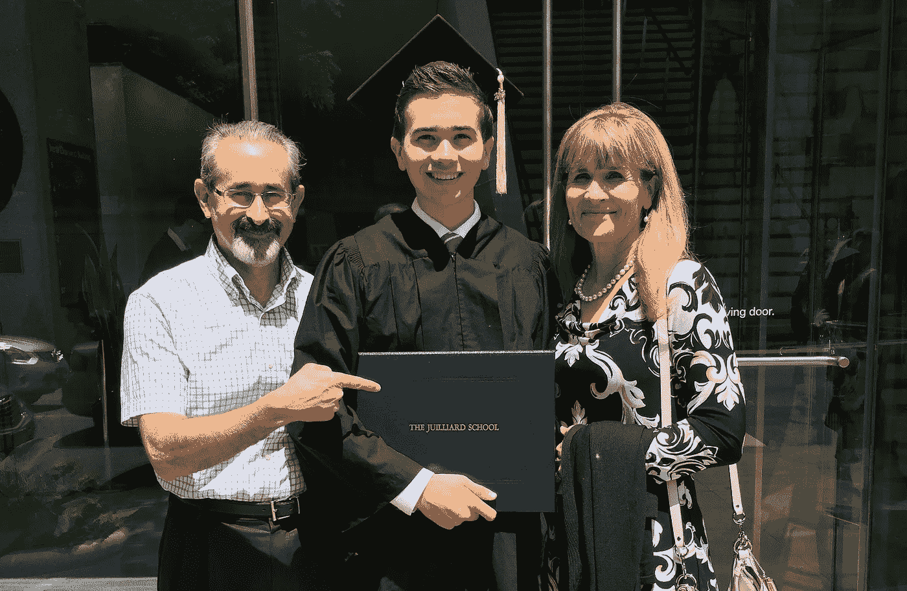
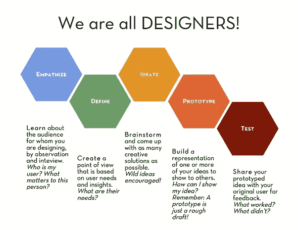

# 告诉音乐学院毕业生要“有企业家精神”的问题在于

> 原文：<https://medium.com/swlh/the-problem-with-telling-music-school-grads-to-be-entrepreneurial-b280727035e8>

College me all day ([GIPHY](https://media.giphy.com/media/26ueYwXr8iY9sodAQ/giphy.gif))

## 我在盒子里住了四年。

在这个混乱的世界里，一间铺着彩色地毯、挂着几十年旧窗帘、光线不好的小练功房是我的避风港。这是我最神奇的学习时刻。我和我的朋友们在这些事情上花了几个小时，在学习演奏我们的乐器的过程中回味和挣扎。

我发现我的大部分学术课程充其量只是模糊的有趣，更多的时候并不适用于作为一名表演者的职业。但是我已经完全准备好演奏莫扎特的协奏曲了。如果我能去卡内基音乐厅，我知道需要付出什么。

毕业那天，我开始注意到一个非常独特的信息从四面八方飞向我们——*成为* *企业家*。

real college me

## 请问？

我知道史蒂夫·乔布斯是一位企业家，埃隆·马斯克和奥普拉，甚至亨利·福特。但是音乐不是一件商业的事情，我不喜欢以这种方式谈论它。我喜欢跳出框框思考的想法，在古典音乐中做出真正的改变，但是我甚至不知道从哪里开始，我已经在我的小盒子里花了太多时间。

我去了[新世界交响乐团](http://www.nws.edu)成为一名管弦乐单簧管演奏家，并在一年的时间里忘记了企业家的事情，但通过新世界的进步心态和我自己的意志的结合，做一些不同事情的愿望在我的脑海中不断涌现。因此，我向新世界申请并获得了一大笔资助，在我的第二个赛季制作一场新型的音乐会，有相当自由的空间来探索我的想法。

## 这个问题

当我第一天见我的项目导师时，她问了一个永远改变了我的问题:

***“你的观众是谁？”***

我身体前倾，准备回答这个问题。然后我坐回到椅子上，停顿了一下，摸索出一个答案。音乐学校里从来没有人让我考虑听众。但是后来我看了看这些伟大的企业家… **他们是** [**设计**](/the-design-innovator/https-medium-com-the-design-innovator-so-what-is-design-anyway-4f99128b51c4?source=linkShare-19e343312022-1509802170) **解决别人问题的方案**。史蒂夫·乔布斯设计了一款产品，让每个人都能使用电脑。埃隆·马斯克设计了一种消耗化石燃料资源的解决方案。奥普拉设计了赋予被忽视的人权力的方法。亨利·福特设计了一种解决马跑得太慢的方法。

他们了解他们的受众，发现他们的需求，并设计解决方案来满足他们的需求。如果我要创造新的有价值的东西，我需要像设计师一样思考。

## 设计提升艺术

Meryl says hold up ([GIPHY](https://media.giphy.com/media/CURF5iPO5uY4U/giphy.gif))

等一下。艺术是关于表达*我的*想法、感觉和解释。设计就是解决*你的*问题。如果艺术的唯一好处是自我表达，那我们为什么要分享它？如果其他人愿意听，他们一定会通过听音乐获得一些好处。

在传统音乐会上，你应该坐下来，陶醉在人类已知的最伟大的音乐杰作中。然而，自从音乐会开始后，世界发生了巨大的变化，伟大的管弦乐不再是现场乐队的专属。如果仅仅是为了听音乐，许多人发现在家里使用 Spotify 和出色的扬声器对他们来说更好。

幸运的是，传统的音乐会体验只是一种体验。**我们可以设计新的音乐来提升音乐，让新的人也能听到。**

## 成为设计师

所以。为了成为音乐家企业家，我们需要了解我们的听众。为了理解我们的观众，我们需要成为设计师。为了成为设计师，我们需要成为**善解人意的** **问题解决者。**

Eleven knows how to feel ([GIPHY](https://media.giphy.com/media/3o8dFoNwHc0qX91WPm/giphy.gif))

音乐是一种艺术形式，它传达复杂的人类情感，将人们团结在同一事业下，并帮助不同背景的人相互理解。一般来说，古典音乐只是让人感受到所有的情感…它有能力感动人。**我们正在解决的问题，是针对那些需要搬迁但还没有搬迁的人。**音乐是一种可以解决这个问题的独特资源，音乐家是工匠，他们可以将这种资源塑造成新的形式——新的音乐会形式、教育项目、社区嵌入式项目、场地、合奏以及其他未开发的可能性。

在练习室之外的宝贵时间里，**音乐学生应该沉浸在使用工具的工作中，这些工具将真正帮助他们走出自己的头脑，同情需要音乐的人，从而塑造未来。我们可以通过一种成文的方法将这一点付诸行动，这种方法可以帮助各行各业的组织建立真正与人们对话的体验。**

## 该方法

[设计思维](http://www.designkit.org/human-centered-design)是一个从一个或几个人开始思考问题并产生解决方案的过程。这个过程通常包括五个阶段:(1)移情，(2)定义，(3)构思，(4)原型，和(5)测试。你会发现它几乎是所有革命性产品和体验的核心，比如苹果和 Airbnb(查看[我写的关于这个主题的文章](/@zachmanzi/what-orchestras-could-stand-to-learn-from-airbnb-and-apple-3ad3db7f8b29?source=linkShare-19e343312022-1509559382))。我们可以用 DT 来发现如何通过音乐感动各种人。

***这在音乐中到底是什么样子？如果我们是一个钢琴三重奏组，为 20 多岁的诗人创造一种体验，那么我们必须了解这些人是谁，他们喜欢什么，他们讨厌什么，他们周末做什么，他们喜欢去哪里，他们怎么说话，如果他们不在音乐会上，他们还会做什么。然后我们建立一种定制的体验，邀请他们以一种对他们来说内在有价值的方式通过音乐铺平道路。也许我们最终会在当地书店设计一场下班后的音乐会，邀请诗人写众包诗来回应勃拉姆斯、门德尔松和贝多芬的特定乐章。但是我必须先跟他们谈谈，知道从哪里开始。看看我和 NWS 一起创作的[音乐会](/@zachmanzi/the-new-world-symphony-nws-recently-performed-a-new-kind-of-orchestra-concert-called-dimensions-e5bf6da6da4b)，看看我们如何使用 DT 来创造音乐会中的观众参与度。***

[design thinking stages](https://www.quora.com/What-are-some-methods-similar-to-human-centered-design-as-proposed-by-IDEO)

DT 也被其他领域所采用——新学院与奈特基金会合作，建立了一个[新闻+设计本科项目](https://www.newschool.edu/lang/journalism-design/),为学生提供实用工具，为不断变化的媒体环境创造新的解决方案。商业、健康和教育领域的专业人士正在使用设计思维来解决新问题。(这也将极大地有利于乐团管理部门的探索)。

## 后续步骤

我们这些音乐人必须带头冲锋陷阵，因为我们从内到外都明白音乐的价值。与苹果(Apple)和耐克(Nike)等公司相比，我们花费了$ number 美元来了解他们的受众，我们的资源少得多，但我们可以改变我们作为一个集体的思维方式，这可能比任何数量的金钱都更有力量。

对音乐学生:我已经花了 6 年多的时间在强化管弦乐训练上，并且热爱这种工作。但我和许多年轻的音乐人(也许包括你)交谈过，他们告诉我，他们想追求另一种职业或创建自己的项目，但觉得这不可行。所以 **如果你的学校曾鼓励你发挥创造力或企业家精神，你应该问问他们打算如何为你提供这样做的工具。一些学校正在建立像茱莉亚音乐学院的[标记中心](https://www.juilliard.edu/school/alan-d-marks-center-career-services-and-entrepreneurship)这样的机构，这为将创造性课程置于音乐教育的中心开辟了很好的途径。**

NWS 创意总监 Siggi Bachmann 和我目前正在开发一门名为“音乐家的设计思维”的课程，我们将从 2018 年秋季开始将它带到音乐学校([单击此处](https://docs.google.com/forms/d/e/1FAIpQLSdq-ltOkt8uVLvvhxZYTIbQ9Lgf12cGo0-TnubDR-PH_a-Htw/viewform?usp=sf_link)注册我们的电子邮件列表，并在信息可用时尽快接收信息！).

当我们拥抱设计师的心态时，我们就开始看到用音乐感动新人的途径。

groove ([GIPHY](https://media.giphy.com/media/5xaOcLGvzHxDKjufnLW/giphy.gif))

–––––

要了解更多关于设计思维的知识，请查阅来自斯坦福大学设计学院、设计公司和卢马学院的资源。

## 这个故事发表在 [The Startup](https://medium.com/swlh) 上，这里有 258，400+人聚集在一起阅读 Medium 关于创业的主要故事。

## 点击这里订阅接收我们的头条新闻[。](http://growthsupply.com/the-startup-newsletter/)

