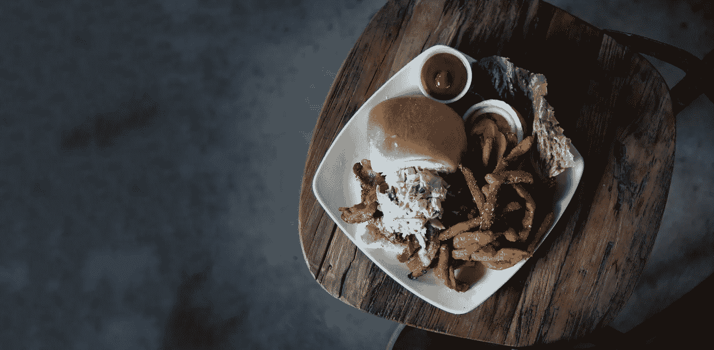

# “自由”这个概念的问题

> 原文：<https://medium.com/swlh/the-problem-with-the-idea-of-free-49c12d7f1ab6>

## 包括对苹果蜂的咆哮

Applebee 最近开展了一项促销活动，只要 12.99 美元，你就可以买到所有你能吃到的鸡块和排骨。更好的是，你不必在两者之间进行选择——你可以在吃饭的时候切换一下。这似乎是一笔不错的交易，所以我决定试一试。

鸡块还不错，所以我决定接下来尝尝排骨。

我这么说并不夸张:排骨是我吃过的最难吃的东西。分散在薄薄的次级肉片中的骨头不能构成一顿饭。

当女服务员回来问一切如何时，我只是说“还行，不过那些肋骨很可怕。”

她笑着说了些类似“是的，它们也不是我最喜欢的，但至少它们是免费的！”

这种“至少他们是免费的”的想法是摧毁企业的原因。虽然她说得对，厨房为我做这些菜并没有花费我任何额外的费用，但同样的原则也适用于自助餐中的几乎所有东西，或者所有你可以吃的特色菜。

如果你一直坚持质量不重要因为它是免费的这一原则，你最终会得到一家失败的餐馆。

我和女朋友最近在一个州立公园的小屋度过了周末。

互联网太糟糕了。虽然通常我不会介意，会去外面体验大自然，但天气决定让这不可能，我们被困在里面。

但是，他们说“嗯，我们的免费 wifi 一般都这么慢，当我们预订满的时候”，好像免费的事实意味着他们没有义务提供高质量的服务。

在顾客的心目中，没有什么是“免费”的。这甚至可能是有人选择你而不是你的竞争对手的原因。

真正成功的公司是那些反其道而行之的公司。通过提供周围最好的肋骨，或任何酒店最快的 wifi，也许有人会告诉他们的朋友。

每一次客户互动和体验都是一次机会。别吹了。

## 想和我“免费”谈 30 分钟的营销策略吗？[在我的日历上安排一个时间](https://calendly.com/alexdriddle/consult/)！如果你喜欢我的作品，请在[推特](https://twitter.com/AlexDRiddle)或[媒体](/@AlexDRiddle)上关注我，别忘了点击那个鼓掌按钮。

## 这篇文章发表在 [The Startup](https://medium.com/swlh) 上，这是 Medium 最大的创业刊物，有 303，461+人关注。

## 在这里订阅接收[我们的头条新闻](http://growthsupply.com/the-startup-newsletter/)。

