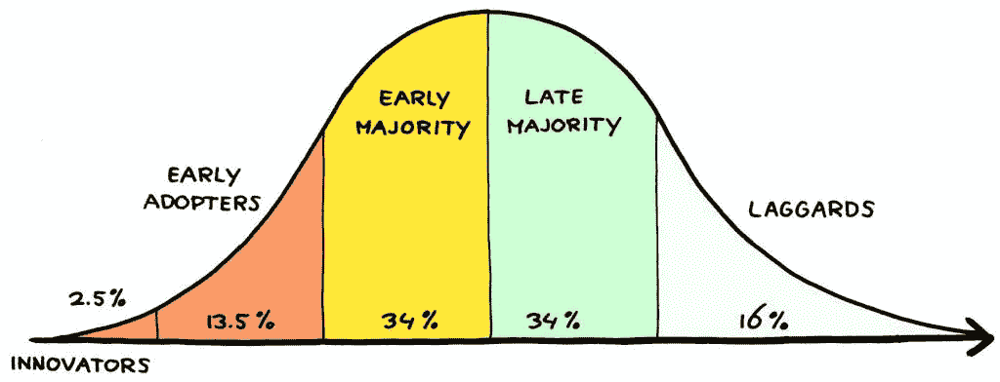

# 试图增长过快的问题是

> 原文：<https://medium.com/swlh/the-problem-with-trying-to-grow-too-fast-5c368fbfdf21>

## 你如何限制你的受众来实现可持续增长。

亚历山大大帝是如何成长起来建立他的帝国的？一次一片土地。你如何吃掉一头大象？一次一口。

那么，为什么当我问“你打算如何发展你的创业公司？”每个初创公司的创始人都告诉我，他们“计划很快在全国范围内推出，并期望在一年内走向全球”。

这是发展可持续业务的错误方法。

想想脸书。当他们第一次推出，你必须有一个 harvard.edu 的电子邮件加入。很快，他们增加了更多的学院。最终，他们向所有人发起了。

如果他们在第一天就进行全球发布，他们就会失败。

其原因是由于一种叫做临界质量 T2 的东西。如果你的朋友都不在上面，你就不会加入脸书。很少有人是早期采用者。

但是，在每个学院内，他们可以比在全球范围内推出更快地达到*早期多数*和*晚期多数*阶段。

如果我们严格按照图表来看，美国有多少人是创新者和早期采用者？大约 5200 万。

只是在哈佛怎么样？3500 左右。

我们需要 5200 万注册人数才能让脸书在美国起飞，但只需要 3500 人就能让它在哈佛起飞。把他们最终扩展到的所有学院加起来，你就能明白为什么他们一旦最终走向全国，会爆炸得如此之快。

尽早围绕你的产品建立更小、更有针对性的社区。否则，你将会像其他百万个没人记得的创业公司一样被抛弃。

## 这篇文章发表在 [The Startup](https://medium.com/swlh) 上，这是 Medium 最大的创业刊物，拥有 299，352+读者。

## 在这里订阅接收[我们的头条新闻](http://growthsupply.com/the-startup-newsletter/)。

