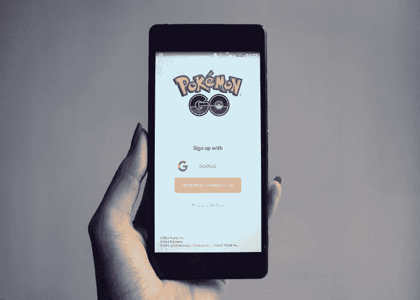
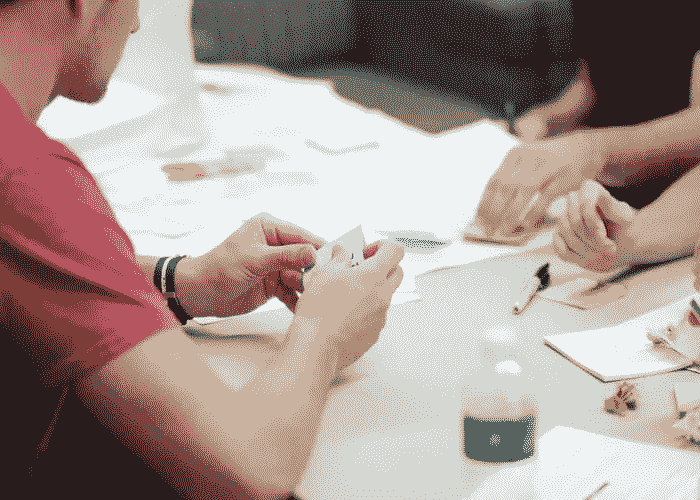
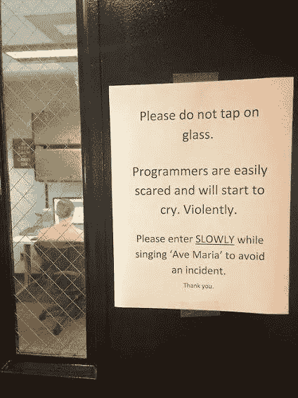

# 应用程序制作流程——解释

> 原文：<https://medium.com/swlh/the-process-of-app-making-explained-5113333be221>

事实是:有相当多的应用程序制作公司。事实上，根据 Clutch.co 的一篇帖子，67%的小企业计划在 2017 年底完成一个应用程序。请记住，这些信息仅包括移动应用统计数据，不包括桌面或 web 应用。

现在，假设你想找一个可靠的应用程序制造商合作。在科技公司的海洋中，你很容易迷路。为什么？因为很难[区分好坏](https://kolosek.com/what-makes-a-good-development-company/)。幸运的是，有许多参数可以**将优秀的应用程序制作公司与你不想与之做生意的公司**区分开来。这些参数是:

*   员工的知识，
*   技术支持，
*   恰当沟通问题的能力，
*   还有很多。

不要忘记:最好的应用程序制作公司是那些拥有**工作彻底、高效并关注细节的员工的公司**。这类公司的员工投入他们的时间、知识和技能，想出最好的解决方案。他们能够设身处地为用户着想，认识到用户最深层的需求，并在开发应用时将这些信息作为指导。

让我们继续讲故事。想象一下，找到几家你认为非常适合你的公司。不过，在你接触这些公司并对它们进行评估之前，你应该了解应用程序的制作过程是如何进行的。

如果你是整个开发过程的新手，你应该意识到团队承诺或团队成员之间的良好沟通不足以确保应用程序的质量。一个开发人员和设计人员的团队必须遵循一定的步骤来实现最终目标。

**那么，开发过程有哪些步骤呢？**是什么造就了伟大的开发过程？开发过程是否依赖于开发人员和设计人员的知识，或者还有更多？

让我们来回答所有这些问题(以及更多)！

在我开始实际的 stepsーin 之前，有一个简短的说明。在下面的文本中，我将介绍外包应用程序制作公司所经历的过程，这并不奇怪，因为我为一家远程开发团队的公司工作。

现在，让我们来看一下所有的步骤。

你可能听说过给人留下良好的第一印象是做生意的关键。我们完全同意，原因如下。

留下良好的第一印象很重要，因为从长远来看，这可以建立信任，并有助于缓和第一次接触的气氛。其实你知道吗，人际交往中的一个[真诚的微笑](https://www.inc.com/jeremy-goldman/6-ways-successful-people-make-a-good-first-impression.html)能让你更难忘？

*那么，会议期间会发生什么？*

> *你第一次见到外包公司的项目经理(或首席技术官或首席执行官)。在这次会议中，你们讨论潜在项目背后的* ***创意*** *。如果双方达成共识，你向公司提供你的应用应该是什么样子的信息，然后，一旦项目经理有了所有的初步答案，应用制作流程就可以开始了。*

在大多数情况下，最好的应用程序制作公司都会尝试与客户面对面交流。如果这是不可能的，第一次联系可以通过电话进行。

# 第二步:团队探索你的想法

一旦项目经理收集了他们需要的关于项目的所有信息，他们就把你介绍给团队，然后他们通过与开发和设计团队进行头脑风暴会议来更深入地探索你的想法。

关于应用程序制作，companiesー的事情是这样的**开发者和设计者必须一起工作**才能按照客户想要的方式创建一个应用程序。如果他们不这样做，创建一个应用程序的目标就不会明确，而且总会有一个元素被遗漏。每个人都必须步调一致，理解彼此的任务，平等地做出贡献。

一个团队应该做出哪些重大决策？在这一步，团队应该根据应用的目的和最终目标，为应用选择合适的平台。可以理解的是，选择移动平台还是网络应用是有区别的。

与此同时，一个设计师团队应该致力于使**成为应用程序的最佳视觉解决方案**。设计师创建应用程序最终完成时的外观模型。这包括添加徽标和所有重要元素，如颜色、字体、样式等。

一旦团队对这个想法有了一个概念，公司就应该联系你并展示出来。

# 第三步:向客户提出想法

一旦这个想法被彻底探索，团队/项目经理会把它呈现给你。通常，一个设计师团队负责这项工作，因为设计师可以很容易地引导你完成每一个开发和设计师的选择。

> *请注意，最好的应用程序制作公司知道如何以简洁而精确的方式展示他们的想法。他们不想浪费你的时间，也知道你不想听两个小时的故事。*

在这个阶段，在你提出问题或不同意某件事之后，只要注意他们给你的反馈，你就能发现一家好的开发公司。来自最好的应用程序制作公司的团队总是试图**收集尽可能多的反馈**，因为他们知道这是建立值得信赖的合作的方式。

此外，如果有什么你不满意的地方，你应该经常提出来，并最终改变它。请记住，这一步是实际编程开始前的最后准备。

# 第四步:应用程序制作流程

应用程序的制作过程需要**开发和设计团队**共同努力来创造最终产品。通常，客户会定期检查团队的进度，并在需要时做出更改。

有几种方法可以确保应用程序开发过程处于正确的轨道上。

你可能听说过敏捷团队和 T4 团队。一些应用程序制作公司的经理说，这是控制项目和将进展货币化的最佳方式。我们可以说，这种方法引导我们完成了所有的项目，到目前为止没有让我们失望。

app 制作流程由**实际编码**组成。每个项目的目标都是确保你最终得到高质量的代码，这可以通过雇佣有经验的开发人员来实现，他们可以快速交付，而不会损害代码质量。然而，有一种开发过程的方法肯定会提高拥有高质量 codeーTDD.的机会

**TDD** 是三个词的首字母缩写:**T**est**D**riven**D**开发方法论。简而言之，这意味着开发人员必须先测试他们的代码，然后才能称之为完成。测试应该定期进行，直到通过每一次测试，代码才算完成。当执行测试时，记住第一个测试肯定会失败。这是发展的首要规则之一。

# 第五步:Beta 测试

只有当应用程序完全完成时，即当设计和编码部分都完成时，应用程序制作公司才会选择 beta 测试。

> *为什么要进行 beta 测试？因为这是最后的测试，是为了确保你的应用发布时不会有错误或崩溃。开发者终于有机会作为最终用户使用应用程序，这也是他们注意到所有缺陷和改进空间的方式。*

从财务角度来看，beta 测试是非常高效的。如果一家开发公司决定跳过 beta 测试，成本可能会更高，因为所有的测试都是在应用程序上市后进行的。

请记住，在正式发布应用程序之前，检查错误、性能、可用性和所有其他问题是必须的。不要让任何其他应用程序制作公司告诉你不同的。

# 步骤 6:发布后的活动

如果你认为你的开发团队在应用程序发布后就“脱身”了，那就再想想吧。这个项目甚至在发布后还在继续，那时候你需要有人支持你。

事情是这样的:**没有完美的应用**。即使在产品发布后也可能出现错误，但重要的是在错误出现时立即处理它们。这就是为什么开发团队通过修复所有可能出现的问题来处理应用程序。在这个阶段，团队承担技术支持的角色。

# 结论

正如你所看到的，开发过程就像任何其他 processーit 需要勤奋的人，适当的沟通，不怕面对挑战。

请记住，只有**双方共同努力**，app 制作过程才能成功。开发团队在创建应用程序之前需要您的意见以及您关于他们进度的信息。

*谢谢你一直读到最后。希望对你有帮助！*

*原载于 2018 年 4 月 26 日*[*kolosek.com*](https://kolosek.com/the-process-of-app-making-explained/?utm_source=ts)*。*

## 这篇文章发表在 [The Startup](https://medium.com/swlh) 上，这是 Medium 最大的创业刊物，有 319，283+人关注。

## 在这里订阅接收[我们的头条新闻](http://growthsupply.com/the-startup-newsletter/)。

