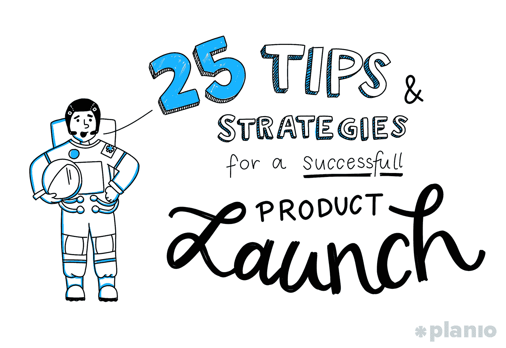
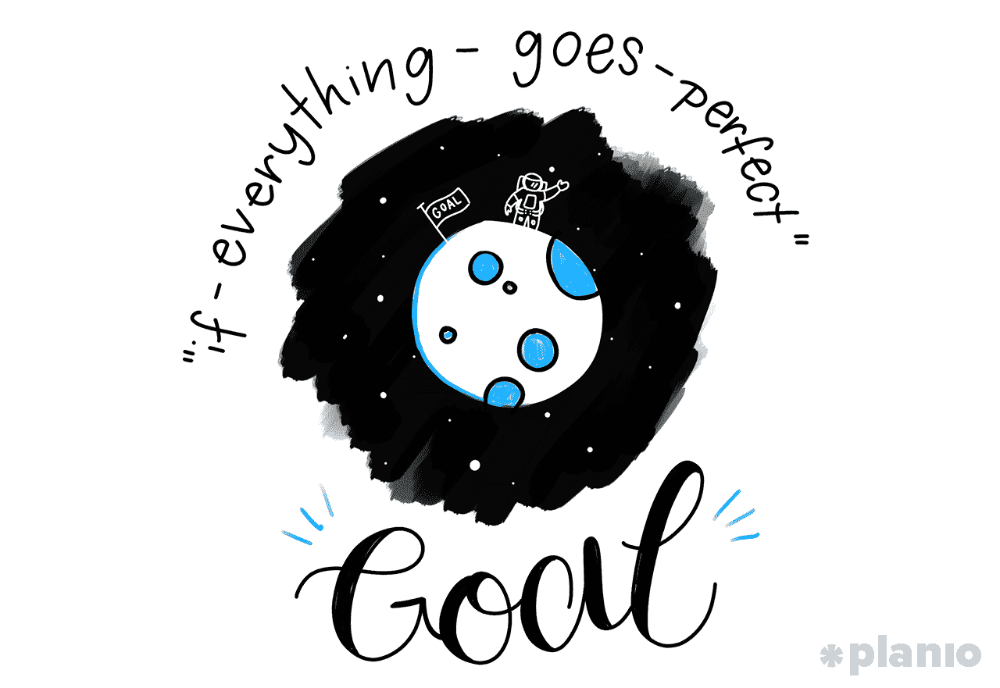

# 产品发布行动手册第 1 部分:完美发布的 25 个策略

> 原文：<https://medium.com/swlh/the-product-launch-playbook-part-1-25-strategies-for-a-flawless-launch-422e5de9b276>

## 从如何建立你的社区到如何获得媒体等等

这是每个项目业主最大的恐惧。你花了几个月的时间努力打造一款你认为顾客会喜欢的产品。你的梦想充满了 TechCrunch 的功能和产品搜索的热门位置。重要的一天到来了。你打开开关，然后…

…蟋蟀。

[根据市场研究协会](http://www.marketingresearch.org/the-importance-of-process-in-new-product-development)，**的数据，只有 40%的开发产品能够进入市场。**

在这 40%中，只有 60%会产生任何收入。

不幸的是，太多的人对他们的产品发布抱着“造好了，他们就会来”的心态。他们被自己投入的工作蒙蔽了双眼，并认为他们的产品很棒，其他人(和顾客)自然也会这么想。

但是利害攸关，不能自满。如果你已经把你的血、汗、泪投入到制造一个你相信的产品中，为什么现在就停止在你 98%的地方呢？

**事实上，一个成功的产品发布可以归结为两个因素:在合适的人面前推出合适的产品。**

听起来很简单。但远非如此。在本指南中，我们将涵盖确保产品成功上市所需的一切，从确认您已经构建了正确的产品，到让正确的产品出现在正确的人面前的营销策略。

*一次成功的产品发布会充满了各种变化，需要你的整个团队步调一致。使用像*[*Planio*](https://plan.io/)*这样的工具来跟踪你的进度，并指导你的团队从发布前到发布后的聚会。*

# 发布前:决定发布什么以及如何实现

如果你认为这个指南是关于你如何推广你的产品，我有消息告诉你:你的产品发布会在发布日之前开始。

确保你的发布会成功的唯一方法是确定你正在生产的产品对你想购买的人是有价值的。不仅如此，你还需要让他们知道这一点，让他们感兴趣并投资，并尽一切努力让他们在你最终发布时毫不犹豫地购买。这里是开始的地方:

# 1.挖掘你的数据，发现人们想要什么(或者你遗漏了什么)

无论你的发布会多么引人注目或者报道得多么好，成功最终都归结于为你的客户提供价值。所以，你的产品发布策略的第一步是让*绝对确信*人们想要你卖的东西。

从自己的业务数据开始。你可以查看哪些指标来了解人们在哪里和为什么来找你？

你提供多种产品，其中一个是明确的英雄吗？

人们是否会从你网站的某个页面返回(意思是你卖的东西不符合他们的期望？)

当你的竞争对手正在扼杀它的时候，你有没有看到它的使用率或销售额下降？

在数据中寻找模式，发现可以为用户创造价值的地方。但是，请记住，这只是一个起点。[过于数据驱动会扼杀创造力](/microsoft-design/if-you-want-to-be-creative-dont-be-data-driven-55db74078eda)，但是适量的数据是一个强有力的工具。

# 2.与您的客户交谈

你最好的洞察力将来自实际用户。不幸的是，许多企业跳过了这一部分，或者认为数据说明了一切。但是与客户交谈还有许多额外的好处:

1.  你开始了解他们，他们的具体需求，以及他们最初选择你的原因(你将利用这些来撰写客户角色)
2.  您会得到关于他们使用的功能的坦率回答(这有助于验证您的产品并提供关于新功能的见解)
3.  你可以听到他们是如何交谈的，以及他们使用的语言(这是你营销页面的黄金)

顾客是洞察力的丰富来源。但是你必须让他们说出自己的想法。我知道你对自己正在构建的东西很兴奋，并且想告诉他们，但是在你插话之前，让他们自由地、不受影响地说出来。开放式问题会给你带来意想不到的答案。

但是就像你的数据一样，你需要把这些信息作为灵感的来源，而不是指南。正如[史蒂夫·乔布斯的名言](https://gizmodo.com/5834330/the-best-steve-jobs-quotes):

> 按焦点小组设计产品真的很难。很多时候，人们不知道他们想要什么，直到你给他们看。

# 3.研究市场，将你的想法转化为策略

最后一个观察和了解你的产品的地方是市场本身。现在外面有什么？你的用户会根据谁来评判你的产品？

首先，列出你的竞争对手和 SWOT 分析(优势、劣势、机会、威胁)。或者，你可以简单地看着你的产品，问“是什么让它与众不同？”

记住，你不能只说你的产品更好。你需要能够给出细节。

在你的发布会上，人们会谈论什么？如果你把你的产品和竞争对手的产品放在一起，什么会让别人选择你的产品？

这些关键优势是您产品发布战略的支柱。这就是为什么尽早识别它们如此重要。

收集了所有的信息后，是时候实际测试你是否在正确的道路上了。

这一切都归结于[验证](https://www.ryrob.com/validate-business-idea/)的过程——在一群真实用户身上测试你的产品。

当然，你可能认为你想保持一些神秘和悬念围绕你的产品。**但是不在真实用户中测试你的想法就像戴着眼罩试图射击一个目标。**

当詹姆斯·戴森爵士开始设计世界上最畅销的吸尘器时，他花了[5126 个原型](http://www.fastcompany.com/59549/failure-doesnt-suck)才找到一个人们想要的。

创建一个早期反馈小组，由值得信赖的朋友、超级用户甚至一些新用户组成，并尽早将你的产品展示在他们面前。他们按照你的意图使用它吗？他们从中看到真正的价值了吗？

所有这些研究确保你在开始销售人们不想要的东西之前，已经确定了产品发布的目标。

# 5.开始建立你的社区和受众

是的，每天有几十亿人在线。是的，可能有成千上万的人希望 T8 购买你的产品。但是如果他们不知道呢？还是他们第一次听说是在你的发布日？你很可能会失败。

相反，你应该在发布日期之前，围绕你的产品和品牌建立一个受众群。

看看 ProductHunt 的创始人 Ryan Hoover 的例子就知道了，他说如果没有他自己的努力，他的公司根本不会存在。

> 如果我不在[发布前]写作，不建立这些热爱科技的观众群，ProductHunt 就不会存在。

Ryan 选择写他的产品将要进入的领域，因为这是与志同道合的人联系的最省力的方式之一。然而，他说你不能只写你的产品(这不是新闻稿)。你需要写下你正在解决的问题。你个人面临的问题促使你寻找解决方案。

你写的地方也很重要。对于这样的帖子，选择一个已经有固定受众的公共论坛，比如 [Medium](/) 或者在 [Reddit](https://www.reddit.com/) 、 [Quora](https://www.quora.com/) 上回答问题，或者小众脸书团体。

如果你要推出一款消费产品，或者更具视觉效果的产品，另一个选择是在 Instagram 或 Pinterest 上建立粉丝群。这将向你的潜在客户表明，你处于他们的位置，你了解他们的具体需求。正如胡佛所解释的:

> 如果你开始做你热爱的事情，你会发现并吸引同样热爱的人。他们不仅会是你第一个与之交流反馈的人，也会是你的第一批用户和第一批顾客。”

# 6.定义您的理想客户(每种产品只有一个！)

你可能已经知道你的产品是为谁制造的。但是当谈到一次成功的发射时，你需要变得非常专注于那个人到底是谁。

不要简单地看一个广泛的人口统计——就像说你的产品是为 18-35 岁的人设计的——你的产品发布会因为有明确的受众而更有影响力。

因为，正如数字营销机构 [Findsome & Winmore](https://www.findsomewinmore.com/) 的首席执行官马特·塞托所说:

> *品牌死在中间，试图吸引所有人。*

相反，Certo [解释说](https://www.social-hire.com/blog/small-business/q-a-a-formulaic-approach-to-building-a-brand-through-storytelling/)你需要知道谁是你最好的客户(并尽你所能了解他们。)

> *“侧写他们。给他们画素描。他们喜欢你的服务或产品的什么？他们在日常生活中如何使用你的产品？作为一家企业，你如何改善那个人的日常生活？”*

一个很好的例子是 Lululemon。运动服品牌将他们的全部受众缩小到两个特定的角色: [Ocean 和](http://www.businessinsider.com/lululemon-idea-customers-ocean-and-duke-2015-2)Duke。每个角色都有具体的特征，比如年龄、年收入、兴趣，甚至关系状态。

对于您自己的产品发布，对您的理想客户角色进行同样详细的描述将有助于巩固您的发布策略、产品开发和营销。

如果你要推出像 Lululemon 这样的消费品，问类似的问题:

*   谁是我的理想客户？
*   他们住在哪里？
*   他们的年收入是多少？
*   他们的兴趣是什么？
*   她如何使用我们的产品？
*   关于他们，你还能指出哪些细节？

如果你在销售 B2B 产品，你会希望更多地关注他们的业务和他们面临的问题。询问他们公司的规模、购买周期、痛点等问题是一个很好的开始(或者，查看这个[理想客户模板](http://blog.close.io/ideal-customer-profile)以了解更多深入的问题)。

# 7.借鉴史蒂夫·乔布斯的经验，构思一个引人入胜的故事

你知道谁是你的顾客。你知道他们想要什么，你的产品可以满足他们的需求。现在，你只需要能够准确地告诉他们*为什么你是他们应该下注的马。*

换句话说，是时候从你产品发布的*什么*转移到*为什么*了。

如果你在寻找灵感，没有人比已故的苹果创始人史蒂夫·乔布斯做得更好。

谈到产品发布，乔布斯是一个讲故事的大师。但他擅长的不仅仅是讲述产品本身的故事，而是讲述使用产品的人。乔布斯的故事让你觉得你不得不拥有他们的最新产品，这就是为什么苹果用户是如此虔诚的一群人。

当你在构思自己的产品发布叙事时，你需要记住关注人，而不是产品。比起事实，人类更容易记住和联系情感。如果你只是关注速度的提高、设计或其他一些特性，就更容易被忽视。

取而代之的是，就这些特性能让你的理想客户做些什么来精心设计你的叙述。

从乔布斯到好莱坞编剧，每个人都使用的一个通用模板是遵循[三幕结构](http://www.businessinsider.com/steve-jobs-followed-a-simple-3-step-formula-for-all-of-his-speeches-2016-4):设置、对抗、解决。

您的**设置**向客户显示他们现在的位置。它把他们描绘成英雄。在**对抗**中，他们碰到了一个问题。这是你理解的痛点，也是你的产品正在解决的痛点。在**决议** *，*中，英雄(用你的产品)克服了他们的问题，世界因此变得更加美好。

换句话说，在我们把辛苦赚来的钱花在一个产品上之前，我们想知道你理解我们，我们的问题，并且有一个可行的解决方案。把这三个都写在你的叙述中，你就可以把它作为你的产品发布文案的基础。

# 8.使用亚马逊公式写一份模拟新闻稿，并创建一个目标出版物和记者的列表

新闻报道可以放大你的产品发布会，是它成功的巨大倍增器。问题是，许多营销人员认为记者会关心他们的重新设计或更新产品。(剧透提醒:他们没有。)

就像你的顾客一样，记者关心一个故事。你需要向他们展示你的产品有潜力让人们兴奋和阅读。在亚马逊，他们非常相信写一篇强有力的新闻稿的力量，以至于每件产品在生产之前都需要一篇*！*

亚马逊总经理伊恩·麦卡利斯特解释道:

> *如果新闻稿很难写，那么产品可能会很糟糕。*

这里是[亚马逊的模板](/bluesoft-labs/try-an-internal-press-release-before-starting-new-products-867703682934)，这是一个很好的起点:

*   标题:以读者(即你的目标客户)能够理解的方式命名产品
*   **副标题**:描述产品的市场是谁，以及他们获得了什么好处。标题下只有一句话
*   **总结**:对产品及效益进行总结。假设读者不会读其他任何东西，所以把这一段写好
*   **问题**:描述你的产品解决的问题
*   **解决方案**:描述你的产品如何优雅地解决问题
*   **引用你的话**:引用你公司发言人的话
*   **如何入门**:形容入门有多容易
*   **客户报价**:提供一个假想客户的报价，描述他们是如何体验这一优势的
*   **结尾和行动号召**:总结一下，给读者指出下一步该怎么走

有了新闻稿模板，就可以创建一个电子表格，其中包含您想要联系的目标出版物和博客。研究每一个人，找到更有可能报道你的相关记者或编辑。记下他们报道过的任何类似产品或他们采取的共同角度。你将利用这些信息为每个作者量身定制每条媒体宣传信息。

# 9.列出候选名单并联系媒体、合作伙伴和附属机构

我们已经讨论过制作你的新闻稿和电子表格，以确定每份出版物的目标受众。但是还有谁能帮你发布产品呢？

你可以联系的合作伙伴或互补公司有哪些？会谈论你或评论你的产品的有影响力的人呢？最后，你会经营一个联盟计划吗？你能联系相关的博主或合作伙伴来帮助销售你的产品吗？

使用您的媒体电子表格的另一页来突出显示这些机会，并列出您想要锁定的候选人，为什么它们是一个好的选择，以及它们的受众规模/对您的价值。

# 10.撰写和设计您的营销页面

您的营销页面是您在发布当天向所有客户发送信息的地方。你可以把它当成你产品发布的第三基地。你需要做大量的工作来吸引顾客，但是一旦他们来了，你就有最好的机会把他们带回家。

这意味着有很大的压力要使它在视觉上引人注目，有很强的文案，并且易于使用。

我们写了一份关于如何运营网站项目的完整指南，然而，在这个阶段，你需要确保你把关键元素放在一起:

*   品牌理念;标签行
*   你的解决方案
*   核心功能
*   价值主张
*   社交证明(用户的评价/引用)
*   行动呼吁

当你为这一页撰写文案时，你需要利用你从构思故事、与顾客交谈和挖掘自己的数据中学到的一切。与每个人分享你的信息，看看它如何引起共鸣。和你早期的反馈小组谈谈，用他们的语言来说明你到底要如何让你的产品最有吸引力。

这本身就是一个过程，你应该在发布日之前不断更新。

# 11.概述您的客户之旅，并开始收集创意资产

[大多数市场研究](https://www.salesforce.com/blog/2015/04/takes-6-8-touches-generate-viable-sales-lead-heres-why-gp.html)都认为，在你有可能达成交易之前，你需要与顾客有 6-8 个“接触点”。换句话说，客户需要多次看到你、听到你的声音、读到你的信息，然后才会同意。

在产品发布期间，你将会和那些既认识你又不认识你的客户打交道。在发布前你接触的越多，你成功的几率就越高。

获得这些信息的最佳技巧之一是描绘出你的客户从从未听说过你到成为付费客户的旅程。然后为每个步骤创建资产。要做到这一点，可以问这样的问题:

*   他们在网上都去哪里玩？
*   他们第一次听说你是什么时候？
*   他们信任哪些人？
*   他们去哪里提问？
*   你有他们的电子邮件或者你能得到它吗？
*   他们会对你的产品有什么顾虑？

从那里，你可以开始规划你需要的创意内容，以确保他们在每一步都能找到你。这可能意味着:

*   相关网站和出版物上的博客帖子
*   主页上的视频
*   脸书广告
*   评论相关的 Reddit，Quora 的脸书集团线程
*   电子邮件培养活动
*   与有影响力的人和思想领袖合作
*   你的产品的早期评论
*   播客外观
*   顾客的评价

列出一份你的潜在客户可能找到你或听说你的地方的清单，并开始列出你能做些什么来吸引他们。

# 12.借鉴众筹，利用预购来炒作

[在你的产品上市前就销售出去](https://www.fastcompany.com/3026215/what-every-company-can-learn-from-the-pre-order-kickstarter-model)让早期用户进入市场。它还可以让您围绕您的产品建立一个社区，测试营销信息，并验证您的定价策略。更好的是，如果你给提前购买的人有限的折扣，它可以创造一种稀缺感。

然而，如果你正在考虑做某种形式的售前，请记住，这将需要注意和工作。如果你正在建立一个社区，你将不得不与他们接触。如果你提供折扣或特别优惠，你不能错过。

如果你公开你的“有限供应”产品是为了炒作，你最好努力让它们卖出去。没有什么比承诺 0 美元的众筹活动更令人沮丧的了，你的预售页面也是如此。

# 13.设定雄心勃勃的“如果一切顺利”的目标

为了有一个成功的产品发布，你需要对成功有一个清晰的认识。

现实一点，但是不要怕拍高。这些目标应该是你的整个团队能够团结起来为之努力的目标。把它们当成你的“如果一切顺利”[目标](https://plan.io/blog/ultimate-guide-to-setting-goals-that-get-accomplished/)。如果你的整个计划顺利进行，你希望会发生什么？

这是一次产品发布会，目标应该是达到销售、注册或订阅的明确目标。所以不要只被社交分享和流量这样的虚荣指标所困扰。

# 14.将所有东西放在一个发布日策略中(并使用你的项目管理工具来跟踪它)

如果还不清楚的话，你的产品发布策略有很多变动的部分。将所有这些保持在一起并平稳移动是一项巨大的任务。

这就是你的项目管理技能派上用场的地方。下水是一项团队运动。拥有一个可靠的、经过深思熟虑的发布计划和时间表将有助于你组织所有需要跨团队完成的事情。

*   你的产品有望在截止日期推出吗？
*   您的销售团队是否拥有销售所需的所有资产和培训？
*   客户支持是否知道会有大量客户涌入，他们是否准备好提供帮助？

不仅如此，产品发布推广的所有潜在路径都在发挥作用吗？你是否与外部公关或营销公司合作？他们是否拥有成功支持您的产品发布所需的所有资产和支持？

一份好的产品发布文档不仅仅是任务清单。它考虑了所有的任务、它们的时间框架以及它们的依赖关系。依赖关系尤其重要，因为您要协调可能不习惯一起工作的跨职能团队。

与所有相关的团队交谈，让他们帮助创建有意义的时间表和里程碑。如果他们制定了时间表，它会更现实，他们也更有可能按照时间表生活。

像 [Planio](https://plan.io/task-management/) 这样的项目管理工具可以让您在一个地方看到所有的任务，分配截止日期、优先级和基于角色的工作流，从而帮助您保持产品发布的所有移动部分有序。

最终目标是一个战略文档，它涵盖了将该产品推出市场所需的一切，并让参与该项目的每个人都知道:

*   他们的职责是什么
*   他们的交付物应该包括什么信息，以什么格式
*   他们交付成果的顺序是什么
*   他们依赖谁来交付成果
*   谁依赖于他们的交付物

像这样详细的早期计划可以让你看到所有的事情是如何一起工作的，并给你时间来看看你是否错过了什么大事。

虽然看起来工作量很大(确实如此)，**一次成功的产品发布遵循着和托马斯·爱迪生对天才的定义******【相同的公式:1%的灵感和 99%的汗水。****

*****想知道接下来会发生什么？在*** [***Planio 博客***](https://plan.io/blog/product-launch/) ***上查看完整的帖子以及发布当天(及之后)要做的事情。*****

# **嘿，我是乔里！**

**我帮助公司和有趣的人通过巧妙而集中的写作讲述他们的故事。想一起工作吗？给我发邮件到 hello@jorymackay.com**

***这篇文章的一个版本最初发表在* [*Planio 博客*](https://plan.io/blog/product-launch/) *上。查看更多关于项目管理、建立远程团队和创业成功的文章和实用技巧。***

****

## **这篇文章发表在 [The Startup](https://medium.com/swlh) 上，这是 Medium 最大的创业刊物，有 312，822+人关注。**

## **在这里订阅接收[我们的头条新闻](http://growthsupply.com/the-startup-newsletter/)。**

****