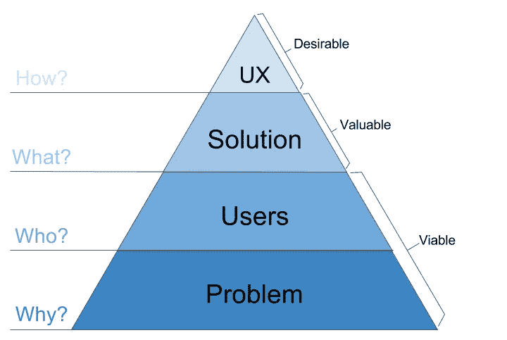

# 产品管理需求层次

> 原文：<https://medium.com/swlh/the-product-management-hierarchy-of-needs-1003b6c439d2>

马斯洛的需求层次通常被描绘成一个金字塔，最大、最基本的需求在底部。必须先满足较低层次的需求，然后才能满足较高层次的需求。

我认为类似的理论也可以应用到产品管理中，我在这张图表中捕捉到了这一点:

The Product Management Hierarchy of Needs

所以，从底层开始…

# 为什么

对一个产品经理最基本的需求就是有一个问题要解决。最好的产品和公司源于一个真实的、明确的问题。谷歌让寻找网页变得更容易，亚马逊提供了更多的书籍选择，贝宝简化了在线支付。

没有耐心的“企业家”通常会专注于一个不存在的问题，并试图说服其他人附和，同时实现他们成为“首席执行官和创始人”的梦想。同样，产品经理经常会陷入交付并不真正需要且没有价值的特性的困境。

你的想法必须**可行**——理解并验证问题，以确保它存在，并且足够痛苦，以证明解决它的任何工作都是值得的。*(如果你的支出很少，追求更小的问题是可以的)。*

成功的产品可能来自看似不存在的问题，例如，已经售出超过 7500 万只电子鸡“只是为了好玩”，但请记住，销售维生素比销售止痛药更难。

> *提示:* *利用****5 Why ' s****的方法，得到底层问题，了解真正的痛点。*

# **who**

如果您已经确认存在问题，并且风险/未知因素已经减少到足以证明继续前进是正确的，那么您就可以解决下一个基本需求——用户。

要让一个想法变得可行，必须有人愿意使用你的产品(如果你卖的话还要付钱)。这与“为什么”紧密相连，因为如果你的想法没有市场，那通常是因为你没有解决一个真正的问题。

有时候，一个看似不错的想法因为用户的理解或环境而不可行

*   人们不想被看到使用你的产品
*   人们无法访问您的产品
*   需要它的人付不起钱

来满足这种需要；了解你的用户；和他们说话，把东西放在他们面前，看着他们。确保你能回答关于他们是谁，他们有多少人，他们在哪里，他们做什么，他们的动机/痛苦的问题。

> *提示:确定将使用/购买你的产品的* ***人物角色*** *。在制作任何东西之前，每个角色至少要见 3 个人，给他们买咖啡/蛋糕，直到你有信心可以回答以上所有问题，甚至更多。*

# **那个什么**

现在您已经满足了两个需求:有一个问题需要解决，并且有用户需要它。要想变得有价值，你的产品必须通过提供解决用户问题的解决方案来让用户受益。

您确定的任何解决方案也必须是可行的，即您能否在任何限制条件下(如资源、专业知识、物理定律等)创建它。

举例来说——建造一个人类传送装置肯定能解决交通问题，而且肯定会有用户，但是与更好的公共交通相比，这是一个合适的解决方案吗？

确保您创建的任何解决方案都与您正在解决的问题以及您正在为其解决问题的用户相关联。支持精益方法，尽早把你的解决方案放在用户面前，并且经常提供护栏来阻止你的产品走得太远。

> 提示:勾勒出当前用户的旅程，并标记出你的解决方案影响这一流程的所有地方。检查您的产品是否会在您确定的每一点上产生预期的效果或变化。

# 怎么做

如果你已经发现了一个问题，而你的目标市场可以用你的解决方案来解决这个问题，那么你很可能拥有接近传说中的最低可行产品或 MVP 的东西。(*在这篇文章中，我强调了为你的用户提供价值，所以我认为最低价值产品是一个更好的术语。)*

一旦你满足了最基本的三个需求，并且有了 MVP，产品经理自然会寻求改进、提炼和优化他们的产品。马斯洛对“自我实现”的描述很好地转移到这个阶段；

> “渴望完成自己力所能及的一切，渴望成为自己力所能及的人”

翻译——你希望你的产品尽可能做到最好。

这是“如何做”，通常可以在用户体验的大框架下进行(UX)。用户体验不仅仅是屏幕显示的顺序，或者工具提示和按钮的位置。它包括从用户发现你的产品、下载/打开它、注册它、分享它、报告它的问题、升级它、支付它等等的整个用户旅程。如果你的应用很棒，但是没人能找到或下载它，那么它有价值吗？它真的是一个很棒的应用吗？

UX 是产品管理层级中的最终需求，因此提供了最大程度的自由来发挥创造力和个性。了解你的用户喜欢什么和不喜欢什么，尝试 A/B 测试，在设计中投入思想，并在每个阶段进行优化。记住，简单并不容易，通过去掉一些东西来改进产品通常比默认添加一些东西要好。

> 提示:使用 [Kano 模型](/product-problems/product-management-is-like-roulette-except-the-house-doesnt-always-win-2a083ff96301)对工作项目进行分类，并在你的核心产品旁边实现令人高兴的东西。取悦者是影响 UX，让你的产品变得有粘性和可爱的好方法。

## 摘要

如果你从需求和满足需求的顺序来考虑问题，那么解决问题的过程就会变得更加清晰:

1.  从为什么开始，了解问题
2.  彻底了解你的用户
3.  您的解决方案必须提供价值
4.  优化整体用户体验，让你的产品变得可爱

我相信围绕这个理论还有很多要补充的，但是我喜欢吃我自己的狗粮，所以我很早就发表我的想法以获得反馈。让我知道如果你认为这是一个有趣的阅读，你有一个不同的观点或一些补充吗？

> 如果你有兴趣了解更多关于产品开发的事情，那么一定要按住拍手按钮，跟随我和出版物。
> 
> 您还可以在 [ucreate.it](https://www.ucreate.it/) 找到更多关于 ucreate 和我们提供的产品的信息

## 这篇文章发表在[《创业](https://medium.com/swlh)》上，这是 Medium 最大的创业刊物，有+421，678 人关注。

## 订阅接收[我们的头条新闻](https://growthsupply.com/the-startup-newsletter/)。

