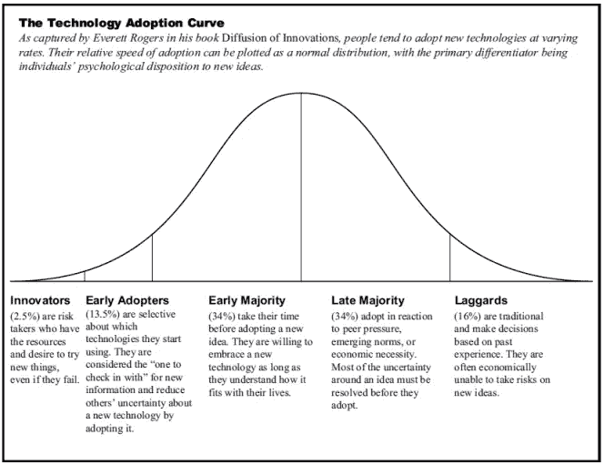
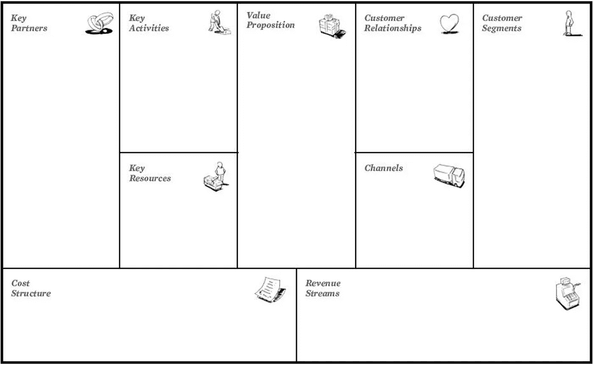

# 产品经理与战略家

> 原文：<https://medium.com/swlh/the-product-manager-vs-the-strategist-49049a8e079f>

## 塑造你的世界的角色背后的人是如何思考的。

## 你的生活是被策划的。

你正在喝的咖啡，你正在播放的视频，还有你穿着的那副对话服——你所有的选择都是由可获得的和想要的东西所驱动的。但是谁把这些选项放在那里呢？谁决定雀巢应该制造一台浓缩咖啡机？是谁让 Youtube 家喻户晓？谁让耐克收购匡威的？

**产品经理和战略家推动这样的决策，从而塑造你的世界。两者都选择要解决的问题和追求的目标。两者都将宏伟的愿景转化为有形的商品和市场现实。**

目前，他们的世界截然不同。项目经理和战略家通过不同的视角看待事物，并保持经常对立的优先权。但它们实际上是一个功能整体的两个部分:为了应对现代市场面临的一系列挑战，这两种观点都是赢得和保持胜利的必要条件。

大多数公司只重视其中的一个，并把两个世界分开。在这样的系统中，项目经理和战略家提供相互竞争的视角，而不是相互授权，为客户和企业创造指数级的胜利。

要理解这两者如何协作，我们必须首先理解产品经理和策略师是如何思考的。

## 产品和战略有什么关系？

***产品*** 将客户需求与商业目标联系起来，生产人们使用和购买的商品和服务，使公司具备竞争力。作为一个领域，它在过去几十年里对有效竞争变得更加重要，尤其是随着科技行业的崛起。方向可以来自上层(项目经理执行高管的愿景)，也可以来自下层(项目经理将功能编织成可销售的故事)。

***战略*** 综合考虑外部和内部环境，找出市场差距和机会，使公司具备竞争力。作为一个领域，它通常在高管团队附近举行。这个角色已经成熟，但战略工作的性质在过去几十年里已经发生了重大变化:竞争优势已经从在某一特定领域做到全球最佳，转变为最能适应不断变化的市场和客户需求。

当两者结合在一起时，公司通常会取得突破性的成功。也许最近最明显的例子之一就是 Nespresso 系统:该产品满足了人们对高质量且方便的浓缩咖啡的强烈(大部分未得到满足)需求，同时该战略使雀巢能够通过订阅销售和硬件许可保持增长。

简单来说，产品和战略都是为了完成一个公司的 ***why。*** 产品以 ***开头，什么*** 。策略始于*。*

# *那么每个角色在每个阶段倾向于怎么思考呢？*

**注意，为清晰起见，以下内容已简化；有很多例外。产品管理和战略的定义都是模糊的，并且不断发展，所以把这看作是实现更好合作的一个起点，而不是一套强硬的区别。**

## *打入市场:*

*   *产品经理利用客户研究发现未满足需求的差距。他们通过按照最棘手或最广泛的范围对列表进行优先排序，来识别具有最强市场影响的问题。例如，Youtube 允许客户通过同时下载和观看大型视频文件(即流媒体)来共享和消费这些文件，而不是必须等待整个文件下载完毕——鉴于 2005 年的互联网速度，这是一个特别重要的需求。产品经理追求解决有影响力的客户问题，然后通过直接或间接销售为企业创造价值。*
*   *战略家通过竞争分析找到市场缺口。他们通过以下方式确定最大的机会:a)考虑高度成功的竞争对手正在做什么，他们可以做得更好，或者 b)竞争对手可能错过了哪些他们可以轻松应对的领域。例如，Trader Joe's 意识到，他们可以重新设计自己品牌的产品，使其成为质量和客户利益相关性的标志，而不是作为一种更廉价的替代产品出售。战略家决定哪些机会可以产生最大的新客户和/或商业价值。*

## *突破市场顶端:*

*   *产品经理通过 a)解决未满足的重要需求，或者 b)比所有竞争对手更好地解决已满足的需求，从而促使客户更换产品，从而赢得胜利。相应地，他们公司的商业模式旨在通过与产品成功相关的销售(直接或间接)来取胜。例如，iPod 虽然不是第一个数字音乐播放器，但它引入了随机播放功能，并且是第一个显示歌曲名称而不是文件名的播放器，创造了卓越的音乐聆听体验。产品经理关注一个聪明的 ***什么*** 。*
*   *战略家通过以独特的方式捕捉机会来赢得胜利。他们已经想出了 a)如何以更低的价格出售同样的东西(例如通过战略伙伴关系或互补的收入流)或 b)如何从他们已经得到的东西中创造新的价值(例如通过开拓新的市场)。例如，优步实现了这两个目标，他们意识到可以通过 UberX 将客户变成供应商，从而提供更便宜的出租车服务。战略家们关注一个聪明的 ***如何*** 。*

## *成功扩展:*

*   *产品经理通过满足更广泛受众的需求来扩展他们的解决方案。随着他们的产品被更多不同的客户所采用，他们会调整他们的产品以适应这些有不同需求的新客户。这被称为技术(或产品)采用曲线:*

**

*[http://smartideastore.com/wp-content/uploads/2013/04/technology-adoption-curve-Rogers.png](http://smartideastore.com/wp-content/uploads/2013/04/technology-adoption-curve-Rogers.png)*

*   **战略家*通过改进他们的商业模式来削弱竞争对手，创造新的价值，从而扩展他们的解决方案。他们可能会建立新的合作伙伴关系来降低成本，确定新的营销渠道来接触客户，或者为相同的机会找到新的收入来源。识别这些机会的有用工具是业务模型画布:*

**

*[http://wordpress-innovately.rhcloud.com/wp-content/uploads/2015/04/business-model-canvas.jpg](http://wordpress-innovately.rhcloud.com/wp-content/uploads/2015/04/business-model-canvas.jpg)*

## *在市场顶端保持竞争优势:*

*   **产品经理*继续创造新的或补充的功能和产品，以满足不断变化的客户需求。一旦他们解决了一个客户问题，他们可能会解开相关或相邻的客户问题。例如，随着谷歌通过 Gmail 成为占主导地位的电子邮件提供商，提供匹配的日历，并最终推出一套生产力应用程序，是用户需求的自然发展。
    随着竞争对手的追赶、市场的重塑和客户期望的改变，项目经理不断改进他们的产品，不断寻找当今最相关的需求。要想进步，适应性是关键。*
*   **战略家*随着竞争对手、市场和客户的变化，不断寻找新的方法为企业和客户创造价值。例如，一旦他们为一个产品建立了一套战略合作关系，他们可能会意识到他们可以利用这个网络轻松地创建另一个产品。例如，亚马逊通过将他们的内部虚拟服务器系统(旨在提高亚马逊的零售效率)转变为一种外部产品，作为自己的收入来源，即亚马逊网络服务。
    随着新竞争对手的进入、市场的扩大或缩小以及客户期望的改变，战略家们不断寻找新的方法来获得优势。要想进步，灵活性是关键。*

# *调和产品和战略*

*一些公司，尤其是科技公司，已经找到了如何利用这两个世界的优势。*

*例如，人们普遍认为，脸书最初是通过围绕社交网络创造排他性赢得市场的，这是一项战略决策，而不是直接解决需求的决策。但这种排他性是围绕现实生活中的网络产生的，这一决定(有意或无意地)通过让人们使用他们的真实身份并创造一种补充而不是附加于他们现实生活的在线生活来满足客户的需求。快进十年，脸书正在制造无人机，将互联网接入带到偏远地区(这是客户的强烈需求)，解决他们已经饱和其可接入市场的战略问题。可以说，脸书已经掌握了产品和战略的平衡，**精心打造解决方案，通过为客户解决问题来增强他们的业务。***

*亚马逊是这种平衡的另一个优雅的例子(也许是有争议的)——它承诺以低价的形式将利润返还给客户，这使它拥有几乎不可能破解的战略优势(即使竞争对手试图暂时承担损失),而且只要它是市场领导者，这种商业模式就能保持可持续性。因此，亚马逊创造了一个循环:1)它获得最低的利润，所以 2)它有最低的价格，所以 3)它有最多的客户，这 4)尽管利润最低，但它仍然活着。**通过一种难以复制的策略，尽可能以最佳方式满足客户需求。***

*这些例子以及我们今天看到的产品和战略之间的相互作用只是冰山一角。大多数现代公司仍然更喜欢或擅长其中的一个，角色很少说话，往往缺乏对另一个的理解或认识。*

*想象一下，如果我们改变这种情况，我们能为企业和客户创造多少价值。*更多关于我们如何来到这里的* [*在这篇文章*](/@juliamitelman/the-evolution-of-product-strategy-566d6717d042) *中，以及在下一篇文章中产品和策略应该如何一起发挥作用。**