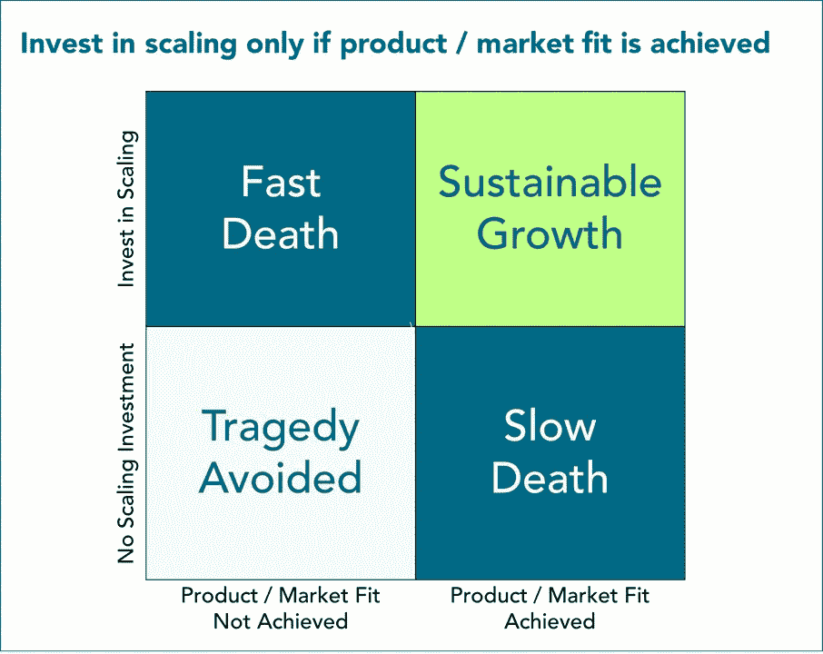

# 产品/市场匹配记分卡:停止怀疑，开始衡量

> 原文：<https://medium.com/swlh/the-product-market-fit-scorecard-stop-wondering-start-measuring-76d93c8428d2>

我最近的一个客户让我帮助他们评估他们的 B2B SaaS 产品是否达到了产品/市场契合度。回答这个问题将大大有助于他们决定其产品的状态是否证明从繁重的实验阶段过渡到将时间和资源投入规模增长是合理的。

当谈到产品/市场的契合度时，我合作过的大多数公司都乐于“直接感受”，也有很多思想领袖认为这没什么，但这个客户打算收集尽可能多的客观证据来告知他们的决定。

面对这一挑战，我开始尝试让他们对产品/市场的适合度进行真正客观的评估。我的发现改变了我对积极监控健康重要性的看法。

**扩展是一种选择，增长不是**

需要澄清的是，我的客户并没有试图决定“是否增长”，而是想知道投资于扩大规模措施的时机是否正确，这些措施将使他们能够顺利增长，并在需求到来时乘风破浪。

当团队对他们的产品进行足够多的试验，在足够大的市场中偶然发现功能、价格、渠道和细分市场的最佳配置时，这种有机指数需求就可以释放出来。

如果它让你措手不及，你的成长烦恼可能会赶走比你获得的更多的客户。这是杰弗里·摩尔的鸿沟如此难以跨越的一个重要原因。

Image Credit: digitalproductpeople.com

B2B 公司似乎可以通过选择开发新客户或不开发来抑制客户增长。但实际上，企业客户的采购窗口每隔几个季度甚至几年才打开一次。当这些机会出现时，希望通过新的企业产品获得牵引力的公司不能轻易放弃。

> *规模化是初创公司成长的结果。然而，通常情况下，扩大规模是为了推动初创公司的发展。这就是我们的问题所在。尼尔·帕特尔*

这就是产品/市场契合度的问题；你不会知道它什么时候会发生，但当它发生时，它将推动指数级的需求，迫使你出手。准确识别何时发生对于适时进行规模投资至关重要。

**时机是生死之差**

值得称赞的是，我的客户监控自己产品/市场契合度之旅的本能是正确的，因为风险如此之高。没有竞争对手提供相同的价值主张，也没有他们可以复制的相似之处。他们处于未知领域，意识到他们的下一个产品实验可能会突然释放市场契合度和需求峰值。这是一个危险的情况。

Image Credit: digitalproductpeople.com

现代企业家教父史蒂夫·布兰克(Steve Blank)经常警告初创公司过早扩大规模的危险，但他肯定不是唯一一个发出警告的行业人士。

> *事实证明，过早扩张是初创公司现金大量流失——甚至死亡——的主要原因。* —史蒂夫·布兰克

加州大学伯克利分校和斯坦福大学的初创公司基因组研究人员在他们关于过早规模化的报告中，基于他们对 3000 多家初创公司的里程碑式的 2011 年研究，得出了几个关于过早规模化影响的不祥结论，包括:

因此，如果你实现了产品/市场匹配，你需要扩大规模，以避免客户流失到快速追随者竞争对手的缓慢死亡，但如果你过早地扩大规模，你臃肿的组织将很快扼杀你的效率。前鸿沟产品团队要做什么？

**如何不死:不要催它**

对达到合适状态所需时间的现实预期可以帮助团队避免过早扩展。初创公司基因组报告的研究人员发现，总的来说，创始人低估了实现适应所需的时间。

> *初创公司验证市场的时间比大多数创始人预期的要长 2 到 3 倍。这种低估造成了过早扩展的压力。—启动基因组*

鉴于较长的销售周期和较低的反馈量，B2B 产品团队应该比他们的消费者同行留出相对更多的时间来适应他们的旅程。

Image Credit: digitalproductpeople.com

如果产品团队需要更多的理由来保持耐心，避免匆忙得出他们已经实现产品/市场契合的结论，Peter Reinhardt 提出了这个发人深省的想法:

> 80%的 SaaS 公司从未让产品适应市场。
> 
> 彼得·莱因哈特

**如何不死:测一下**

对于团队在等待 fit 发生时如何避免过早扩展，肯定不缺乏意见。建议包括从文化招聘，到 Y Combinator 的保罗·格拉姆(Paul Grahm)的建议，即专注于那些旨在分散团队对规模扩张想法的注意力的事情，比如取悦个人早期采用者。

> 来自大公司的人会带来大公司的流程、程序和文化。这导致业务过早扩大。 —斯蒂芬·福特

问题是，我觉得绝大多数建议都太间接了，脱离了早期产品团队真正应该做的准备工作——积极衡量产品/市场适合度的指标。

但是你到底应该监控什么呢？

那得看你问谁了。关于什么是产品/市场契合度的理想指标，存在着激烈的争论。但好消息是，对文献的扫描显示，观点倾向于集中在大约六个独立但互补的主题上:收购、收入与客户、保留与再投资、推荐、分离焦虑和直觉。

Image Credit: digitalproductpeople.com

开发允许您监控这六个集群的产品性能的 KPI，将会描绘出一幅关于产品/市场适合度的非常清晰的画面。

**产品/市场适合记分卡**

这基本上是我们为我的客户确定的方法:我们使用六个意见集群来建立一个可测量的适合指标的记分卡。它看起来有点像这样:

为了说明决策者和用户之间的区别，这对于 B2B 产品来说是至关重要的，我们将保留分为单独的标准。另外，记分卡是根据文献中最初的六个主题构建的。

为每个标准选择实际的 KPI 来衡量是过程的真正艺术。我的客户的 KPI 选项受到这样一个事实的限制，即他们通过大量手动销售过程向一小部分大型企业销售产品。这意味着比消费产品产生的主观数据点更少、更多。

例如，对于销售和收购标准，我们从销售团队的会后笔记中查看了销售线索资格分数的趋势。胜率和漏斗持续时间将是更客观的收购 KPI。如果您已经部署了销售自动化工具，您应该有更多的工具可以利用。

Image Credit: digitalproductpeople.com

将标准分为“客观”和“主观”两类，基于客户的实际行为(购买、使用)和人们的想法和表达(如价值)，记分卡由两部分组成。

对于后者，我们使用调查来衡量客户意见。意识到它的批评，我们仍然选择使用一个 NPS 风格的调查，我们结合了肖恩·埃利斯的 P/MF 调查的一系列问题。我们认为这是“最大努力”,同时承认小样本问题也在混淆调查结果推断方面发挥了很大作用。

**融合测量和直觉**

有了这些“适应”,这个产品/市场适合记分卡不允许团队自动调整他们的投资决策，但这从来不是我们的目标。相反，我们将记分卡视为团队练习的基础，既能促进信息收集，又能促进结构化讨论。

在记分卡中，我们为团队提供了用自己的直觉和专业知识补充数据的机会。“注意事项”一栏引发了对每项标准测量应进一步审查的原因的讨论。在我们的案例中，小样本是我们经常引用的一个警告。

记分卡的另外两个方面引起了团队的进一步讨论。“我们感觉到了吗？”标准完全取决于团队对产品市场适合度的“直觉”。每个标准都有一个弱、不清楚或强的分数，然后汇总成一个最终评估，由一组利益相关者讨论以达成共识。

**建立并使用自己的产品/市场适合记分卡**

我和我的客户一起构建的记分卡版本针对他们的产品和市场环境进行了优化。虽然我认为它非常适合企业 B2B 软件产品，但任何使用它的人都应该准备调整它以适应他们的环境。

根据您的情况定制记分卡，将其付诸实践意味着收集数据并与利益相关者定期讨论。具体来说，团队应该:

**1。策略上设置的级别**

确保团队和利益相关者理解你为什么会对产品的市场适应性感兴趣，也就是说，它与制定投资决策有什么关系。此外，讨论在任何 okr 的背景下，fit 和 scaling 的作用——设定目标和结果，鼓励追求和衡量 fit，但不鼓励过早调整。

**2。就方法达成共识**

通过让你的利益相关者从一开始就参与制定记分卡中的标准、衡量标准和成功门槛，提前应对任何可能会在以后破坏你的方法的批评。

**3。实测素材**

很可能你已经在收集关于获取和保留的数据，但是大多数团队需要引入一个纵向测量方案(调查、访谈等)作为主观标准。查看数据中的差距，并制定一个计划，在 18-24 个月内定期收集缺失的指标。

**4。辐射实时状态**

任何产品团队都不应该对他们的产品在任何时候的表现感到惊讶。设置一个实时仪表板，跟踪您的记分卡 KPI 朝着您自己确定的成功阈值的进展，并将其显示在团队空间的屏幕上。

**5。与利益相关方一起审查状态**

鉴于你的健身之旅可能会持续一年或更长时间，你会希望与利益相关者进行间歇性接触，以使每个人都了解你迈向这一重要里程碑的进展。每当你的实时仪表盘显示合适时(你可能会有一些误报)，就召集一次特别会议，会议议程主要是回答这样一个问题:“我们实现了产品/市场的合适吗？”。

# 参考

马克·安德里森。" Pmarca 创业指南"2007 年 6 月 25 日，pmarchive.com/guide_to_startups_part4.html.

B2B 国际。"净推介值(NPS). " *B2B 国际*，[www . B2B International . com/research/services/customer-loyalty-research/net-promoter-score-NPS/。](http://www.b2binternational.com/research/services/customer-loyalty-research/net-promoter-score-nps/.)

空白，史蒂夫。“问题不在于它有多大，而在于它的表现有多好:初创企业基因组罗盘。”Steve Blank，2013 年 7 月 27 日，Steve Blank . com/2011/08/29/it-not-how-big-it-is-it-how-well-perform-the-startup-genome-compass/。

卡甘马蒂。“产品市场契合度。”*硅谷产品组*，硅谷产品组，2016 年 12 月 12 日，svpg.com/product-market-fit/.

陈，安德鲁。"什么时候消费者创业公司达到了产品/市场契合度？" *Andrewchen，Com* ，2011 年 5 月 29 日，Andrew Chen . Com/when-has-a-consumer-startup-hit-product market-fit/。

埃利斯肖恩和摩根·布朗。黑客式增长:当今发展最快的公司如何取得突破性成功。皇冠商务，2017。

费尔德，布拉德。“产品/市场适合 SaaS 公司的错觉。”*费尔德思维*，2015 年 1 月 21 日[www . Feld . com/archives/2015/01/illusion-product-market-fit-SaaS-companies . html](http://www.feld.com/archives/2015/01/illusion-product-market-fit-saas-companies.html.)

迪布乔治。"如何找到产品与市场匹配的圣杯."*企业家*，企业家，2018 年 6 月 1 日，[www.entrepreneur.com/article/313759.](http://www.entrepreneur.com/article/313759.)

太好了，斯蒂芬。"通过雇佣合适的人来避免创业过早扩大规模." *e27* ，2015 年 10 月 29 日，e27 . co/避免-过早-规模化-创业-雇佣-权利-人-20151028/。

格林森艾伦。"你的 SaaS 创业公司的产品符合市场吗？"*Medium.com*、Medium 2017 年 9 月 6 日 Medium . com/@ alangeleson/has-your-SaaS-startup-achieved-product-market-fit-FB 708 B3 e 0604。

帕特尔，尼尔。"如何避免过早的死亡陷阱."*企业家*，企业家，2015 年 4 月 30 日，[www.entrepreneur.com/article/245603.](http://www.entrepreneur.com/article/245603.)

艾莉森.肖恩泰尔。"这是创业失败的首要原因."*商业内幕*，商业内幕，2011 年 8 月 31 日，[www . Business Insider . com/this-is-the-1-reason-startups-fail-2011-8。](http://www.businessinsider.com/this-is-the-1-reason-startups-fail-2011-8.)

*精益创业|改变新产品制造和投放方式的运动*。(2011).*Theleanstartup.com*。检索于 2018 年 4 月 23 日，来自[http://theleanstartup.com](http://theleanstartup.com)

穆罕默德·图菲亚潘。“什么是产品/市场适合度？”*成长黑客工作室*，成长黑客工作室，2017 年 6 月 30 日，Growth Hacking . Studio/Growth-Hacking/what-is-the-product market-fit/。

沃赫拉河(2018 年)。[在线]Firstround.com。可在:[https://first round . com/review/how-super human-build-a-engine-to-find-product-market-fit/](https://firstround.com/review/how-superhuman-built-an-engine-to-find-product-market-fit/)[2018 年 11 月 25 日访问]。

## 这篇文章发表在[《创业](https://medium.com/swlh)》上，这是 Medium 最大的创业刊物，有+432，678 人关注。

## 订阅接收[我们的头条新闻](https://growthsupply.com/the-startup-newsletter/)。

