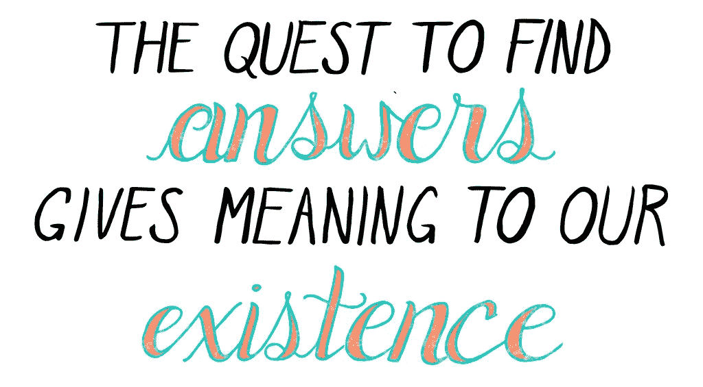

# 不在巅峰状态下表现的深刻代价(以及如何确保你做到)

> 原文：<https://medium.com/swlh/the-profound-price-of-not-performing-at-your-peak-and-how-to-make-sure-you-do-9318b1a14dca>

当你看不到的时候，你不会感觉到你错过了什么。

他们说，你不知道的不会伤害你。

他们称之为害怕错过。

或者*。*

*这就是为什么看到可能发生的是如此强大，你看到你失去了什么。*

*就像 HBO 热播剧《T4》催人泪下的最后一幕，六尺之下的大结局。*

*这个小视频教给你的可能比你一辈子学到的都多，因为它快进到每个角色的生命尽头，提醒我们每个人的结局都是一样的，以及生命是多么不可避免和宝贵。*

*你们中的大多数人没有能力，或者选择不去想象那遥远的未来，去理解现在什么才是重要的。知道的人赢了。*

*我见过的最令人印象深刻的 21 岁年轻人说，他为自己安排了一场模拟葬礼，并邀请了他的朋友和家人，这样他就能确保自己过上最好的生活。*

*如果你看到你每天可以过的生活与你现在实际过的生活相比会怎样？*

*这会让做正确的事情变得更容易，不是吗？*

*科学证明，我们害怕失去我们所拥有的，而不在乎得到更多。*

*我们生来都有[进化成功的目的，](/swlh/8-reasons-most-people-arent-successful-and-8-ways-to-ensure-you-ll-succeed-7e8be17e5187)虽然这对不同的人来说意味着不同的东西，以这样或那样的形式，*

> *我们最终知道我们需要做什么才能做到最好，那么我们为什么不去做呢？*

*无法经历可能发生的事情的问题是，当我们知道我们错过了什么的时候已经太晚了。我们最终变老变聪明，意识到本来可以怎样。*

> *这是痛苦的，为什么有人说地狱的定义是当你有意识地躺在临终的床上，在你最后的日子里，回头看你本可以过的生活，并意识到你确实过的生活。*

*这就是为什么我委托这件艺术品来定期想象我临终时的样子。*

**

*Aram on Deathbed by Emily May Rose*

*避免这种错失的命运。*

*直到 34 岁，我才意识到没有什么比最大限度地发挥我们的潜力更有价值，这是我们生活中唯一的责任。*

*这是我们对自己应尽的自私职责。[投资的义务，](/the-mission/you-dont-deserve-what-you-want-until-you-make-these-7-investments-in-yourself-841c716a0dcf)和[爱我们自己](/the-mission/this-5-minute-daily-habit-will-get-people-to-treat-you-how-you-want-to-be-treated-be5cf1a52828)*

> **我们只有一次生命，没有什么比我们每天的生活经历更重要。**

*醒来时充满灵感和快乐。*

*感觉兴奋和热情，我称之为[贪婪的热情。](/the-mission/7-secrets-to-transform-yourself-right-now-2147a348af70)*

> *做那些感觉不像工作的工作，因为这是关于我们，我们的成长和发展。*

*正是这些人有勇气[走向世界，分享自己的声音](https://www.google.com/url?sa=t&rct=j&q=&esrc=s&source=web&cd=2&cad=rja&uact=8&ved=0ahUKEwj46ObGoIrYAhVSkeAKHXHYCh0QtwIILzAB&url=https%3A%2F%2Fwww.youtube.com%2Fwatch%3Fv%3D50cAmVnN50Q&usg=AOvVaw0_PqCRns2Ij-cV47qACB0e)。*

*坎耶·韦斯特是如此的自信和大胆，以至于他可以说唱、时尚、拍电影，做任何他想做的事情，并告诉世界去他的。*

*麦当娜可以打破她那个时代的文化规范，公开谈论她的强奸和信仰，并推动一代人走出他们的舒适区。*

*正是这些人获得了成为世界上最好的人所需要的掌握，这给了他们信心，不仅无视别人的说法，而且接受制造更多的不适，因为他们知道他们对人们的影响越大，他们就越能获胜。*

*正是这些人在他们的生活中从来没有工作过一天，因为每一天都是如此的膨胀，他们不禁以贪婪的热情工作。*

*如饥似渴地做一件事，就好像你在狼吞虎咽，对它如饥似渴。*

> *这就是为什么史蒂夫·乔布斯说“保持饥饿，保持愚蠢”。他非常热情，这也是他在 2005 年向斯坦福大学毕业生提出建议的原因:*

**

*Art by Emily may Rose*

*当你充满热情时，你在吞噬生命中的每一刻，尽可能有目的、有意义地生活每一刻——你着火了。*

*可悲的是，人口中如此少的一部分人(这是超越成就的部分)只能瞥见它，而最可悲的是绝大多数人永远也不会。*

*如果你认为我疯了，那可能是你疯了。*

*但这都是相对的，这对于亲近的人来说很正常，当然也是理解我意思的人的标准。*

*如果你想成为普通人，就做普通人做的事。如果你想成为生活在绝对高度的那 1%,就去做他们做的事情。*

*这也不是关于金钱或成就，而是关于你自己，为了自己的缘故，通过选择成为最好的自己。*

*我花了[离开一家大公司年薪 30 万美元的工作](http://www.bisnow.com)来换取个人成长，[在我自己的两家公司开始并失败，](/@ARTaghavi/pivots-to-a-meaningful-life-33f4cd38e689)到最后[在第三个](http://www.traena.io)赢得它，意识到当我们有意义地实践我们每天生来独特地要做的任务时，我们是最好的——这对我来说显然已经成为写作。*

*这是我独一无二的天赋，这将使我在我所做的事情上做到最好。*

*正是我的文章背后的情感让它上升到足以让阿什顿·库彻与他的 1800 万粉丝分享的高度。*

**

*[每个人生来都有独特的基因，根据他们在童年、大脑和环境中的发展，生来就有他们最擅长的*类型*技能。](https://qz.com/936525/personal-dna-testing-and-genetic-scientists-are-proving-that-youre-unique-just-like-everyone-else/)*

*每个人都有一个自我，一个驱使我们生存并努力做到最好并留下伟大遗产的自我。*

*我们注定要让它尽可能的壮观。*

*家庭→部落→社区→世界。*

> *关系让工作变得重要。没有关系，无论是艺术还是其他什么都不重要。*
> 
> *如果没人看见你会做什么？*

*因此，每个人都有一些非常有意义的事情，让他们每天都充满情感和贪婪的热情。这是“工作”不再成为工作，而是引人入胜的乐趣。*

> *这是当掌握，深入的工作和天赋融合在一起，创造出超越自我的东西，它提供了这种程度的热情。*

*早上起床就能让你兴奋不已。*

*这就是人们能够“不知疲倦地工作”的秘密。*

> *他们在以越来越快的速度提升自己的状态下工作。他们正在经历自我进化。*

*这就是为什么几个世纪以来圣贤一直说“做你自己”，你必须找到你不能不做的事情，那总是驱使你的事情。*

*对我来说，就是写作和吞噬知识。*

*对甲壳虫乐队来说，是他们演奏的乐器和创作的歌曲。*

*他们玩了 10，000 个小时，但他们肯定没有工作一分钟。*

*这就是为什么人们被驱使去解决让他们如此恼火的问题，以至于他们情不自禁地将自己的生命投入到这个问题中。*

****不是为了他们所服务的人(虽然这些人最终作为副产品被很好地服务)，而是因为是为了他们自己成为最好的自己，感受伟大。****

*这就是为什么我写电影剧本和电视剧本，专门讲述黑人社区的贫困和治安问题，因为我对有意创造这些的人感到愤怒，我对有色人种因此不得不经历的不公正感到愤怒。*

****但底线是这一切都是为了我，当我加上我天生的任务，需要我如饥似渴的写作和知识获取，以及我自信、创造性的掌握问题的声音时，当心世界*** 。*

> *你也可以，也必须。*

# ***以下是它给你带来的代价以及如何让它停止***

## ***1。** **你***

*你的精神状态决定了你每天的经历，而你赋予时刻的意义决定了你的状态。*

*那么你的存在有多重要呢？1–10.*

*你的时间有多宝贵？1–10*

*前几天我从纽约去了 DC，昨晚去参加我最亲密的导师的慈善活动，她在那里被授予了一个惊人的奖项。如果不是她，我不可能去别的地方。*

*即便如此，我还是去了一个小时的鸡尾酒会，之后，他们正在放映尚未上映的全新电影，名为《裁员》，由马特·达蒙主演。*

*它很有趣，我会和老朋友一起看它，度过一段美好的时光，但跳过它回家阅读、写作和训练是显而易见的。*

*这并不是因为我是典型的“工作狂”，不喜欢找乐子。尽管我确信很多人会选择这样理解。*

*因为成长是一件有趣的事情，对我来说也是如此。我选择成长而不是被动娱乐。*

*它最大限度地发挥了我的潜力。满足我无尽的好奇和永不满足的学习。*

*因为我相信:*

**

*Art by Emily May Rose*

*那么你的热情有多高呢？你的工作离你的巅峰有多近？*

****你相信你的人生有多少意义？****

*无论是吃饭还是工作，日常任务的意义有多大？你有多优秀是因为你觉得变得优秀是你的责任？*

> *我们人类生活中最有智慧的话语(想想耶稣和佛陀等人写的灵性书籍)之所以来自那些认为这是他们的责任的人，是因为他们“被上帝召唤”，而不是因为他们被上帝召唤，而是因为他们非常清楚，生命因为这项任务而变得值得活下去，成为他们最好的不仅仅是一句妙语，而是他们欠这个世界的东西，因为这让他们能够最大限度地发挥自己的潜力，成为他们最好的自己。因此，他们有责任跟随召唤，影响世界。*

****这就是为什么有些东西“比你更大”，*** 正是这种信念、信心和证据(来自情感)给了你无尽的动力和信念，让你每天都生活在如饥似渴的热情中。*

*既然你知道了什么是可能的，那么不生活在这种状态下你实际上要付出什么代价呢？*

*不是你的家人或其他任何人(尽管这也会让他们付出代价)，而是你自己？*

*你不是每天都带着贪婪的热情生活:*

*   *你收到的少了*
*   *成就较少*
*   *成就感降低*

*因此应得的更少。*

*你不是每天都带着贪婪的热情生活:*

*   *你做得更少了。*
*   *生活更少*
*   *意味少，吸引少。*

*你没有生活在这种状态中的每一天，你爱的越来越少，做的越来越少。*

*虽然这一切都是无形的，但在现实世界中，它让你付出了什么代价？*

*你没有生活在那种状态的每一天，你都在挣得更少，睡得更少，学得更少。*

*没有生活在那种状态中的每一天，你都会感觉更少，享受更少，欣赏更少。*

*现在，如果你生活在那个州呢？每天你都生活在那种状态中，你变得更多，学得更多，爱得更多。*

*你生活在这种状态下的每一天，你都在更多地工作，更多地指导，更多地服务。*

*你在这种状态下生活的每一天，你都应该得到更多，赚得更多，得到的也更多。*

*你生活在那种状态下的每一天，你都在做更多，看更多，跑更多。*

> *在那种状态下，很明显你需要做什么，以及你如何到达那里。财富被重新定义为吸引它的自然法则。*

*我不相信“成为亿万富翁”或“变得富有”或任何已经占据人们头脑的语言模因，因为除了银行账户中的数字之外，它没有任何意义。*

*任何基础之外的东西都变得更加方便(即好的健康食物来节省时间或者有足够的空间来发展关系和安静的空间)是不必要的。*

*我的愿景很明确，不是因为我有钱或成功或没有，而是因为我认识到什么是真正的财富，能够看到我周围的所有财富，并理解人和市场是如何工作的，这很简单。*

*我非常清楚这如何转化为有形的金钱，因为你所要做的就是为合适的人创造价值。*

*有了脸书这样的东西，你想联系谁就联系谁，这就变得简单明了。我将永远不必离开我的房子，我将能够把我的时间花在进一步扩展我自己和我的工作上，并看着经济补偿作为我为他人创造价值的副产品而随之而来。*

# *你的家人*

*这对你的另一半有什么影响？*

*当你没有贪婪的热情时，你能好好爱吗？*

*你是否尽了最大努力，从而让你的另一半也尽了最大努力？*

*这是你能为他们做的最好的事吗？你是在教他们发挥出最佳水平，以便他们能以最佳状态教你吗？*

**乔·维塔莱博士说:“你接触的每个人都反映了你内心的信仰体系。”**

*你对你们的关系有什么标准，你的另一半为此付出了什么？*

*   *他们得到的更少，得到的爱更少，对你的感觉也更少。*
*   *他们被操的次数越来越少，被操的次数越来越多，也越来越少见到你。*
*   *他们感受到的爱越来越少，回报也越来越少。*

*他们不太情绪化(以积极的方式)，期望也更少。*

*一切总是回到平均值，所以他们的存在状态实际上是因为你不是你最好的结果。*

*这对你的孩子有什么影响？*

*你想让他们认为你是什么样的人吗？*

*你是你想为他们树立的榜样吗？*

*你想让他们也在巅峰状态下表现吗？*

*你不能说一套做一套。*

*如果你的潜意识不相信你的意识告诉他们的，他们也不会相信你。当你告诉他们怎么做时，他们会知道你在撒谎。*

*这就是快乐满足的孩子最终取得成就和努力奋斗的孩子之间的区别？我知道这一点，因为我是一个必须自己去克服和理解这些艰难事实的人。*

# *体格健康*

> *"你的身体是你潜意识的反映。"—坎迪斯·佩特博士*

*众所周知，身体健康是心理健康的结果，你的身体是你潜意识的反映。*

*我全心全意地相信这一点，因为我曾经是一个胖孩子，不得不克服欺凌，在学校被称为“外国人”，女孩们不喜欢他。*

*我们当然不会暴饮暴食，因为我们的身体渴望它，我们吃东西来填补空白，因为我们的情绪受到刺激。*

*当你以贪婪的热情表演时，你甚至不关心“食物”。它只是被视为燃料，你喜欢一遍又一遍地吃同样的基本燃料(这听起来很无聊，但你仍然能享受吃得更多)。*

*你认为餐馆是绝对的奢侈品，并不是必需的，尽管肯定会欣赏它们的便利，可以节省时间等重要的东西。*

*最重要的是，你欣赏所有食物的丰富性，只要你能摄入必要的热量，你就不在乎吃什么，这些热量通常是健康的，所以你可以生活在最佳状态。*

*当我吃鸡蛋和菠菜时，我的感觉和去我最喜欢的米其林星级餐厅时一样，那家餐厅离我的公寓只有一个街区。*

*我真的不在乎。我只是期待着吃东西，不管它是什么，尽管坦白地说，我不在乎它，因为它需要时间(这也是为什么我间歇禁食，既能发挥我的最佳水平，又能节省时间)。*

*当你有贪婪的热情时，你对自己的成长如此热情，以至于没有时间去想食物。它变得次要了。*

*我并不是说目的是让自己挨饿或者不享受食物，但是食物只是变成了一种健康的维持。这句话来自一个饱受食物和意志力管理问题困扰的人，直到几年前，他发现了贪婪的热情和生酮饮食。*

*这就是为什么我们有时会忘记吃饭，因为我们忙于工作，或者因为我们沉浸在一本书或一门手艺中，以至于迷失了自己。*

*带着贪婪的热情，这就是你对食物的看法。*

*现在想象一下，如果你这样看待饮食，你会有多健康？*

*在这种状态下，你会一直更轻，更有活力。*

*在这种状态下，你可能会活得更久，因为你会自然而然地开始戒掉糖和垃圾食品之类的东西。*

*在这种状态下，你会渴望更少，但感到满足。*

*在这种状态下，你不会关心食物(这是变瘦的诀窍)，所以你会想吃就吃，吃饱了就停下来。*

*在这种状态下，你会把情绪从你的饮食中移除。*

*在这种状态下，你会更有效地锻炼，因为你不必一直锻炼，也不必如此努力地燃烧卡路里。*

*现在想想你现在的身体健康状况，以及你为此付出的代价*

*你是否过度沉溺于补偿其他情感缺失？*

*你有精力好好工作，好好爱，好好做爱，好好生活吗？*

*如果你有强烈的热情，你能生产更多的东西来赚更多的钱吗？*

# ***以下是如何通过三个步骤让它停下来***

## *1.有什么是你不能不做的？从这里开始*

*是什么让你不断回来，让你的大脑充满了强烈的激情和情感。*

*不加思考，你直觉上擅长什么。*

*你的童心倾向是什么*

*每个人都有一项任务或活动，他们会渴望去实践。发现或重新发现你的。*暗示在童年你会发现它的一瞥。我的梦想是一遍又一遍地记录我的梦想和目标。*

***2。什么事让你极度情绪化？***

*是什么直觉让你手臂上的汗毛竖起来？情感创造了运动和情感。*

*信仰创造信念。*

*所有这些都是你每天想要能够自然产生的能量。*

*在我上一家公司，我们为大公司的学习和培训部门做培训软件。*

*我热爱我的团队和我们的公司，但我不是构建产品的程序员(我生来就是做活动的)，每天出现对我来说并不奢侈。向大公司出售软件的活动阻止了我最大限度地发挥个人潜力，所以在我们取得一定的成功后，我明确决定完全听从我的写作召唤。*

*因此，很难每天制造兴奋和热情。*

***3。你必须克服什么样的个人挑战或痛苦？***

***重新审视苦难是释放贪婪热情的另一把钥匙。***

*如果我告诉你，今天的脸书连接了世界，因为马克·扎克伯格想通过利用他天生擅长的编码任务来克服吸引女孩的愚蠢痛苦(这是一种很常见的驱使男人成为最好的男人的事情)，你会相信我吗？这是真的。*

*他将自己最擅长的活动与编码融合在一起，并一直保持下去。 ***脸书成为了让他最大限度发挥潜力的工具，对工程的要求越来越高，越来越快地展现了扎克的伟大。****

*他不断地做，不断地做，不断地成长，然后 FB 从他的学院，到其他学院，到全美国的所有学院，现在是全世界。*

> *Zuck 证明了如果达到贪婪的热情，我们的潜力是无限的。连接世界只是 Zucks 个人成长的副产品。*

*正如传奇医学博士大卫·霍金斯爵士所说:*

> *“处理过去最有效的工具之一是创造一个不同的环境。这意味着我们赋予它不同的含义。我们对过去的困难或创伤采取不同的态度，我们承认其中隐藏的天赋。”*

*传奇的卤素灯幸存者和精神病学家维克多·弗兰克尔首先认识到这一点。*

*在他的著名著作《人类对意义的探索》中，他的临床和个人经历表明，如果在情感事件和创伤事件周围赋予新的意义，它们将会有相当大的机会并被治愈。*

*在霍金斯的传奇著作《放手》中，弗兰克尔讲述了他自己在纳粹集中营的经历，他将自己身体和精神上的痛苦视为获得内心胜利的机会。*

*他说:*

> *人的一切都可以被夺走，只有一样东西除外:人类最后的自由——在任何特定的环境下选择自己的态度，选择自己的道路。*

*弗兰克尔将可怕的环境重新置于语境中，以深刻理解人类精神的能力。*

*意识到伴随人类苦难而来的隐藏礼物。*

*意识到伴随个人胜利和克服而来的礼物。*

*当你被驱使去克服个人创伤，尤其是从童年开始，你就被驱使了*

*为你做一切，做最好的自己，因为你值得最好的。*

*每个人都有能力以自己独特的倾向影响世界。*

*大多数人永远不会，因为他们是普通人，看不到他们为此付出的代价。*

*大多数人永远不会，因为他们对平庸视而不见。*

*大多数人永远不会，因为他们看不到可能会发生什么。*

*维不会是那个人。*

**

*Art by Emily May Rose*

*[每周一次点击接收我承诺的改变游戏规则的文章，这是你在互联网上其他地方找不到的。你还会收到我的指导，告诉你如何在你所做的事情上成为世界上最好的。你不会后悔的。](https://betreatedhowyouwanttobetreated.com/optin-main)*

**

## *这篇文章发表在 [The Startup](https://medium.com/swlh) 上，这是 Medium 最大的创业刊物，拥有 274，559+人关注。*

## *订阅接收[我们的头条新闻](http://growthsupply.com/the-startup-newsletter/)。*

**