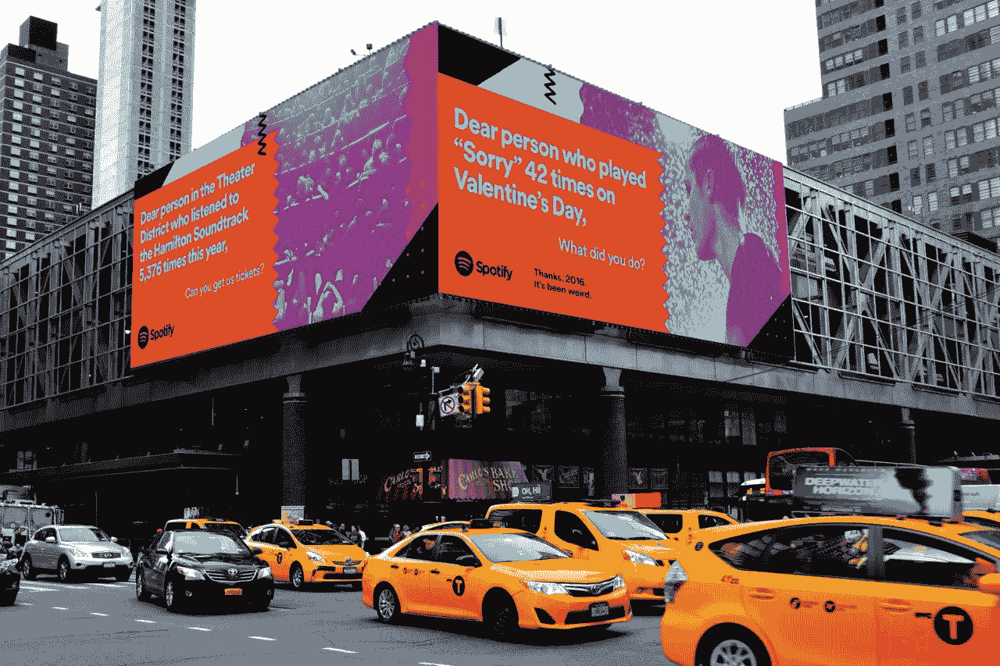

# 品牌故事讲述心理学

> 原文：<https://medium.com/swlh/the-psychology-of-brand-storytelling-d164551742d0>

故事有改变几代人的力量。追溯到文明的开端，讲故事已经被用来教育和推动社会。从识字之前的岩画到亚里士多德和希腊悲剧，我们所知道的世界是由一代一代流传下来的故事塑造的。

## 基于故事的理解和记忆

尤其是在个人层面，故事拥有巨大的力量。我们的整个感觉和意义生成系统是建立在以故事为基础的方式索引、存储和检索信息的基础上的。听过一次之后，你能记住广告或研究中列出的精确事实和数据的频率有多高？我敢打赌这种情况很少见。

人类的心理并不是为了逐字逐句地重复信息而构建的。相反，它使用由图像和序列构建的上下文线索，以故事的方式索引信息。你可以把人类看作故事的建造者，他们不会在孤立的事件中记录他们的记忆。相反，我们创造了一个连贯的故事，从一种情形到另一种情形时隐时现。

最终，故事往往感觉如此自然，因为我们在心理上被设计成比任何其他格式都更容易处理它们。这也难怪这么多年来，品牌一直在用讲故事的方式向世界推销他们的愿景、想法和产品。从很早开始，品牌就很快理解了讲故事在吸引、激励和激活观众方面的重要性。

# 讲故事的心理学

在我们探讨为什么讲故事对品牌至关重要之前，我首先想带你了解一下故事背后的心理过程。这会让你更好地理解它们的必要性和说服力。

无数的研究已经研究了人们听到一个故事时的心理过程。这些研究中有大量提到了一个叫做运输的过程。

最初由[格林和布洛克(2000)](http://psycnet.apa.org/record/2000-00920-003) 构想，运输是意象、注意力和情绪的认知融合，使一个人吸收到一个故事世界中，以至于他或她暂停怀疑。

构成运输的三个要素是:心理意象、认知投入和情感投入。当所有这些因素都存在时，叙事传输就发生了。

**Elements of Narrative Transportation**

## 1.心理意象

精神意象是你在听故事时在脑海中创造的视觉效果。举个例子，想象一下，有人兴致勃勃地告诉你，他们为什么那么爱吃西瓜。他们解释说，每吃一口，松脆的口感、甜味和果汁滴落在脸上和手上的感觉是无与伦比的。

我们大多数人听到这些后，脑海中都会有一幅生动的画面，有些人甚至会想象自己吃着心爱的西瓜。精神意象是由你在头脑中构建的生动形象组成的。

## 2.认知参与

在你的头脑中建立这些精神图像的过程消耗了许多认知资源，或者说脑力。认知资源是有限的，这意味着一个人只有一定数量的资源可以“花”在特定的活动上。

由于你在倾听和建立心理图像时耗尽了这些资源，你就没有那么多时间用于反驳或怀疑别人所说的话。这就是为什么故事如此有说服力。不管是品牌，还是政客，还是朋友，如果他们能讲一个视觉化的故事，你就不太可能对意图产生戒心。

## 3.情感投入

运输的最后一个要素依赖于一个故事的情感诉求。使用各种情感来实现参与的故事完成了运输过程。这些情绪可能与故事人物的移情或同情有关。或者甚至在听者中引发积极或消极的情绪。

> 注意力、意象和感觉融合在一起，导致怀疑的中止。

当一个人通过这三个要素体验运输时，他或她更有可能从与讲故事者(或[品牌](https://www.jstor.org/stable/4189256))一致的态度中获得体验。

# 品牌故事

[讲述有助于运输的共鸣故事](https://www.br-nd.nl/blog/2017/10/emotive-branding-101-what-is-it-and-why-is-it-important)的第一步是在你的组织内建立故事。通过关注员工的幸福，建立一个鼓励个人践行品牌价值观的地方，这些价值观更有可能延伸到营销和客户服务渠道中的外部故事。

# 讲述组织内部的故事

那么，你如何让你的员工参与创造和维护你的内部故事呢？

## 1.促进相互创造

公司结构正在发生变化。创业公司不再是所有级别的员工决定组织文化和方向的唯一公司。通过让整个团队参与创造你的价值观，进而创造你的品牌故事，你就增加了故事与现实相符的可能性。

此外，通过建立一个开放、坦诚的沟通和反馈环境，您的员工将更有可能在工作中感受到联系、忠诚和灵感。

## 2.明白行为决定价值观

通过分析员工的行为，从组织的核心开始。在他们的职业生涯中，是什么[驱动着你的团队](https://issuu.com/br-nd/docs/23plusone)？他们的私生活呢？他们认为是什么推动了你的公司？

你组织中那些人的行为决定了你公司的价值观。找到不同视角之间的共同点，就能构思出一个大家都相信的故事。

## 3.抓住一切机会分享你的故事

利用团队的意见，创造一个吸引观众的故事。只要有机会，就分享你的故事。它在公司里出现得越多，就越会留在你员工的脑海里。

# 分享你的观众可以相信的外部故事

当有了一个令人信服的品牌故事，舞台将被设置为创建符合你的品牌价值的活动。随着内容营销的兴起，传达你的故事比以往任何时候都更容易。

社交媒体为品牌提供了以一致、吸引人和建立关系的方式发布数字内容的机会。然而，这种发展也意味着几乎每个品牌都在网上争夺相同的份额。

随着如此多的品牌信息在网上传播，消费者开始变得不敏感。这给组织带来了压力，不仅要脱颖而出，还要在文化上与观众产生共鸣。

## 擅长内容营销和讲故事的品牌

**Chipotle**

例如，以 Chipotle(沙门氏菌爆发前)为例。他们的稻草人广告震动了市场，无意中点名羞辱了其他经营和生产过程有问题的快餐店。更不用说在最初的 15 秒内就能吸引观众的强大故事线了。

Chipotle 设法分享了一个他们的目标受众能够认同的故事。这一活动在各种社交平台和线下进行了宣传，甚至改编为他们的杯子和商店中的其他用品。结果呢？Chipotle 不仅引发了全国性的讨论，还赢得了一群忠实的消费者，他们分享了自己的故事。

**总是**

女性卫生品牌总是通过颠覆常规找到进入消费者生活的方式。他们的活动 [Like a Girl](https://always.com/en-us/about-us/our-epic-battle-like-a-girl) ，通过广泛的内容营销活动，挑战了“像个女孩”的内涵。

这场运动从一个视频开始。但自那以后，已经扩展到消费者和品牌产生的博客线索、视频推荐、社交媒体活动等等。这场运动取得了巨大的成功。以至于[的一项研究发现](http://www.campaignlive.co.uk/article/case-study-always-%20likeagirl/1366870)对女性来说有 70%的正面解释，对男性来说有 60%的正面解释。

**Spotify**

不是别人，正是 Spotify 制作了另一个更近的活动。也许更能引起共鸣，因为在这种情况下，他们的目的不是震撼社会或发表大胆的声明。他们只是想表明他们不仅仅是一个音乐流媒体平台。这正是他们所做的。

Spotify user-generated campaign

虽然这种讲故事的形式不同于其他两个例子，但效果一样强烈。Spotify 利用他们的数据，围绕荒谬的播放列表名称和消费者的收听历史，开展了一场创意活动。虽然这一活动最初是在一个平台上开始的，但积极的反应促使它在线上和线下渠道中传播和分享。

# 是时候开始创作你的下一本畅销书了

一个引人注目的故事正好符合你品牌战略的其余部分。它旨在作为您内部和外部沟通的基础。此外，当需要新的灵感时，它总是在那里。

最重要的是，故事需要激活它的受众。这篇博文中讨论的所有要素的一个核心方面显示了通过价值驱动的活动吸引受众的价值。无论是你的员工还是客户，个人都希望感觉到自己的重要性。因此，当他们被邀请参与时，他们的满意度和忠诚度都会提高。

那么，你想告诉世界什么故事？

*本文原帖*[*https://www.br-nd.nl/*](https://www.br-nd.nl/)*。*

## 这个故事发表在 [The Startup](https://medium.com/swlh) 上，这里有 263，100+人聚集在一起阅读 Medium 关于创业的主要故事。

## 在这里订阅接收[我们的头条新闻](http://growthsupply.com/the-startup-newsletter/)。

