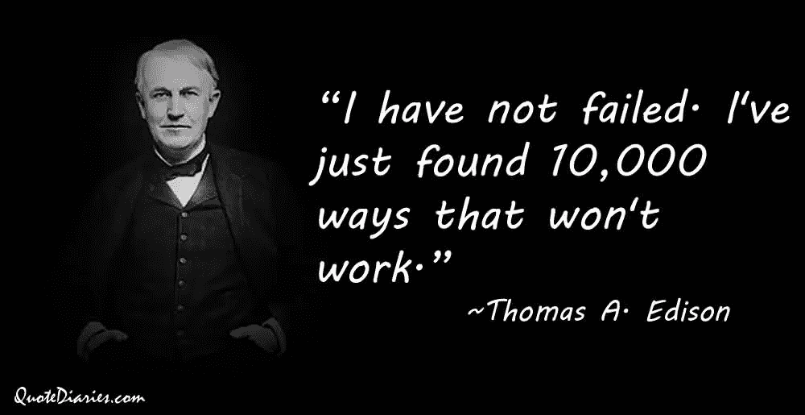

# 失败心理学

> 原文：<https://medium.com/swlh/the-psychology-of-failure-90eb0daf06da>

## 学会在通往成功的路上经历失败。

photo courtesy of pexels.com

## 失败是必要的

没有人喜欢失败。

但是，不管喜欢与否，失败是生活中不可避免的事实(尤其是在写作方面)。

你会听到，*“厚着脸皮在这个行业里混下去，*”这是真的，但只是回避了一个潜在的问题，那就是你不需要开发一个不受失败负面影响影响的防弹衣，而是你需要学会如何吸收这些失败，把它们放在你的心里，把它们藏在你的肚子里。消化那些粪便，直到你从其中吸取有益的营养，然后，就像生活方式一样，拉屎。

> 每一次失败中都有成长的机会。

记住这一点。把它贴在你的墙上。在你的眼睑内侧钉上备忘录。

无论如何，永远不要忘记:

> *最终决定你在任何努力中成功的能力，是你面对失败保持和进步的能力。*

我也不只是在谈论大失败。我们都听说过的那种，

*“我的小说被拒绝了 32145 次。我有解雇通知书可以证明。”*

或者，

“我的小说在商业上失败了。1 星评论丰富。Blaarg！”

当然这些失败很糟糕，但是为了让失败变得更大，你必须准备好让失败变得更大。如果你仔细想想，这总比呆在一个你的失败没有任何意义的地方要好。

Photo courtesy of quotediaries.com

所以这是我们首先要想明白的:

> 要想在一个大失败的位置上，你必须拼命工作，忍受无数微小的失败。

## 出现了，你就赢了一半

所有失败中最致命的一个(也是自古以来困扰人类的一个)是没有出现。

我们都听说过，对吧？完成交易的 90%只是出现。

写小说最难的部分就是把你的屁股放在椅子上。

一旦你越过了最初的障碍(并真正出现)，你就已经成功了一半。

人们喜欢谈论他们多年来一直计划写一本书。然而，在这些人中，有多少人真的写了一本书？

非常非常非常少。

为什么？因为他们从不出现。

在人类努力的所有领域都是如此。

*有一位多年来一直在谈论开设肉馅卷饼摊的朋友吗？*

*打算学第二语言的朋友怎么样？*

在过去的几十年里，有人谈论过环游世界吗？

是的，我们都认识这些人。见鬼，我们*就是*这些人。这才是重点。

我们中的大多数人永远不会完成任何值得注意的事情，因为害怕失败、拖延和其他任何事情会阻止我们出现并投入工作。

但你不是那种人。对吗？

你已经在文章中做到了这一步，所以这告诉我，你比这个世界上其他没有做到的人都要好(这对于一个小小的文章中间的拍拍背来说怎么样？永远不要说我没有为你做任何事。这告诉我你有勇气。

这很好，因为心理学家安吉拉·达克沃斯进行的一项研究表明，T2 的毅力是决定一个人今后人生成功的最重要的特征。

## **惊雷**

我们将在以后的文章中深入探讨 grit，但是现在，让我们至少定义它:

> *"* 积极的非认知特质，基于个人对特定长期目标或最终状态的热情，以及实现各自目标的强大动力。

*简而言之，这是一个为了在未来某个不确定的日期取得成功，今天努力工作的人。*

*听起来有点像作家，是吧？*

*想一想，在一本小说出版并准备大规模销售之前，你必须连续多少天把你的额头撞在键盘上。*

*现在，你可能是一个比我更熟练的文字传达者，但我的猜测是，你仍然需要至少一两天来完成这项工作，在此期间，你将面临一系列新的问题。*

*姑且称这些为微失败吧。*

**

*每一个在孤立中是无关紧要的，但这些东西像兔子一样繁殖，如果你不小心，它们会像一群野孩子一样堆在你身上，把你拖到它们合在一起的、抖动的身体下面。*

*那么，除了发展出一种钢铁般的意志和一张厚脸皮，让任何东西都无法触及我们多愁善感的内脏，我们还能做什么呢？*

## *失败是大自然的秘密武器*

*作为数百万年进化的结果，你真的是坐在星巴克里，啜饮着你的大豆薄荷星冰乐，玩着你的 Macbook Pro。(好吧，也许你不是*字面上的*坐在那里，但我用的是*字面上的*的形式，实际上是隐喻*的*，所以就在那里。*

*无论如何，不要认为你比宇宙偏好的猜测和检查方法更好(这涉及到如此多的失败，我甚至无法开始接受它)。*

> *你，我的朋友，是一千年失败的顶点。*

*要谦虚。*

*要骄傲。*

***被授权。***

**

## *赞美及其在对抗失败中的作用*

*有人对你说过，*

> *“哇，太棒了。你在那个 *****insert 不管你做了什么都做得很好，而且可能在***** 很糟糕？”*

*你有足够的自我实现能力，知道自己什么时候做得不好，对吗？*

*我当然希望如此。因此，当有人给予虚假的赞美时，会产生相反的效果，让我们觉得自己像废物。*

*现在，这是一种非常明显的滥用表扬的方式，但是更危险(也更普遍)的版本是当一个人因为*错误*的事情而受到表扬。*

***科学时间:**卡罗尔·德韦克(一位疯狂的著名心理学家)做了一项研究，他们对两组儿童进行了智商测试。*

*然后，在收到他们的分数后，一组孩子因为他们的聪明而受到表扬:*

> **“你做得很好，你一定很聪明！”**

*而另一组则因为他们的努力而受到表扬:*

> *“你做得很好，你一定非常努力！”*

*然后，在下一轮测试中，孩子们可以在两个智商测试中做出选择。他们被告知，一个是“*非常简单，你肯定会做得很好*”，而另一个是“*难多了*”。*

*大部分被表扬聪明的孩子选择了简单的测试，而绝大多数被表扬努力的孩子选择了更难的测试。*

**

*在第三轮中，孩子们被给予了一个明显高于他们水平的测试。他们肯定会失败，但研究人员更感兴趣的是努力，而不是结果。*

*果然，被表扬努力的孩子比被表扬能力的同龄人(很快变得沮丧并放弃)在测试上花费的时间要长得多。*

*最后，孩子们接受了与第一次相同的智商测试。*

*在这项测试中，最初被表扬聪明的孩子实际上做得更差，而被表扬努力的孩子进步显著。*

*好吧，这和失败、写故事、成功生活有什么关系，或者我们在这里实际上谈论的是什么？*

***一切。***

**

*我们用来自言自语的语言在我们是否不可避免地坚持一项任务足够长的时间以最终获得成功方面起着重要作用。*

*例如:*

*写书很难。这需要努力、技巧和毅力。*

*现在，如果你遇到困难，开始对自己说:*

> *“我只是不太擅长这个。”*

*那么你是在消极地赞扬一个“**固定的**”属性，比如技能。*

*如果相反，你是因为“*坚持下去*”而表扬自己，那么，现在你强化了“我很顽强”的积极心态。*

*通常，当我们看着我们的偶像时，我们会给自己讲一个故事，讲述他们是如何走到今天这一步的，因为他们是如此的有技能，有才华，或者他们有很好的个性。*

*各种'**固定属性**'。*

*但是我们忽略了一个事实，没有人曾经(嗯…也许从来没有。总有例外。卡戴珊，有人吗？)没有投入大量的时间和精力，没有经历无数次的失败，就取得了成功。*

*专注于此。把它放在你的脑海里，因为这实际上是一件令人难以置信的强大的事情。*

**

*J.K .罗琳并不是突然出现在公众视野中的。她在她的工艺上辛苦了*年*，在绝对的默默无闻中受苦，忍受着一个又一个的失败，直到有一天——*

***轰！***

*哈利波特，宝贝。*

*所以你必须引导这个。你必须接受失败。从中吸取教训。从中成长。*

*但是无论你做什么，永远不要逃避。*

## ***记住，每一次失败都是成长的机会。现在出去开始失败吧。***

***感谢阅读！:)***

*你准备好释放你的全部潜力了吗？*

*按照这个免费的电子邮件课程一步一步来，我会教你如何建立更牢固的关系，提高生产力，实现财务自由。*

*[**点击此处参加免费的 5 个势力范围电子邮件课程！**](http://www.thehyperfocusedmind.com/)*

*//*

**

## *这个故事发表在 [The Startup](https://medium.com/swlh) 上，这里有 258，400+人聚集在一起阅读 Medium 关于创业的主要故事。*

## *点击这里订阅接收我们的头条新闻[。](http://growthsupply.com/the-startup-newsletter/)*

**