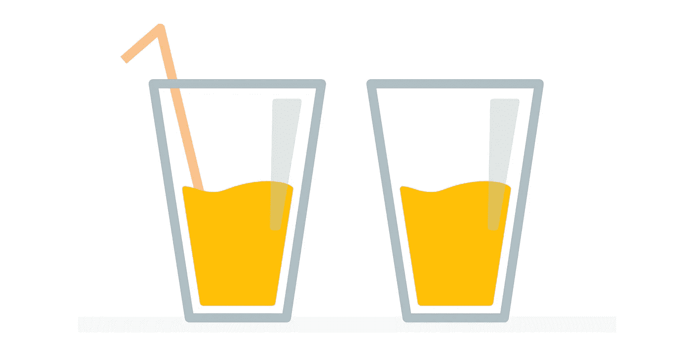
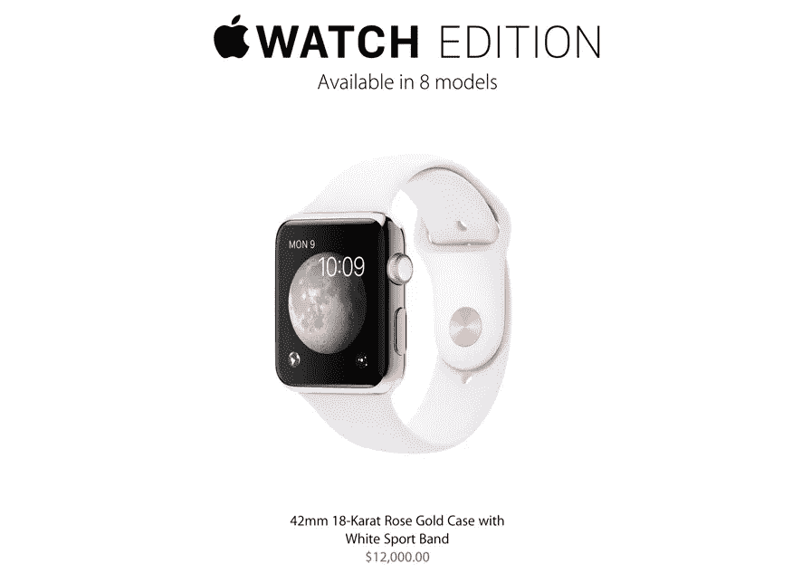
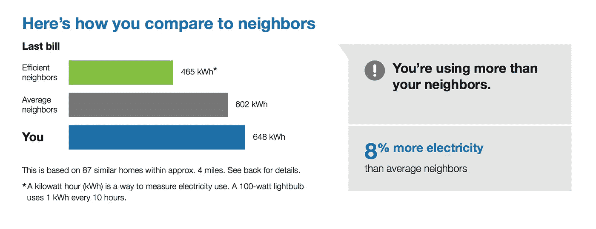
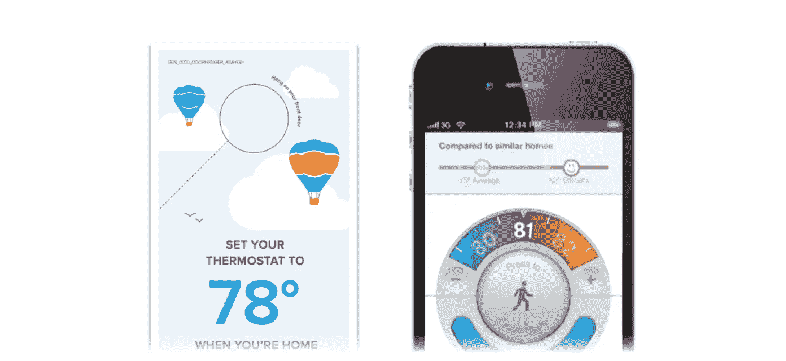
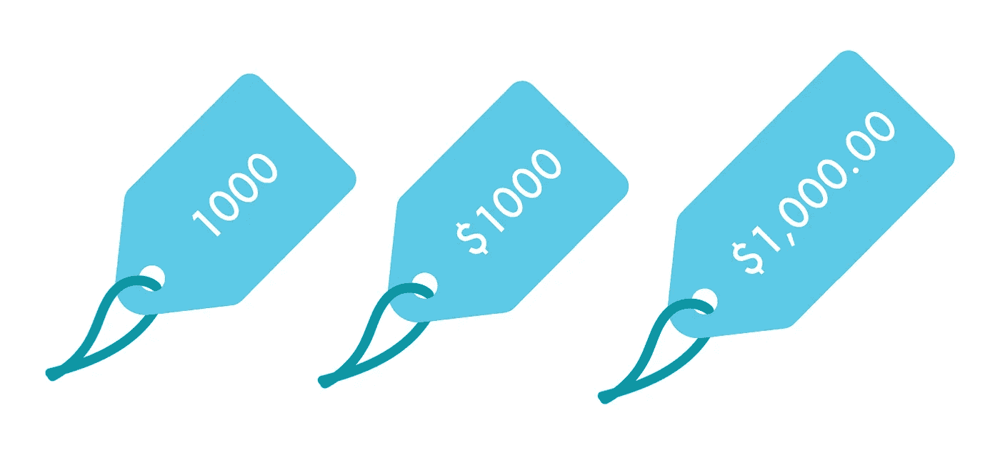
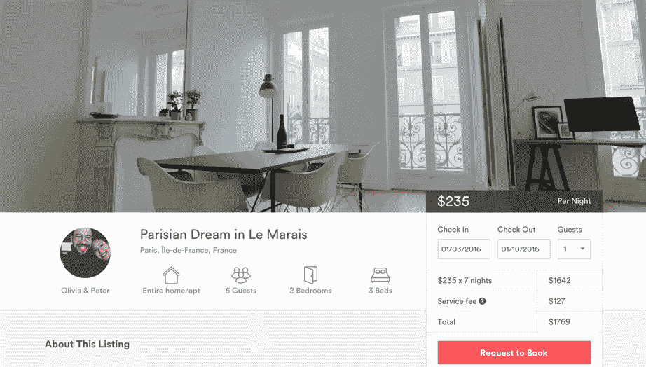
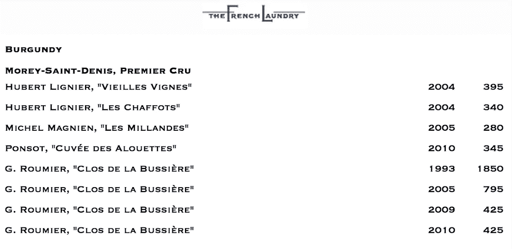
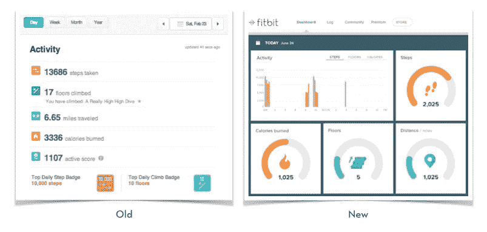

# 设计中的数字心理学

> 原文：<https://medium.com/swlh/the-psychology-of-numbers-in-design-d6a7a011e8b1>

> 谈到数字，我们并不像自己认为的那样理性。

传统的经济理论长期以来假设人类是有逻辑的、不动感情的，并且做出符合我们自身利益的决定。然而，近年来，不断发展的行为经济学领域揭示了这一假设是有缺陷的——人类事实上是复杂的生物，他们经常依靠情感和反射来做出决定，即使这些决定有时违背理性。

在 Opower，[我们的设计团队](http://ux.opower.com)深入思考如何将有用和令人愉快的用户体验与行为科学相结合，以激励地球上的每个人节约能源。我们相信，了解人们如何解读信息、做出决策和采取行动背后的心理学和科学，能够让我们交付更有效的设计，帮助我们实现目标。

作为关于如何在设计中利用行为科学的系列文章的第一篇，我们将看看数字，看似客观的信息单位，实际上如何容易受到主观解释的影响。理解数字心理学有助于设计广泛的产品——从电子商务网站到健身跟踪应用程序，再到商业分析软件——其中数字信息是产品体验不可或缺的一部分。

# 杯子半满还是半空？

考虑一杯果汁，装满到一半。如果让你描述杯子里的东西，你可以用无数种方式回答。你可以说杯子半满，半空，包含 8 盎司，110 卡路里，20 克糖，或你每天维生素 C 的 200%——这些都准确地代表了杯子的内容，但我们的大脑不一定以同样的方式对这些描述做出反应。这种现象被称为 ***框架效应*** ，它解释了同样的信息，以微小的差异呈现，如何能极大地影响我们的感知和决定。

## 这都是相对的

行为经济学的先驱阿莫斯·特沃斯基和丹尼尔·卡内曼在 1981 年进行的一项研究展示了框架效应如何对我们做出的选择产生心理影响。当这项研究的参与者被问及他们是否愿意开 20 分钟的车去用 15 美元的计算器节省 5 美元时，近 70%的人说愿意。但是当被问及他们是否愿意开车 20 分钟去买一件 125 美元的夹克以节省 5 美元时，只有 29%的人表示愿意。为什么？尽管这两种产品节省的 5 美元在理性上是相同的，但享受 33%的折扣比 4%更有吸引力，我们愿意为此付出更多努力。

另一个框架效应的例子来自丹·艾瑞里的书**【可预测的非理性】。*20 世纪 90 年代，Williams-Sonoma 公司首次在他们的商店里推出了一款面包机，定价为 275 美元。在销售惨淡后，商店与顾问合作，顾问建议推出一款更大更好的型号，价格为 429 美元。结果，销售开始腾飞——不是高端型号，而是最初的 275 美元型号。为什么？对于一种产品选择，没有参照系的顾客很难决定面包机是否物有所值。但与昂贵得多的选择相比，最初的机器似乎更便宜，也更有吸引力。这种效果，叫做 ***锚定*** 、是很多零售环境下使用的策略。*

*考虑一下苹果发布的 10，000 美元以上的 Apple Watch 版本。即使该公司不打算销售数百万只 Edition 手表，该产品的存在也加强了锚定效应，使 349 美元的运动手表看起来完全合理。*

**

*Compared to $12,000, $349 for a watch with the exact same functionality seems downright reasonable.*

*这些技巧也适用于定价以外的情况。在 Opower，我们的目标是以最有说服力的方式构建家庭能源数据，以鼓励人们减少能源使用。由于大多数人不理解像*千瓦*和*热*这样的能源单位，而且实际节省的成本往往太小，不足以激励人们，所以我们的许多沟通都以百分比比较为特色，以使我们的信息更容易理解和令人信服。*

**

*作为另一个例子，我们的团队设计了一些体验，旨在通过能源提示、特殊的季节性活动和可编程恒温器应用程序，让人们在夏季和冬季坚持节能恒温器温度。我们已经能够衡量这些努力带来的有意义的节能，促使人们选择比他们原本认为更有效的温度设置。*

**

*Both low tech solutions (e.g. door hangers) and high tech solutions (e.g. thermostat apps) can effectively anchor people toward energy efficient settings.*

# *当微小的细节很重要时*

*我们都熟悉营销人员通过降低几便士的成本来使价格看起来更低的策略(例如，50 美元对 49.99 美元)。这种被称为 ***魅力定价***的技巧之所以流行，有一个很好的理由——它有效。*

*然而，许多品牌开始远离这种技术，担心 99 美分的定价意味着便宜而不是质量。相反，这些品牌采用其他心理策略来增加其产品和服务的价格吸引力。*

**

*研究表明，去掉价格中的小数和逗号可以改变人们的看法，让价格看起来更合理。例如，显示为 **$1000** 的相同产品被认为比显示为**$ 1000**或**$ 1000.00**的价格更便宜。Airbnb 在其网站上使用这一定价原则，这大概增加了其房源的吸引力，并增加了预订量。*

**

*Sites such as Airbnb display prices without commas or decimals*

*[其他研究表明](https://www.hotelschool.cornell.edu/research/chr/pubs/reports/abstract-15048.html)从价格中去除美元符号(美元)可以减少支付的情感“痛苦”,从而增加我们的消费倾向。高端餐厅和奢侈品零售商经常使用这种策略。在这里，我们看到法国洗衣店的酒单是如何显示价格的，没有任何符号或小数，减轻了直接的标签冲击和与我们钱包的内在联系。*

**

# *一张照片值 1000 个数据点*

*随着我们的世界充满数字系统、传感器和智能设备，一个问题一直存在——我们如何从每天每时每刻积累的海量数据中发掘价值？*

*当编辑和计算数字时，电子表格可能是有效的，但作为设计师，我们知道数据表可能不是讲述故事或传达有意义信息的最有效方式。事实上，康奈尔大学最近的一项研究表明，数字，当辅以图表和视觉效果时，会显著增加信息的说服力。*

*考虑一下 Fitbit 的这个例子，将他们几年前的在线仪表板与最近的设计进行比较。*

**

*可视化支持数字数据的表示有几个原因。新的 Fitbit 仪表盘增强了用户原始活动数据的显示，具有引人入胜的视觉效果，可以吸引我们的注意力，让我们专注于所传达的关键信息。此外，图表有助于理解，并使活动趋势更容易识别。最后，进度表利用了 ***蔡加尼克效应*** ，不完整的状态使信息更容易记住，并驱使我们完成目标——无论是创造新的训练记录，保持更好的睡眠时间表，还是全天保持活跃。*

*从框架方法到定价细节，再到数据可视化，这些例子只是说明了设计师可以在自己的产品中使数字信息更有意义、更有说服力、更具可操作性的几种方法。*

*还有其他有趣的心理学和数字在设计中的例子吗？评论或者给我发短信 [@aaronotani](http://twitter.com/aaronotani) —我很乐意听！*

***要了解更多，请查看以下推荐内容:***

*   *行为科学:[流行行为科学书籍清单](http://www.goodreads.com/shelf/show/behavioral-economics)*
*   *数据可视化:[华尔街日报信息图形指南](http://www.amazon.com/Street-Journal-Guide-Information-Graphics/dp/0393347281)，[爱德华·塔夫特著](http://www.amazon.com/s/url=search-alias%3Daps&field-keywords=Edward+Tufte)*
*   *定价:[无价](http://www.amazon.com/Priceless-Myth-Fair-Value-Advantage/dp/0809078813/)，[定价的心理学](http://www.nickkolenda.com/psychological-pricing-strategies/)*

***也看看我最近关于设计的文章:***

* [## 用设计改变观念

### 如何利用框架效果的力量设计产品

medium.com](/@aaronotani/changing-perceptions-with-design-717c030654e)  [## 产品设计的行为方法

### 设计有影响力的产品的四个步骤

medium.com](/p/166d22628970) 

*发表于* **创业、旅游癖和生活黑客**

-*