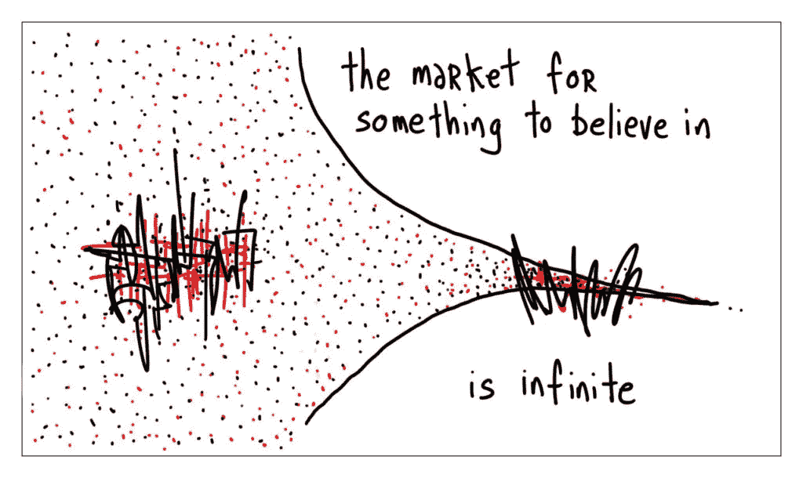
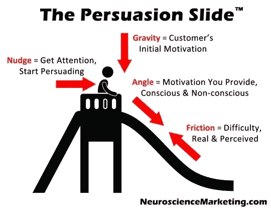
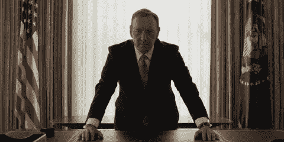

# 说服心理学

> 原文：<https://medium.com/swlh/the-psychology-of-persuasion-4639c7a96deb>

## 骗子是如何行骗的，销售人员是如何销售的，政客是如何蒙骗你的

Image credit: [http://gapingvoid.com/blog/2004/06/27/the-hughtrain/](http://gapingvoid.com/blog/2004/06/27/the-hughtrain/)

"你必须信任和相信人们，否则生活将变得不可能."

俄罗斯剧作家安东·契诃夫(Anton Chekov)可能说得对，我们不能单干，但我们对他人持怀疑态度也是正确的。

骗子、政治家或销售人员所需要的高超技能，也是伟大的创意者所需要的技能:操纵现实的能力(在西班牙语中，这个词的词根是 *mano* ，意思是手。因此，操纵就是“以熟练的方式处理或控制”。)、引导(和误导)注意力、模仿、讲述引人入胜的故事等…

毕加索告诉我们，“艺术是揭示真理的谎言”。

作家乌苏拉·勒奎恩承认，“小说家的工作就是撒谎。”

马龙·白兰度说，“如果你能撒谎，你就能演戏。”

一个好的讲故事者、营销者或作家的工作就是让你上当受骗。让你相信他们说的话，不管有多牵强。就像莫特一样，[我们愿意相信](http://www.globalnerdy.com/wordpress/wp-content/uploads/2013/09/mulder-and-i-want-to-believe-poster.jpg)。

正如作家兼艺术家[休·麦克劳德](http://gapingvoid.com/blog/)总结得如此完美:

> 信仰的市场是无限的。

无论你是在写一篇文章，谈判一笔交易，还是设计一个网站，了解我们是如何被影响的总是会有回报的。那么，我们如何学会驾驭说服的力量呢？通过观察那些劝你做你从未想过会做的事情的人。

以下是一些世界上最伟大的(也许不是最可口的)劝说者——从骗子艺术家到政客——如何利用你的情绪让你做他们想做的事。

# 店员

让我们从说服者群体中最广为接受的群体开始:销售人员。

顾名思义，他们的工作就是把你和你的血汗钱分开。

彼得·德鲁克有一句名言，营销的目的是让销售变得多余:

> “营销的目的是充分了解和理解客户，使产品或服务适合他们并自我销售。”

是的，说服已经对你卖给*的东西感兴趣的人实际购买*，仅仅是强调它将使他们受益的方式。但是这有什么意思呢？

一个好的销售人员可以把鹿肉牛排卖给素食者。

怎么会？这就是乐趣所在。

研究表明，我们做出的多达 95%的决定都是下意识做出的，这给了任何有说服倾向的人很大的空间来引导我们的选择，而我们甚至没有意识到。

正如《影响力:说服心理学》一书的作者罗伯特·恰尔迪尼所说:

> "人们理解影响他们行为的因素的能力差得惊人。"

我们可能不知道我们为什么要做这些事情，但是一个好的销售人员可以读懂你发出的微妙的潜意识信号，并把你玩弄于股掌之中。

以下是优秀销售人员让你答应的一些最佳技巧，即使你不知道为什么。

## 1.乘坐说服滑梯

在他的神经科学营销博客上，罗杰·杜利描述了他所谓的[说服幻灯片](http://www.neurosciencemarketing.com/blog/articles/persuasion-slide.htm)。

Image credit: [http://www.neurosciencemarketing.com/blog/articles/persuasion-slide.htm](http://www.neurosciencemarketing.com/blog/articles/persuasion-slide.htm)

我们都有某种程度的内在动机，任何一个好的说服者都可以利用这一点。在杜利的幻灯片模型中，这是重力。你已经拥有的动机水平决定了你必须有多有说服力:

> “没有足够陡的角度，滑梯就不起作用。如果这种动机不够强烈，客户将开始下滑，然后停止。我把这分为两种类型的动机:有意识的和无意识的。”

大多数营销人员关注的是有意识的激励因素:特征、好处、价格、折扣。但是这些都是适用于你大脑理性部分的东西——正如我们所见，它只占你决策的 5%。这不是我们想要的。

现在，无意识的激励因素可以动摇强硬派。在这里，你将决策从理性的转移到**感性的**，绕过逻辑思维，专注于以下事情:

[互惠:](http://changingminds.org/explanations/theories/reciprocity_norm.htm)让你的客户觉得他们“欠你一个人情”。我们在社会上习惯于回报，这就是为什么免费样品或意想不到的“升级”几乎总是让我们花更多的钱。只要看看拉斯维加斯赌场的免费自助餐就能理解这种技巧。

稀缺性:让你的顾客觉得他们只有一次机会得到产品。如果我们认为我们不会再有机会购买，我们更有可能绕过任何逻辑论证。

使用终极术语:在每一种语言中，都有一些词汇承载着更多的文化重量。在 Changing Mind 博客上，他们将这些词分为三类:*上帝术语*(要求服从的祝福)*魔鬼术语*(唤起厌恶感)*魅力术语*(更加无形，但仍然强大)。

神的话语通常唤起一些情感或基本需求，如安全或归属感。以下是销售人员经常用来要求服从的词语:

*   **安全:** *保证，久经考验*
*   **控制:** *强大，有力*
*   **理解:** *因为、作为、所以、真理、真实*
*   **贪婪:** *金钱、现金、储蓄、赢得、自由、更多*
*   **健康:** *平安，健康井*
*   **归属:** *归属，快乐好，堕落*
*   **推崇:** *排斥、唯一、推崇*
*   **身份:** *你们，(他们的名字)，我们*
*   **新奇:** *新奇，发现*

然而，我们必须记住，虽然这些是“终极”术语，但随着时间的推移，随着文化关联的变化，一个词在天平上的位置也会发生变化。只要看看[触发你的电子邮件的垃圾邮件过滤器](http://www.mequoda.com/articles/audience-development/subject-line-spam-trigger-words/) : **立即行动！**自由**自由**。**实惠。便宜。限时优惠。这些“垃圾”词汇都曾是神语，但它们的过度使用将它们推下了榜首。**

## 2.让他们说不

世界上所有的销售培训可能会促使你让客户或顾客更经常地说“是”，但是研究表明这种重复会冲淡每个“是”的重要性和信心。把你的潜在客户放在一个他们说“不”的位置(潜意识里感觉更有控制力)，意味着当他们真的说“是”的时候，他们会更倾向于坚持他们的回答。你可以有意识地编写你的推销或销售漏斗，让你的客户一开始就对简单的问题说“不”，这样他们就更有可能在最重要的时候达成一致。

## 3.毫不夸张地说，把你自己放在一个权力的位置上

有很多研究表明肢体语言如何影响谈判，但是从弱到强的转变才是真正有助于销售的。最好的销售人员开始谈话时(无论是比喻还是字面意思)都比他们的客户低一点。

Image credit: [http://www.wsj.com/articles/SB10001424127887323608504579022942032641408](http://www.wsj.com/articles/SB10001424127887323608504579022942032641408)

但随着销售的推进，他们会略微上升，直到他们处于主导地位。这种逐渐的转变下意识地让顾客更容易接受销售人员的建议。

# 骗子是如何行骗的

最近《纽约时报》的一篇文章强调了 33 岁的尼尔·赖斯的困境，她是曼哈顿的一名顾问，一点点地[给了两个承诺让他和旧情人重聚的灵媒](http://www.nytimes.com/2015/11/16/nyregion/lured-in-by-two-manhattan-psychics-to-the-tune-of-718000.html)718，000 美元。“我只是被吸进去了，”他说。“这就是人们不理解的地方。”

优秀的销售人员和骗子之间只有一线之隔，然而最大的区别不仅在于*为什么*一个骗子会说服你去做他们想要的事情，还在于*如何*。

长期的骗局——巨大的影响——取决于遵循一条黄金法则:了解你的目标。

在她的书《信心游戏》中，心理学家 Maria Konnikova 采访了骗子和他们的受害者，以了解他们是如何工作的，以及他们的技巧为什么有效。她发现，就像硬销售一样，[这一切都归结于让它变得情绪化。](https://www.brainpickings.org/2016/01/12/the-confidence-game-maria-konnikova/)

第一步:知道你在和谁说话。知道他们哪里自信，但更重要的是，哪里不自信。

**第二步:**寻找裂缝。处于情感脆弱的境地会让你更容易被说服(就像咨询师想念他的前任一样)。当你的生活不再有意义时，你会更愿意倾听那些给你你喜欢的答案的人。

**第三步:**创造一种信任的崇拜。尼尔故事中的灵媒用神秘主义说服他继续付钱给他们。他们的服务是出于信仰，而不是理性。如果可以的话，不要对抗广泛持有的信仰体系。相反，用你的知识创造你自己的信仰体系。费迪南德·瓦尔多·德马拉，也被称为“伟大的冒名顶替者”，伪装成一名外科医生(进行真正的手术)、一名律师、监狱看守、癌症研究人员和本笃会修士，称之为“扩大权力真空”:

> “这样就没有竞争，也没有过去的标准来衡量你。谁能看出你不是在经营一家顶级公司？然后没有过去的法律或规则或先例来压制你或限制你。做出自己的规则和解读。”

在你能成为权威的地方，说服和影响更容易。没有明确规定的地方。作为“专家”,你更容易被信任。

但是，正如克莱尔蒙特研究生大学的神经经济学家保罗·j·扎克解释的那样，行骗的关键不仅仅在于你信任行骗者，还在于他们对你表现出信任(还记得销售人员对互惠的使用吗？):

> “社会互动，尤其是我们感觉处于优越地位的互动，比如帮助他人，会参与一个强大的大脑回路，释放神经化学物质催产素，从而引发回报我们所获得的信任的欲望——即使是对陌生人。
> 
> “催产素的效果受到我们巨大的前额叶皮层的调节，前额叶皮层是大脑‘执行’区域的所在地。催产素全是情绪，而前额叶皮层是审议性的。”

因此，即使我们相信我们的行为是理性的，从另一个人身上表现出的信任和脆弱也会迫使我们进行情感思考，这是所有说服的关键。

# 政治家

在我们的说服金字塔的顶端是政治家。

虽然一个骗子可能会说服一两个人赞同他们的故事，但政客们面对的是数以百万计的对手，每个人都有自己独特的世界观和情感。那么，你如何说服这么大一群人跟随你的想法呢？

归根结底，投票给一个政治家就是投票给一种生活方式。你的选择是基于你对什么问题真正重要以及你认为道德上正确的信念。

在他们的研究中，研究者 Robb Willer 和 Matthew Feinberg 发现，不仅我们的政治选择被道德判断所控制，而且[我们体验到这些道德信念是真实的和普遍适用的](http://media.wix.com/ugd/2f07d4_546b1b3a850a4271a3b3d2283609e6d9.pdf)。

一旦我们相信了某些价值观，就很难说服我们改变想法。

完全不同的信念可以被认为是“正确的信念”,而不需要任何逻辑推理。

当我们试图理解自己价值观之外的价值观时，我们会遇到道德移情缺口——无法从自己的立场之外看待问题。

大多数政治家和潜在影响者的失败之处在于不理解这些道德信念是多么根深蒂固。对于一个在情感层面上强烈反对同性婚姻或增加军费开支的人来说，没有办法简单地理性辩论这两者的优点。

所以，我们在这里碰壁了。这是一个无法说服的问题。对吗？不完全是。

有一种叫做**道德重构**的技术，通过这种技术，你可以重构你的论点，以符合你的听众的价值观。

专注于他们看重的东西。不是你做什么。

在《人格与社会心理学杂志》上发表的一篇名为*描绘道德领域*的文章中，杰西·格雷厄姆教授调查了全球数千人，发现我们的道德基础可以分为五类:

1.  伤害/关怀
2.  公平/互惠
3.  内部团队/忠诚度
4.  权威/尊重
5.  纯洁/神圣

将美国政治视为强硬道德信念的一个非常明显的例子，格雷厄姆和其他研究人员发现，自由主义者最关心的是关怀和公平问题，而保守派最关心的是忠诚、尊重和纯洁。

那么一个好的影响者如何利用这些知识来说服反对者呢？

正如唐·德雷珀所说:

> "如果你不喜欢别人说的话，那就换个话题。"

在 Willer 和 Feinberg 的研究中，他们向自由派和保守派提出了支持同性婚姻的两个信息中的一个。

第一种观点强调同性伴侣平等权利的必要性(针对那些更重视公平道德价值观的人)，而第二种观点认为“同性伴侣是自豪和爱国的美国人”，他们“为美国经济和社会做出了贡献。”

自由主义者无论被出示何种声明，都表现出对同性婚姻的同样支持(因为他们已经相信同性婚姻，不需要说服)。但是，如果保守派阅读爱国主义信息而不是公平信息，他们会更支持同性婚姻。

在另一项研究中，Feinberg 和 Willer 发现，当宣传声明是根据纯度而不是根据危害或控制的更自由的价值来制定时，保守派表现出对环保立法的更大支持。

在这两种情况下，没有什么不同，但是**陈述的方式改变了一切**。

正如威勒斯教授在《T4 纽约时报》的一篇文章中总结的那样:

> “你必须进入你想说服的人的头脑，想想他们关心什么，并提出支持他们原则的论点。如果你能做到这一点，这将表明你不把与你意见相左的人视为敌人，而是把他们视为价值观值得你考虑的人。”

# 说服的原则

那么我们能从这些无良角色的技巧中学到什么呢？

# 1.知道你的对手是谁

Konnikova 称之为“准备”，即骗局的第一阶段，或者说说服性辩论，都是关于研究和确定你想影响谁。市场研究、客户拓展、数据跟踪——这些都是了解你的对手是谁的方法。

# 2.理解他们的痛苦并向他们展示好处

对于骗子来说，这是你讲述的计划或故事。在这里，你允许受试者得出你想要他们得出的结论，而不需要过多的指导。对于我们其他人来说，这意味着利用您所做的研究为您的客户的难题提供一个清晰的答案。

# 3.给滑道上油

一旦说服工作全面展开，除了后退一步，根据需要添火之外，别无他法。油脂最好少用，所以一点点稀缺和一点点社会证明可能是你保持事情进展的全部需要。

# 4.当事情变得艰难时，坚强的人会变得情绪化

当你遇到反对或反击时？变得情绪化。正如我们从几乎每一个主要的骗局或大规模说服中看到的，我们都只是情绪化的动物，非常乐意在以后用“逻辑”来证明我们的决定。

# 5.改变对话

翻翻剧本。如果你说的没有用，用你的同理心去理解你的目标是怎么想的，用他们的价值观来重新构建论点。

对于任何骗子、诈骗犯、销售人员或政客，最重要的一点是，他们之所以成功，是因为我们让他们成功。

一个骗局真正起作用的唯一时间是当它掠夺你希望发生的生活的某个方面。动力已经在那里，在你内心的某个地方。不管火花有多小，只要足够努力，有人就能把它点燃成熊熊烈火。

我们想要相信，一个好的影响者会把我们推向正确的方向。

但不要只是跑出去，开始使用这些黑暗的艺术操纵邪恶。正如罗伯特·恰尔迪尼所警告的:

> “当这些工具被不道德地用作影响力的武器时……任何短期收益几乎都会带来长期损失。”

# 需要帮助来构建你的下一个项目吗？我们的工作不言自明(无需说服)。

## 查看 Crew，开始与网络上最好的设计师和开发人员一起工作。超过 1000 万人使用过[剧组](http://crew.co/?utm_source=Medium&utm_medium=CTA&utm_campaign=MediumCTAs)生产的产品。超过 300 万人阅读了[我们的博客](http://blog.crew.co/?utm_source=Medium&utm_medium=CTA&utm_campaign=MediumCTAs)。在这里加入他们。