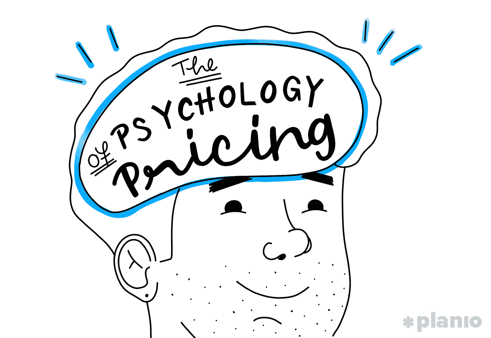
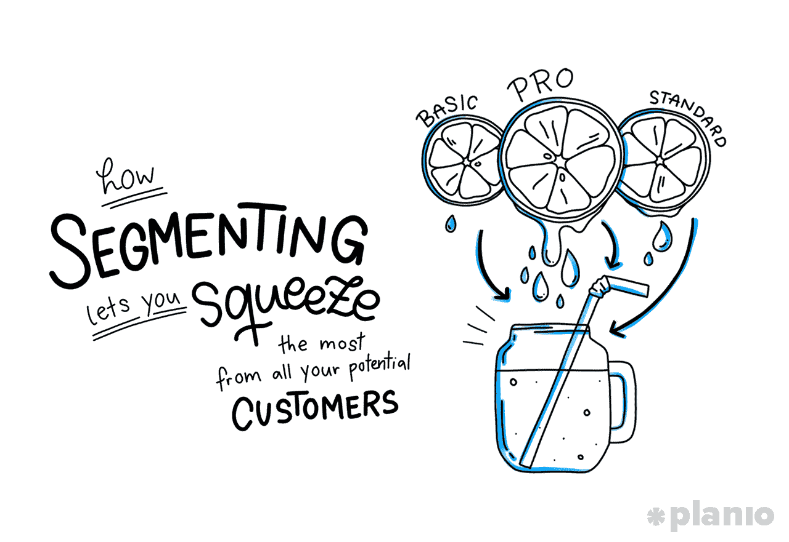
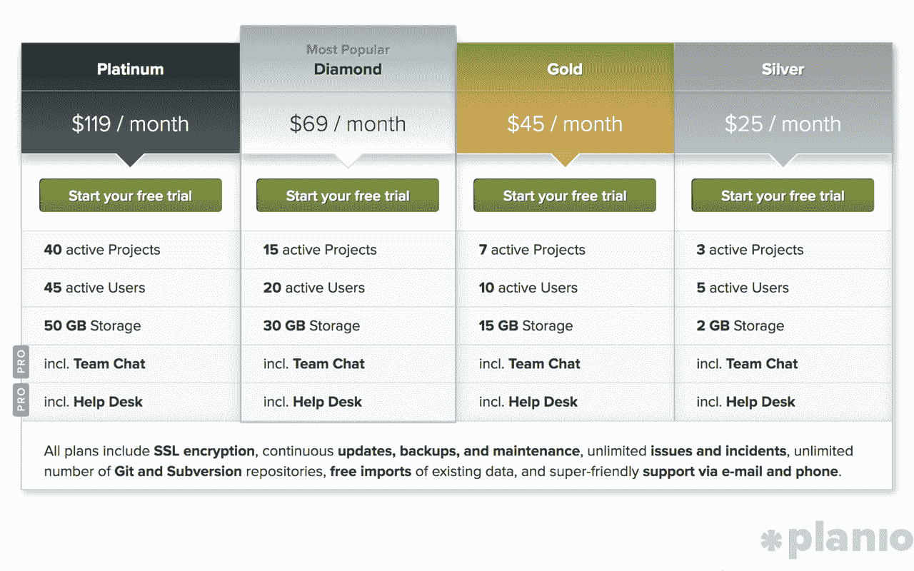
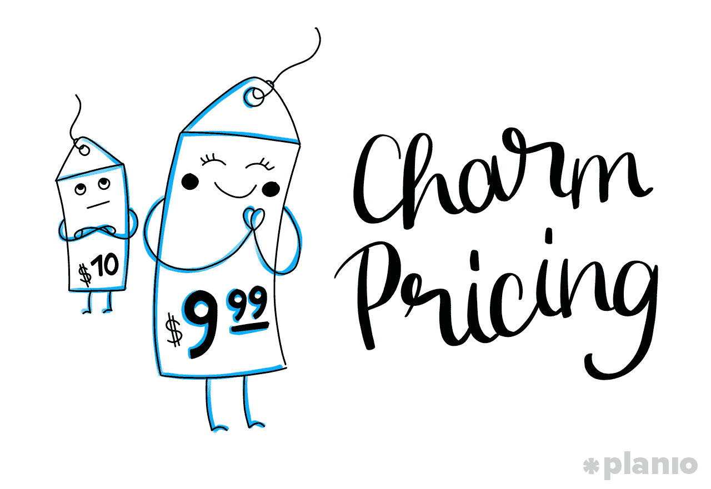

# 定价心理学

> 原文：<https://medium.com/swlh/the-psychology-of-pricing-1f06972d0cd2>

## 如何为您的公司选择正确的定价模式

你的产品很棒。你战胜了困难，倾听了用户的意见，策划了一个杀手级的产品发布会，让成千上万的潜在客户叫嚣着要得到你的最新产品。

突然，销售部的杰夫站起来问道:

***“那么，我们这个东西收费多少？”***

当每个人都面面相觑时，房间变得寂静无声。

**该死。**

定价是那些感觉应该是自然的因素之一，但很少是这样的。

你对你的产品应该花多少钱有一种感觉，但是你不能只是对着墙壁扔数字，然后看看什么能坚持下来。更糟糕的是，你知道错误的定价是你可能犯的最大错误之一。

**把产品定价过低**你可能会赢得大量客户，但你赚的钱不足以支付工资、支持你许许多多的新客户，或者支付你豪华办公室的费用。

**将产品定价过高**你很可能得不到足够多的客户，而且你仍然无法支付薪水、支持你的客户或支付你昂贵的办公室费用。

> 不管怎样，如果你做得不好，你的公司就要完蛋了。

更糟糕的是，对于收取多少费用，很少有一个“正确”的答案。你不仅要应对人们愿意支付的价格，针对竞争对手为自己定价，建立人们重视的品牌，而且在人们愿意支付的价格背后还有各种各样奇怪的心理( ***)说真的，你有没有想过为什么你会花 9.99 美元而不是 10 美元买某样东西？*** )

简而言之，给你的产品定价——不管是什么——是你要做的最重要的决定之一。这也是最令人沮丧的，似乎不合逻辑的，也是最容易搞砸的。

但是，当你从商业角度以及心理和客户角度理解定价时，你就有更好的机会搞定它，并让你的团队和投资者(以及房东)满意。

所以，让我们开始吧。

*这篇文章的一个版本最初发表在* [*Planio 博客*](https://plan.io/blog/pricing-strategies/) *上。查看更多关于项目管理、建立远程团队和创业繁荣的文章和实用技巧！*

# 所有的定价(一开始)都是猜测。但必须是受过教育的人。

等一下。我记得你说过我们不允许随便乱定价，看看什么有效！

你不是。除非你有水晶球，否则你最初如何给你的产品定价会有一定程度的猜测。这里的关键是做足够的研究，尽可能减少猜测的程度。

我们在这里讨论的是智能定价。考虑到你的公司、你的客户、你的品牌、市场和总体经济趋势的所有因素的定价告诉潜在客户，“嘿！这是一款很棒的产品，完全值得我们要价。”

你还需要了解你的一般定价策略是什么。可能是:

1.  撇帐:向第一个顾客收取比后来的顾客更多的费用
2.  **渗透:**低价获取市场份额
3.  **最大化:**为每笔销售收取尽可能多的费用

*(如果你免费赠送你的产品，或者使用免费增值模式，你可以阅读哈佛市场营销教授 Vineet Kumar 的这篇精彩的文章***。)**

*就本文而言，我们将假设你正试图最大化你的价格。首先回答几个关键问题:*

# *1.谁是你的客户？*

*让我们先解决这个大问题。你卖给谁？*

*你越了解你的顾客是谁，他们的需求和想要什么，他们购买需要多长时间，他们最喜欢什么颜色，向他们销售就越容易。*

*正如 Close.io 创始人 Steli Efti 喜欢说的那样:*

> *谁最了解客户，谁就赢了。*

*具体来说，在定价方面，这意味着:*

1.  ***了解他们想要的结果:**你的客户需要什么才能感到成功，他们实现成功的正确方法是什么？换句话说，你的产品或解决方案给他们带来了多少价值？*
2.  ***把他们的支付意愿放在你产品设计的核心:**你的客户需要什么样的功能，并且愿意为此付费？正如定价专家马德哈万·拉曼努贾姆[向](http://firstround.com/review/its-price-before-product-period/)解释的那样:*

> *大多数公司会推迟定价决定，直到产品开发出来之后。他们踏上了一段漫长而昂贵的旅程，希望自己能赚钱，而不是知道自己会赚钱。*
> 
> *通过在产品开发过程的早期与客户沟通，你可以确保你的产品不仅存活，而且茁壮成长。*
> 
> *“如果你不这样做，你将无法对你开发的产品特性进行优先排序，或者在产品上市之前，你不知道你是否在开发顾客会愿意付钱的东西。”*

# *2.你的单位成本是多少？*

*制造每个单元/管理每个许可证/照顾每个客户需要多少成本？*

*要知道收费多少，并使利润最大化，你需要知道每个增量单位的成本(因此，你从中获利多少)。*

*在这一点上，很容易认为你想收回所有的 R&D 成本，但正如 Stack Overflow 的首席执行官 Joel Spolsky 解释的那样:*

> *也许一开始你花了 25 万美元开发这个软件，但那是沉没成本。我们不再关心这个了，因为不管你卖 1000 件还是 0 件，250，000 美元是一样的。沉没了。吻别吧。无论你定什么价格，25 万美元都没了，因此不再相关。”*

# *3.你的收入目标是什么？*

*你需要赚多少钱来维持生活(或者更多)？*

*企业只有赚到足够的钱来支付账单和利润才能生存。那你需要什么？把你每月的成本加起来——原材料、劳动力和工资、你闪亮办公室的租金、偿还债务——记为 x。然后，明白你想要的利润率是多少。除了保本，你还想赚多少钱？那是 y。*

*这是另一个滑坡，因为许多企业要么不计入所有成本(并低于价格)，要么计入所有成本，并期望通过一种产品获利(因此要价过高)。*

*你的收入目标是什么将取决于一堆只有你自己知道的因素。但是现实一点。*

# *4.你对客户的价值是什么(效用和品牌)？*

*你每年会花 1000 多美元买最新款的 iPhone，或者花数千美元买名牌服装，这是有原因的。正如《 [*无价:公允价值的神话》*](http://www.amazon.com/gp/product/B0096EGFZK/) 的作者威廉·庞德斯通教授解释的那样，我们大多数人对“价值”的概念一无所知因此，我们可能会被一些我们认为不可能的方式所左右。*

*在销售产品之前，你做了哪些工作来影响你的顾客？你有强大的品牌吗？你被定位为奢侈品(相对于预算)吗？你是否有明确的目标人群，并展示了你能为他们创造的所有价值？你有过去客户的有力证明和案例研究吗？*

*正如红点 VC Tomasz Tunguz [所说](http://tomtunguz.com/pricing-summary/):*

> *"价格强化了品牌，因为价格显示了一个产品是优质产品还是超值产品."*

*人们是非理性的，认为付出多少就得到多少。普通消费者会相信最贵的选择是最好的。因为只要没什么触动他们的诈骗警报，他们为什么不呢？*

# *5.竞争对手是谁？*

*看看市场。谁已经在卖你卖的东西了？他们的产品要价多少。*

*虽然了解竞争对手在做什么很重要，但你不应该仅仅依靠他们来设定市场价值。此外，你需要记住，无论如何，你的顾客在购买前会考虑所有的选择。这会产生意想不到的灾难性后果。*

*假设你的竞争对手要价在 100 到 500 美元之间。你决定你“大约在中间”,收费 300 美元。虽然你可能认为这显示了你的产品有多好的价值，但你实际上告诉客户的是你认为你是“哼”*

*你的价格不是凭空而来的。你需要非常清楚你的客户是如何看待它的。*

*就像你需要了解你的竞争对手一样，你也需要了解市场的总体走向。早在 2007 年，销售高价云存储空间是有道理的。但是十年后，Dropbox 改变它的关注点是有原因的。*

*当你计算出产品的价格时，你需要预测市场的走势。你提供的服务会继续有价值吗，还是你在干旱时卖泥土？*

*你猜猜看。嗯，有根据的猜测。*

*你可以做尽可能多的研究，但是你真正“知道”你是否在正确的轨道上的唯一方法是倾听付费用户。人们掏出钱包的时候是最诚实的。*

***但是你需要给他们一个开始的地方。***

*把所有这些数字、事实和研究结合起来，想出一个有意义的数字。也许你会使用 10 倍价值法则，计算出你的客户将从你的产品中获得的价值，并以 10%的价格定价。*

*或者，把你自己最好的猜测放在一起，用市场因素和竞争作为一个直觉检查。但是，不要在没有深刻理解*为什么*他们会这样定价的情况下就照搬竞争对手的做法。(提示:他们可能只是凭空捏造了这个数字。)*

# *基本版、标准版、专业版(天哪！):细分如何让你从所有潜在客户身上获得最大收益*

*这个猜测给了你一个很好的起点。现在你如何确定这个价格能使你的利润最大化？*

**

*先说一个基本的经济学术语:需求。*

*对于每一种产品，都有一定程度的需求。看看这个领域的竞争对手，或者你所在行业的市值是多少。你预计有多少人会以你提出的价格购买你的产品？*

*假设你的产品定价为 100 美元，有 50 个人要买。这意味着你会赚 5000 美元。不错！但是如果你把价格提高到 150 美元，但是只有 40 个人买呢？你会赚 6000 美元。少卖多赚整整 1000 美元。*

*如果你把价格降到 80 美元，但这次有 100 个人买呢？那是 8000 美元。*

*如果你把所有这些数字绘制出来，你会得到一条所谓的需求曲线。这张图表显示了大概有多少人会以什么价格购买你的产品。它是向下倾斜的(因为越来越多的人会以更低的价格购买，越来越少的人会以更高的价格购买)。*

*一旦你计划好了，你就可以根据提议的价格和潜在客户的数量来选择收入最高的数字。嘣。搞定了。*

****但等。那些愿意花更多钱并正在达成交易的人呢？****

****还是那些如果你便宜 20 美元就会买的人？桌子上剩下的不就是钱吗？****

*对于这些人，我们还需要抛出另一个经济学术语:消费者剩余。由于您的解决方案定价*不完全符合*客户愿意支付的价格而损失的利润。*

*如果我们想最大化我们的利润，我们需要想办法吸收尽可能多的盈余。我们希望能够向愿意支付更多费用的人收取更多费用，而向不愿意支付的人收取更少费用。幸运的是，你可以通过分段的方式做到这一点。*

*看看大多数 SaaS(软件即服务)产品。他们知道不同的顾客会以不同的方式使用他们的产品。因此，他们选择了反映用户价值的价格，而不是一个价格就可以无限使用。*

*让我们以 [Planio 的定价](https://plan.io/pricing/)为例:*

**

*作为项目管理工具，他们知道对他们的客户来说最重要的特性是管理项目。*

*但是，与其收取 69 美元/月的费用，让只管理 3 个项目的人因为支付太多而感到恼火(并给更忙的团队一个疯狂的交易)，**每个价格点反映了不同的客户群**。*

*细分在各行各业中有很多不同的用途。在当地报纸上提供优惠券的产品有效地将他们的产品细分为不同的买家(收入较低、剪优惠券有意义的人与那些更忙但愿意为同一产品支付更多的人)。*

*或者只是想一想你曾试图预订航班的任何时候。不仅有不同等级的座位，而且航空公司根据你的旅行时间，你要去多长时间，你要离开几天来划分。*

*每一种细分形式都试图从你的客户那里获取尽可能多的利润。*

# *卖家请注意:细分并不容易。也很容易侵蚀你的品牌，毁掉你的产品*

*哇，这一切听起来好得难以置信！我们的价格对我们的用户来说是最有意义的，并把其他人区分开来。无事可做，只能坐在泳池边，看着钱滚滚而来。*

*不完全是。仅仅提高和降低产品价格并就此收工是不够的。细分需要为您的客户服务，就像它为您服务一样。*

*让我们暂时回到机票预订的例子。早在 21 世纪初中期，航空公司在细分客户方面表现得如此“出色”，以至于惹恼了他们。每个人都知道自己受到了排挤，所以当低成本航空公司出现时，这个行业被颠覆的时机已经成熟。*

*当你想出定价公式时，你不会想犯同样的错误。相反，你需要把你的价格和你的用户想要的结果对应起来。*

*这样，每一层定价都提供了您需要的价值。那个每月多付 100 美元的人不会因为他们基本上只是为同样的东西多付了钱而生气。*

*这里有一个快速的自我检查来确保你没有落入那个陷阱:*

1.  *您的定价是否基于正确的指标？你的客户认为你的产品最有价值的是什么？是项目、席位、特色、存储？当客户越来越多地使用你的产品时，他们会说“耶！我想要更多的 ***那！****
2.  ***你的细分市场限制还是授权给客户？**每个细分市场是否都限制了用户的使用，或者让他们做得更多？如果你了解他们想要的结果和支付意愿，你可以锁定他们，让他们觉得更多的功能/用途/空间是一种胜利。他们得到的价值越多，他们就越愿意付钱。*
3.  ***您是否在持续测试？起初，很难知道你是否在正确的轨道上。记住，顾客用他们的钱包投票。如果可以的话，引入一小部分第一批用户来了解他们是如何使用产品的，他们的价格门槛是多少。在遇到太多的推延/取消/退货之前，你可以将价格提高多少？***

*是的，我们这里谈的是定价。但是合理的定价不会让人觉得是从客户那里拿走的。这让他们觉得他们得到了更有价值的回报。*

# *围绕如何让你的定价更有吸引力的怪异科学(或者，让我们付出超出我们应该付出的愚蠢事情)*

*到目前为止，我们在定价方面一直很实际，但重要的是要记住，很多定价是不实际的。还记得庞德斯通教授说的吗？我们谁也不知道***应该有多值钱。****

**几乎所有你要出售的产品都没有内在价值。我们在这里谈论的不是商品。因此，价值(以及价格)受制于各种奇怪的心理因素，让它们看起来更有价值。**

**我们不是在讨论欺骗顾客，而是人类解释价值和价格的一些奇怪方式，以及你如何利用这些方式为自己谋利。**

# **挑选奇数**

****

**这是书中最古老的定价技巧之一。但它仍然存在是有原因的。人们称之为“魅力定价”，这是当价格最左边的数字变化时产生的积极感觉。我们的大脑用我们看到的第一个数字来编码价格，所以从 9.99 美元到 9.19 美元的变化并不重要。但是从 9.01 美元涨到 8.99 美元，突然之间，人们感觉价值发生了变化。**

# **大声说出来(少用音节)**

**在发表在[消费者心理学杂志](http://www.sciencedirect.com/science/article/pii/S1057740811001082)上的一篇论文中，研究人员发现包含更多音节的价格对消费者来说似乎要高得多。这要归功于我们阅读数字的方式和它的“流畅性”。一个数字越难说，我们对它的感觉就越糟糕。所以 1999.99 美元(一千九百九十九美分)感觉比 1999 美元(一九九九)贵。音节越多，我们认为成本越高。**

# **利用价格锚定对你有利**

**多亏了一种叫做锚定的人类倾向，当显示价格时，你首先看到的就是你最终想要的。[锚定或焦点主义是一种认知偏见，它认为我们在做决定时过于依赖提供的第一条信息](https://en.wikipedia.org/wiki/Anchoring)(“锚”)。那么如何在自己的定价策略中运用这一点呢？**

**首先，你可以确保在你的销售页面上更早地显示更高的数字(“锚定”那个价格)。或者，在一个看似违反直觉的例子中，麦肯锡(McKinsey)的一位分析师发现，当一家半导体制造商推出新产品时，他们没有降低旧产品的价格(像我们大多数人一样)，而是提高了价格。**

**他们不仅从出售旧库存中获得额外利润，而且保持高锚价使得新买家更有可能支付新产品的要价。**

# **显示物理上较小的数字**

**研究表明，把你的价格放在页面底部而不是顶部会让人感觉价格更低。更疯狂的是，你的字体大小会影响我们对它的感觉。由于处理流畅，**如果你用较小的字体显示价格，人们会觉得你的价格更低！****

# **当你定价时，你在发出一个信号**

**除了技巧和优化，定价是你需要仔细考虑的事情。**

**它不仅要反映你对客户和市场的所有了解。但是你的公关、营销和销售需要反映你的价格。**

**如果所有的箭头都指向同一个方向，那么定价加强并证明了你在市场中的地位。正如《T4》一书的作者劳伦斯·斯坦梅茨非常恰当地指出的那样:**

> **8000 美元的劳力士和 40 美元的精工手表有什么区别？精工是更好的计时件。它要精确得多。区别在于你的销售能力。**

**定价很重要，但它只是你围绕你的公司和产品创造的感觉、信念、价值观和品牌的一部分。做对了，就像火上浇油。**

# **嘿，我是乔里！**

**我帮助公司和有趣的人通过巧妙而专注的写作讲述他们的故事。想一起工作吗？在 hello@jorymackay.com 给我发邮件**

***这篇文章的一个版本最初发表在* [*Planio 博客*](https://plan.io/blog/pricing-strategies/) *上。查看更多关于项目管理、建立远程团队和创业成功的文章和实用技巧。***

****

## **这个故事发表在 [The Startup](https://medium.com/swlh) 上，这是 Medium 最大的创业刊物，拥有 317，629+人关注。**

## **在这里订阅接收[我们的头条新闻](http://growthsupply.com/the-startup-newsletter/)。**

****