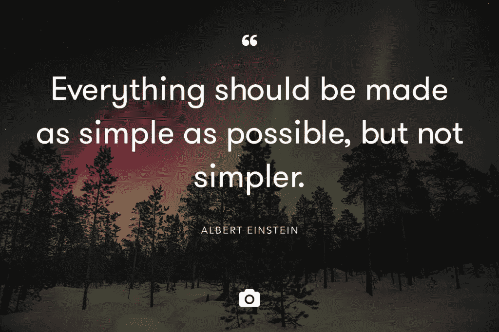

# 简单的心理学

> 原文：<https://medium.com/swlh/the-psychology-of-simple-fd5d25a3ca>

为什么简单这么难做对？

对于一个我们都明白的概念来说，“简单”是难以确定的。

我们可能“一看到就知道”，但是让一个产品、一本书或一个网站感觉简单和容易的背后不仅仅是本能反应。

用[史蒂夫·乔布斯](http://www.goodreads.com/quotes/445279-simple-can-be-harder-than-complex-you-have-to-work)的话说:

> “简单可能比复杂更难:你必须努力让自己的思维变得清晰，才能变得简单。但最终还是值得的，因为一旦你到了那里，你就可以移山。”

如果在创造简单事物的过程中有如此多的力量，为什么我们中的许多人会错过目标呢？

为什么简单如此复杂？

像生活中的大多数事情一样，简单不仅仅是表面上的吸引力。让我们看看我们的大脑是如何理解新信息的，为什么有些事情比其他事情感觉更简单，以及你如何在你的下一个项目中使用这些想法。

# 认知流畅性和对原型的偏好

哈佛大学教授乔治·怀特塞德斯在他的 TED 演讲 [*迈向简单科学*](http://www.ted.com/talks/george_whitesides_toward_a_science_of_simplicity/transcript?language=en) 中，将“简单”分解为三个特征:

*   他们是可预测的
*   他们是可以接近的
*   它们是建筑材料

最容易的起点是可预测性。我们喜欢简单的东西，因为它们对我们的大脑来说很容易理解——理解它们并不困难。

这很好，因为我们的大脑工作速度快得惊人。

在谷歌和巴塞尔大学 2012 年的一项研究中，研究人员发现用户会在 1/20-1/50 秒内判断一个网站的美感和感知功能。在比打响指还短的时间内，我们就能对像网站这样复杂的东西做出判断。

我们做出的判断发生得如此之快，以至于他们经常感觉是本能的或情绪化的，而不是一个心理过程。

但是这些判断是由我们的大脑做出的。只是我们没有意识到而已。

人类天生会做出仓促的决定。作为我们战斗或逃跑反应的一部分而发展起来的东西(感谢进化，把我们从野外的捕食者手中拯救出来)继续对我们对新刺激的第一印象产生重大影响。为了帮助我们快速做出决定，我们的大脑会根据预期或**原型元素创建捷径。**

这里有一个例子来说明我所说的:如果我问你，你会把什么颜色和男孩联系在一起，大多数人会立刻想到蓝色(女孩会想到粉色)。你不用主动去想答案。就在那里。你的大脑已经建立了太多次的联系，以至于它创造了一条捷径。男孩=蓝色已经成为原型。

心理学家称我们的大脑对原型的偏好为****，这是让事情看起来“简单”的很大一部分原因。****

****认知流畅性是我们在接受新信息时的感受。它是完成一项脑力任务的难易程度的主观体验。****

****如果某件事情*感觉*简单(比如知道蓝色是男孩子的)，我们就假设这件事情*简单。这就是为什么德国设计师 Harmut Esslingen 在 20 世纪 80 年代帮助塑造了苹果产品的标志性外观，遵循“形式跟随情感”的指导原则。*****

****我们以一个网站为例。当你第一次访问一个网站时，你会期望看到某些原型元素:比如顶部或侧面的导航条，或者电子商务网站右上角的结帐窗口。每一种“类型”的网站，从在线杂志到时尚博客，都有这些原型元素。****

****当一个网站不符合这些期望时，我们的大脑就更难解码，我们几乎会自动判断它要么太复杂，要么设计糟糕。****

# ****学习简单的语言****

****当谈到一个简单的设计有多吸引人时，除了对原型元素的偏好之外，还有其他因素在起作用。****

****自 20 世纪 60 年代以来，心理学家一直在研究纯粹的暴露效应——我们接触某种刺激的次数会影响我们对它的积极感受。这是广告商喜欢利用的概念之一(想想[回到未来](https://www.youtube.com/watch?v=95_DB6GgLQs)电影中可怕的产品植入就知道了)，因为你不一定要有意识地意识到你以前见过这些刺激。****

****在 2013 年的一项研究中，意大利心理学家斯特凡诺·鲁杰利和斯特凡诺·博卡将 78 名高中生分成两组，让他们观看热门电影片段。一组看的是产品名称可见的版本，而另一组看的是掩盖了所有产品标识的版本。研究结束后，这些小组回答了关于这部电影的问题以及他们对某些品牌的偏好。****

****与对照组相比，被展示植入广告的那组人报告了对品牌*的更高偏好，即使他们在电影*、*、*中没有认出这些品牌。****

****然而，不仅仅是接触单一元素会影响我们的感觉。另一个现象——***平均美效应***——表明我们也更容易被包含许多共同元素的刺激所吸引。大量研究表明，当[的脸与其他脸混合(变形)时，或者当它们向人群平均水平扭曲时，通常会变得更有吸引力](http://psy2.ucsd.edu/~pwinkiel/halberstadt-winkielman-two-faces-PS-2013.pdf)。****

********

****熟悉的原型元素的组合比完全独特的东西更吸引我们的大脑，也更容易理解。****

# ****简单——美观与功能的结合****

****虽然让事情变得简单可能始于认知的流畅性，但最终却是易用性和可访问性。****

****当我们主动操纵信息时，比如访问一个新网站或学习如何使用一种新产品，我们会使用大脑中被称为 [**工作记忆**](http://blog.pickcrew.com/put-memory-work/) 的部分。唯一的问题是工作记忆是一件很挑剔的事情。任何容易失去注意力的人都可以证明，很难同时持续思考大量信息。事实上，心理学家发现，我们的工作记忆通常会在大约 7 项信息时达到极限。****

****将这些知识运用到您的设计中是一种强有力的方法，可以确保它的使用尽可能简单。****

****这里有一个例子:****

****当苹果开发第一款 iPod 时，史蒂夫·乔布斯进行了一项严格的测试:如果他想要一首歌或一个功能，他应该能够点击三次就能找到。他坚持点击是直觉的。****

********

****尽管 iPod 内部非常复杂，但乔布斯知道，对于我们这些消费者来说，要想立刻对它感到舒适，这个设备必须非常简单。这意味着对它的外观和使用都很熟悉(即使我们以前从未见过它)。不仅点击轮*感觉*简单，因为这个动作是原型，而且使用这个界面根本不占用我们的工作记忆。****

****简单的东西，心理入门门槛低。我们无需任何培训就能使用它们。****

# ****如何利用简单的力量****

****理解大脑如何看待简单的事情是一个很好的开始，但是你如何确保你正在做的事情看起来简单呢？****

# ****1.从过去偷东西****

****现在看来，原型元素是简单性的基础，这一点已经很清楚了。这意味着要深刻理解用户的期望是什么。****

****看看你的竞争对手的产品或网站。有哪些共同元素？当人们来到你面前时，他们期望看到(或读到或听到)什么？定义这些元素，并利用它们让你的产品立刻变得熟悉和简单。****

# ****2.创建您自己的植入式广告****

****你做的每一件事，从你的网站到你的标志或者你的 Twitter 背景，都传达了关于你和你的品牌的信息。这些元素中的每一个都是在你的公司周围创造视觉熟悉感的独特机会(还记得单纯的曝光效应吗？).****

****[使用情绪板](http://www.gomoodboard.com/)创建设计风格指南。在你所有的帖子和网站上使用来自同一来源的[股票图片](https://unsplash.com/)。创建[一个你可以在所有媒介上使用的彩色故事](http://blog.pickcrew.com/how-to-tell-a-color-story-the-psychology-of-color/)。****

****无论你做什么，记住你和你的观众越熟悉，他们就会发现你越简单，越有吸引力。****

# ****3.“相同但不同”****

****这是我最喜欢的一句话，是我从印度尼西亚的孩子们那里学来的，他们试图卖给你从手镯到滑板车的所有东西。****

****“相同但不同”基本上是指与你想要的(或习惯的)东西足够相似，但又有自己独特的卖点(让你更想要它)。就简单而言，这意味着使用那些非常重要的原型元素，同时增加新颖性和独特性，这样你的版本就会在我们的记忆中脱颖而出。一点点偏差可能是件好事。****

****1977 年，苹果第一本营销手册的标题宣称:“简单是终极的复杂”。****

****但我认为他们有点弄错了。****

****简单不一定是复杂，而是舒适。是晚宴上唯一的朋友。这是开胃菜桌上的裹着毯子的猪。让你瞬间放松的是一些小事。****

****找到一种让简单对你有利的方式，让你的用户或观众立刻感到舒适。想想他们的期望是什么，你如何利用他们的思维捷径来创造简单、美丽、相同但不同的东西。****

****图片鸣谢:[耐莉·沃尔科维奇](https://unsplash.com/nelly)，[阿思·泰克卡](http://arstechnica.com/apple/2005/08/922/)，[格雷戈·斯威德](https://unsplash.com/gregshield)，[脸部研究实验室](http://www.faceresearch.org/)****

# ****得到了[一个想法](https://crew.co/?utm_source=Medium&utm_medium=CTA&utm_campaign=MediumCTAs)？****

********

## ****与最好的设计师和开发人员一起工作。超过 1000 万人使用了剧组生产的[产品。超过 300 万人阅读了我们的博客。在这里订阅](http://crew.co/?utm_source=Medium&utm_medium=CTA&utm_campaign=MediumCTAs)。****

********