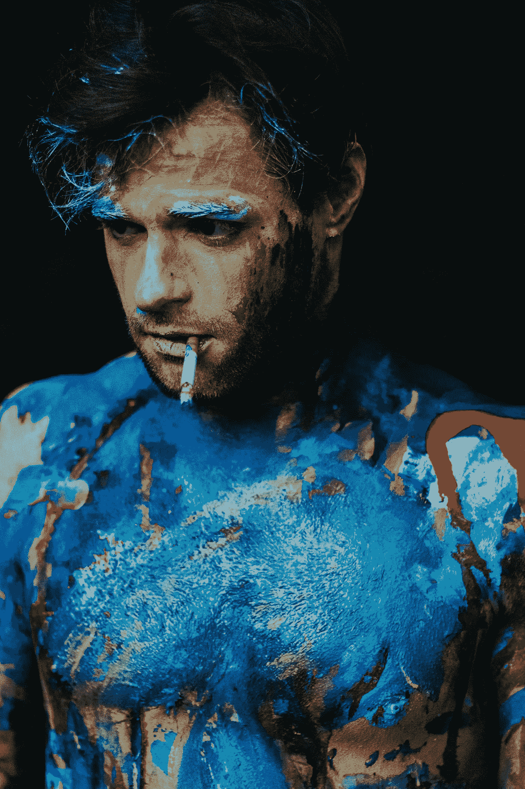
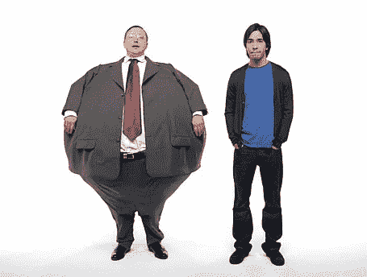

# 地位心理学:有创造力的人如何让自己与众不同

> 原文：<https://medium.com/swlh/the-psychology-of-status-what-creative-people-do-to-set-themselves-apart-55e15153463e>

## 工业如何欺骗你让你每天都感到不满足，以及很少有聪明的人找到克服它的方法。

Photo by [melissa mjoen](https://unsplash.com/photos/T4pyizC6G1k?utm_source=unsplash&utm_medium=referral&utm_content=creditCopyText)

这是人类状况的一部分——对地位的需求。

我们看到它在动物王国里以一种更简单的方式表现出来。狩猎结束后，阿尔法银背狼得到最好的产品，阿尔法狼得到第一次采摘。他们先吃东西。

然而，对于人类来说，这种“T2”先吃“T3”的需求有许多不同的形式。我们在餐桌上衡量自己；传统上，*族长*会在感恩节大餐中切火鸡，我们可以用其他我们不常意识到的方式互相吸引:

*   我们通过我们在企业中的级别或头衔来衡量地位。
*   我们用银行账户里有多少钱来衡量地位。
*   我们衡量地位的标准是我们认为我们的伴侣对他人有多有吸引力和多有吸引力。
*   在某些游戏的范围内，我们通过我们的体力或运动能力来衡量我们的地位。

我们总是以某种方式或形式来衡量对方。资本主义是建立在对地位的需求之上的。

在创造性的生活中，对地位和认可的需求被放大了。

妈的，我经常衡量一个作家的追随者数量，我卖出了多少本电子书，或者我的电子邮件列表的大小。

我们生活中的很多事情都是由我们对自己所处位置的感知决定的。

**是什么导致了我们本能的、无休止的渴望获得比周围人更高的地位？**

# 羞耻的心理学

羞耻，六种基本情绪之一，与我们追求更高的地位有很大关系。

[心理学今天](https://www.psychologytoday.com/us/blog/shame/201305/the-difference-between-guilt-and-shame)对羞耻的定义是，

> 因意识到不名誉、不正当、荒谬等事情而产生的痛苦感觉。由自己或他人完成。

这种情绪每天都伴随着我们，并被我们无法逃避的社会因素放大。

Photo by [Caleb Woods](https://unsplash.com/photos/VZILDYoqn_U?utm_source=unsplash&utm_medium=referral&utm_content=creditCopyText)

*   当我们没有完成特定的职业目标时，我们会感到不光彩。
*   当我们没有穿着正确得体的服装去参加鸡尾酒会时，我们会觉得不合适。
*   当我们所有的朋友都在炫耀 [iPhone Xs](https://www.apple.com/iphone-x/?afid=p238%7Cs7AkblcwL-dc_mtid_20925d2q39172_pcrid_221626740472&cid=wwa-us-kwgo-iphone-slid--) 的时候，我们还在使用[诺基亚 6350](https://www.amazon.com/Nokia-6350-Unlocked-External-Bluetooth/dp/B00710MZOQ) 翻盖手机，我们会觉得*可笑*。

# 营销人员让你陷入的陷阱

几十年来，营销和广告公司一直在利用你的地位和羞耻来提升他们的产品销量。

你还记得大约十年前苹果公司为对抗其主要竞争对手微软(以及所有个人电脑)的技术而发起的天才广告战吗？

Hodgman and Long in [Mac vs. PC](http://adage.com/lp/top15/#getamac)

这场广告战被称为 [*Mac vs. PC。它播放了一系列 66 个商业广告，展示了时髦、年轻、有抱负的苹果电脑(由喜剧演员贾斯汀·朗饰演)和单调、陈旧、乏味的个人电脑(由约翰·霍吉曼饰演)之间的地位交换。*](http://adage.com/lp/top15/#getamac)

地位之争在这里是显而易见的:Mac 总是占据智力上的制高点，他总是更善于适应当前的技术趋势和设备，他更精简、更快速，总体上被描绘成阿尔法。

另一方面，个人电脑总是又笨又慢。他会在手头缺乏资源和讨论信息的情况下出现在广告中。

这场商业活动想传达什么？

它试图传达你——消费者——内心的羞耻感。

见鬼，我感觉到了。我来自一个 PC 家庭。我记得我们家第一次有了一台电脑——一台 *Packard-Bell* (根据 PCWorld 的报道，它被列为有史以来最差电脑的第一名】。这就是上面广告宣传所描述的一切:缓慢、笨重、喧闹、缺乏吸引力和单调。

它需要太多的升级才能跟上时代的步伐，这让我觉得自己不如我周围那些与时代一起炫耀自己的 mac 电脑的人(这甚至是在 MAC 拥有现在的实力之前)。

我感到非常羞愧，因为我不是未来——乔布斯的未来——的时髦的技术学生。

将所有这些推断到您每天接触到的其他广告活动中:

*   一种洗衣液会比另一种让你感觉更好。
*   除非你在练习中使用这种特殊的棒球手套，否则你不会表现得很好。
*   你是一个可耻的人，除非你吃这种低热量的冰淇淋。

这份名单还在继续，看来我们被困住了。

我们发现自己在追逐这只永远抓不住的兔子，以为下一次购买或收获会给我们带来我们渴望的满足感。

我们被告知，如果我们得到这个，我们将最终“在那里。”

这条路没有尽头。

# 创意的不同叙事

Photo by [Nathan Lee](https://unsplash.com/photos/ui3k4FpyoOM?utm_source=unsplash&utm_medium=referral&utm_content=creditCopyText)

作为一个创造性的开始，一个人可以在他们的工作中经历很多耻辱。

该项目的吸引力并没有像你想象的那样吸引住观众。你一直在埋头苦干，事情还没有成形。人们一直在负面地批评你的努力工作。

所有这些混合成一种状态，感觉最低水平的地位和最高水平的羞耻。

> 我认为，这是因为我们认为我们需要成为“下一个大事件”

我们需要被了解，我们需要所有的目光都盯着我们——我们的地位取决于此，我们通过容易获得的信息和叙述的交流被强行灌输这种想法。

然而，形势对你非常不利。[根据调查](https://pudding.cool/2017/01/making-it-big/)，在 7000 支能够成为一场 3000 人规模演出的乐队中，只有 21 支能够真正“成功”

> **如果有一种不同的方式可以在更适度的范围内满足我们的地位需求，同时还能创造一种生活，会怎么样？**

如果我们从 10 个人开始，而不是从 100 万或者 10 万人开始，会怎么样？

我们所做的只是向 10 个人展示和讲述我们的工作。**我们确保首先告诉我们爱和信任的人。也许到那时，如果这个想法可行，它将会被传播。**

创意的目的是利用那些渴望你的作品的特殊人群——不是每个人都有一颗跳动的心。

> “一旦你把自己从完美接受的需求中解放出来，开展重要的工作就会容易得多[……]每个人都不是你的客户。”
> 
> ——塞思·戈丁

从那里，你可以成长。你可以测试你的工作是否物有所值。再者，你可以建立并期待固化你的[*1000 真粉丝*](https://kk.org/thetechnium/1000-true-fans/) *。*

只有当你选择相信时，感到羞耻和不足的陷阱才是相关的和真实的。

打造自己的创意之路。

坚持做你热爱的工作。做得更好。与寻找它的人分享它。从那里开始，你将把你的创造性工作转化为可以支持你生活的东西。

除此之外，谁知道？

> 也许你会“成功”

但这不是目的。

# 👋🏻你好，我是乔恩

## 我是一个作家，思想家和葡萄酒爱好者，写关于个人成长和心理优化的文章。加入 1，200 多名读者的行列，获取我为期 6 天的个人“创业博客”课程和我的时事通讯:

**🚨** [**【自由】世卫组织还想自己当老板？课程:开始从你的博客**赚钱需要知道的 6 件事](https://mailchi.mp/4b982beed325/free-6-step-course)

## 这篇文章发表在 [The Startup](https://medium.com/swlh) 上，这是 Medium 最大的创业刊物，有 355，974 人关注。

## 订阅接收[我们的头条新闻](http://growthsupply.com/the-startup-newsletter/)。

