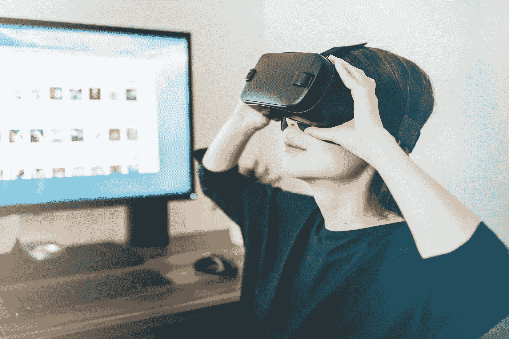

# 消费者心理——今天的营销之旅

> 原文：<https://medium.com/swlh/the-psychology-of-the-consumer-todays-marketing-journey-ec7a0ce803d9>

Photo by [JESHOOTS.COM](https://unsplash.com/photos/xGtHjC_QNJM?utm_source=unsplash&utm_medium=referral&utm_content=creditCopyText) on [Unsplash](https://unsplash.com/?utm_source=unsplash&utm_medium=referral&utm_content=creditCopyText)

消费者心理学是一个迷人的话题。这就是超市把利润最高的商品放在眼睛高度或底座上的原因。这就是为什么商店里的地毯设计会巧妙地引导你在空间里走来走去。这就是你在赌场找不到钟的原因。

作为一名数字营销专业人士，我的工作是跟上最佳实践，以…