# 专家们错了:Snap 值得购买

> 原文：<https://medium.com/swlh/the-pundits-are-wrong-snap-is-a-buy-682ce30a67b9>

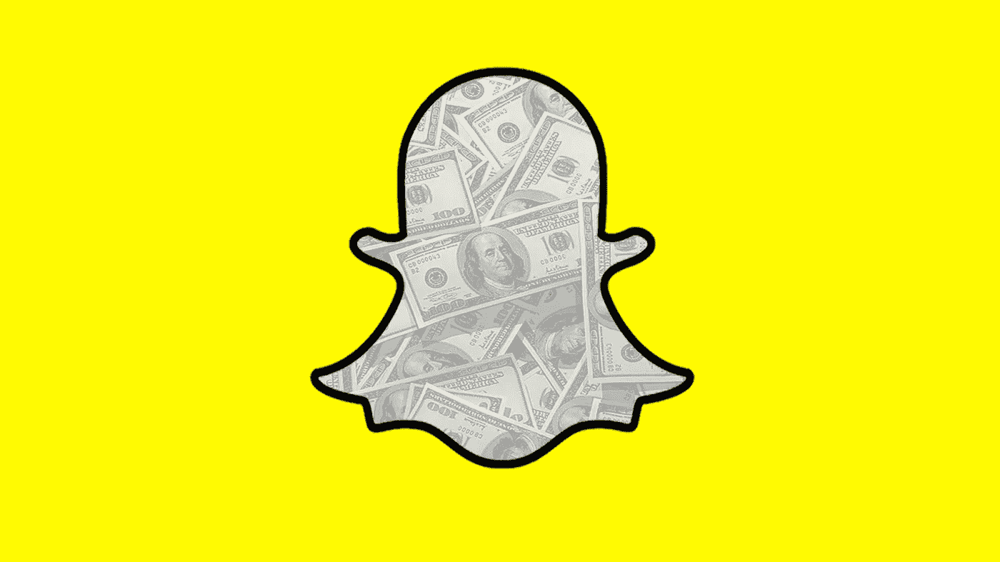

对于那些自从 Snap 宣布其[打算上市](https://www.sec.gov/Archives/edgar/data/1564408/000119312517029199/d270216ds1.htm#rom270216_10)以来就没有关注过新闻的人来说，媒体的周期就像坐过山车一样。最初的估值估计在[200-250 亿美元](https://www.wsj.com/articles/snapchat-parent-snap-inc-files-for-ipo-1486071371)之间，随后很快就有一些更大胆的说法称，IPO 可能会使该公司的估值[高达 400 亿美元](http://www.vanityfair.com/news/2016/10/snapchat-40-billion-ipo)。考虑到这一点，公告发布后立即出现的评论是决定性的看跌，主要集中在该公司与 2016 年仅 4.05 亿美元的收入相比过高的[价格](http://fortune.com/2017/02/02/snapchat-ipo-snap-stock/)上。

随着时间的推移，更多深思熟虑的分析已经将注意力转移到 Snap 的增长前景上，这里出现了对该公司[用户增长放缓](http://www.recode.net/2017/2/2/14492932/snapchat-ipo-twitter-facebook-comparison)的重大担忧，将其与 Twitter 上市后表现平平的[相提并论](https://www.fool.com/investing/general/2015/08/08/facebooks-and-twitters-post-ipo-performance-couldn.aspx)，从而对据称的估值数字提出了严重质疑。因此，据报道，Snap 已经[降低了其预期](http://www.reuters.com/article/us-snap-ipo-valuation-idUSKBN15V0JK?il=0)，某些估计预计定价将低至每股 14-16 美元，这意味着估值为[160-190 亿美元](http://www.reuters.com/article/us-snap-ipo-valuation-idUSKBN15V0JK?il=0)。

在它的预期定价(预计在 3 月 1 日)之前，我们看看传言中的估值是否合理，并就投资者应该在哪里给股票定价提供我们自己的指导(该公司将在纽约证券交易所交易，预计交易代码为“SNAP”)。

我们发现，虽然市场对 DAU 增长的整体担忧是合理的，但市场可能低估了该公司在 ARPU 的增长前景，并得出结论，投资者有很大的上升空间。**对我们来说，Snap 是一个值得购买的东西**。

# 增长是答案

如上所述，最初的报告主要侧重于比较 Snap 的据称估值与其收入，与同行相比，这看起来确实非常昂贵(表 1)。

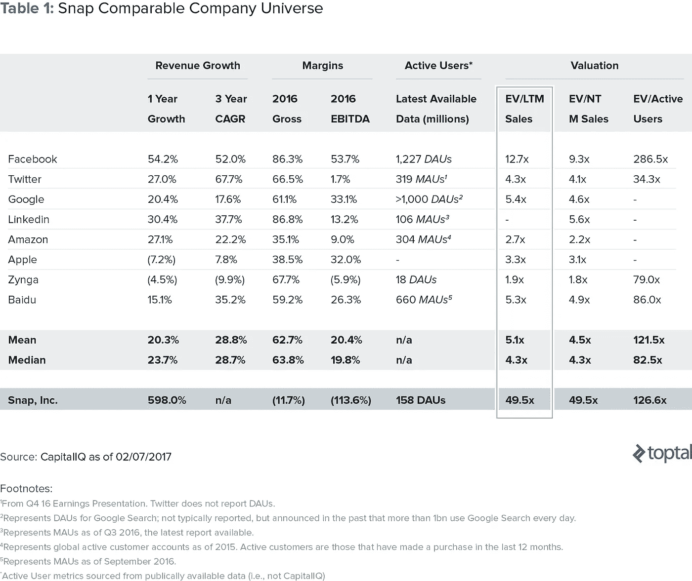

但这种分析在两个重要方面完全没有击中要害。首先，Snap 的同行世界中的许多公司不具有直接可比性(仅举几个例子，谷歌是一家搜索公司，亚马逊是一家在线零售商)。将同行宇宙限制在 Snap 最直接可比的同行，脸书和 Twitter，是一个更合适的并列关系(图 1 和图 2)。

但是，即使仅仅局限于与脸书和 Twitter 的比较，这两家公司的成熟度也是非常不同的，这是必须考虑的。一个更公平的分析应该着眼于这三家公司上市前的指标(图 3 和图 4)。在这样做的时候，读者会注意到相对估值，虽然仍然昂贵，但看起来比以前的图表要少。

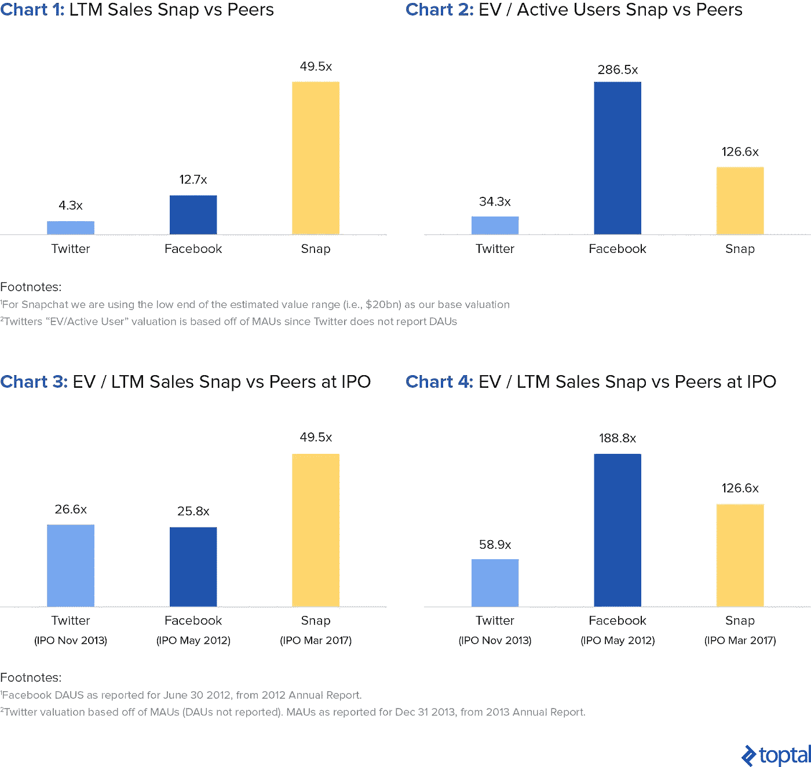

不过，这种比较仍然存在时间问题。作为参考，[脸书八岁，推特七岁](http://www.businessinsider.com/is-snapchat-ipo-worth-investing-in-2016-10)时，他们首次公开募股。Snap 只有 5 年的历史，如果再有 2 到 3 年的增长，Snap 可能会是一家非常不同的公司。

此外，Snap 是一个直接面向移动的平台，而脸书和 Twitter 上市时，桌面交付仍占据主导地位。考虑到从桌面到移动的转变，Snap 正在进入一个用户群不断增长的市场(移动从桌面获得份额)，其交付平台正在吸引越来越多的用户参与(图 5 和图 6)。

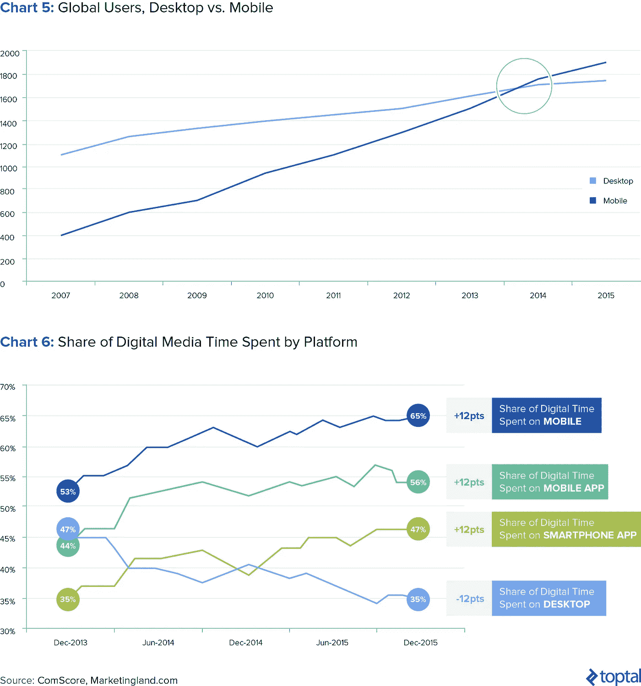

总之，不同的到期情况加上不同的交付平台，无论是现在还是 IPO 时，在评估 Snap 的估值时，基于可比数据的方法都很麻烦。与同行相比，Snap 可能看起来很贵**，但与同行相比并不是正确的方法**。

考虑到上述情况，仅快照分析最有意义。这样的分析应该只关注一件事:增长。对于处于 Snap 阶段的任何公司来说，增长对估值至关重要，为此，有两个基本因素会影响未来的增长:

1)日活跃用户(dau)的增长，以及
2)每用户平均收入的增长(ARPU)

我们依次来看这些。

# DAU 增长:疑虑隐现

事实上，在提交申请几周后出现的许多更有见地的分析都聚焦于 DAU 的增长。老鹰成群结队地出去了。对 Snap 来说不幸的是，虽然最初的用户增长表现令人印象深刻(图 7)，但最近几个月加入该平台的新用户数量大幅下降。尽管在 IPO 前的六个季度中，Snap 的用户增长超过了脸书和 Twitter，但其季度增长率从两位数下降到了 2016 年第三季度的 7%，更令人担忧的是，2016 年第四季度的增长率仅为 3.3%(图 8)。

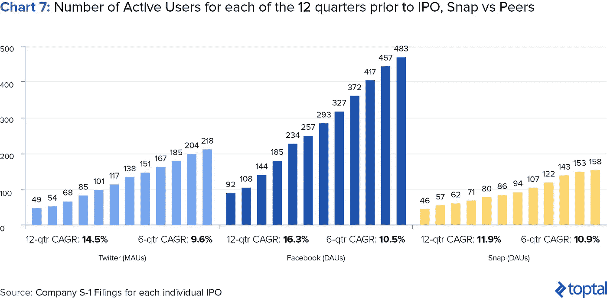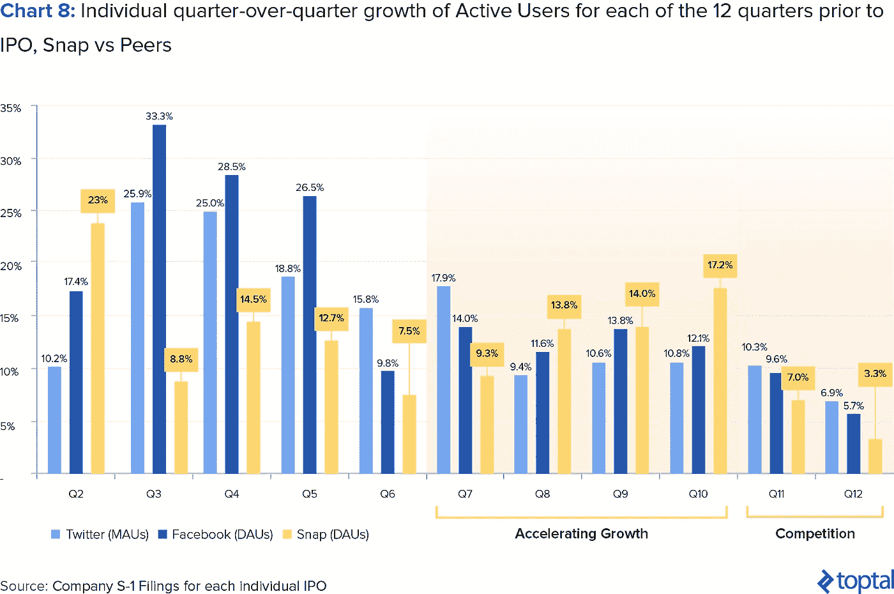

管理层对以下事项的解释可以在他们的 S1 中找到，其中[他们陈述](https://www.sec.gov/Archives/edgar/data/1564408/000119312517029199/d270216ds1.htm#rom270216_10):

> 在截至 2016 年 12 月 31 日的季度早期，每日活跃用户净增加率相对持平，并在 12 月份加速增长。尽管历史上我们的日活跃用户增长一直不稳定，但我们认为本季度早期的持平增长主要与今年早些时候用户参与度的加速增长、产品性能下降以及竞争加剧有关。
> 
> 与 2015 年下半年相比，2016 年上半年每日活跃用户的净增加速度加快，这主要是由于产品发布增加了用户参与度，以及老年人口和国际市场的采用率增加。这为第三和第四季度的每日活跃用户创造了更高的基线，因此即使同比增长强劲，这些季度内的增量净增也更加困难。此外，在 2016 年年中，我们推出了几款产品并发布了多个更新，这些更新引入了许多技术问题，降低了我们应用程序的性能。
> 
> 我们认为，这些性能问题导致我们的日活跃用户增长下降，特别是在 Android 用户和 Android 设备比例较高的地区。最后，我们还看到 2016 年国内和国际竞争加剧，因为我们的许多竞争对手推出了与我们功能相似的产品。

因此，上述解释强调了增长放缓的两个关键潜在原因:Android 产品的技术问题和/或日益激烈的竞争。

前者虽然有问题，但不会成为令人担忧的重要原因。人们可能会认为，一家资金高达 26 亿美元、[近 2000 名员工](https://www.sec.gov/Archives/edgar/data/1564408/000119312517029199/d270216ds1.htm#rom270216_10)(其中许多是工程师)的公司能够解决这个问题，让公司的增长轨迹回到 2016 年初的水平。

但更令人担忧的是竞争。Snap 面临着来自竞争对手越来越大的压力，特别是脸书和 Instagram，如果这个问题得不到解决，可能会继续限制 DAU 的未来增长。事实上，难怪 Snapchat 的增长数字在 2016 年第三季度开始下降，因为这正是 Instagram [推出 Stories](https://techcrunch.com/2016/08/02/instagram-stories/) 的时候，这是一款近乎明目张胆的 Snapchat 同名产品。

对 Snap 来说，不幸的是，按地理位置划分的 DAU 增长数据只会进一步加剧竞争担忧。事实上，从地理位置来看，Snap dau 增长放缓主要发生在“世界其他地区”(图 9)。鉴于 Instagram 在海外的用户群要大得多([Instagram 的约 3 亿 dau 中有 80%是国际用户](https://techcrunch.com/2017/02/02/slowchat/)，人们可以看到，随着 insta gram(和其他竞争对手)开始提供 Snapchat 迄今为止一直在推销的关键功能，安装 Snapchat 的动机是如何减弱的。

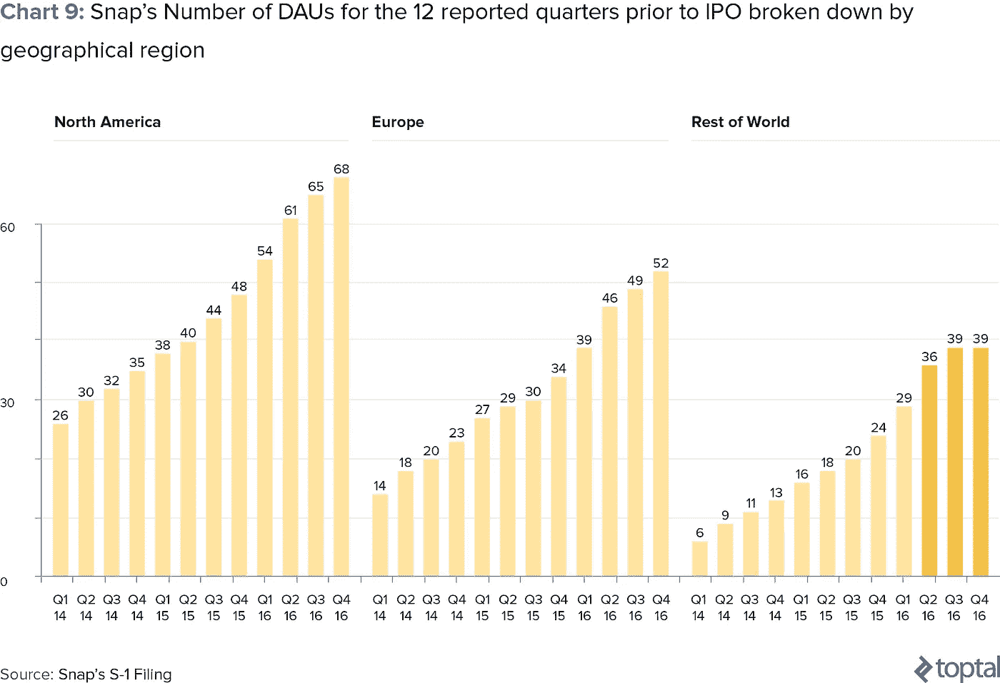

总而言之，从 DAU 增长的角度来看，Snapchat 的情况并不乐观。2016 年第四季度不仅是 Snap 有公开数据以来增长最低的一个季度，甚至比更成熟的公司脸书的增长还要慢(图 10)。鉴于这些不利因素，如果 Snap 希望达到已经公布的估值，它必须有效地让投资者相信，它能够解决 DAU 季度环比增长放缓的问题。

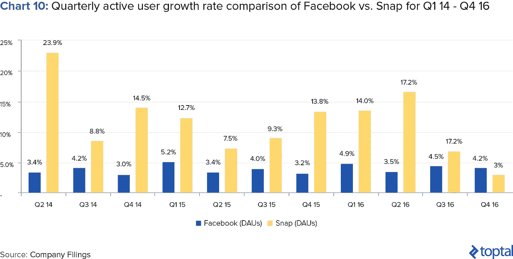

考虑到上述情况，我们预计 Snap 未来的用户增长模式将更类似于 Twitter，而非脸书。虽然 Snap 在美国的持续受欢迎将保持增长，但来自脸书、Instagram 和[以及其他国际竞争对手](https://techcrunch.com/2017/02/02/slowchat/)的竞争将继续限制 Snap 在国际上的增长。

因此，我们的基本预期是上市后平均每年增长 14.1%，几乎正好介于脸书和 Twitter 分别为 19.1%和 10.3%的年平均增长率之间(表 2)。Twitter 增长溢价的主要来源是 Snapchat 在产品功能上比 Twitter 更好的创新能力(更多信息见下文)。

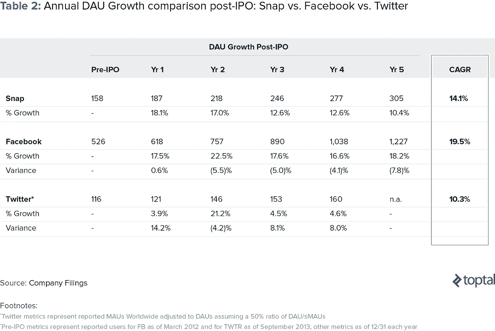

# ARPU 增长:坚实的开端，仍有很大的上升空间

虽然 DAU 的上述估计没有什么值得投资者兴奋的，而且与大多数市场评论基本一致，但停止对 DAU 表现的分析是短视的。特别是，它忽略了硬币的另一面:ARPU。谈到 ARPU 的增长，我们看到了一个完全不同的故事。我们认为 Snapchat 将在以下因素的推动下实现强劲的 ARPU 增长:

*   更有利于货币化的产品
*   在关键用户群体中占据更有利的位置
*   更注重货币化的管理思维

所有这些都将反过来受到移动广告领域普遍潜在实力的推动。我们依次来看这些。

 [## 投资条款清单会如何影响你

### 尽管旨在帮助创始人驾驭融资过程的资源大幅增加，但许多人仍在苦苦挣扎…

www.toptal.com](https://www.toptal.com/finance/fundraising/common-term-sheet-mistakes-founders-make) 

# Snapchat 是一款非常有利于盈利的产品

从 ARPU 的角度来看，Snapchat 最吸引人的特点之一是，该产品本身似乎非常适合货币化，可以说比其竞争对手更好。该平台的有效性在很大程度上是由 Snap 在产品功能上的创新和在竞争中保持领先的能力推动的，这使得 Snap 在图像共享和视频领域建立了令人印象深刻的强大地位。

首先看看图片分享，Snap 已经迅速赶上了它的竞争对手(图表 11 ),这在很大程度上归功于它在格式上的创新能力(最初是消失的消息，后来是过滤器、故事等)。).这一点意义重大，因为它使 Snap 在开发和交付此类格式的赞助/品牌内容方面处于行业领先地位。例如，尽管 Snap 的用户基础小得多，但其专注于赞助商过滤器的能力却远远超过了脸书(图 12)。

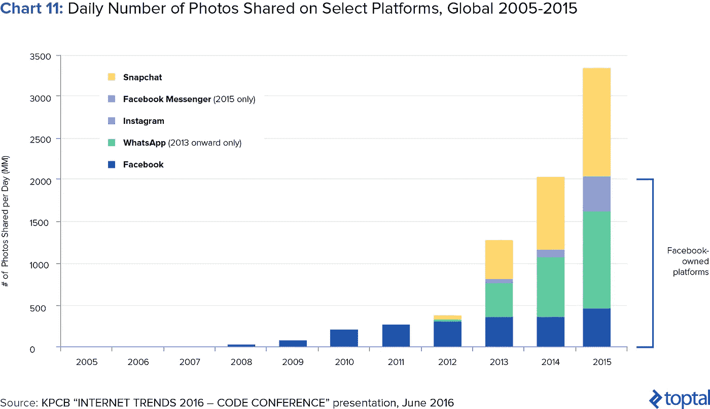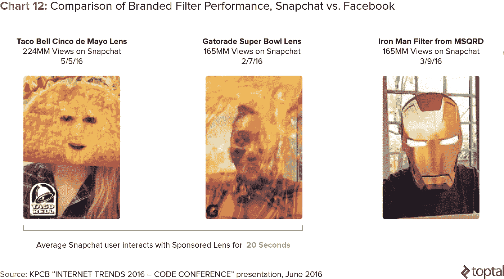

图像共享的增长和围绕其产品功能的创新使 Snap 在广告商中占据有利地位，使 Snap 能够与全球非常重要的品牌建立重要的合作关系。在 S1 中突出[的这类活动的一个例子是，温迪快餐如何用赞助的 Geofilters 覆盖其美国商店，以推广墨西哥胡椒烤鸡三明治。Snap 的测量工具报告称，受赞助的 Geofilter 在观看受赞助的 Geofilter 的七天内，带动了超过 42，000 名增量用户前往 Wendy 的位置。](https://www.sec.gov/Archives/edgar/data/1564408/000119312517029199/d270216ds1.htm#rom270216_10)

或许比图片分享更重要的是，Snap 已经在视频领域占据了主导地位，将其转化为对脸书的严重威胁[。根据](http://www.businessinsider.com/why-snapchat-is-a-threat-to-facebook-2016-4) [KCPB 的介绍](http://www.kpcb.com/internet-trends)，尽管 Snap 的用户群明显较小，但截至 Q1 16 日，Snap 的日视频浏览量已经超过了脸书(图 13)。

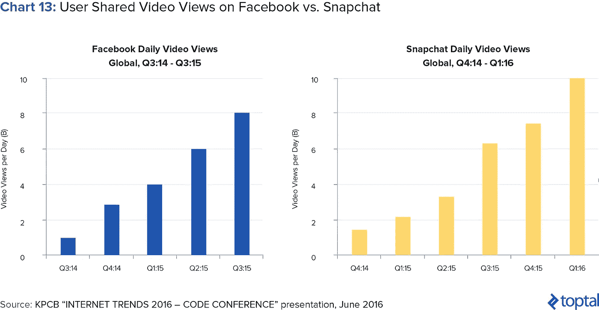

迄今为止的这一成功是由 Snap 独特的视频格式方法推动的。KCPB 将 Snaps 方法称为“ [3V 广告](http://www.kpcb.com/internet-trends)”:(1)垂直——为移动观看而生，(2)视频——讲述故事的好方法，(3)观看——总是全屏。

这三者的结合使得 Snapchat 上的视频广告更加有效。事实上，根据 KCPB 的陈述，在 Snapchat 之外，许多视频广告是无效的，81%的人会屏蔽广告。然而，Snap 在其 S-1 中指出，平均而言，所有 Snap 广告中有 60%是开着声音观看的。

以上再次表明了 Snap 作为一个盈利平台的有效性，以及管理团队在将乐趣和产品功能与盈利渠道结合起来时保持产品创新和领先的能力。[最近一个视频成功的例子](https://www.google.com/url?q=https://searchenginewatch.com/2016/07/25/facebook-vs-snapchat-which-is-the-best-for-your-brand/&sa=D&ust=1487870984029000&usg=AFQjCNH5Ux8ev961vMygix56Llot8Tl1yQ)是佳得乐在超级碗期间的赞助镜头，这一活动总共导致了 6000 万次播放，1.65 亿次观看，购买意向增加了 8 个百分点。

Snap 开发了终极三连胜——一个强大的广告平台，结合了通信(聊天)、图像创建和共享以及视频内容。这使得许多营销活动取得了高于平均水平的行业影响力、业绩和投资回报率。这应该会支持 ARPU 的快速增长，因为更多的营销人员认识到这些好处，并决定将广告资金转移到 Snap。

# Snap 在关键用户群体中非常强大

随着移动广告投资资金的增加，更多的广告商开始瞄准千禧一代和更年轻的人群。2015 年，营销人员将[超过三分之一(34%)的年度营销预算](https://www.emarketer.com/Article/Marketers-Allocate-Media-Budgets-Target-Millennials/1013616)用于瞄准这些群体。如果算上青少年和十几岁的孩子，这个数字可能会更大。

上述现象在很大程度上是因为千禧一代有望在未来几年推动消费支出。截至 2015 年 3 月，千禧一代有 8000 万人，是美国最大的人口群体，也是 T2 最大的人口群体。

这当然转化为巨大的消费能力。估计表明，到 2020 年，千禧一代可能每年花费[1.4 万亿美元，并可能在未来几年继承多达 300 亿美元。甚至青少年也在产生巨大的消费能力，2015 年他们的消费和婴儿潮一代一样多。](https://www.nytimes.com/2015/06/21/business/media/marketers-fixation-on-the-millennial-generation.html?_r=0)

广告商面临的问题是，千禧一代正在从传统广告渠道转向他们的手机(图 14)。像 Snap 这样的公司及其竞争对手提供了一个锁定这些群体的最佳渠道。

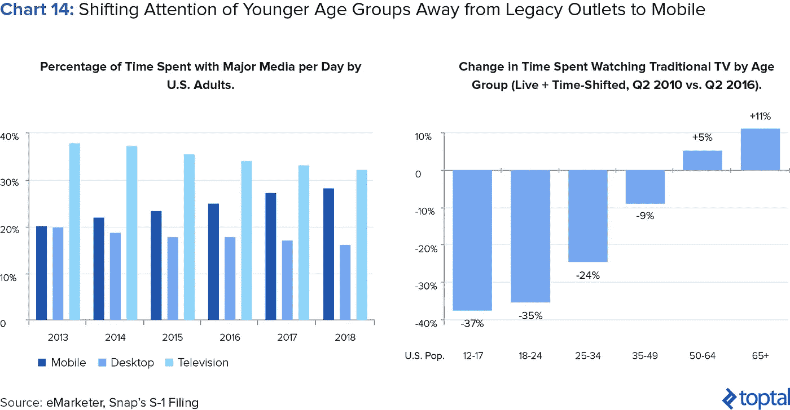

对 Snap 来说幸运的是，他们似乎已经在这些年龄组中形成了非常强大的地位。63%的 Snap 用户年龄在 18-34 岁之间，22%的用户年龄在 13-17 岁之间，Snap 吸引了一个非常令人垂涎的营销人群的注意(图 15；注意:图表来自 2016 年的 comScore 报告，因此该数据并不完全符合 Snap 在其 S-1 中报告的最新人口统计数据。

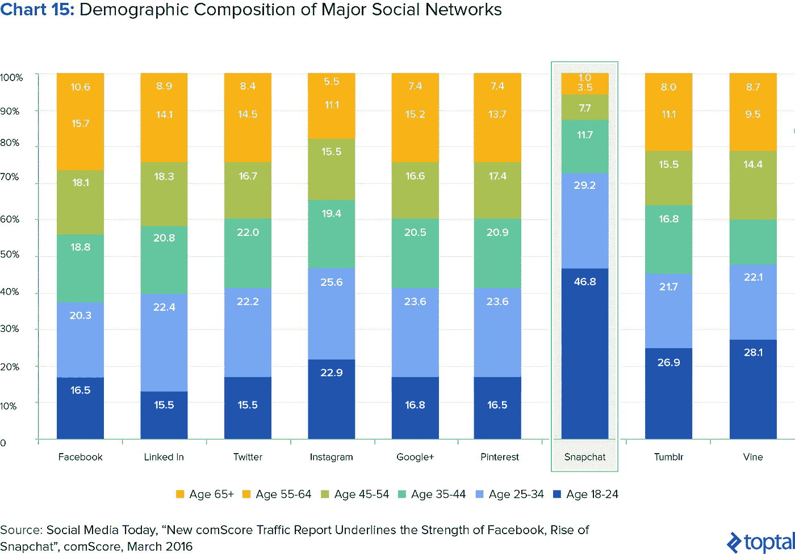

更重要的是，Snap 已经成为 18-34 岁年龄段人群参与度的领先平台(图 16)。脸书显然是一个占据主导地位的玩家，拥有巨大的影响力和重要的参与度，但 Snapchat 是每个访问者平均每月分钟数第二大平台。随着 Snap 继续扩大其覆盖范围，并进一步渗透到这一关键年龄组，Snap 应该会在此图中向右侧移动更高的位置，因为它将继续威胁脸书的领导地位。

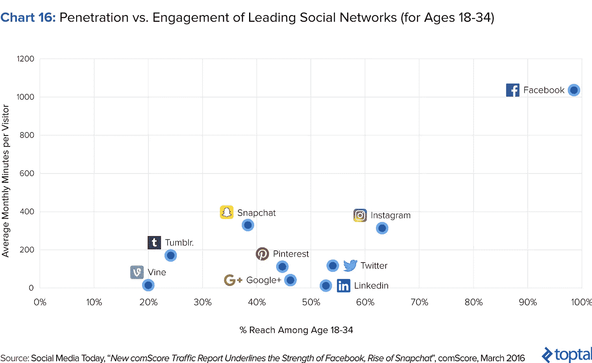

这对 Snap 来说是个好兆头。该公司继续迅速扩大其在 18-24 岁人群中的覆盖面，同时也扩大了其在老年群体中的渗透。根据 comScore 的数据，截至 2015 年 12 月，超过五分之三的 18-24 岁年轻人现在积极使用 Snapchat，年龄较大的群体也在增加(图 17)。

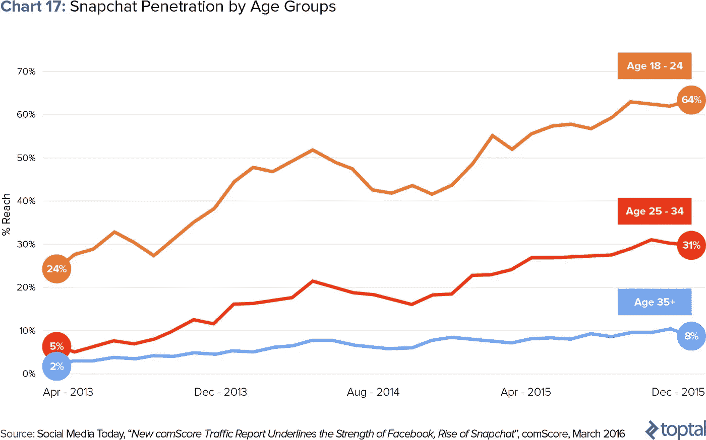

凭借在千禧一代、青少年和青少年人口中的主导地位，月度参与度方面的第二大平台，以及在这些关键人口中的进一步扩张，Snap 应该会获得很大一部分广告收入。这将支持 ARPU 在未来几年的快速扩张。

# 快照管理更注重盈利

抛开上述两点不谈，Snap 最令人鼓舞的一点是，管理层一直表现出更强的倾向性和将有趣的新产品功能转化为盈利途径的能力。简而言之: **Snap management 在货币化方面表现出色**。

结果证实了这一点。与脸书和 Twitter 相比，Snap 开始盈利的时间更早，尽管作为一家公司“年轻”了几年，但就 ARPU 而言，Snap 的增长速度超过了这两家竞争对手(图 18 和图 19)。

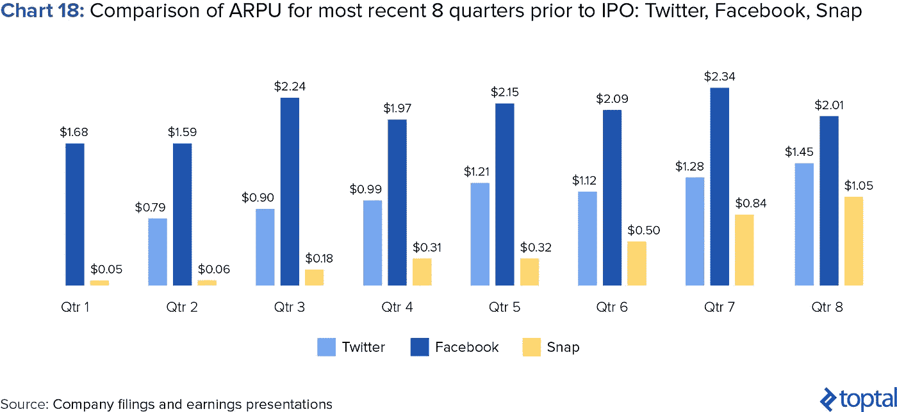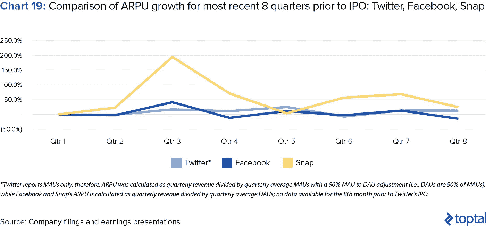

不可否认，声称 Snap 比其同类产品更擅长赚钱是一种主观且难以证明的断言。然而，如果你相信这一点，那么当你考虑 Snap 还有多少上升空间时，这就变得更加有趣了。为此，将 ARPU 的数据与脸书和推特的数据进行简单的对比表明，Snap 的 ARPU 可能会比现在上涨 7 倍(图 20)。

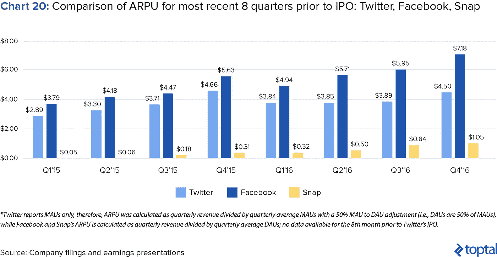

对我们来说，Snap 在 ARPU 令人印象深刻的历史表现是由它在产品和盈利方面的创新能力推动的，加上仍有巨大的上升空间，这表明未来几年 ARPU 将会强劲而迅速地迎头赶上。因此，在[收购](http://www.forbes.com/sites/jeffbercovici/2013/11/13/facebook-wouldve-bought-snapchat-for-3-billion-in-cash-heres-why/#133b3b6079ed) Snapchat 失败后，脸书现在回归到[复制其一贯的特色](http://fortune.com/2016/08/02/facebook-snapchat-2/)，对我们来说并不奇怪。

 [## 如果没有全职首席财务官，你的初创公司能存活多久？

### 雇用首席财务官是一个艰难的决定。本文向您展示了这样做的最佳时机。

www.toptal.com](https://www.toptal.com/finance/cfos/cfo) 

# 整个行业的增长将继续支持 Snap ARPU 的增长

除了 Snap 作为一家公司的内在优势之外，显而易见的是，整体潜在的行业优势将有助于在未来几年维持 ARPU 的增长(尽管这将在多大程度上仍然是一个问题)。

根据 IDC 的[报告，广告支出预计将从 2016 年的 6520 亿美元增长到 2020 年的 7670 亿美元，其中移动专用支出将增长 3 倍，从 2016 年的 660 亿美元增长到 2020 年的 1960 亿美元。特别是社交媒体营销，预计到 2019 年将每年增长 20%，达到 502 亿美元，](http://online.wsj.com/public/resources/documents/SnapS1-02022017.pdf)[到 2020 年将轻松超过](http://www.cnbc.com/2016/12/05/social-media-advertising-spend-set-to-overtake-newspapers-by-2020-research.html)报纸广告。

此外，[根据 KPCB](http://www.kpcb.com/internet-trends) 的说法，移动广告有 220 亿美元的市场机会，因为就消费时间%而言，它是唯一增长的渠道。这将继续鼓励营销人员从电视和印刷等传统渠道转向移动渠道(图 21)。鉴于 Snap 的整个广告库存都在移动设备上，移动广告总收入的不断增长肯定会让 Snap 受益。

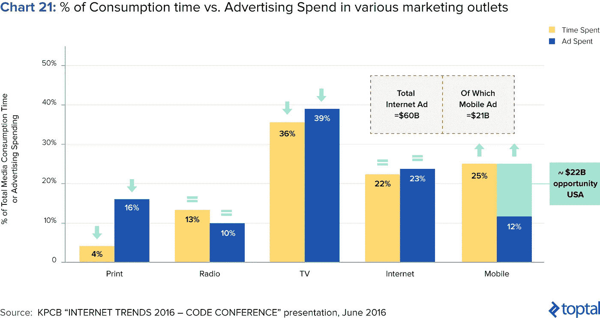

为了进一步增加收入，我们不能忽视 Snap 开发辅助产品的潜力。

随着 2016 年 9 月推出其首款硬件产品 Spectacles，Snap 已经表现出探索新产品类别的意愿。软件之外的新产品开发可能会为 Snap 提供一个与竞争对手不同的非常有趣的盈利模式(FB 正在探索 VR)，以及一种拥有更多用户思想份额的独特方式。

眼镜是一种可佩戴的眼镜，内置摄像头，可以无缝连接到智能手机，从“人类的角度”拍摄独特的照片。该公司将 Spectacles 视为 Snapchat 的扩展，并打算使用这种眼镜创建一种独特的圆形视频格式，而不是标准的矩形观看视角(再次重塑了标准的视频传输模式)。

Spectacles 确实为 Snap 创造了收入，但 2016 年的收入并不重要，因此没有在该公司的文件中报告。展望未来，眼镜可能会在 Snap 的收入中占据更大的份额。

目前还不清楚 Snap 计划向市场推出哪些其他类型的新产品，但 Snap 已经展示了创造创新和粘性产品的强大能力，这些产品可以推动用户增长和收入(图 22)。期待每一款新产品的推出都具有推动用户增长、提高用户参与度和增加思想份额的战略意义，所有这些都将为 Snap 创造更大的收入机会。

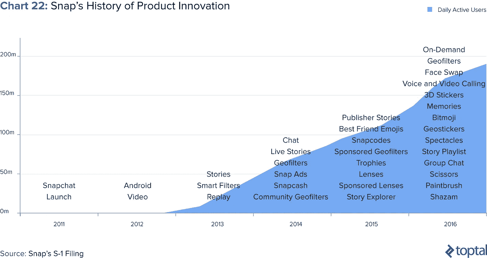

# ARPU 未来的增长:一台货币化机器

展望未来，鉴于上述所有情况，我们预计，尽管用户增长放缓，Snap 的平台应该能够支持未来非常强劲的 ARPU 增长。我们看到 Snap 的 ARPU 在未来 5 年赶上脸书，如果它进一步超越它，我们不会感到惊讶。换句话说，尽管用户增长像 Twitter 一样，Snap 可能会经历更像脸书的增长，如果不是更好的话。

这种情况的最大风险主要与脸书和其他竞争对手快速有效地复制 Snap 功能的能力有关。如果是这样的话，Snap 在产品创新方面的领导地位可能不会影响 ARPU 的显著增长。然而，如果竞争对手努力玩好“追赶游戏”，Snap 可能会看到 ARPU 的增长率与我们下面的预测一致。后者在本文中被有趣地描述为“姜饼策略”。

考虑到这一点，我们预计 ARPU 可能有两条增长轨迹。我们对不利情况的预测与其他评论更加一致，主要考虑的是后一种情况，即产品创新后被竞争对手有效赶上。相反，基本情况是基于管理层在产品上不断创新的能力，以及竞争对手在复制这些特征方面的相对低效。

这两种情况的数字显示在下表 3 中，但重点是，在我们的基本情况预测中，我们预计在未来五年内，50%的 CAGR 北部，ARPU 将在 2019/2020 年赶上脸书 2016 年的数字。

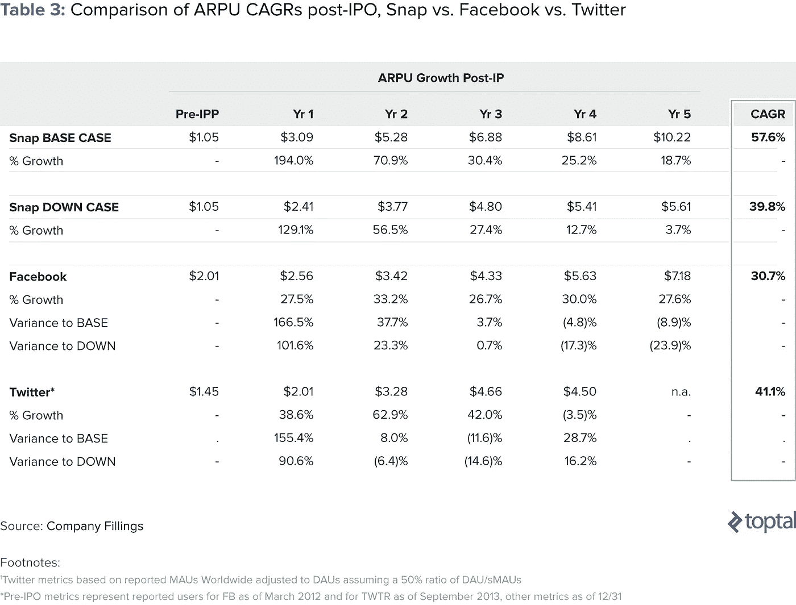

# 综上所述:Snap 值多少钱？

考虑到以上所有因素，我们现在可以开始计算我们对 Snap 的估计估值了。我们首先根据上面概述的 DAU 和 ARPU 假设，看看 Snap 未来的收入情况，然后使用这些收入估计值进行估值分析。

# 财务预测

我们的财务预测汇总在表 4 中，但我们想强调的主要数字如下:

*   DAU 的增长介于 Twitter 和脸书上市后的表现之间，到 2019 年达到 2.46 亿 dau
*   强劲的 ARPU 追赶和增长，到 2019 年达到每用户 6.88 美元，在基本情况下，几乎等于脸书目前 2016 年的 ARPU 数字
*   在下行情况下，ARPU 增长更加有限，到 2019 年将达到 4.80 美元，与 Twitter 目前的 ARPU 数据一致
*   在基本情况下，2017 年和 2018 年分别实现 16 亿美元和 38 亿美元的总收入
*   在下行情况下，2017 年和 2018 年的总收入分别为 13 亿美元和 27 亿美元

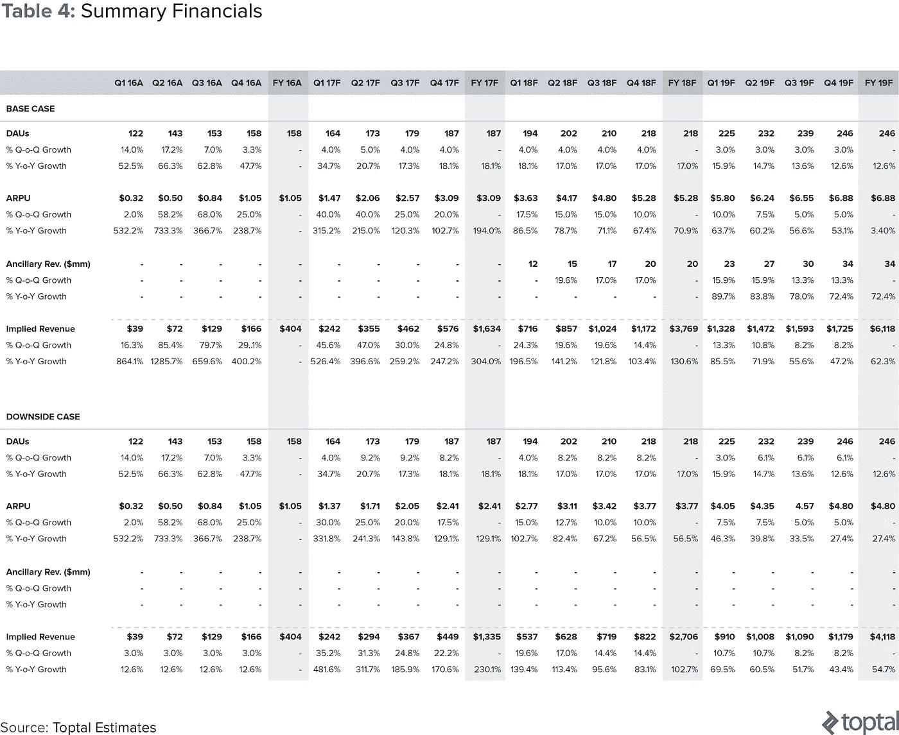

# 估价

我们在 EV /收入的基础上对 Snap 进行估值，使用 6.0 倍到 10.0 倍的目标倍数范围，该范围来自脸书和 Twitter 当前交易倍数范围的中点。一方面，Snap 在 DAU 的增长更为有限，因此其市盈率低于脸书，但另一方面，其在 ARPU 更为有利的前景也使得其市盈率高于 Twitter。我们将这些倍数用于预测 2018 年收入，以说明 Snap 是一家比两家公司都更年轻的公司。我们的估价总结在下表 5 中，但关键要点如下:

*   尽管 DAU 增长有限，但我们对 ARPU 的基本假设意味着，基于 2018 年预期收入的 8.0 倍，估值约为 300 亿美元
*   在我们看跌的情况下，我们对 2018 年的预期收入估计为 220 亿美元，符合但仍略高于最近的价格目标。
*   总体而言，我们认为 Snap 未来有很大的上行潜力，假设他们的公司更成熟，使用 Snap 2019 年的预期收入估计值进行估值是合理的，估值可能会升至近 500 亿美元，从而得出该股值得买入的结论。

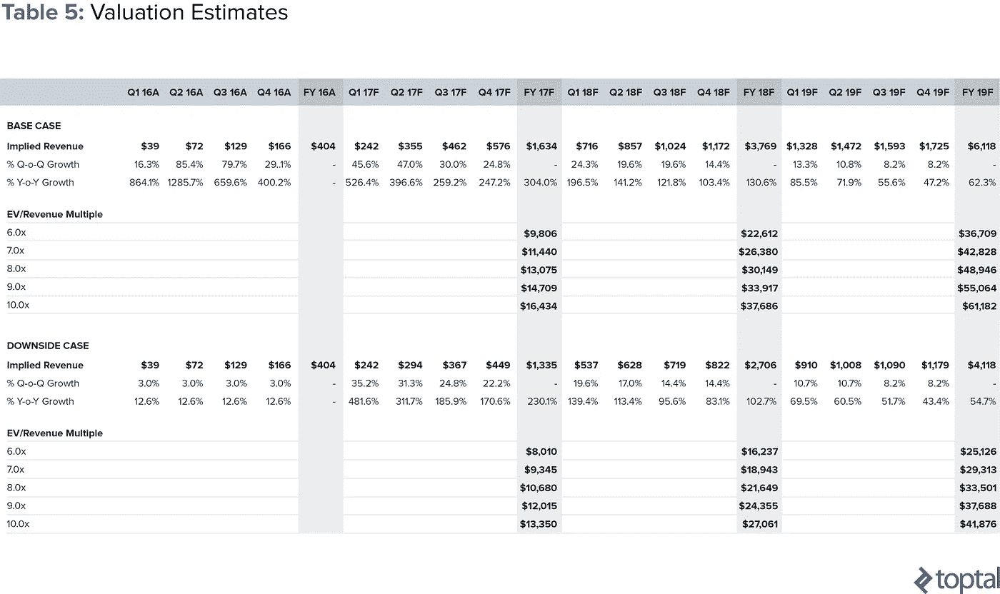

# 快照:Twitter 的增长，但脸书 ARPU

在许多方面，人们可以说，Snap IPO 预示着社交媒体平台从为用户增长而建设到为用户参与和货币化而建设的更普遍的转变。自成立以来，Snap 一直感觉更像是传统社交媒体应用和游戏应用的融合。该平台更有趣的性质反过来积极转化为货币化和 ARPU 增长，远远超过 Snap 在其生命周期的同等阶段的同行。无论是否是有目的的管理策略，Snap 似乎更适合货币化。

这当然是与广告支出从传统媒体渠道向在线/数字和特定移动渠道的不断转移同时发生的。从很多方面来看，广告客户似乎正在达到将大部分资金转移到社交媒体和“新媒体”渠道的临界点。

因此，我们非常看好 Snap 的未来财务前景，根据我们的上述分析，我们认为 Snap 值得买入。Snap 的价值在于它是第一个从一开始就考虑到广告客户的社交媒体平台。

*本文仅供参考，不构成投资建议。本文中的信息不应被解释为作者或 Toptal LLC 对任何公司或证券的任何当前或过去的认可、推荐或赞助。*

***原载于*******由*** [***估价专家 Joe Matta***](https://www.toptal.com/finance/resume/joe-matta)***。****