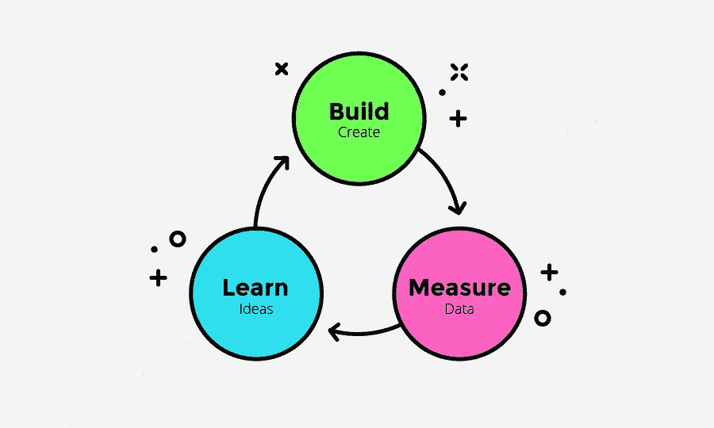

# 寻求产品与市场的契合

> 原文：<https://medium.com/swlh/the-quest-for-product-market-fit-6b0e81386cc1>

## PaintBerri 精益创业案例研究

在过去的两年半时间里，我一直在从事 PaintBerri.com 的工作，这是一个为艺术家们提供的在线社区，他们可以和其他艺术家一起绘制和创作视觉故事。本月，我和我的联合创始人在花了近一年时间全职专注于 PaintBerri 后，将回到各自领域的常规工作岗位。

以下是该团队如何通过[精益创业方法](http://theleanstartup.com/principles)做出几个重要的客户洞察和产品支点的概述:使用 MVP、经验证的学习和高效的反馈回路。**我希望这个案例研究能激励其他企业家走向精益**，其他人也有机会从 PaintBerri 团队面临的挑战中学习。

请注意，本案例研究**仅触及产品和业务的关键转折点**——在整个故事中，我们一直在对实验性功能、营销活动等进行测试。

Katherine on the left, Me on the right

# 从副业到全职项目

**PaintBerri 在 2014 年年中开始作为一个兼职项目**，由软件工程师 Katherine Tung 领导，她希望为数字艺术家创建一个优秀的基于网络的绘画程序，并提高她的工程技能。

该网站的灵感来自于围绕着名为[**Oekaki boards**](https://en.wikipedia.org/wiki/Oekaki)的基于网络的绘画程序而形成的社区，这种程序在 2000 年代末的网上艺术界很流行。

Oekaki sites featured a simple web-based paint program, a gallery of user-created drawings, and a focus on the anime/manga aesthetic

在早期，当我周末有时间的时候，我会做一些模型和平面设计。

一旦绘画程序的基本版本开始运行，该团队邀请艺术家朋友在封闭的测试版中进行测试，并帮助找到错误。

封闭的测试版获得了巨大的成功，许多人在网上吵着要更多的访问代码来与他们的朋友分享。凯瑟琳辞去了在 Expedia 的全职工作，投身于将 PaintBerri 建设成一个内置绘画程序的成熟在线社区。2015 年末，[公测正式宣布](http://paintberri.tumblr.com/post/133042980067/paintberri-now-in-open-beta)，闸门打开。

随后，6000 多名艺术家蜂拥而至，随之而来的混乱局面，以及我自己的加入，为精益原则的实施奠定了基础。从某种意义上来说，我们已经在进行精益运营了，通过启动业务并以最少的支出来运营，但是我们很快认识到，进行精益 *越早越好。*

Buried under a pile of bugs, support tickets, emails, well-intentioned suggestions, and flames

在与旧金山 Udemy 的朋友们含泪告别后，我回到了华盛顿贝尔维尤的家中，开始着手研究如何运营一家初创公司。我如饥似渴地阅读大量书籍，其中几本是我在另一篇帖子[中推荐的，这些书我希望我能早点读完](/@francestung/books-i-should-have-read-a-lot-sooner-as-an-entrepreneur-designer-and-human-69069ce95ddd#.uedzqrpys)。

**这为精益周期的第一阶段做好了准备:构建**。我们已经围绕一个绘画项目建立了一个在线社区。网站上发布的所有艺术和评论都是用这个绘画程序创作的，我们刚刚开始迭代这个产品。

# 第一个版本

[Art by Yawns](https://paintberri.com/posts/new-oc-by-yawns-Hk0ZoAIIRV)

用户可以创建一个个人资料，在线画画，发布他们的画，并用迷你图评论帖子。评论链通常会变成即兴的故事，叫做“角色扮演”[，比如这个](https://paintberri.com/posts/Carina-Prismont-City-App-by-Land-rJ8ANAyS):

我们还有一张在 PaintBerri 上的**的很好的照片——大部分是年轻的女性业余数字艺术家**,他们喜欢动漫、漫画、电影、漫画、视频游戏和书呆子文化。

# 走进兔子洞

Just a few of the more… vibrant publicly posted complaints

我们每天都在注册许多新用户，但是我们也收到了许多关于绘画程序的投诉和错误报告。很自然地，几乎每个人都把他们的需求或错误作为体验的关键，这是压倒性的。我们添加了大量功能来直接解决这些问题，但感觉无论我们做什么，人们都不会开心，这令人沮丧。

Jumping into the feature rabbit hole

很快，我们知道这不是一种可持续的产品决策方式。**同样令人担忧的是，所有的漏洞修复和更新都没有对用户参与度产生任何明显的影响。**

# 挑战核心假设

在发布了几十个 bug 修复、特性和对绘画程序的增强后，没有对铺天盖地的抱怨和 bug 产生任何影响，**我们暂停了开发**。

如果艺术家来到 PaintBerri 并停留的原因不是为了能够使用免费的基于网络的绘画程序，那会怎样？深不可测！

# 设置研究

为了找到答案，我设计并实施了一项研究，以了解人们喜欢和不喜欢 PaintBerri 体验的原因。我读了辛迪·阿尔瓦雷斯的优秀著作《精益客户开发》,并受书中建议的启发设计了一个互动调查。

Giant buttons and easy to read prompts made this survey very easy to complete

# **深入挖掘寻找动机**

这项调查向已登录的 PaintBerri 用户展示了几天，我们收集了**超过 1300 份回复，这些数据足以看出清晰的趋势**。谢天谢地，大多数人在网站上玩得很开心！

对“你最喜欢/最不喜欢 PaintBerri 的什么”的回答的细分是它变得有趣的地方。**角色扮演和艺术分享是该网站最积极的特色，绘画项目是最消极的特色。**

为了从定性的角度分析这些数据，我采访了 10 位 PaintBerri 最有价值的用户，他们是通过一系列调查筛选出来的，然后被精心挑选出来的。这些艺术家非常活跃，对网站充满热情，并不断产生有价值的内容——拥有大量追随者、喜爱者和评论的艺术帖子。**我们想吸引更多这样的人，所以首先我们想了解他们为什么会出现在我们的网站上。**

从这些采访中，**我们了解到让这些艺术家迷上 PaintBerri** 的 3 个因素:一个紧密团结的社区，更开放地与其他艺术家互动(相对于 DeviantArt 和 Tumblr 的庞大和非个人化的社区)，网站上其他艺术家的积极反馈和鼓励，以及一个以评论线程(角色扮演)形式支持视觉故事的地方。

Everybody loves to be appreciated!

# 决定下一步行动

从调查结果和采访中可以明显看出，与其他艺术家交流和通过角色扮演创造视觉故事是我们用户的首要任务。

Pivot! Make a sharp turn before its too late!

**这标志着我们对 PaintBerri 产品**的态度发生了重大转变，因为它被认为主要是一种基于网络的绘画体验，而社区是次要方面。现在，我们彻底改变了这种方式，我们有很多工作要做。

# 做支点

几个主要的变化标志着“彩弹”的转向，我专注于将艺术家聚集在一起创作视觉故事。我们暂停了绘画程序的开发，允许艺术家上传在其他程序中创作的作品，并开始推出社交功能的 MVP，如迷你论坛。这些变化是在给社区的一封信中宣布的，这封信很受欢迎。

Warm fuzzies

# 熄灭一团火，转身面对另一团火

很快，我们注意到投诉数量**下降**，许多与绘画程序有兼容性问题的艺术家对艺术上传选项特别满意。

但是，长期以来，我们忽略了经营可持续企业的其他一些方面。

# 聚焦货币化

**用户满意度没有很好地转化为利润**。我们依靠广告来获得收入，但是尽管用户增加了，它不会是一个长期的资金来源。我们在网站上旋转广告时也遇到了困难，因为 PaintBerri 是一个内置在 AngularJS 中的单页应用程序，所以效果不是很好。

More ads = more impressions = more clicks = more pennies! Unless of course somebody is using ad blockers.

我们过去曾成功运作过小规模的筹款活动，所以我们决定启动一个更大的筹款活动，用它来测试**我们的市场如何从免费用户转变为付费用户。**

The Conversion Funnel. People go in, money comes out. Thank you Ibrahim for suggesting I actually draw it out :P

# 测试我们的用户是否会转化为客户

我们设计并建立了一个捐赠活动，以额外的角色扮演功能作为激励。**所有的额外功能都是最好的**，比如出现在用户名后面的一个小标记和每个评论更多的字符。最昂贵的捐赠层“钻石心”将为你提供 99 美元的所有额外功能，外加一个独家新功能——可变高度评论画布。我们把它作为一个价格锚放在那里，没有想到会有人真的买它。

Some of the bonus goodies and marketing materials

# 成功，和一个不太明显的失败

令人惊讶的是，在不到两周的时间里，我们完成了最初筹款目标的 250%。几十个人买了钻石心，我们以为没人会碰它。我们惊呆了。

$$$

但是我们的成功有一个致命的缺陷。通过研究数据，我们已经成功转化了很高比例的少数用户群——封闭测试期的早期采用者。占 PaintBerri 用户绝大多数的新用户几乎没有转化。

Donor breakdown (FYI PaintBerri was always in Beta, so this captures 100% of users)

在 PaintBerri 作为一个在线绘画网站的早期，我们知道它是为了迎合一个极端小众的观众。**许多早期用户都是出于怀旧的原因来到这个网站**，看到他们过去最喜欢的在线体验之一复活并现代化，他们激动不已。

通过发展成为一个社交艺术角色扮演网站，PaintBerri 正在疏远这些早期采用者中的许多人，他们通过限制所有艺术家发布内置绘画程序的作品，重视提高自己的绘画能力。**不幸的是，这些人也更愿意购买这样的产品**。

此外，**在其他小众艺术和角色扮演网站上，我们找不到任何成功的商业案例。即使是相对知名的学校也是由志愿者经营，并通过捐款支持。唯一的例外是以 NSFW/露骨内容为特色的艺术网站，我们不想去那里(原因很明显)。**

# **知道何时停止**

由于捐赠活动的失败和缺乏其他成功的(非显性的)利基艺术和角色扮演网站，我们不得不得出一个艰难的结论:货币化将是一个难以置信的挑战。精益理念的一部分是尽可能高效地运行，这意味着将 PaintBerri 置于停滞状态以节省资源，这些资源可以在以后用于投资回报率更高的产品。

2016 年 7 月，我们在[的 PaintBerri 博客](http://blog.paintberri.com/2016/08/01/letter-to-the-paintberri-community/)上发布了一封信，宣布了我们的决定。

# 颜料莓的潜在未来

尽管 PaintBerri 处于停滞期，**但这并不是整个产品的终结**。我们了解到，在我们最初寻求满足无止境的特性请求列表时，我们已经创建了一个非常强大的基于浏览器的绘画程序。大多数基于浏览器的绘画应用程序使用 Flash 或 Java，而 PaintBerri 是使用 WebGL 构建的。凯瑟琳在数字艺术技术博客 SurfaceProArtist 的采访中谈论了更多关于这项技术的内容。

这项技术还有许多其他可能的应用，以及找到更好的产品市场契合度的机会。**如果我们能更早地运行精益，我们就能更快地审查这些应用程序**，而不必投入如此多的时间、精力和金钱。

# 回顾过去，展望未来

PaintBerri 本身仍然是一个令人难以置信的成功，它远远超出了我对它的预期。最初是一个有趣的周末项目，后来变成了一个月浏览量超过 100 万的网站，吸引了数字艺术界的新星，并帮助世界各地的年轻艺术家建立持久的友谊。而且**我们在做这一切的同时，保持了对公司的 100%所有权，并保持了我们的个人储蓄完好无损。**

迄今为止，已有超过 23，000 名艺术家在该网站上创建了账户，总共**发布了超过 100，000 条帖子**。这些艺术家中的许多人都是令人难以置信的超级巨星，看看他们在这里的惊人作品:[哈欠](https://paintberri.com/artist/yawns)、[泽菲](https://paintberri.com/artist/zephy)、[打手](https://paintberri.com/artist/goons)、[阿扎雷尔](https://paintberri.com/artist/azareal)、[糖](https://paintberri.com/artist/sugar)和[贝拉克瓦](https://paintberri.com/artist/belacqua)。

我非常感谢有机会成为一名企业家。辞去高薪工作并不容易，我知道很多人没有这样的选择。通过这次经历，作为一名设计师和一个人，我成长了很多。我见识了产品管理、营销和商业的迷人内部运作，我很高兴能把这些知识带到我的下一个设计角色中(最终，我的下一次创业冒险)。

非常感谢 PaintBerri 的敬业导师和顾问们:[丹尼斯·吴](https://medium.com/u/f54c95b7fd07?source=post_page-----6b0e81386cc1--------------------------------)，兰迪·钟，威廉·于，[瑞安·瓦里安尼](https://medium.com/u/a05009ac0818?source=post_page-----6b0e81386cc1--------------------------------)，和[塞丽娜·吴](https://medium.com/u/1235f7689569?source=post_page-----6b0e81386cc1--------------------------------)。

非常感谢 Pablo Stanley、Robbin Arcega、Scott Rabin、Ibrahim Damlaj、Rachel Lee、我的父母以及所有出色的 PaintBerri 艺术家们的支持。

如果你想多聊聊我的经历，请告诉我:)

如果你喜欢这篇文章，请推荐让更多的人发现它，谢谢！