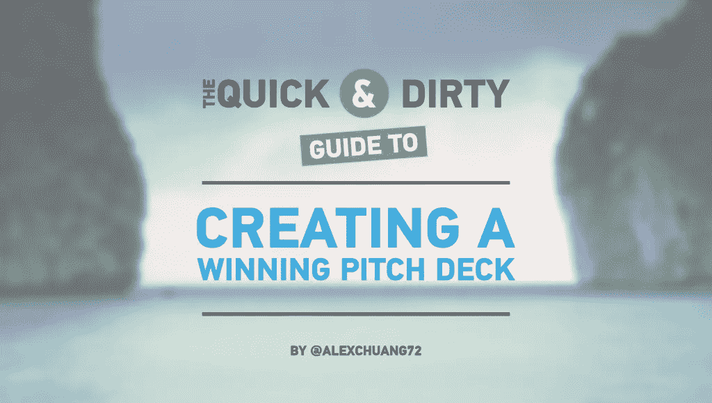

# 创建成功推介资料的快速指南

> 原文：<https://medium.com/swlh/the-quick-and-dirty-guide-to-creating-a-winning-pitch-deck-b4f88e106f5b>

起初，创建一个演示平台可能会令人望而生畏，尤其是如果你以前从未做过的话。你可能在谷歌上搜索过“如何搭建一个平台”，或者看过 2010 年的例子。你可能试图根据你在网上学到的东西拼凑一些东西，然后意识到你的故事是支离破碎的。