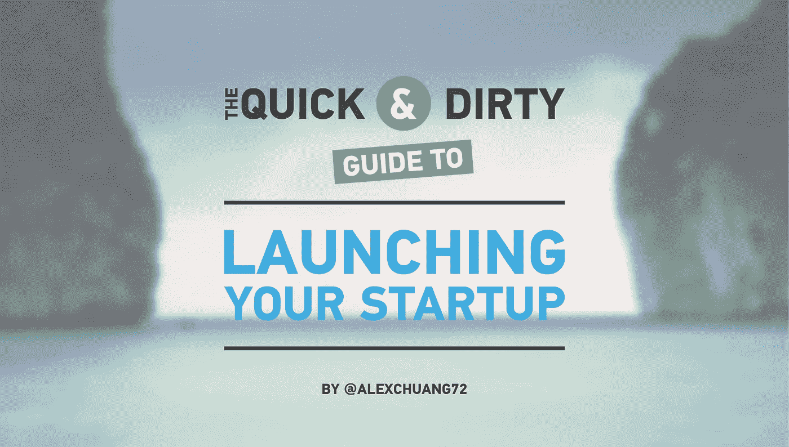
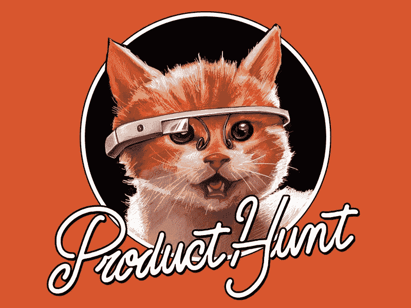
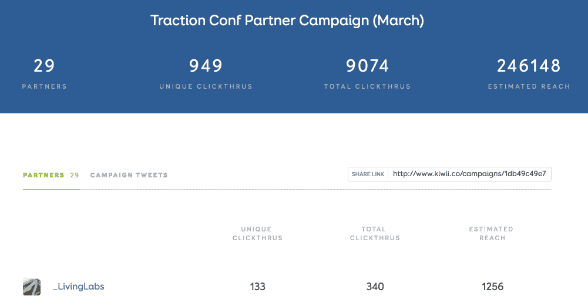

# 2016 年创业快速指南

> 原文：<https://medium.com/swlh/the-quick-and-dirty-guide-to-launching-your-startup-in-2015-7213650e5d8d>

## 如何用有限的时间和金钱即时获得早期用户

*更新:* [*4 年 1000 个创业者之后，下面是我们所知道的如何打造一家创业公司*](http://emailcourse.launchacademy.ca) *。注册我们的免费电子邮件课程！*

*更新 2:如果你刚刚开始测试你的创业想法，读读这篇“* [*验证你的创业想法的快速而肮脏的指南*](/@alexchuang72/the-quick-and-dirty-guide-to-validating-your-startup-idea-c6be6cd91f51#.19w3usjnn) *”。*

在 [Launch Academy](http://www.launchacademy.ca) ，我们已经帮助 350 多家初创公司加速成长。我得到的最大问题之一是“我如何快速获得早期用户？”。有很多博客谈论付费广告、社交媒体、线下分销、内容营销、SEO、SEM、电子邮件营销等等。但是我会把重点放在你可以在一个周末的时间里，用不到 500 美元的投资，获得你的第一个 1000 个用户的可操作的项目上。获得稳固的第一批用户将有助于引导你的产品面向问题/解决方案。

在执行以下策略之前，您需要具备:

*   解决问题的引人注目的产品
*   将会帮助你的朋友和同事的现有网络(大约 50 人)
*   好色之徒的态度和开放的反馈态度

# 策略 1:利用分配消防水龙带

分销消防水龙带是一个平台，你可以在这里提交你的产品，它将暴露给成千上万渴望尝试新产品的早期用户。最著名的是[产品猎](http://www.producthunt.com/)，助推了很多产品发布。例如，Layers 在产品搜索中排名第一，获得了 43000 次独立访问。

以下是如何在产品搜索上启动你的创业公司:

1.  **找一个产品搜索者来发布你的产品**。产品猎人是企业家、投资者、记者和博客作者。使用[搜索列表](http://hunterlist.co/)找到一个与你有共同兴趣和愿景的产品搜索者。通过征求反馈或提供独家交易来建立关系。如果你的产品能解决他们的问题，他们会很乐意为你发布。
2.  **请他们在太平洋标准时间周二早上 5:00 发布您的产品**。[为什么？这里看 Kartik 的分析](/@kar2905/analyzing-product-hunt-data-b225acfeab61)。
3.  **向 PH 社区提供独家交易**。填写这张表格:[https://rrhoover.typeform.com/to/ysDOD2](https://rrhoover.typeform.com/to/ysDOD2)并申请一颗金星。
4.  **不要求 upvotes。**投票环检测算法是不宽容的。但是，您可以在论坛/群组中发布您的产品搜索 url，并寻求反馈。如果人们喜欢你的产品，他们会投赞成票。这个过程必须真实可信。
5.  做一个 AMA(问我任何事情)。一旦你的产品发布上线，尽可能及时地回答社区的所有问题。
6.  **继续**[**maker hunt**](https://www.makerhunt.co/)的对话。这是一个面向所有 PH 创客的松散渠道。在这里做一个 AMA 来吸引 PH 创客社区。

其他流行的消防水管:

*   测试列表 - 25，000 多名早期用户，发布费用 129 美元
*   Erlibird - 40，000+ beta 测试者，149 美元发布
*   [黑仔初创公司](http://killerstartups.com/)——5000 名潜在用户，发帖费用 169 美元

在这里获得完整的名单:[http://promotehour.com/](http://promotehour.com/)

> *请注意，当您的产品处于测试阶段时，您应该使用 Betalist。一旦你有了一些市场验证和问题/解决方案，你应该考虑在产品搜索上推出你的产品。

哦，你还应该在 [Quora](https://www.quora.com/) 上回答相关问题，并把你关于创业的博客文章做成 pdf 格式，发布在 [Slideshare](http://slideshare.net/) 上。

# 战术 2::在黑客新闻/Reddit 上发布

Y-combinator 的黑客新闻每天获得超过 200 万的浏览量和 20 万的独立访客。通过登上首页，你的网站有可能获得超过 10，000 的独立访客，就像著名的[和](/design-philosophies/an-overnight-success-660739c2a7e9)一样。

以下是如何在黑客新闻上启动你的创业公司:

1.  **在你的帖子标题前面使用******显示 HN。确保你的产品已经做好，人们可以真正地玩它。例如，“展示 HN:在完全交互式的 3D 体验中探索星球大战星系”****
2.  ****有一个朗朗上口的标题。**点击[此处](http://www.quora.com/What-are-the-best-Show-HN-titles-ever-on-Hacker-News)查看一些“展示 HN”标题的好例子。**
3.  ****美国东部时间周三上午 8:00 提交帖子。星期三是 HN 的交通高峰。****
4.  **让你的朋友投票支持你的帖子。Upvote 仅限于每个 IP 地址一个 upvote，直接 URL 将不起作用。你的朋友需要在新版块(http://news.ycombinator.com/newest**)**中搜索你的帖子，并投票支持它。如果你上了头版，让他们在头版搜索([http://news.ycombinator.com/](http://news.ycombinator.com/))。**

**Reddit/R/Startups 的工作方式类似于黑客新闻。同样的规则也适用。**

# **策略 3:黑掉你自己的公关**

****

****用 Mechanical Turk + Google News API 黑自己的 PR****

**客户开发实验室的聪明人创造了一个新闻黑客，你可以很容易地获得所有最有可能报道你的创业公司的记者的电子邮件。点击查看完整指南[。](http://customerdevlabs.com/2013/09/24/google-news-api-mturk-press/)**

1.  **去 http://press.customerdevlabs.com/**
2.  **搜索一个与你的创业类别相关的术语(例如 SaaS、社交媒体、全息图、kickstarter 等)并下载 CSV。**
3.  **上传 CSV 到机械土耳其人。**
4.  **在[上给你的员工下达指令，告诉他们如何找到任何人的电子邮件地址](https://www.distilled.net/blog/miscellaneous/find-almost-anybodys-email-address/)。**
5.  **制作一个新闻资料袋。[在这里下载我的例子](https://www.dropbox.com/s/mk520mxe2wh8pqo/Press%20Kit%20Sample.zip?dl=0)。**
6.  **分别给记者发邮件，推销你的创业公司。[点击此处查看推介电子邮件示例。](https://docs.google.com/document/d/1MEIzcW5Kzp2VGhpnwakKbgdZMKgNAiAuZjbMGLa-odo/edit?usp=sharing)**

**乔瓦尼策划的其他公关事件:[http://www.producthunt.com/@casinellig/collections/pr-hacks](http://www.producthunt.com/@casinellig/collections/pr-hacks)**

# **策略 4:建立一个发布前的电子邮件列表**

****登陆页面****

**拥有一个收集电子邮件地址的登录页面是非常基本的。你可以使用 [Instapage](https://instapage.com/) 、 [LaunchRock](https://www.launchrock.com/) 、 [SquareSpace](http://www.squarespace.com/) 或 [Unbounce](http://unbounce.com/) 来构建你的登陆页面。然后你可以安装一个 [HelloBar](https://www.hellobar.com) 来收集电子邮件地址。**

****推特****

1.  **使用[FollowerWonk.com](https://followerwonk.com)下载多达 50，000 名关注你的竞争对手或相关产品的追随者。**
2.  **将文件上传到[MakesMail.com](https://www.makesmail.com/)，它会自动给你那些关注者的所有潜在邮件。**
3.  **发起你的电子邮件活动，描述为什么你的产品优于竞争对手的产品。**

**领英**

1.  **搜索您希望锁定的专业人士类型(例如社区经理)。**
2.  **从 Odesk 或 Mechanical Turk 雇佣一些人，手动发出个性化邀请，与你的目标客户建立联系，邀请他们试用你的产品。他们很可能会接受你的邀请。**
3.  **导出您的联系人的电子邮件地址。**

# **策略 5:用 Kiwii 扩大你的发布**

**Kiwii 是在你的人际网络中的每个人的帮助下分享你的发布公告的最简单的方法。你的信息将会在你希望的特定时间通过 Twitter 发布和分享，这将会带来巨大的影响力。在启动你的创业之前，让你网络中的每个人都承诺分享你的信息。[阅读 Kiwii 如何帮助牵引大会将社交流量提升 15 倍。](/@getkiwii/case-study-how-traction-conference-used-kiwii-to-increase-its-social-traffic-by-15x-d0a6d1bed0c5#.9z2wgfi5p)**

****

# **策略 6:与有影响力的人和博客作者建立关系**

1.  **列出最有可能用 [BuzzSumo](http://buzzsumo.com/) 或 [Traackr](http://traackr.com/) 宣传你的产品的影响者/博主。**
2.  **通过回复/收藏/回复社交媒体上有影响力的人/博主的内容来吸引他们。首先提供价值(想想[互惠原则](https://en.wikipedia.org/wiki/Reciprocity_(social_psychology)))。**
3.  **时机和相关性就是一切。如果他们写了一些与你的产品或行业相关的东西，伸出手开始对话。**
4.  **向他们发出独家邀请或提议试用您的产品(例如终身专业会员、第一年免费订阅等)。**
5.  **如果他们喜欢，请他们写下来。通过提供 5 到 10 个要点来解释人们为什么使用它，让他们的生活更轻松。**
6.  **主动为他们写博客，进一步减少摩擦。**
7.  **继续建立关系和参与度。**

**点击查看[影响力营销推荐指南。](http://traackr.com/influencer-marketing-guide/)**

# **智慧的遗言**

**伟大的产品是用户喜爱的产品。就像一件好的艺术品，永远也不会完成。通过执行这些早期的发行版技巧，您将能够获得您的第一批用户。然后你将能够观察他们的行为，听取他们的反馈，这样你就可以迭代和改进你的产品。我认为创业就是进行一系列小实验。在你进入下一阶段之前，你必须得到最初的市场信号和确认。一旦您拥有了所需的资源和洞察力，您将有信心执行更具可扩展性的渠道。**

**感谢@symana、@jeromezng、@susieycsu、@raywalia、@ lloyedlobo、@jamesclift、@maggable 和@anothersamchan 阅读本文的草稿。**

**附注:我将于 10 月 7 日至 8 日参加在三藩市举行的[牵引大会](http://www.tractionconf.io/)，会见一些业内最优秀的成长型黑客。希望在那里见到你！**

***更新:* [*4 年 1000 个创业者之后，下面是我们所知道的如何打造一家创业公司*](http://emailcourse.launchacademy.ca) *。注册我们的免费电子邮件课程！***

***//关于作者:***

**亚历克斯·庄是温哥华领先的科技孵化器 Launch Academy 的联合创始人兼首席战略官。亚历克斯是一个连续的企业家，UX 设计师和增长黑客。**

****你可能也会喜欢:****

**验证你的创业想法的快速而肮脏的指南**

**千禧一代的幸福指南**

**[失落的管理艺术](/@alexchuang72/the-lost-art-of-management-42356e258181#.jt4i3fmdc)**

**[创意领袖的基石](/leaders-of-the-future/the-building-blocks-of-creative-leaders-b135df5b0464#.dvn1fh3mi)**

**[如何设计自己的工作保障](/life-tips/how-to-engineer-your-own-job-security-b5cb32303628#.hidbyqlxw)**

****

***发表于* **创业、旅游癖和生活黑客****

************

**-**