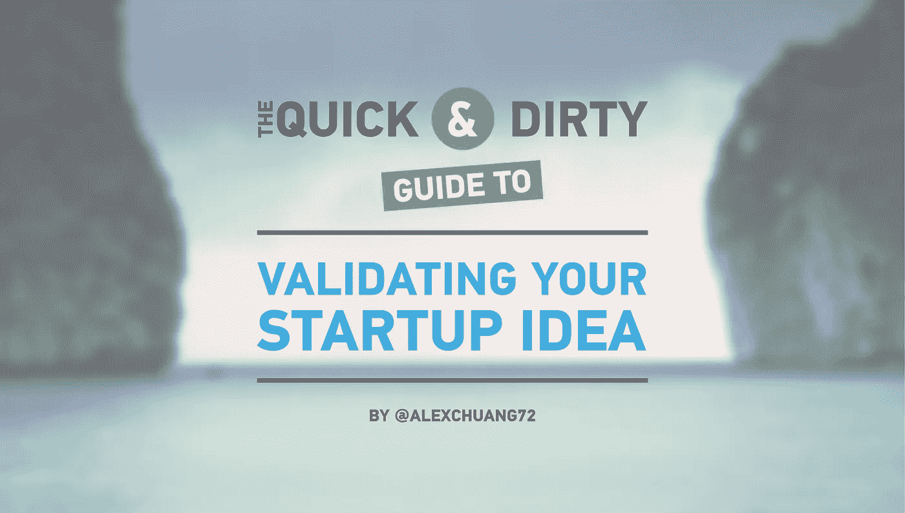

# 验证你的创业想法的快速而肮脏的指南

> 原文：<https://medium.com/swlh/the-quick-and-dirty-guide-to-validating-your-startup-idea-c6be6cd91f51>

## 如何设计和实施有意义的精益启动实验

大家好，我是亚历克斯。在 [Launch Academy](http://www.launchacademy.ca/) ，我很幸运，身边有这么多有才华的早期创业者。四年来，我指导了 1000 多名企业家，建立了六家初创公司，巩固了我的知识，并开发了一个框架…