# 全自动汽车的竞赛

> 原文：<https://medium.com/swlh/the-race-to-fully-autonomous-cars-8212ff73aad>

## 这里有一个关于自动驾驶汽车的自治和移动空间的概述，即它意味着什么，谁领先，技术是什么，它如何工作，成本多少，普及的主要障碍是什么，技术目前的表现如何，等等。这仅涵盖到 2017 年 12 月 1 日—有关最新发展的注释在末尾。

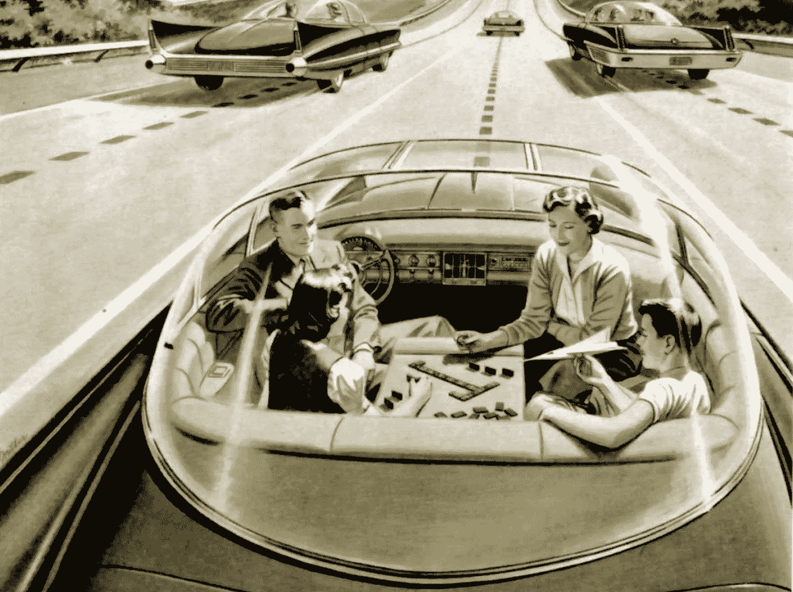

photo courtesy of RAND Corporation

什么是自主性和移动性？*对于本帖，我们将重点讨论自动驾驶汽车。* 当有人提到自主和移动时，他们最有可能指的是自动驾驶汽车——想想 Waymo 或 Cruise Automation——但远不止这些。NHTSA [称](https://www.nhtsa.gov/sites/nhtsa.dot.gov/files/documents/13069a-ads2.0_090617_v9a_tag.pdf)这项技术，“……充满了希望……”并将其定义为，“……未来，车辆将越来越多地帮助司机避免撞车。这是一个通勤时间大幅减少的未来，数百万人——包括老年人和残疾人——将获得自由的开放道路。尤其重要的是，这是一个高速公路伤亡事故大幅减少的未来。”你可以把它想象成一条从 A 点到 B 点的更简单的道路，这条道路还没有被科技改造过。例如，你坐进车里，告诉它去哪里，一边看电影或看书一边享受旅程。下图是更广泛的自治和移动社区用来衡量 NHTSA 定义的不同自治级别的图表。

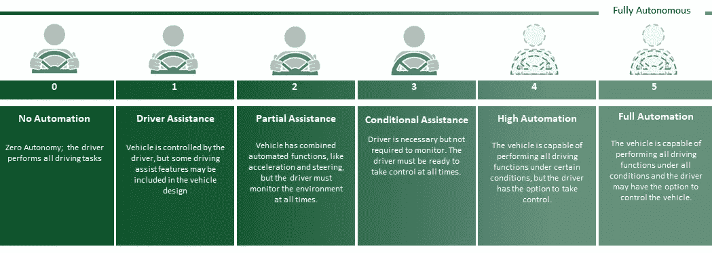

[**NHTSA**](https://www.nhtsa.gov/technology-innovation/automated-vehicles-safety)**:** Automated Vehicles for Safety

为什么它很重要？*安全。简单。环境影响。* 转向自动驾驶汽车有许多商业原因——交通更少、通勤更快、休闲时间增加等。—但许多行业领导者追求这项技术的主要原因是为了提供更安全的道路。在美国，每年有超过 3 万人死于交通事故，但自动驾驶汽车可以大幅减少事故数量，帮助挽救成千上万人的生命。事实上，如果美国道路上 90%的汽车都是自动驾驶的，事故数量将从每年 600 万降至 130 万。根据 Eno 交通中心的一项研究，死亡人数将从 33000 下降到 11300。这些数字是基于这样一种信念，即如果人为失误造成的事故发生的机会减少，交通拥堵就会减少。人们还预计，自动驾驶出租车的兴起将有助于减少道路上的汽车总数，缓解整体交通状况，由于无人驾驶汽车旨在优化加速和制动效率，它们也将有助于提高燃油效率和减少碳排放。据[麦肯锡](https://www.mckinsey.com/business-functions/digital-mckinsey/our-insights/disruptive-technologies)称，采用自动驾驶汽车每年可以减少汽车产生的 3 亿吨二氧化碳排放量。

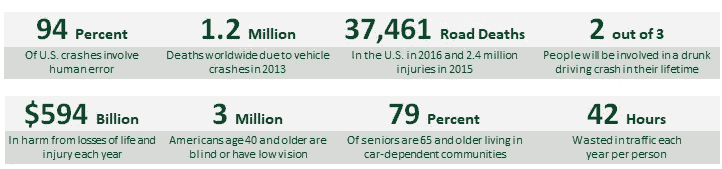

Source: Waymo Safety [Report](https://waymo.com/safetyreport) & NHTSA

谁在谈论它？*国家。跨国公司。思想领袖。* 阿联酋等主要国家，即迪拜未来基金会联合迪拜道路与运输管理局推出了' [*迪拜自主交通战略* '](http://www.dubaifuture.gov.ae/our-initiatives/dubais-autonomous-transportation-strategy/) 。该战略旨在到 2030 年将迪拜总交通的 25%转变为自主模式，涉及 500 万次日常出行，每年节省 60 亿美元的经济成本。迪拜最近订购了 50 辆特斯拉 Model S 和 Model X SUVs，在上述战略之前将它们变成完全自动驾驶的汽车。计划是再订购 150 台。谷歌的子公司 Sidewalk Labs 正在与多伦多东南区合作，利用数据驱动的方法，将一块 12 英亩的土地改造成一个未来的城市发展项目，以创建一个以人为本的智能城市，一个与自动驾驶汽车通信的城市。如果一切按计划进行，谷歌将在附近 800 英亩的土地上做同样的事情。谷歌将把他们的多伦多办公室搬迁到 12 英亩的地块，以更好地测量环境(即收集数据，自我沉浸等)。).根据波士顿咨询集团最近的一项研究，到 2030 年，美国 25%的行驶里程将由自动驾驶汽车覆盖。波士顿咨询公司的研究预测，自动驾驶、电力和共乘的结合将证明比其中任何一个因素本身都更具经济效益。波士顿咨询公司预计，向自动电动汽车的转变将在 21 世纪 20 年代初开始，人口超过 100 万的城市采用率最高。大城市拥有保持车队高利用率所必需的人口，理论上也将从预计的拥堵、停车问题和污染的减少中受益最多。

**自动驾驶汽车是如何工作的？*人工智能和传感器的混合体。*** 行业领导者——如 Waymo 和 Cruise Automation——用来教授他们当前系统的最突出的方法是像人类一样思考。这意味着汽车必须实时识别环境，并了解环境将如何行动，以便做出相应的反应。例如，如果汽车注意到一名行人正在过马路，它会精确到毫米地监控该行人的位置，并预测他们的下一步行动，以避免任何碰撞。最终，自动驾驶汽车需要比人类更好才能占上风。下面是一些现代技术，它们对实现这一过程至关重要。

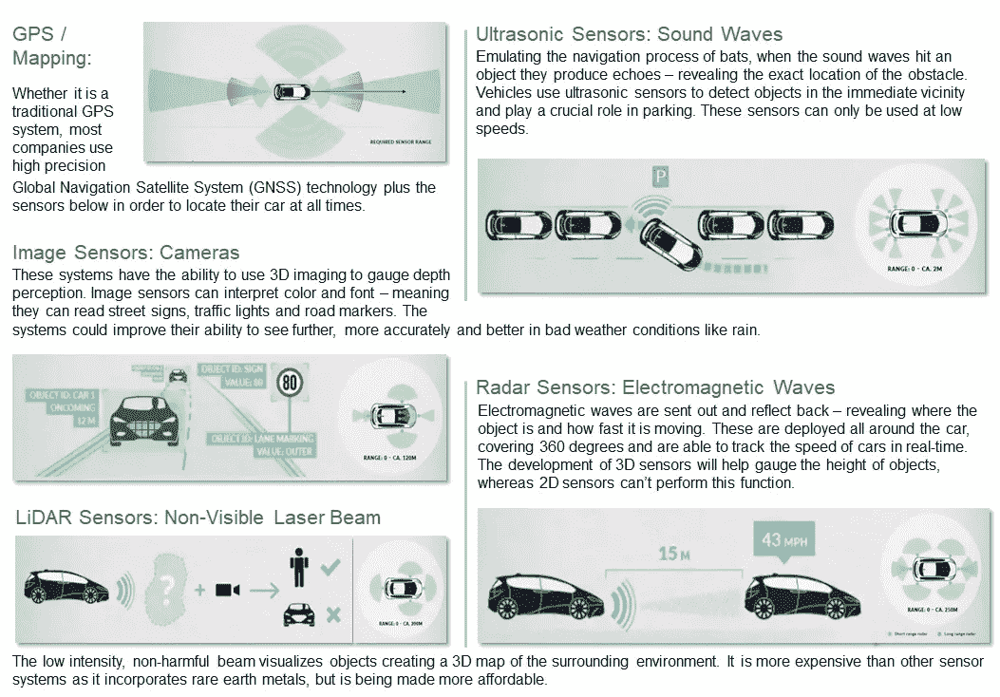

它是如何协同工作的？*人工智能。* 上面提到的传感器和系统将实时数据输入中央人工智能软件系统，然后该系统观察汽车周围的物体，预测它们的行为并做出相应的计划——就像人类会做的那样。谷歌的子公司和自动驾驶汽车领域的领导者 Waymo 从三个主要方面解释了这一点。

1.  *感知——软件的一部分，用于检测和分类道路上的物体，同时还可以估计它们的速度、方向和加速度。软件正确区分人、车、圆锥体等的能力。并且准确理解不同的字体和颜色有助于正确预测物体的行为。*
2.  *行为——软件随后建模、预测并理解道路上物体的意图。对物体行为的有效预测源于数百万英里的测试。Waymo 强调了他们的软件如何能够准确预测骑自行车的人、行人和骑摩托车的人的行为，尽管他们看起来很相似(即行人比骑摩托车的人移动得慢，但可以更快地改变方向)。*
3.  *规划器——汽车会像防御性驾驶员一样规划最佳行动路线。这意味着，特别是 Waymo，它的汽车可以避开盲点，为骑自行车的人提供额外的空间，并提供平稳的进出交通。*

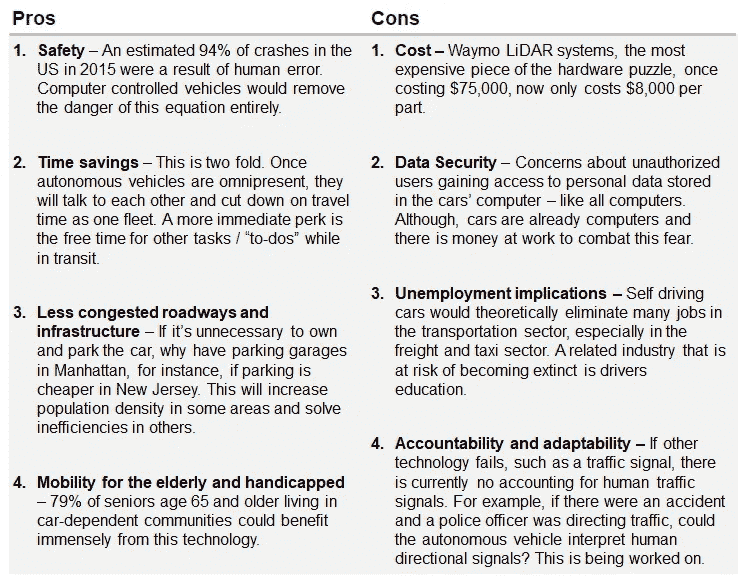

**这些系统的价格是多少？**这取决于你希望你的汽车有多先进，但假设你想将一辆现有的汽车装备到 4 级自治，预计花费超过 10 万美元。装备汽车所需的主要硬件是汽车顶部的主激光雷达系统*(右)。*威力登是谷歌 Waymo 汽车背后的制造商，但谷歌最近宣布，他们找到了一种方法，将成本从 75，000 美元降至至少十分之一，即每辆约 7，500 美元。这还有待实现，但如果这是真的，这是朝着正确方向迈出的一大步。安装四个类似但不太重要的激光雷达传感器，价格约为 6000 美元，激光雷达费用高达 117000 美元。除此之外，还有一个雷达(10，000 美元)，摄像头(两个 6000 美元)，显卡和其他硬件的价格为 10，000 美元。总的来说，这是近 143，000 美元加上现有汽车的成本，有些汽车比其他汽车适应性更强。竞争对手竞相将这一产品推向市场——预计在不久的将来价格会更低。

**当前任职者之间的相对关系。** [Navigant Research](https://www.navigantresearch.com/research/navigant-research-leaderboard-report-automated-driving) 发布了一份关于 18 家最具影响力的自动驾驶汽车制造商、科技巨头和初创公司应对自动驾驶汽车挑战的报告。该研究基于一些标准，但主要是战略和执行(即识别领导者)。这是此处图表结构的基础，但调查结果与其他公司一起呈现，最终改变了 [Navigant](https://www.navigantresearch.com/research/navigant-research-leaderboard-report-automated-driving) 呈现的结果。大多数领导者都是大型汽车制造商，但这只有在幕后构建软件和硬件的初创公司的帮助下才有可能。

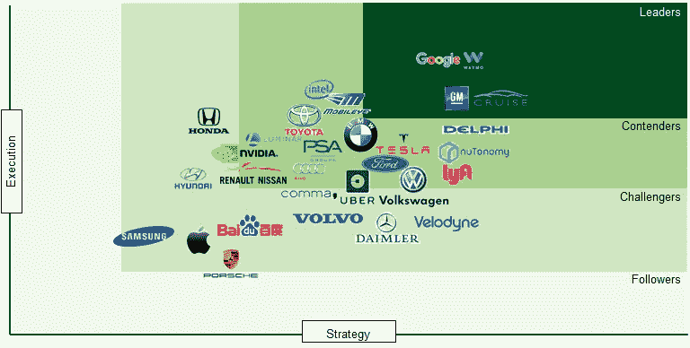

Criteria = vision, GTM strategy, partners, production strategy, technology, product capability, distribution strategy, product quality, product portfolio and staying power

**第五级自治竞赛中的领导者:**

**谷歌/way mo**——*始于 08 年。现在在亚利桑那州测试 5 级。下一步:在城市中测试。*八年前作为谷歌项目推出的 Waymo 于 2015 年 10 月在公共道路上进行了首次无人驾驶测试，并于 2015 年 12 月成为自己的公司，隶属于 Alphabet 保护伞，目前正在亚利桑那州提供无人监管/无人驾驶的乘车服务。Waymo 尚未透露将向客户收取多少费用、乘车时间以及在此过程中将覆盖多大面积的区域。Waymo 不从事实体汽车制造业务，而是打算向其他公司提供自动驾驶技术，但目前的目标是将这项技术作为一款叫车应用进行测试。将硬件工作内部化，而不是从威力登外包，以及降低组件价格，符合他们的战略。

**通用/ Cruise Automation** — *旨在成为第一家在纽约市道路上进行测试的公司。*今年 10 月，该公司透露计划在其位于密歇根州的沃伦技术中心(Warren technology Center)园区部署一支自动驾驶的 2017 款雪佛兰 Volts 车队，名为 MCity，通用员工可以从这里预订汽车，并使用移动应用程序输入目的地。该公司的自主技术将把乘客带到他们想要的目的地，并在附近停车以备将来使用。通用汽车还证实，其自 2012 年以来一直在开发的超级巡航技术将用于 2017 款凯迪拉克 CT6。通用汽车还宣布了两个汽车共享和打车试点项目的计划，以帮助测试其硬件和软件产品，并更好地了解用户体验。由于通用汽车的无人驾驶汽车距离作为 Lyft 服务的一部分上路还有几年时间(通用汽车向 Lyft 投资了 5 亿美元)，该汽车制造商计划在不久的将来向 Lyft 司机提供短期汽车租赁(一天、一周或一个月)。通用汽车不得不调整第三代雪佛兰 Bolt(用于测试系统的汽车)中 40%的零件，以适应自动驾驶。通用汽车于 2016 年 3 月以$1B 的价格收购了 Cruise Automation，并计划将 Cruise 技术融入未来的生产中。目前，Cruise Anywhere 是一个机器人，它驱动着 250 名旧金山 Cruise Automation 员工中的 10%从早上 7 点到晚上 11 点与一名乘客一起工作，以评估客户行为，记录任何事故并纠正任何错误。Cruise 表示，它将是第一家在纽约市测试自动驾驶汽车的公司。

**优步**——*于 2017 年 9 月在匹兹堡推出了他们的自动驾驶汽车。【2015 年 5 月，优步从卡耐基梅隆大学挖走几名机器人专家后，在匹兹堡设立了分公司。在启动匹兹堡试验后，为了在安全可控的环境中测试自动驾驶汽车，该公司在 9 月份建立了一个名为 Almono 的 42 英亩的设施。优步目前通过亚利桑那州的一个类似设施进行测试。今年早些时候，优步与 nuTonomy 合作，并提到它将开始开发自己的软件和硬件。去年 12 月，优步在没有首先获得自动驾驶汽车测试许可证的情况下，在三藩市推出了一辆自动驾驶汽车试点，引发了与加州车管所的公开纠纷。在车管所撤销其 16 辆自动驾驶沃尔沃 XC90s 的注册后，优步离开加州前往亚利桑那州。今年 1 月，优步与戴姆勒建立了合作伙伴关系，以防他们的内部技术不按计划发展。Waymo 正在起诉优步，声称这家打车服务公司窃取了其激光雷达系统的知识产权。[优步计划购买 24000 辆自主沃尔沃 SUV 参加无人驾驶未来竞赛](https://techcrunch.com/2017/11/20/uber-orders-24000-volvo-xc90s-for-driverless-fleet/)。Edison research 表示，优步的技术迫使司机每英里至少接管一次。然而，Waymo 的技术只需要每 5128 英里干预一次。*

**Delphi/nuto nomy**——*总部位于英国的通用汽车公司的分拆。* Delphi 是一个 100 人的自动驾驶团队，刚刚通过收购 nuTonomy 增加了 100 名员工(其中 70 名是工程师和科学家)。总部位于波士顿的初创公司 nuTonomy 于 2013 年从麻省理工学院分离出来，一直在自动驾驶汽车领域悄悄采取大动作。2016 年 8 月，nuTonomy 成为第一家在新加坡试点项目下推出自动驾驶出租车车队的公司。这家初创公司已经与 Lyft 合作，在今年年底之前在波士顿推出一个试点项目。截至 2016 年，nuTonomy 已经筹集了 2000 万美元的风险投资。投资者包括新加坡政府和 Fontinalis Partners。nuTonomy 与 Lyft、Grab 和 Groupe PSA 达成了协议，后者拥有欧洲汽车品牌标致(Peugeot SA)和雪铁龙(Citroë)。德尔福正在与最近被英特尔收购的自动视觉公司 Mobileye 合作，在 2019 年前制造自动驾驶汽车(他们的年度报告声称，他们将在 2019 年前在市场上推出完全自主的交钥匙解决方案——在年度报告中提到了 6 次)。也就是说，德尔福和 Mobileye 希望为汽车制造商提供一个系统，让廉价汽车和卡车能够自动驾驶。该中心将是一套 Mobileye 和英特尔芯片，每秒钟能够进行大约 20 万亿次数学运算。他们打算在以后的版本中增加 2 到 3 倍的功率。

**Lyft** — *刚刚在曼哈顿开设了一个 11000 平方英尺的场所，专注于纽约市的自主测试。【2017 年 7 月 21 日，Lyft 宣布将开设一个新部门，专注于自动驾驶汽车。2017 年 9 月 7 日，Lyft 宣布将推出一支配备 Drive.ai 的自动驾驶汽车车队，仅面向旧金山的精选客户，但根据加州法律，车内会有人随时监控。Drive.ai 为自动驾驶汽车打造 ai 软件。它旨在为汽车制造商制造由人工智能驱动的硬件和软件套件。除了 Drive.ai，Lyft 还与通用汽车达成了合作伙伴关系，获得了 2500 万美元的投资，并与 Waymo 建立了合作伙伴关系，另外还有一支由捷豹路虎(Jaguar Land Rover)提供的测试车队。Lyft 刚刚在曼哈顿的切尔西区设立了店铺，占地 11，000 平方英尺，拥有 80 名员工(包括自动驾驶工程师)。*

**福特**——*福特希望在 2021 年制造出一辆 4 级自动驾驶汽车。*福特致力于扩大其在高级算法、三维绘图、雷达技术和摄像头传感器方面的研究。自该计划启动以来，福特已经宣布了四项关键投资和合作:威力登、SAIPS、尼伦伯格神经科学和民用地图。福特最近向 Argo AI 投资了 1B，旨在“到 2021 年实现完全自主”，因此与 Argo AI 和其他科技公司进行了合作。目标是让福特汽车完全配备自动驾驶技术。Argo AI 是一家完全独立的公司，拥有独立的股权结构，福特是“主要股东”，但将“基本独立”地运营。员工将获得公司的股权。这项投资将在五年内完成。

**奥迪** — *最先进的大众集团子公司已经开始在纽约州奥尔巴尼进行测试。今年 5 月，纽约州向希望在该州测试自动驾驶汽车的公司开放了一项申请。奥迪拿到了第一张牌照，并在接下来的几周内在奥尔巴尼附近开始测试。奥迪已经在内华达州和加利福尼亚州进行了测试，因此这对奥迪来说并不陌生。A7 的设置是为了执行 SAE 级自动驾驶任务，这意味着它可以在条件良好的情况下以公布的高速公路速度无人驾驶(即，没有超速，没有积雪，司机仍然需要坐在方向盘后面，并在收到提示时准备接管)。奥迪的第 4 级系统 A9 e-tron 可以在高速公路上行驶，并在没有辅助的情况下改变车道，预计将于 2020 年至 2021 年上市。为了在 2020 年达到第 4 级自主，奥迪将依赖英伟达来协助人工智能和所需的处理能力。*

**特斯拉**——*在经历了一系列与自动驾驶相关的事故后，他们希望在 2018 年证明自己。*尽管特斯拉的自动驾驶功能已经取得了很大进展，但 Navigant 表示，有理由怀疑这家汽车制造商实现四级自主的能力。特斯拉汽车目前正在使用新的硬件进行制造，这些硬件将改善特斯拉自动驾驶，并将系统重命名为 Autopilot 2.0，并为完全自主奠定基础。然而，据 Navigant 的一名研究人员称，“Autopilot 2.0 仍然缺少原始版本的许多功能，原始版本更加依赖于视觉系统的 Mobileye，”Navigant 的高级研究分析师萨姆·阿布埃尔萨米德(Sam Abuelsamid)说。“从我们所看到的一切来看，他们似乎没有赶上 Mobileye 一年半前的水平。”该公司声称，一辆特斯拉将在 2018 年年中之前从洛杉矶开到纽约，以展示这项技术。自 2015 年首次安装 Autopilot 以来，特斯拉撞车率暴跌 40%。

**丰田**——*加快步伐，做好准备开发全自动驾驶汽车。*丰田对丰田研究所(TRI)的 1B 投资凸显了这家日本汽车制造商对自动驾驶的兴趣。9 月底，该公司发布了下一代自动驾驶测试车 Platform 2.1，据称这款车可以更准确地检测物体和道路。这是在 2017 年 3 月推出初始版本的几个月后。步伐的加快表明了汽车制造商实现大规模生产的愿望，就丰田而言，他们对早期创业公司的兴趣是因为该公司最近与 Luminar 合作，Luminar 是一家由一位 22 岁的与彼得·泰尔*(稍后详细介绍)*有联系的创业公司。Navigant 表示，作为世界上最大和最赚钱的原始设备制造商之一，丰田拥有制造全自动汽车的资源和专业知识。

沃尔沃 — *正在签署历史上最大的汽车交易之一。*沃尔沃计划通过逐步推出半自动功能，到 2020 年使其汽车“免于死亡”。作为 Drive Me 计划的一部分，该汽车制造商今年将让家庭在瑞典哥德堡和伦敦测试自动驾驶沃尔沃。该公司还将在中国进行一项“高级自动驾驶实验”，100 名志愿者将能够在公共道路上测试无人驾驶的沃尔沃 XC90s，但该汽车制造商尚未透露该试验将于何时开始。沃尔沃和优步在 8 月份同意斥资 3 亿美元联合开发自动驾驶汽车，目前正在亚利桑那州进行测试。与沃尔沃的新交易据说价值约 14 亿美元。

**宝马** — *与两个重要合作伙伴一起追求全自动驾驶汽车。*宝马在其豪华车辆中发布了先进的驾驶辅助技术，如宝马 7 系和 5 系。宝马计划在 2021 年发布一款完全无人驾驶的汽车，并与英特尔和 Mobileye 合作。宝马 iNEXT 是首款全自动驾驶的宝马汽车，将为宝马在这方面的战略奠定基础。试驾将于明年开始。英特尔自动驾驶集团副总裁 Kathy Winter 展示了将在道路上测试的 40 辆宝马 7 系高度自动化汽车中的第一辆。所有的汽车都有望在年底上路。所有车辆都将包括多个 Mobileye 摄像头，用于道路扫描。

**梅赛德斯-奔驰(戴姆勒)**——*专注于软件/人工智能系统。*戴姆勒正与博世合作，计划在 2020 年将全自动驾驶汽车引入城市道路。合作的重点将是使这些先进的驾驶系统安全和可预测所需的软件和算法。目标是创造可以在城市指定区域内自主运行的共享汽车。戴姆勒参与了 Momenta 价值 4600 万美元的 B 轮融资。AI，自动驾驶汽车的软件。这家汽车制造商还参与了自动无人机初创公司 Matternet 和 Starship Technologies 的融资回合，Starship Technologies 是一家制造自动驾驶、最后一英里送货机器人的公司。目前，在梅赛德斯 S 级和 E 级汽车等品牌中，有一套半自动功能。2015 年，一辆梅赛德斯大卡车在公共高速公路上自动驾驶，创造了历史。

**本田** — *(与 Waymo)在一笔大交易中输给了克莱斯勒，并在慢慢恢复。*本田更专注于扩展其现有车辆的辅助驾驶功能，而不是推动完全自主。本田表示，它打算到 2020 年在市场上推出能够在 3 级高速公路上行驶的车辆。该公司在加州拥有自动驾驶汽车测试许可证，但仅在 2016 年的封闭课程上进行测试。尽管 Waymo 曾考虑使用本田汽车，但本田却输给了克莱斯勒，尤其是 Pacifica 混合动力小型货车。

**雷诺-日产联盟** — *共同应对自主和移动未来的合作伙伴关系。*该联盟将于 2018 年开始销售带有“多车道控制”的车辆，这种车辆可以在高速公路行驶期间自动避开危险并改变车道。该公司表示，到 2020 年，它将推出无需司机干预就能在城市十字路口和繁忙的城市交通中行驶的车辆。该汽车制造商在其日本的量产车中发布了 ProPILOT，这是一种自动驾驶功能，可以让汽车在高速公路上自动驾驶。雷诺-日产还计划在欧洲、美国和中国推出 ProPILOT。它的最终目标是不断为 ProPILOT 添加自动驾驶功能，直到 2020 年它的汽车完全自动驾驶。日产目前正在探索使用呼叫中心进行干预，如果其自动驾驶汽车无法处理特定的驾驶场景。

PSA——*主要的欧洲竞争对手专注于用 ZF 技术装备汽车。* PSA 是欧洲第二大汽车制造商。凭借标致、ds 和雪铁龙这三大世界知名品牌，Groupe PSA 在 2015 年全球销量达 300 万辆。作为欧洲第二大汽车制造商，它在 2015 年创造了 630 亿美元的销售额。该公司计划在 2020 年让完全无人驾驶的汽车上路。2015 年 10 月，该汽车制造商的四辆自动驾驶汽车在法国巴黎和波尔多之间行驶了 360 英里。德国汽车零部件制造商 ZF 在 2016 年宣布，将为具有自动驾驶功能的 PSA 车辆提供摄像头、雷达和软件。这些汽车将于 2018 年上路。

**保时捷** — *害怕失去品牌身份，专注于慢慢融入自主特性。*保时捷在汽车技术领域采取的最切实的行动是推出 Mission E:全电动汽车来对抗特斯拉，但尚未提及大规模生产的时间表。保时捷表示，将投资 1B+美元生产 Mission E。他们已经与马自达合作开发自动驾驶汽车。保时捷首席执行官克劳斯·泽尔默(Klaus Zellmer)将自动驾驶模式比作巡航控制和车道保持辅助等功能，并表示它最终将成为每辆保时捷的标准配置。“你可以按下那个按钮，汽车就会带你回家，因为我们的客户也经历了他们不喜欢的交通状况，他们想做点别的事情，”他说。“你必须让顾客选择。我们将为客户提供自动驾驶模式的可能性。”

**现代** — *提前推出其半自动功能。*现代一直在 2016 款伊兰特等车辆上部署其“公路驾驶辅助 2”(hda 2)半自动功能，如车道保持辅助。HDA2 系统被适当地视为 2 级自主功能，类似于特斯拉的自动驾驶仪。现代汽车(Hyundai Motor)本周宣布，将在明年的韩国平昌冬季奥运会上部署使用高清地图技术的自动驾驶汽车，在首尔和奥运场馆之间穿梭，距离为 78 英里。现代计划在 2020 年在量产车中拥有一套自动驾驶功能，但在 2030 年之前不会承诺完全自主。在 CES 2017 上，现代展示了其 Ioniq 电动汽车的自动驾驶原型。

**Luminar/Austin Russel**——*与丰田联手，并得到 Peter Theil 的支持。*一位来自斯坦福的 22 岁年轻人，他得到了 Peter Theil 的支持，用单个激光取代现有的激光雷达系统，比现有系统看得更远。Waymo 系统中使用的激光雷达现在只能看到汽车前方一秒钟的时间，而该系统可以看到汽车前方七秒钟的时间，从而有更多的时间根据移动物体做出反应。Luminar 的技术使用单个激光快速来回移动，以 50 倍的分辨率检测超过 200 米或约 656 英尺的物体——拉塞尔声称这是许多激光雷达的 10 倍范围。该公司于 2017 年 4 月推出，获得 3600 万美元的资金，并宣布正在与丰田研究所合作开发最新版本。

**Comma.ai /乔治·霍兹** — *由安德森·霍洛维茨(Andreessen Horowitz，310 万美元)支持，意图开源汽车。也许更为人所知的是他因入侵 iOS 和 Playstation 的 PS3 等系统而遭到的大量法律诉讼，乔治·霍兹是一项新技术的策划者，该技术旨在用一种可以安装在任何车辆上的 4000 美元的交钥匙解决方案来取代 Waymo 笨重的系统。Hotz 没有因为出售他未经测试的 Comma.ai 系统而收取罚款，而是通过一款名为 Openpilot 的产品免费提供，以更快地收集数百万英里的里程。而其他公司正在通过定义不同的路况和手动标记驾驶数据来教授他们的汽车——这是一条超车道；这是一个停止标志——comma . ai 依靠日常驾驶员的模式和行为来训练 Openpilot 使用的模型。*

**顶级供应商:**

**Mobileye** — *两家领先的硬件供应商之一。*如今汽车中的大部分硬件技术都是由 Mobileye 生产的。Mobileye 是一家专注于视觉系统的以色列公司，该公司于 2017 年 5 月被英特尔以 150 亿美元收购，被特斯拉汽车公司、优步、菲亚特克莱斯勒、宝马、德尔福等公司使用。该公司最近发布了一份声明，声称他们已经找到了一种将责任编程到汽车中的方法，可以有效地确保装有这种软件的汽车永远不会引发事故。这还有待检验。据英特尔称，这些车辆将结合 Mobileye 的“计算机视觉、传感、融合、测绘和驾驶政策”与英特尔的“数据中心和 5G 通信技术的开放平台和专业知识，以提供一个完整的‘车到云’系统。”

**威力登**——*mobile ye 唯一的主要竞争对手。*威力登成立于 2005 年，是最昂贵的单一硬件激光雷达的领先制造商，用于 Waymo、福特和百度。尽管现在 Waymo 已经表示他们将在内部建造这些激光雷达，将价格从目前的 75，000 美元提高到 7，500 美元。上个月，该公司宣布将其产能提高了 400%以上，以满足日益增长的全球需求。该公司预计 2018 年将是繁忙的一年，全自动和半自动应用的订单将导致生产设施的扩张。一个可以“关灯”运行的高产量自动化工厂将有助于压低价格。

**高通** — *在芯片制造商争夺战中处于领先地位。*作为自主世界中更积极主动的芯片制造商之一，高通正在与英特尔等竞争对手展开竞争，并计划与 LG 合作在首尔开设另一个研究中心，以探索 5G 网络的生产和商业化，因为它与自动驾驶汽车有关。这是自动驾驶汽车革命的一个关键部分，因为这项技术将让汽车能够实时相互交谈，并处理比当前系统多得多的数据。

**英特尔** — *因最近收购 Mobileye 而加入对话。*英特尔在 2016 年 12 月宣布，将向从事自动驾驶技术的初创企业投资 2.5 亿美元。7 月，它与 Mobileye 和德国汽车制造商宝马建立了合作伙伴关系，为宝马打算在 2021 年开始生产的自动驾驶汽车提供芯片。然后，英特尔在 8 月份以 150 亿美元的价格收购了 Mobileye，意在为汽车细分市场定义和提供云到车解决方案。英特尔 i7 处理器用于 Mobileye 系统，但英特尔计划今年发布一款更快的芯片。

**英伟达** — *自动驾驶汽车整体生产中的关键部件。* Nvidia 制造了一个处理单元，奥迪正在将其应用于其最新车型，另一个是特斯拉刚刚开始在其汽车上使用的处理单元。特斯拉使用的 Nvidia 设备名为 Drive PX2，每秒可以计算 24 万亿次运算。Nvidia 最近(文章日期截至 2016 年 12 月)展示了一个更强大的版本，名为 Xavier。德国汽车制造商 ZF 也在使用 PX2，并计划在 2020 年前将其投入全自动驾驶汽车。

**三星**——*寻找创造性的方式参与其中。*三星表示，该公司正在启动一只新基金——三星汽车创新基金，投资一系列联网汽车领域，包括传感器、机器视觉、人工智能、高性能计算、云服务、移动连接、汽车级安全和安保。报道称，第一笔投资将是对 TTTech 的 9000 万美元，TT tech 是一家总部位于维也纳的公司，以安全、高度可靠的网络计算系统而闻名，该系统用于波音梦想飞机、奥迪汽车(包括新款奥迪 A8)和美国宇航局的航天器。三星之前与汽车相关的投资包括自动驾驶的 AImotive 和 Renovo，3D 相机激光雷达的 Quanergy，以及高性能人工智能计算制造商 Graphcore。

**百度** — *广告收入的下降凸显了新收入来源的重要性，即自动驾驶汽车。自 2015 年以来，百度一直在公开测试其自动驾驶汽车技术。该公司于 2016 年 11 月首次允许公众乘坐其电动自动驾驶汽车，但试验仅持续了一周。百度 9 月份推出了一只 15 亿美元的基金，专门用于自动驾驶汽车的开发。这家总部位于北京的公司计划在 2018 年为共享班车服务生产有限数量的自动驾驶汽车，并在 2021 年大规模生产自动驾驶汽车。该公司在加州拥有自主测试许可，并在桑尼维尔设有办事处。它现在在汽车行业的几个领域拥有 70 个合作伙伴，而 7 月份只有 50 个。现有的合作伙伴包括微处理器公司 Nvidia Corp .和地图服务公司 TomTom NV。*

**苹果**——*重新思考其战略并改组管理层。*去年，苹果原本想设计一款全新的汽车，但他们却削减了生产整车的努力，只专注于其中的外围产品(即..软件等。).在完全自主或半自主和不真实的最后期限之间有一些内部争吵，这显然使团队四分五裂。这场较量是在史蒂夫·扎德西(Steve Zadesy)和约翰·艾夫(John Ive)之间进行的，前者是苹果高管，最初负责泰坦(Titan，旨在赢得自动驾驶汽车竞赛的项目)，想要半自动驾驶汽车，后者是苹果首席设计师，想要完全重新想象汽车，从而从零开始创造一款新车。谷歌也有过类似的较量，但自动驾驶汽车赢了，因为他们不相信人们会在紧急情况下重新控制局面。最终，该公司选择鲍勃·曼菲尔德(Bob Manfield)来领导这项工作，因为他在无数硬件工程方面提供了帮助。苹果主要担心的是留住优秀的工程师，这是有道理的，因为有更多有吸引力的竞争对手。

**历史交易精选** *(截止 2017 年 12 月)* **:**

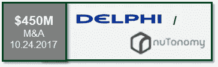

**Delphi/nuto nomy**—*2013 年麻省理工学院展聚焦汽车和机器人软件。* nuTonomy 是一家 **2013 年麻省理工学院分拆**的公司，自 2016 年以来也一直在新加坡**运营自动驾驶出租车，最近获得了在波士顿测试其自动驾驶车辆的许可。nuTonomy 将把包括 70 名工程师和科学家在内的 100 多名员工合并到德尔福的 100 人自动驾驶团队中。到今年年底，德尔福将有 60 辆自动驾驶汽车在横跨三大洲的道路上行驶。nuTonomy 与 Lyft、Grab 和 Groupe PSA 达成协议，后者拥有欧洲汽车品牌:标致和雪铁龙。**

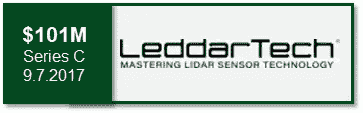

**LeddarTech** *—汽车级固态激光雷达。*本轮由**欧司朗**领投，包括**德尔福、Magneti Marelli** 和**集成设备技术**作为战略投资者。这是该公司迄今为止最大的一次融资，这一轮融资将使 LeddarTech 能够加强其 ASIC 开发工作，扩大其研发团队，并与精选的一级汽车客户一起加速激光雷达开发项目，以实现快速市场部署。

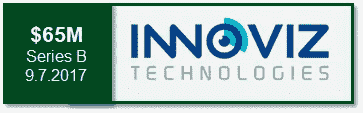

**Innoviz** *—更好、更低价位、更小的激光雷达传感器。* Innoviz 最近从战略合作伙伴和领先的汽车行业供应商**德尔福汽车公司和麦格纳国际公司**获得了 6500 万美元的 B 轮融资。作为顶级供应商，两家投资者都希望向汽车制造商提供核心自动驾驶部件和系统。新的资金将帮助 Innoviz 继续推动其激光雷达解决方案的**大规模生产，该解决方案使用固态设计，随着时间的推移具有更高的可靠性，并声称在不同的天气条件下具有更好的传感能力，包括具有挑战性的条件。**

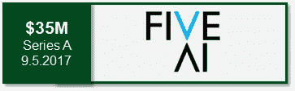

**FiveAI** *—激光雷达系统旨在为汽车原始设备制造商带来自主权。总部位于英国的 FiveAI 是英国 StreetWise 自动驾驶项目的合作伙伴，它筹集了两部分资金，以完成其在自动驾驶服务领域的两部分业务计划。FiveAI 正在打造自己的自动驾驶系统；其次，FiveAI 将使用基于人工智能的平台，通过一支自动驾驶出租车车队来承担优步和其他交通服务。**由多产投资者 Klaus Hommels 创立的 Lakestar Capital** 公司领导了这一轮融资。*

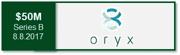

**Oryx Vision***——以色列激光雷达制造商。*下一代汽车**激光雷达创新者**，Oryx Vision 筹集了**5000 万美元**B 轮融资。第三点风险投资**和 **WRV 领投**这一轮，另外还有**联合技术风险投资、Bessemer Venture Partners、Maniv Mobility 和 Trucks VC** 。在第一轮融资后仅仅 15 个月，这次融资使 Oryx 的总投资额达到 6700 万美元。**

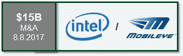

**英特尔/mobile ye***—ADAS 软件的领先供应商，拥有超过 25 家汽车制造商合作伙伴。*这些车辆将结合 Mobileye 的“计算机视觉、传感、融合、测绘和驾驶政策”和英特尔的“开放计算平台以及在数据中心和 **5G 通信技术**方面的专业知识，以提供一个完整的‘车到云’系统。”Mobileye 也是特斯拉自动驾驶技术的早期合作伙伴。英特尔在汽车领域的其他投资包括入股 **Here** (将注入 Mobileye 的地图计划)；为自动驾驶汽车中的安全和导航功能获取 **Itseez** 和**yogi tech**；并承诺至少向太空投资 2 . 5 亿美元。

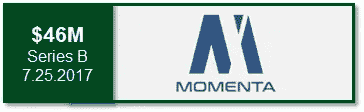

**Momenta.ai —** *自主系统背后的大脑/软件。才一岁。*领投 **Nio Capital** 和**顺为资本**， **Sinovation Ventures** ， **Unity Ventures** 和**戴姆勒**也参与了此轮。Momenta.ai 只有一年的历史，拥有三名前微软研究人员和三名博士，专注于带来数十亿众包数据，以开发“市场就绪”的传感器和软件。数据的数量和质量至关重要，因为它加速了软件的生产。

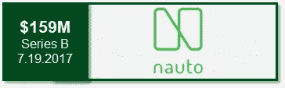

**Nauto —** *AI 供电的摄像头网络连接到云端。*一家位于帕洛阿尔托的公司致力于为现有车队加装配有网络安全摄像头的设备。这轮融资由 T4 软银和雷德·霍夫曼在格雷洛克牵头。该公司的产品专注于收集人类司机及其行为的数据，以改善目前的安全实践，但他们的平台还有第二个潜在的更有利可图的目的:建立一个庞大的数据集，可以证明在自动驾驶汽车的开发中有价值——这就是软银参与的原因。这些数据的潜在价值是许多汽车制造商也对 **Nauto** 进行战略投资的一大原因，包括**通用汽车风险投资**、**丰田 AI 风险投资**和**宝马 iVentures** 。

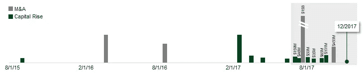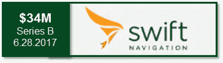

**迅捷导航** — *自主车辆高精度 GPS。*以合理的价格构建“高精度、厘米级精度”**全球导航卫星解决方案(GNSS)** 并为超过 **2，000 家客户**提供解决方案——包括自动驾驶汽车、精准农业、无人机(UAV)、机器人、海事、运输物流和户外硬件应用。通过将 GPS 定位从定制硬件转移到灵活的基于软件的接收器，Swift 提供了比传统 GPS 精确 100 倍的**实时运动学(RTK)** GPS，而其成本只是竞争产品的一小部分。本轮**由 NEA** 领投，包括现有投资人**日蚀**和**首轮**。该公司迄今已筹集了 4760 万美元。

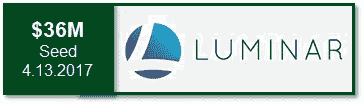

**Luminar**—*1550 纳米波长与 905 纳米波长的激光雷达系统。自 2012 年成立以来，Luminar 一直处于隐形模式，从 Canvas Ventures、GVA 资本和彼得·泰尔支持的 1517 基金等处筹集了 3600 万美元的种子资金。该公司从头开始制造激光雷达，使其更加经济实惠，更加精确。Luminar 放弃了传统的硅芯片，转而选择了铟镓砷芯片(据说可以让芯片更好)。Luminar 拥有 **150 名员工**，在奥兰多开设了一家工厂，收购了包括 **Open Photonics** 在内的两家公司，Open Photonics 的联合创始人 Jason Eichenholz 成为 Luminar 的首席技术官，并正在准备制造其最新设备的第一个 **10，000 台**产品。*

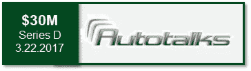

**Autotalks** — *V2X(“车对一切”)通信解决方案全球扩张。*满足即将到来的法规要求的芯片组，具有卓越的通信性能、最强的网络安全性、最高的集成度和众多竞争特性。投资方包括: **Magma Venture** 、 **Mitsui & Co.** 、 **Liberty Media** 、 **Delek Motors** 、 **Fraser McCombs** 和 **Samsung Catalyst Fund** 。这轮融资紧随美国交通部发布的 NPRM(规则制定提案通知)之后，该通知旨在提高道路安全，将在 2023 年**前在美国销售的所有新型轻型汽车中强制使用基于 V2V 的 DSRC(专用短程通信)。**

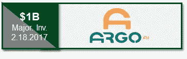

**福特/ Argo AI —** *Argo AI 是一家人工智能公司。*福特投资 10 亿美元与 Argo AI 建立合资企业，Argo AI 是一家总部位于匹兹堡的公司，与卡耐基梅隆大学有联系。目标是完全为福特汽车配备 **level 4** 自动驾驶技术。这是一家完全独立的公司，拥有独立的股权结构。福特是“最大的利益相关者”，但将“基本独立”运营。员工将获得公司的股权。

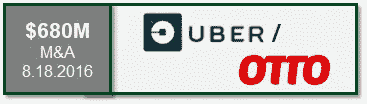

[**优步/奥托**](https://techcrunch.com/2016/08/18/uber-acquires-otto-to-lead-ubers-self-driving-car-effort-report-says/)***——这是导致谷歌采取法律行动的收购案。奥托一直专注于自动驾驶技术，这种技术可以安装在已经上路的卡车上。这完全符合优步的战略，因为该公司不想成为汽车制造商。相反，优步一直在寻求与现有汽车制造商的合作，如沃尔沃，以便利用优步的专有技术将他们的汽车变成自动驾驶汽车。**优步于 2016 年开始测试自动驾驶半卡车**，当时一辆使用先进技术的卡车与百威啤酒一起沿着一条特定的高速公路行驶了 120 英里，这标志着世界上第一次由自动驾驶卡车进行的商业运输，并计划继续测试半卡车。***

**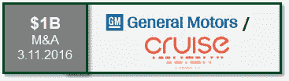**

****通用/ Cruise 自动化** *— Cruise 是 Waymo 的主要竞争对手。* Cruise 开发了一个工具包，允许买家将某些类型的汽车(即奥迪 A4 和 S4 车型)转换成高速公路上的自动驾驶汽车，通用汽车希望将这项技术融入他们的制造流程。通用汽车**也向 Lyft** 投资了 5 亿美元，并启动了一项名为 Maven 的新计划，旨在与优步这样的拼车公司竞争。通用汽车与 Cruise 的交易导致了一款完全集成的自动电动汽车的推出——该技术正被内置于雪佛兰 Bolt 电动汽车中——正在旧金山、底特律和凤凰城进行测试**，纽约市将于 2018 年进行测试**。**

**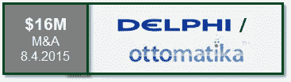**

****德尔福/奥托玛蒂卡** *—奥托玛蒂卡是德尔福背后的智囊。* Ottomatika，一家 **CMU** 的分拆公司，为自动驾驶汽车提供软件和系统开发。Ottomatika 的软件是德尔福自动驾驶汽车先进传感器技术网络的大脑。Delphi 和 Ottomatika 的组合软件在 2015 年 4 月实现了北美自动驾驶汽车的最长驾驶时间。德尔福汽车完成了从旧金山到纽约的**3400 英里的行程，其中 99%的时间是在自动模式下**穿过施工区，以及不利的交通和天气。**

**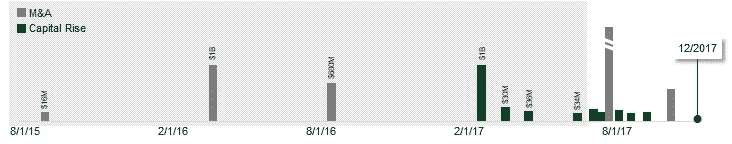**

****自动驾驶汽车目前表现如何？****

*****加州车管所*** [***报道***](https://www.dmv.ca.gov/portal/dmv/detail/vr/autonomous/disengagement_report_2016) ***显示出自去年以来重大改进的迹象。*** 加州车管所最近发布了年度“脱离报告”，记录了 11 家公司获准在加州公共道路上测试自动驾驶汽车的进展。虽然这些数字并不能描绘整个画面，但它们确实提供了对进展的很好的洞察。该报告涵盖了 2015 年 12 月至 2016 年 11 月，并显示了驾驶员必须干预自动驾驶汽车的频率。谷歌(Google)和通用汽车(General Motors)在汽车领域处于领先地位，它们的汽车能够一口气行驶数百英里，没有任何问题。但是，即使是那些落后的国家也显示出了进步的迹象。例如，日产的 robocars 每 247 英里需要一次人工干预，而 2015 年每 14 英里需要一次。引领通用汽车自动驾驶努力的初创公司 Cruise 在旧金山进行了所有测试，从 2015 年 6 月的 5 英里增加到 2016 年 6 月的 400 英里。到去年年底，它已经顺利行驶了数百英里。德尔福的大部分麻烦都是在交通拥挤时变道时遇到的。福特在加州的两辆自动驾驶汽车只在高速公路上行驶，白天，天气和路况都很好，这也解释了为什么它在 590 英里中只需要人类帮助三次。**

**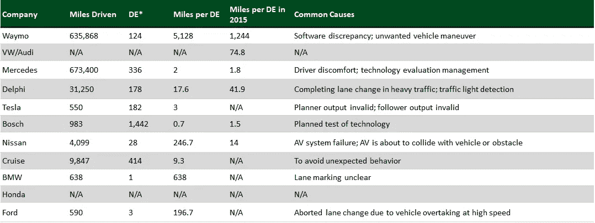**

****State of California, Department of Motor Vehicles,** *Autonomous Vehicle Disengagement* [*Report*](https://www.dmv.ca.gov/portal/dmv/detail/vr/autonomous/disengagement_report_2016) *2016***

****与更广泛的汽车技术市场相比，影音市场表现如何？** *在 2016 年和 2017 年年初至今，半自动和自动技术的交易活动超过了汽车技术所有其他细分市场的总和。***

*****自动驾驶汽车(AV)技术与其他汽车技术的对比—*** 今年最大的交易发生在跨 AV 生态系统(即传感器、视觉、3D 地图等)的公司。).随着这些资源密集型领域的参与者希望更接近市场，可能需要持续的资本流动。Zoox 是一家隐秘的 AV 初创公司，旨在重塑车辆本身的概念，据说它正在与软银就高达 10 亿美元的投资进行谈判。在 AV 技术起飞之前，投资主要集中在联网汽车和车队远程信息处理初创公司。去年，随着威瑞森收购 FleetMatics 和 Telogis，后一个领域出现了几次大规模退出。**

**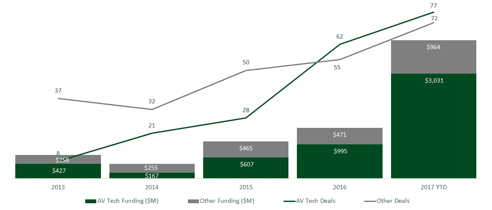**

**CB Insights [Report](https://www.cbinsights.com/research/auto-tech-startup-investment-trends/): Taking The Wheel: Autonomous Vehicle Tech Grabs Majority Of Auto Tech Deals, Dollars**

*****按阶段划分的汽车科技全球年度交易份额——***假设 2017 年还有时间(即数据并不完美)，2017 年年初至今是种子活动占交易不到三分之一的第一年。汽车技术正开始成熟，几年前播种的初创公司现在获得了中期和后期投资。此外，自 2012 年以来，独立投资者的数量每年都在增加，汽车科技继续吸引着更多的支持者。企业和 CVC 投资者的急剧增加反映了汽车原始设备制造商、供应商、半导体和航空航天部门的进入。这显示了 AV 技术的深远影响，因为这一领域继续超过传统的汽车技术。**

**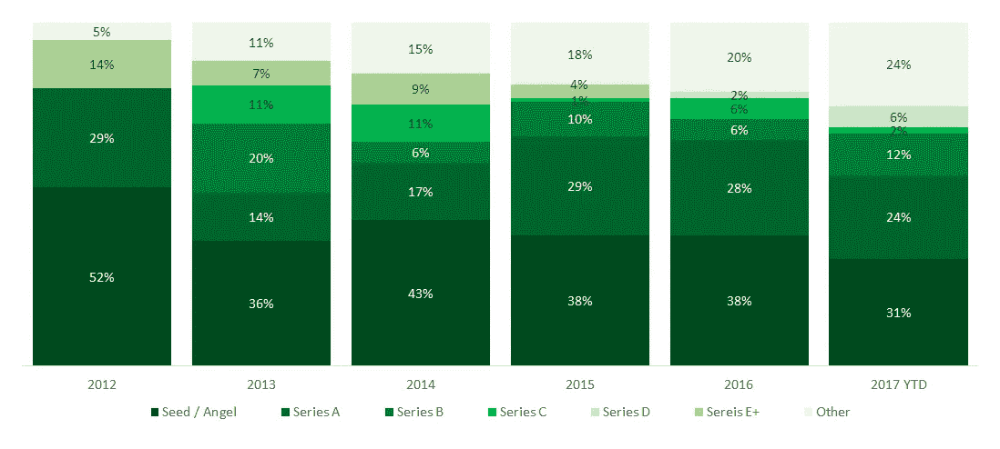**

**CB Insights [Report](https://www.cbinsights.com/research/auto-tech-startup-investment-trends/): Taking The Wheel: Autonomous Vehicle Tech Grabs Majority Of Auto Tech Deals, Dollars**

****关注投资者的自主性和流动性空间。** *这些投资者很多都有战略成分，关注面也比较窄。***

**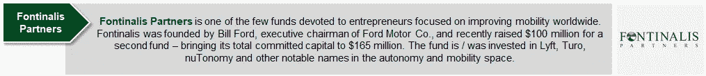****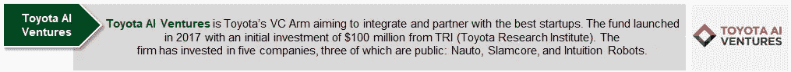****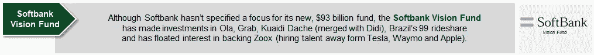****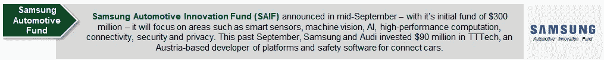****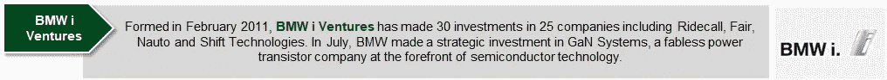****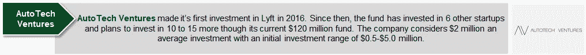****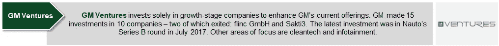****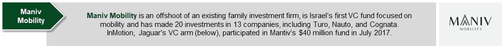****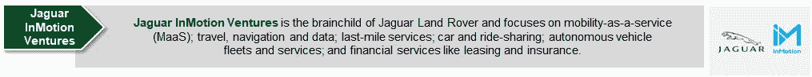**

****自主技术的其他应用****

**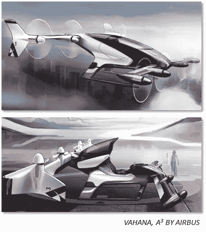**

****垂直起降(“VTOL”)。** *虽然经常与休闲无人机联系在一起，但垂直起降也包括飞行汽车。例如，空中客车公司在 2016 年初启动了 A3 项目，以便“通过开发第一架经认证的电动、自动驾驶垂直起降客机来开辟城市航线。”空客预计“速度将比汽车或交通快 2-4 倍，飞行范围约为 50 英里(80 公里)。”空客面临的主要障碍不是起飞或飞行，而是在充满挑战的环境中正确着陆的能力。飞机上安装的许多系统与自动驾驶汽车上使用的系统相同:激光雷达、传感器、相机、地图/ GPS 等。但也包括惯性测量仪器和可能比 Waymo 技术更强的处理能力。优步最近宣布与极光飞行科学公司合作，开发电动垂直起降(电动垂直起降飞机)。Aurora 公司的电动垂直起降概念是基于其为美国国防部开发的 XV-24A X-plane 计划和该公司开发的其他自主飞机。此次合作旨在通过“优步高架网络”为大众提供城市交通解决方案。该飞机的首次试飞在今年早些时候取得了成功，目标是到 2020 年交付 50 架飞机进行测试。无人机——非客运无人机——在媒体/娱乐、新闻、农业、房地产和公共安全的各种使用案例中有* [*短期商业需求*](/@AmoilsNisa/drones-are-you-looking-in-the-right-place-for-investment-a67ab54cfe66) *创造对“无人机即服务”的需求。在这个领域，还有其他类型的机会，例如维护、软件、通信芯片、保险、娱乐和更好的传感器等等。安全是无人机市场的另一个重要领域。在 Andreesen Horowitz 领导的 1150 万美元的成功 A 轮投资后，Skysafe 的无线电波技术可以检测并阻止流氓无人机进入未经授权的区域，如军事基地、体育场、监狱和机场。***

**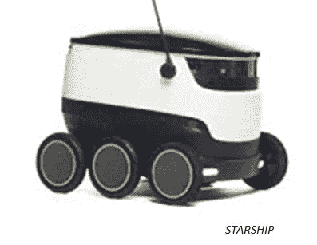**

**最后一英里的商业。*“最后一公里问题”长期以来一直是物流供应商、运输公司和零售商的眼中钉。与散装运输、火车、卡车或飞机运输的主要路段相比，从物流中心到个人家庭和办公室的最后一段(或最后一英里)通常会产生最高的成本和复杂性。随着网上购物的激增给容量带来压力，最后一英里的挑战也越来越大。基础设施故障也使发展中市场和受灾地区的最后一英里配送变得复杂。所有这些初创公司在概念上都是相似的，都在建造自主无人机，以降低最后一英里送货的成本和难度。然而，他们在空中(Flirtey 和 Matternet)与地面解决方案(Starship、Dispatch、Marble 和 Robby)上追求完全不同的方法。空中无人机必须应对空中交通管制和安全问题，而地面车辆更容易受到破坏和盗窃。欧洲科技初创企业 Starship Technologies 正在打造一支无人驾驶送货机器人车队，该公司最近在 A 轮融资中从包括戴姆勒(Daimler)、沙斯塔风险投资公司(Shasta Ventures)、Matrix Partners 等投资者那里筹集了 1720 万美元。该技术旨在使用“现成”组件在 30 分钟内在当地交付货物。这些机器人重量轻，成本低，使该公司能够将当前每次运输的成本降低 10-15 倍。***

****仓库和制造业。** *越来越多的公司将自动驾驶技术应用到仓库的现有系统中(即，为软件而不是工资付费，并获得更好、更准确的结果)。例如，Brain Corp——一家总部位于圣地亚哥的软件开发商，旨在为现有的地板机器人配备专有软件——刚刚筹集了 1 . 14 亿美元的 C 轮融资，由软银的愿景基金牵头。高通风险投资也参与了该轮投资。这 1.14 亿美元将用于开发多种类型的商业和消费机器人的人工智能技术。BrainOS 是该公司的专有操作系统，集成了现成的硬件和传感器，为机器人提供了一个具有成本效益的“大脑”。本质上是机器人的 Android OS。它拥有计算机视觉和人工智能，能够快速高效地开发智能系统，学习并适应人类和环境。其技术为杂乱和动态的室内环境提供了先进的自动驾驶功能。***

****建筑和农业。** *类似于仓库机器人的使用案例，建筑行业正在见证机器人的真正影响，如帮助日本政府准备 2020 年奥运会的自动化推土机团队。为了弥补建筑工人的缺乏(部分源于严格的国际劳动法)和快速接近的最后期限，该团队正在使用无人机引导的自动推土机，这些推土机在空中绘制出路线，并且可以比推土机本身更好地测量地形的密度。这些无人机由 Skycatch 提供，该公司建立了自主捕捉、处理和分析 3D 无人机数据的技术。根据* [*美国消费者新闻与商业频道*](https://www.cnbc.com/2016/09/16/future-of-farming-driverless-tractors-ag-robots.html) *报道，高盛预测农业技术可能成为农业供应商 2400 亿美元的市场机会，小型无人驾驶拖拉机本身就是 450 亿美元的市场。高盛还预测，数百亿美元可用于主要农业用途的先进技术，如精确施肥、种植、喷洒和灌溉。***

****智慧城市。** *美国国家城市交通官员协会(NACTO)最近发布了一份 60 页的报告，内容是政府实体如何展望智能城市的未来，即所谓的“自主城市主义”该组织旨在积极规划自主未来，以便更好地管理交通，使用更少的资源做更多的事情，并提供以人而不是车为中心的移动性。例如，如果没有中央分隔带或交通灯，因为汽车和环境可以相互交流，将有更多的空间用于商业和住宅目的。尽管 NACTO 正在规划未来，但谷歌及其子公司 Sidewalk Labs 正在建设城市的未来。如前所述，这家科技巨头将把多伦多办公室迁至* [*码头区*](https://www.wired.com/story/google-sidewalk-labs-toronto-quayside/) *，Sidewalk Labs 将在这里把一块 12 英亩的土地重新开发成智能城市。如果一切按计划进行，谷歌可以获得另外 800 英亩土地来做同样的事情。***

**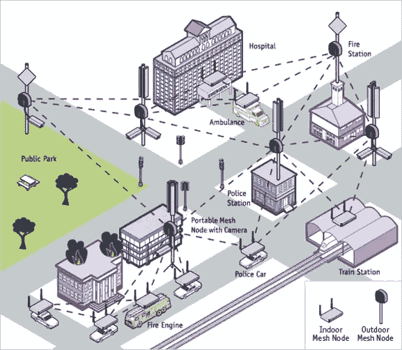**

****网状网络。** *车对车(CxC)和车对万物(CxV)通信技术。*与智慧城市一致，无线网状网络(WMN)是一种本地网络，其中基础设施节点直接、动态且无层级地连接到尽可能多的其他节点，并高效地相互协作，以向/从网络中的客户端发送数据。无线网状网络由客户端、路由器和网关组成。网格节点通常是车辆周围基础设施中的静态对象(即路由器)，而网格客户端可以是笔记本电脑、手机和任何其他无线设备。网关不需要连接到互联网，并经由节点和客户端通过网络传递信息。由节点、客户端和网关的连接产生的覆盖区域被称为网状云，并且类似于云，网状网络是流动的。这意味着，如果一个节点无法保护连接，其余的节点仍然可以通过中间节点直接或间接通信。无线网状网络与不同的无线技术一起工作，包括 802.11、802.15、802.16、蜂窝技术，并且不需要局限于一种技术或协议。目前正在测试这项技术的公司和行业领导者是 Veniam。2016 年 2 月，Veniam 获得了由威瑞森风险投资公司牵头的 B 轮融资 2200 万美元。Union Square Ventures、True Ventures、Cisco Ventures、Liberty Venture 等参与了该轮投资。该公司的目标是建立城市规模的联网汽车网络，扩大无线覆盖范围，并将万亿字节的物理数据带到云中。凭借 80 项专利、迄今为止的 78 万独立用户、1700 万互联网会话和 4300 万连接公里，Veniam 的系统可以无缝 Wi-Fi 覆盖整个城市，并为纽约市带来了首个基于汽车的网状网络。作为 T4 在葡萄牙的试点项目，Veniam 每月为 11 万人提供服务。**

**它是如何工作的？ *根据 Veniam。***

1.  ****宽带连接** : *Veniam 通过在全市范围内增加超级无线路由器来利用现有的互联网基础设施。由于路由器在为交通系统保留的频率上广播，它们可以覆盖比私有网络更广的范围(大约 1600)。***
2.  ****移动热点** : *公交车、出租车、垃圾车、警车等。配备了 Veniam 的专有 NetRider 路由器，这些路由器从接入点接收无线信号，在移动中创建灵活的热点，以填补固定路由器之间的空白。***
3.  **网状网络(Mesh Networks):*网状网络的一个主要优势是它能够与无法直接连接到固定路由器的车辆共享连接。也就是说，没有来自固定路由器的安全信号的车辆可以在范围内依靠另一辆车辆的连接。这就是网状网络目前跨越新加坡和葡萄牙波尔图等主要城市的方式——它们都在同一个网络上。***

****采用自主技术的主要障碍。****

*   ****计算机软件和硬件。** *自动驾驶汽车得比人类强。他们不仅要看到周围发生了什么，而且必须利用这些数据为周围的一切做出更好的选择。自动驾驶汽车中的系统必须强大而灵活。不像你的笔记本电脑在撞车后可以重启，汽车和车里人的安全也是有责任的。这是大部分资本的去向——让技术变得更好。***
*   ****测绘和导航。** *谷歌将现有的环境 3D 地图嵌入汽车电脑，为大量雷达和传感器探测其他车辆和移动物体腾出计算空间。然而，城市景观和汽车周围的自然环境会发生变化，不断更新地图将是麻烦和昂贵的。随着技术的发展，这些系统将变得更加敏捷，并能实时调整。谷歌计划随着新车发布到车队，定期更新中央数据库，而特斯拉计划依靠成像和实时处理来避免碰撞。***
*   ****更好、更实惠的技术。像许多尖端技术一样，将系统成本降低到消费者愿意购买的程度需要时间。自动驾驶汽车中使用的一些传感器——激光雷达、雷达和激光——像 Veodyne 的激光雷达系统目前每台成本为 75，000 美元(截至目前，每辆汽车需要一台)。该设备是迄今为止汽车上最昂贵的硬件，但据报道，谷歌找到了将成本降低到 1/10 或约 7500 美元的方法。像这样的进步是必要的，以使该技术成为消费者和汽车制造商的一种选择。这将是一个移动的目标——就像本页上的其他“障碍”——但初创公司和跨国汽车制造商正在竞相解决这个问题。****
*   ****车对物/网状网络通信。** *众多行业领袖、创业公司、科技公司等。我认为减少车祸的一个主要方法是让汽车与周围的世界有效沟通。车对车通信让汽车向几百米内的其他车辆广播它们的位置、速度、方向盘位置、刹车状态和其他数据。其他汽车可以使用这些信息来构建周围正在发生的事情的详细图片，揭示即使是最谨慎和警觉的司机，或最好的传感器系统，也会错过或无法预测和避免的问题。***
*   ****安全。电脑不会疲劳、喝醉或分心，但人类会。在越来越大的压力下，这项技术必须证明它比人类司机更安全，才能被用户和立法者采用。此外，驾驶需要复杂的社会互动——眼神交流、微妙的手势等。这对于机器人来说仍然很难理解。****
*   ****用户接受。** *自动驾驶汽车被广泛接受的最大障碍之一将是客户是否选择使用该技术并与之共存(即作为行人、骑自行车者等。).对于包括残疾人在内的一些人来说，这项技术代表了最纯粹的移动性，而对于其他人来说，这是对他们自由的威胁。用例对每个人来说都不一样——仅仅因为我想要一辆自动驾驶汽车并不意味着其他人也想要。例如，有些人喜欢驾驶，更喜欢学习手动挡的体验。公司选择引入技术的方式也会影响其他客户为技术付费的方式(即，自动叫车服务的初始成本很高，可能会提高每个人的价格)。***
*   ****法律问题。一旦技术到位，公司需要确定如果自动驾驶汽车发生事故，谁应该负责。是“司机”，是制造汽车的公司，还是拼车服务的运营商？在私人拥有自动驾驶汽车变得普遍之前，这是一个必须解决的法律困境。操作自动驾驶汽车需要驾照吗？不仅要考虑修复损坏的成本，还要考虑如果有人受伤或死亡的民事或刑事责任。沃尔沃已经宣布，当司机使用预计将于 2020 年推出的 IntelliSafe 自动驾驶系统时，它将承担碰撞责任。也有州和联邦法律管理自动运输形式的测试和操作。不同规则的拼凑阻碍了这项技术的测试。****
*   ****伦理道德。** *当碰撞不可避免时，自动驾驶汽车应该保护车外的人还是车内的人？人类在艰难时期做出这个决定，计算机也应该这样做。然而，对于自动驾驶汽车，这些决定需要硬编码到软件的“DNA”中，汽车每次都应该做出正确的决定。这被称为“算法道德”。客户会把自己放在被编程为拯救最多生命的汽车里吗，在某些情况下，这可能会更有利于车外的人而不是车内的人。***

****最近更新:****

*   **Rachel Metz 发表了一篇重要(有趣)的评论，重点介绍了 CES 上展示的一些当前的自动驾驶汽车。**
*   **显然，通用汽车距离在 2019 年推出商业规模的拼车服务只有一步之遥。那一步？交通部批准生产不带方向盘或踏板的汽车。**
*   **从 2012 年首次亮相的 Fisker Karma 的早期失望中反弹，Fisker 在 CES 上发布了新的 [EMotion，并相信它与 Quanergy 的激光雷达传感器的合作将执行 4 级自治。](https://www.theverge.com/2018/1/9/16867184/fisker-emotion-electric-luxury-car-lidar-autonomous-ces-2018)**
*   **梅赛德斯-奔驰[在去年的法兰克福汽车展和东京首次展示后，终于在 CES](https://www.theverge.com/transportation/2018/1/11/16873102/mercedes-benz-smart-vision-eq-concept-car-ride-ces-2018) 上展示了他们的 Smart Vision EQ 概念。**
*   **[福特](https://www.theverge.com/2018/1/9/16868814/ford-self-driving-autonomous-vehicle-ces-2018)(以及大多数大型汽车公司)正专注于与达美乐和 Postmates 等现有合作伙伴合作，将自动驾驶汽车货币化。**

**随着上周 CES 的结束，可能会有更多的更新。**

**欢迎补充和思考！**

****

## **这个故事发表在 [The Startup](https://medium.com/swlh) 上，这是 Medium 最大的企业家出版物，拥有 288，884+人。**

## **在这里订阅接收[我们的头条新闻](http://growthsupply.com/the-startup-newsletter/)。**

****