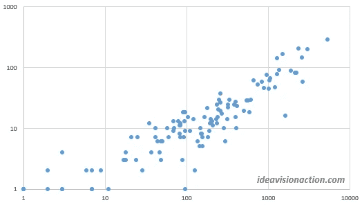
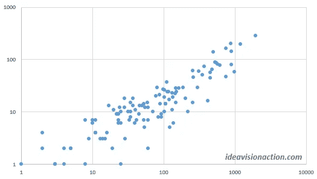

# 阅读率是将观众转化为粉丝的关键

> 原文：<https://medium.com/swlh/the-read-ratio-is-the-key-to-convert-viewers-to-fans-3427e95b7f8f>

[kaboompics/pixabay](https://pixabay.com/en/man-reading-touchscreen-blog-791049/)

我分析了影响我中等数据的七个因素，并在一系列博客文章中发表了我的发现。我以为昨天的帖子会是这个系列的最后一篇。我计划等待另外 100 篇帖子来收集新数据，并进行类似的分析。

我错了。我对这些数据的研究并不完整。我只分析了观点和粉丝。我忽略了读数。在写昨天的帖子时，我试图为那个决定找理由。我不能。

**没有理性的理由去忽略这些读数。**相反，阅读量与粉丝的相关性略高于浏览量。浏览量与粉丝的相关度为 91.9%，阅读量与粉丝的相关度为 92.4%。

Fig. 1\. Fans vs. Views

如果仔细观察图 1 和图 2 中的散点图，就可以看出这种差异。图 2 中的点比图 1 中的点稍“紧”。这意味着我们最好也注意一下读取统计。

Fig. 2\. Fans vs. Reads

> ***读者在观点和粉丝之间架起一座桥梁。***

**分析读取的统计数据**

这一次，我不想像对待观点和粉丝那样随意地进行分析。我想根据之前研究的结果做一个结构化的分析。

我会想出一套假设，用数据来检验。在做这些测试的时候，我可能会碰到我没有想过的假设。我也会举报他们。

这是我将要分析的因素的概述。

**发表文章发表在**

这是一个有趣的因素。我的帖子在初创刊物[上发表后，浏览量增加了 10 倍。然而，这 10 倍的因素并没有转化为球迷。我的帖子在创业刊物上获得了四倍多的粉丝。](https://medium.com/swlh)

创业出版物的读者对帖子有更高的期望。我会分析这些期望。我会努力提高我在创业刊物上的文章的阅读量和粉丝量的比率。

**帖子的标题**

帖子的标题对拉读者有很大的作用。我的初步研究表明，它也在阅读比率中发挥作用。

> ***如果标题在情感上向读者收费，阅读率似乎更高。然而，这种情感上的控诉是一把双刃剑。***

读者可能会讨厌你的论点，并阅读你的帖子，看看你错得有多离谱。或者他们会喜欢你的论点并阅读它来最大化他们的积极体验。从粉丝数量上就能看出这一点。

遗憾的是，Medium 上没有像脸书那样的反应按钮。一张愤怒的脸或一颗心比拍手的次数更能说明问题。这是媒体的一个缺点，但这是另一篇文章的主题。

**帖子长度**

我读到过帖子长度和阅读率之间有很强相关性的说法。根据我从粉丝与浏览量比率得出的结论，我不认为会是这样。目前我没有任何证据。这将是我用数据检验的假设之一。

**帖子的可读性**

我相信这将是影响阅读率的两大因素之一。另一个是帖子的情感冲锋。

我的初步观察指出，增加网页副本的可读性比我想象的要难。在以后的文章中会有更多的介绍。

**星期几和帖子标签**

老实说，我不知道是星期几还是标签在阅读量和浏览量的比率中起了作用。这是件好事。以开放的心态开始分析总是比从一套信念开始要好。

**对待研究的正确心态**

即使我对其中一些因素的影响有一些信念，我也不会做这个分析来证明自己是对的。

> 我宁愿犯错，学点东西，提高自己的统计数据，也不愿证明自己是对的。

**优化你的属性的陷阱**

在分析和优化你的中等属性时有一个陷阱。您可能会过度优化一两个统计数据。

> ***这些统计数据很重要，它们为内容营销业务增加了价值。需要在这种背景下看待它们。***

以牺牲其他参数为代价来过度优化一个参数是可能的。比如我可以写一篇刺激性的，提高阅读率。然而，这种高阅读率不会转化为粉丝、追随者和电子邮件时事通讯订阅者。

**结论**

阅读率比我最初认为的更重要。这意味着我要分析不同因素对阅读率的影响。

我认为一篇文章的情感冲击和可读性对阅读率有着最大的影响。我特别好奇怎么才能提高可读性。

我相信在网页文案的可读性方面有很多值得借鉴的地方。这些教训可能对内容营销业务的底线有很大影响。因此，接下来我将分析可读性。我在这里发布我的经验教训。

**轮到你了**

*   你怎么看待一个帖子阅读率的重要性？
*   影响读取率的因素有哪些？我漏了一个因素吗？
*   这个分析大家有什么建议吗？
*   在分析读取率统计数据时，有什么因素需要我考虑吗？

***如果你觉得这篇文章很有价值，注册*** [***每周简讯***](https://ideavisionaction.com/email-newsletter/) ***就能收到我关于创业、企业家精神、领导力和自我提升的文章综述。***

## 这篇文章发表在 [The Startup](https://medium.com/swlh) 上，这是 Medium 最大的创业刊物，有 317，238+人关注。

## 在这里订阅接收[我们的头条新闻](http://growthsupply.com/the-startup-newsletter/)。

