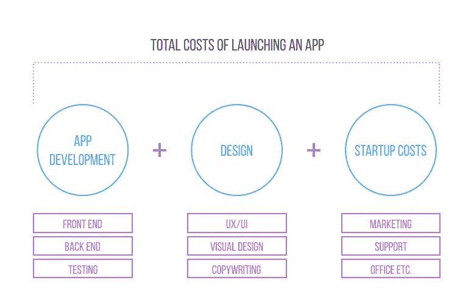
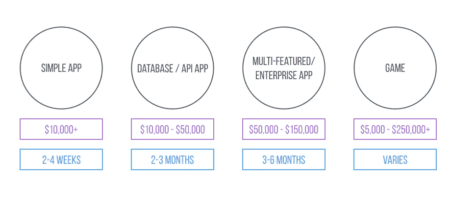
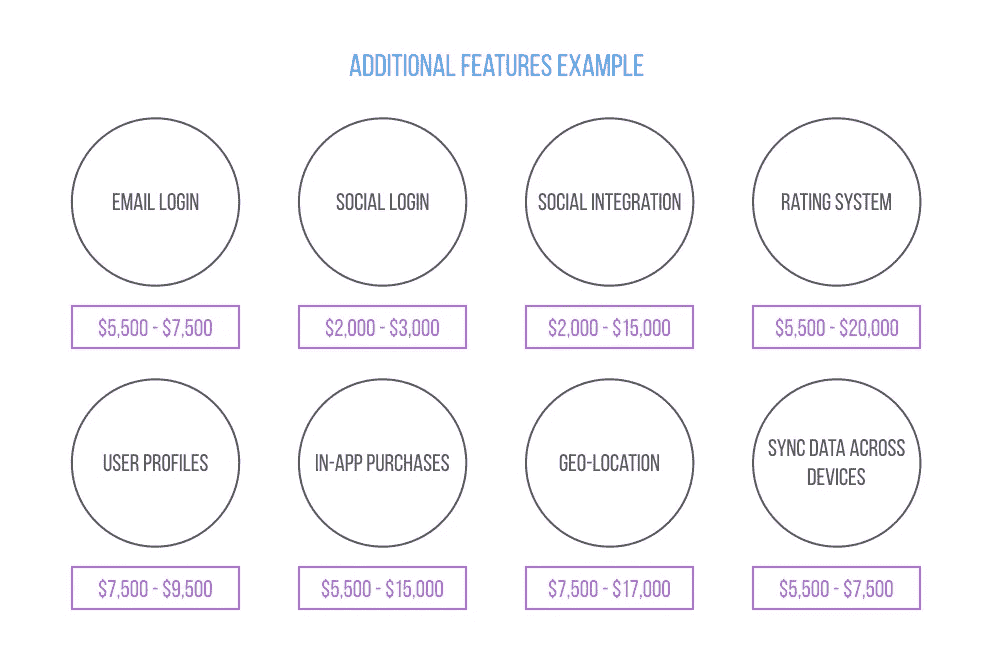
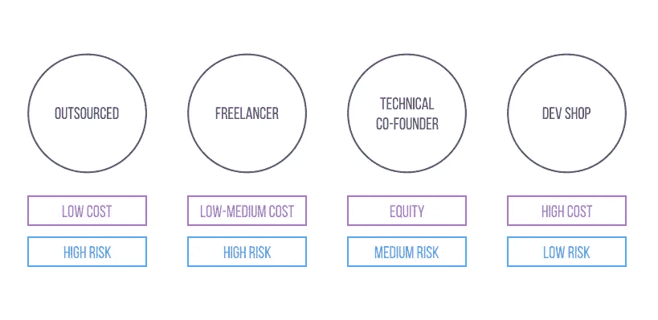
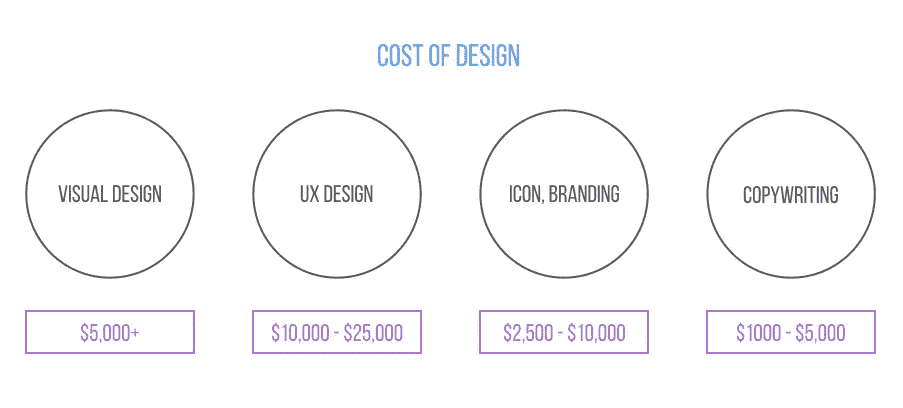
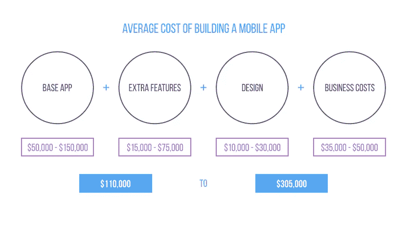

# 构建一个应用程序的真实成本

> 原文：<https://medium.com/swlh/the-real-cost-of-building-an-app-1db06476a39a>

Originally published on [http://www.appsterhq.com](http://www.appsterhq.com/?utm_source=CP&utm_medium=Medium)/

## 理解应用程序开发成本结构的迷你指南

是的，手机正在接管世界。没错，app 经济正在蓬勃发展，创业从未像今天这样火爆。

根据 comScore 最新的[研究](http://www.comscore.com/Insights/Presentations-and-Whitepapers/2016/2016-US-Cross-Platform-Future-in-Focus)，手机现在代表了 65%的数字媒体时间，而桌面已经成为“第二接触点”

去年，应用商店的总收入达到了[280 亿美元](http://www.zdnet.com/article/apples-app-store-2016-revenue-tops-28-billion-mark-developers-net-20-billion/)，而开发者从应用销售中获得了超过 200 亿美元。

# 什么样的 App？

开发一个应用程序就像买一辆汽车——除非你知道细节，否则不可能说出它的价格。你要找的车可以是价值 1 万美元的现代汽车、8 万美元的特斯拉汽车或 10 万美元的卡车。

首先，有不同种类的技术。然后，还有特色。让我们来看看这项技术:

*   **“原生移动应用”**表示该应用是用与该应用设计平台相同的编程语言编写的。例如，对于 iOS 来说是 Swift，对于 Android 来说是 Java。这些应用通常更快、更可靠。他们可以使用手机的功能，比如摄像头和通讯录。它们通常比其他应用程序更贵。
*   **跨平台应用:**跨平台应用类似于本地应用，但它们是通过本地应用商店分发的 web 和本地技术的组合构建的。它们可以在两个平台上运行，但是不能访问电话功能，并且设计起来很成问题，因为两个平台有不同的约定。
*   **渐进式网络应用:**这是谷歌的最新技术。这是一款网络应用，你可以通过浏览器访问，但拥有原生应用的大部分功能和感觉。它们非常容易安装；你只需访问网站并将其添加到主屏幕。这解决了原生应用程序的漏洞，在这个过程中失去了大约 20%的新用户。不过，iOS 不支持它们。

# 什么样的功能？

如前所述，特性决定了最终成本。一般来说，移动应用程序可以分为四大类，这取决于开发它们所涉及的工作量。

*   **简单应用:**这将是一个有三个或四个屏幕的应用，提供一个基本功能，不存储任何数据。一个例子是计算器或计时器。
*   **数据库/ API 应用:**如果你的应用需要在用户的设备或远程服务器上存储一些数据，那么你需要更复杂的东西。如果它需要用户注册和登录，在多个设备之间同步数据，或者你有很多内容要利用，你的应用程序就属于这一类。
*   **多功能/企业应用:**如果你正在寻找提供几个关键功能和一个完全定制的用户界面设计来满足用户的需求，这是你的类别。时间框架和价格可以根据项目的范围而变化。
*   **游戏:**和其他应用一样，游戏的复杂程度和功能各异，价格也相应变化。除了应用程序开发，游戏还需要高质量的用户体验、故事板和吸引用户的机制，这增加了总成本。

你可能会为一个简单的应用程序支付高达 8 万美元。基本的数据库应用程序从 10 万美元到 15 万美元不等，而更高级的多功能应用程序将花费 15 万美元到 25 万美元。游戏很难估算，因为根据质量，它们的价格可能在 100，000 美元到 250，000 美元以上。

送货时间也各不相同。简单的应用程序需要几周到一个月的时间，数据库应用程序需要三个多月，更复杂的多功能应用程序需要三到九个月。

# 附加功能

此外，还有一些额外的功能开始发挥作用。除了基本功能之外，您可能还需要一些其他功能，如电子邮件登录或地理位置跟踪。以下是一些示例及其定价:

*   电子邮件登录:大多数应用程序都有一个非常简单的功能。原因是收集电子邮件对你的营销工作非常有用。
*   **社交登录:**登录，例如，脸书、推特或谷歌。同样，从营销的角度来看非常重要，因为社交登录为你提供了重要的用户数据。
*   **社交整合:**允许应用在用户社交媒体上发帖的功能。它可以通过“口口相传”和“病毒式”营销来推动你的应用增长。
*   **评分系统:**大拇指向上/向下或对内容的评分等等。这对于有大量用户生成内容的餐厅点评应用程序或食谱应用程序非常有用。
*   **用户配置文件:**如果您想允许用户创建自己的用户配置文件。比如对于一个社交 app 或者拼车 app。
*   **应用内购买:**使用“应用内购买”向用户收取应用内附加功能、下载和服务的费用
*   **地理位置:**定位用户或收集关于他们地理位置的数据。这可以帮助你让他们的经历与他们更相关，并收集有价值的数据。
*   **跨设备同步数据:**如果你正在构建一个任务管理应用程序，你的客户将在桌面和移动设备上使用。

社交登录和整合等简单功能可能会增加 3000 美元到 15000 美元的成本。更高级的用户简档或地理位置可以在基本成本上增加大约 7500 美元或更多。

# 谁来建？

由谁来开发你的应用程序对成本的影响和它将拥有的功能一样大。但是在应用程序设计中，一个便宜且简单的最小可行产品效果很好；在选择你的开发商时，你必须小心。

便宜不一定更好；事实上，这可能是一个大错误。我们稍后会谈到这一点。

如果你想开发一个应用，你有几个选择。他们包括离岸团队、自由职业者、技术联合创始人和一个成熟的开发团队。

它们都有一些积极和消极的方面。例如，当谈到离岸团队时，他们可能是你最便宜的选择。这意味着你将在印度或俄罗斯雇佣一个团队，远程工作。

价格很低，但是风险在于最终产品的质量。你看不到你将与之合作的人，通常这些商店没有什么可展示的，因为真正成功并赚了数百万美元的应用程序很少是这样构建的。

然而，你将得到的是一个团队。你得不到的，相比一个开发者店铺，是一个羽翼丰满的团队；由产品经理、设计师、开发人员等组成的团队。

你也可以从自由职业者网站上雇佣一名自由职业者。这和离岸公司类似。好的开发者很贵。你可以雇佣一个学生或者一个朋友，但是工作可能会慢很多，而且会表现出缺乏经验。

如果你是一个有着良好记录的商业人士，技术合伙人是一个很好的选择。这是因为吸引顶尖人才并让他们把职业生涯押在你身上并不容易。

有很多人接近这些人，尤其是那些“有想法的人”，他们会说“我真的不知道我在说什么，但我刚刚想到了下一个脸书”。我需要你做的只是所有的工作，以换取它将会赚到的亿万美元的百分之五。”

联合创始人的报酬是股权，可能是一笔不可思议的资产。

开发商商店是这里最贵的选择；他们和技术合伙人一样，也是打造伟大产品的最可靠途径。

一些开发者商店很有创新性，并拥有票房收入最高的应用。他们为您提供了一个成熟的团队，以及制造和运输成功产品的经验。

然而有些是没用的，你只会为糟糕的工作付出代价。你必须明智地选择。

看看他们的声誉，评论，奖项，最重要的是，跟踪记录。和他们以前的客户谈谈，见见他们的团队。看看他们对你的成功有多投入。不要跟你遇到的第一个开发商走；这是一个重要的决定。

# 产品第一

你必须意识到的一件事是，这不是你花了多少钱的问题，而是你要制造出多好的产品。

Instagram 两年卖了十亿美元。他们花了大约 25 万美元建造了一个原型。与退出价值相比，成本是 50，000 美元还是 500，000 美元没有区别。

重要的是他们制造了一个成功的产品。你可以省下 50，000 美元，但如果这意味着生产一种只会让你蒙受损失的劣质产品，那又有什么用呢？

换句话说，是的，钱很重要，但产品是第一位的。

# 设计成本

大多数人错误地认为设计就是它看起来的样子。人们认为这是一种装饰——设计师们拿到这个盒子，然后被告知，‘把它做得好看点！’这不是我们所认为的设计。不仅仅是看起来像什么，感觉像什么。设计就是它的工作方式。“史蒂夫·乔布斯

不管你的技术有多棒，如果你的设计很烂，没人会用你的应用。尽管围绕设计的角色有很多误解。

说清楚一点，设计和你的技术一样重要。是用户看到的和交互的。它是销售你的应用程序和它背后的想法。最终，这是促使他们注册并长期使用该应用的原因。

设计在解决用户的问题中起着关键的作用。如果你想开发一个有利可图的应用程序，你必须把产品开发的这一方面和技术方面结合起来。

# 应用程序设计:分解它

说到应用程序设计，有几个方面。这些包括:

*   **视觉设计:**它赋予你的应用程序外观和感觉。视觉设计的重要性可以用产品设计的偶像迪特·拉姆斯的一句话来概括:“产品的美学品质是其实用性的组成部分，因为我们每天使用的产品影响着我们的个人和福祉。但只有执行得好的对象才可能是美的。”
*   **UX 设计:** UX 设计是关于它是如何工作的。它是设计中的一门学科，研究用户行为，并使用数据来设计用户体验，以交付特定的结果。结果可能是任何事情，从参与或成功入职到让产品成为用户生活的一部分。
*   图标、标志和品牌:品牌是一种强大的资产。事实上，根据彼得·泰尔的观点，仅仅是品牌就能让你在市场上获得垄断地位。以苹果为例。无论你是否同意，你都需要至少在图标和标志设计上投入资金。图标是让你在 App Store 中受到关注的东西，对用户决定下载你的应用有很大的影响。
*   文案:最好的用户体验是激发和强迫的文案。识别与你的应用品牌相匹配的语音和语调风格需要很大的努力。要做到这一点，你需要一个有说服力的文本，激励用户探索应用程序。它应该清楚地说明好处，并帮助用户理解使用它的不同功能的价值。

图标、标志和文案的价格在 500 到 2000 美元之间。对于 UX 和视觉设计，预计支付更多。一家专业的 UX 设计公司一个项目的收费高达 20，000 美元。

大多数开发者商店会为你提供他们自己的设计团队。从图标和视觉设计到 UX 设计，你都可以做到。

如果你想在内部完成，雇佣设计师的费用会有很大差异。预计支付至少 50 美元每小时的低端和高达 250 美元每小时的高级 UX 设计师。

还要记住，UX 的设计是一个正在进行的事情。你永远不应该停止学习、测试和改进。另一方面，图标设计需要每隔几年重新设计一次。

# 启动成本

让我来毁了它。“建立它，他们就会来，”这是 bullsh*t。这一技术行业的口头禅在失败的网络繁荣时期得到普及，出于某种原因，它仍然存在。这是骗人的。

你必须在销售和市场营销上投资。为什么？因为你的应用程序，不管执行得多好，仍然可能是一个失败者。事实上， [59%的应用程序](https://arstechnica.com/apple/2012/05/ios-app-success-is-a-lottery-and-60-of-developers-dont-break-even/)甚至赚不到足够的钱来平衡他们的开发成本。

大约 12%的应用程序开发者每年的应用程序商店收入超过 5 万美元。最新数据显示，超过 94%的收入流向了[1%的货币化应用](https://sensortower.com/blog/app-store-one-percent)。

数据显示，主要的区别在于，赔钱者将零美元的总开发成本用于营销，花在销售和营销活动上的时间不到 5%。

在 App Store 中，要获得关注，你需要点击图表，要点击图表，你需要在短时间内获得大量用户。没有付费营销，几乎不可能。

但是不要指望仅仅在广告上砸钱。你最终会失去大部分。应用营销是一门科学，旨在找出能够带来投资回报的最佳商业模式。

为此，您需要测试多个通道并比较数据。我能给你的最好建议是早点开始。当你登陆 App Store 时，确保至少有数百名用户在排队等待发布。

扩大用户群会耗费你的金钱和时间。很多。找出正确的商业模式的成本可能会有很大差异，但你应该留出至少 35，000 美元用于你的销售和营销工作。

# 还有更多

显然，还有更多。除了销售和营销，你还需要支付 App Store 和 Google Play 费用、服务器和后端支持、客户支持、会计和法律成本、办公或联合办公空间以及进一步的开发成本。

# 把所有的放在一起

那么，你应该预算多少呢？还是那句话，情况各不相同。但客观来看，最近由 Clutch 对 12 家领先应用程序开发商进行的调查显示，开发一款移动应用程序的费用从 3 万美元到 70 万美元不等。

根据开发一个应用程序所需的平均时间，该网站计算出每个应用程序的平均成本为 171，450 美元。

根据 Enterprise Mobility Exchange 在 2016 年[对全球 300 名高级移动从业者的调查](http://www.ucinsight.com/latestnews/new-report-provides-snapshot-of-the-global-state-of-enterprise-mobility/)，未来 12-18 个月最常见的预算规模是 25 万美元到 50 万美元。但那是为了公司预算。

从更长远的角度来看，建立一个像 Instagram 或 WhatsApp 这样简单的 MVP 可能会花费你 10 万到 25 万美元。像优步这样的应用程序的 MVP 需要至少 100 万美元的投资。

基于以上数据，你需要做出自己的分析。

> 最初发表于 http://www.appsterhq.com/的

