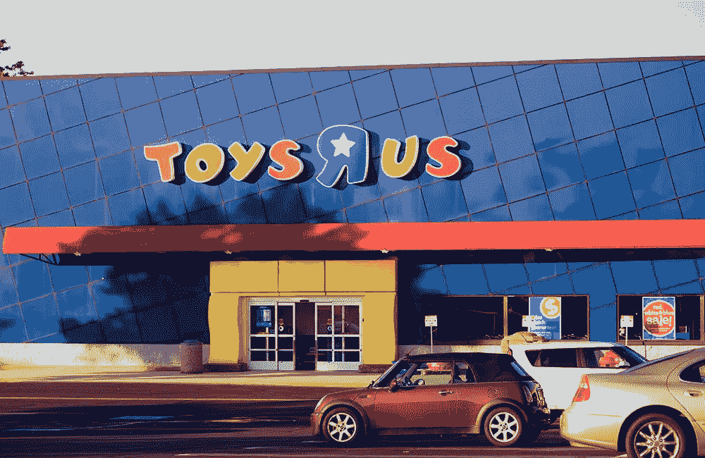

# 玩具反斗城破产的真正原因

> 原文：<https://medium.com/swlh/the-real-reason-toys-r-us-went-bankrupt-a0b726a95681>

## 当公司忽视文化变化时，他们就死了。

这就是为什么[优步](https://www.influencive.com/uber-drivers-face-reality-self-driving-robot-cars/)能够扰乱出租车行业，为什么 Airbnb 能够扰乱酒店。

这也是 iTunes 能够取代唱片商店的原因。

《广告周刊》最近的一篇[文章](http://www.adweek.com/brand-marketing/toys-r-us-wants-to-be-a-champion-of-play-with-new-brand-positioning-that-highlights-playtime/)评论了玩具反斗城推出的品牌重塑:

> 据首席营销官卡拉·哈桑称，这家位于新泽西州韦恩市的连锁店本月早些时候申请破产，但这并不是更名背后的原因。哈桑说，我相信我们有一个美丽的品牌，它需要重塑。"

> 对*来说，彻底改造已经太晚了。*

这个品牌需要 ***一次彻底改革。玩具反斗城不再提供进入他们的商店并与之做生意的理由。因此，人们开始简单地在亚马逊上订购东西，因为这样更快更容易。***

玩具反斗城并没有提供比你我在网上能买到的更多的东西。出租车、旅馆和唱片店也是如此。他们建造了自己的坟墓，因为缺乏观察，缺乏主动性，也因为看不到为什么他们对这个世界仍然重要。

一个恰当的例子是，Pirch 扰乱了价值 400 亿美元的奢侈品零售市场，这里有完整的报道。通过挑战对他们所能做的一切的期望，打破规则(和记录)。

# 让交易取代品牌相关性

正如 Deborah Weinswig 最近的一篇文章中所说的，“集团运营亏损从一年前的 700 万美元增加到了 5400 万美元。”

*见鬼，为什么我和西南航空的员工在一起比和玩具反斗城的员工在一起更开心？*

> 当任何品牌忘记传递价值、人际互动、信息、乐趣和发现时，它就会进入“自动模式”，将与品牌的整个关系简化为进行交易，并忘记提供更多的地方来检查你的商品。

人类的互动和创造力是至关重要和有意义的。提供一个收银台，一个放置你所购物品的柜台和一个收银机是不行的。当一个品牌走上这条路，他们变得自满，懒惰。无聊又可预测。他们本质上是在做最低限度的工作，而不是提供他们品牌中最有灵感的部分。

所以是自满扼杀了这个品牌，而不是其他“外因”

# 玩具反斗城能做些什么？

他们本可以提供“探索室”或带有数字设备的“即插即用”房间。或者是专门用来制作你自己的电视节目的空间，比如 HGTV 工作室，供孩子们使用他们出售的迷你厨房设备。然后孩子们和他们的父母可以上传到他们自己的脸书页面，并在 YouTube 上展示。我闻到了病毒视频的味道吗？孩子们和他们说的做的聪明事？

换句话说，他们可能已经意识到他们提供了一个玩耍的世界，而不仅仅是一个购买玩具的地方。

# 发出声音或者不被听到

每个品牌都需要一个声音。要变得相关，要变得有意义，你需要注意，而这正是玩具反斗城忘记做的。

*在这种情况下，零售玩具巨头更像《彼得潘》中的罗宾·威廉姆斯，他已经忘记了如何玩耍、娱乐和微笑。*

这是任何品牌都不会忘记的事情。

图片来源:【Shutterstock.com 

## 《鲨鱼池》的戴蒙德·约翰写道:“大卫会告诉你，你不一定要有钱。是一种心态。这实际上是表现得好像你没有钱一样，并强迫你发挥创造力，行使我所说的‘破产的力量’。”

## 想要完整收集品牌转型的 33 个步骤吗？

## 然后在这里拿你的副本。

*本文原文发表于 2018 年 1 月*[*www.influencive.com*](https://www.influencive.com/real-reason-toys-r-us-went-bankrupt/)*。*

## 这个故事发表在 [The Startup](https://medium.com/swlh) 上，这是 Medium 最大的企业家出版物，拥有 306，792+人。

## 在这里订阅接收[我们的头条新闻](http://growthsupply.com/the-startup-newsletter/)。

