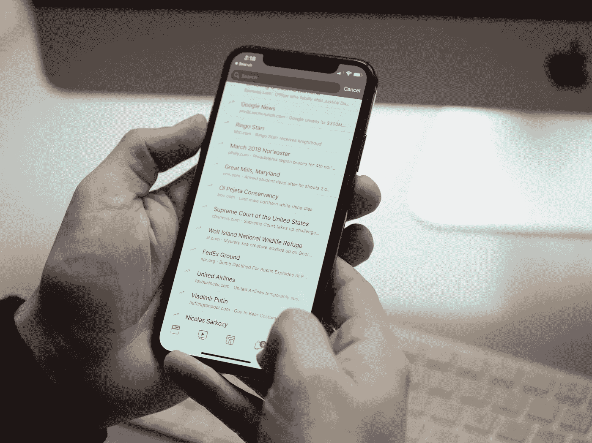

# 扎克伯格“安全宣言”的真正要点

> 原文：<https://medium.com/swlh/the-real-takeaway-from-zuckerbergs-security-manifesto-4fe3dc200859>

9 月 12 日，脸书首席执行官马克·扎克伯格在他自己的平台上发表了这篇文章，宣称他正在“写一系列笔记”，概述他对“脸书面临的最重要的问题——包括抵御选举干扰，更好地保护我们的社区免受滥用，以及确保人们更多地控制自己的信息”的看法

它的标题是“为选举做准备”，出版后不久， *TechCrunch* 发表了一篇关于“史诗般的安全宣言”的文章，我只能称之为[的吹捧文章](https://techcrunch.com/2018/09/13/zuckerberg-strikes-back/)，信以为真地采纳了扎克伯格的直觉、解释和预测——例如，大胆地断言扎克伯格已经“准备好战争”反对选举干预。但这不是你应该从阅读扎克伯格的文章中学到的。

相反，我们应该知道，这个平台显然是在和自己战斗。像脸书这样的社交媒体公司通过可以预测和操纵人类行为的技术赚钱，这意味着削弱这种技术在许多方面与他们自己的激励结构相矛盾——削弱第三方恶意行为者的这种能力，同时仍然试图增强公司的这种能力。

正如*卫报*的奥利维亚·索隆[早在 2016 年写的](https://www.theguardian.com/technology/2016/nov/15/facebook-fake-news-us-election-trump-clinton)，“脸书的商业模式依赖于人们点击内容，而不管真实性，阻止任何这种分享会干扰核心用户行为。”换句话说:确认偏差不是脸书的问题；是[人的问题](https://www.wired.com/2016/11/facebook-echo-chamber/)。那些最容易受到假新闻影响的人群可能是因为他们的信仰只是被证实了。但是，当你的钱来自于让人们盯着你的平台时——就像脸书的情况一样——也没有明显的激励去对抗这种确认偏见。(扎克伯格在文章中承认了这一点，他讨论了调整广告政策，但没有从根本上改变这些广告的显示方式。)

一年后，Josh Constine [写了](https://techcrunch.com/2017/09/21/election-interference/)类似的文章(实际上是为 *TechCrunch* 写的)，评论脸书当时宣布的抑制选举干预的计划:“规模不能成为借口。不通过销售人员的程序化广告购买是脸书发展如此之大和盈利的原因。这些利润必须重新投入到防止滥用的人类和算法安全措施中。”

当你的整个组织建立在收集和分析个人数据的基础上，然后利用这些分析来最大限度地提高每个用户的参与度时，当假新闻、钓鱼和仇恨言论渗透到你的平台话语中时，肯定会有一些成本效益在起作用:危害如此严重，以至于值得降低你赚钱算法的效力吗？正如扎克伯格本人[所说](https://www.facebook.com/notes/mark-zuckerberg/preparing-for-elections/10156300047606634/)，

> 这些问题变得更加困难，因为人们不同意什么是好的结果，或者什么样的权衡是可以接受的。

通过在线平台实现的大规模社会工程对民主和自由、独立的话语构成了一种近乎存在的威胁，如果不是存在的话。这个问题对世界上许多国家来说并不新鲜，几十年来，甚至几百年来，这些国家对合法选举的尝试一直被世界大国所操纵。然而，这个问题在企业方面比以往任何时候都受到更多的关注——因为脸书和谷歌等跨国企业集团被迫面对在其平台上出现的真相问题。

需要澄清的是，我并不是说脸书没有努力，也不是说扎克伯格满嘴谎言。他在文章中清晰地阐述了该组织已经采取的步骤，如撤销虚假账户，使用无党派的事实检查员，以及雇用更多的安全专业人员。(尽管，我会注意到，如果没有像 GDPR 那样强有力的监管，“确保人们对自己的信息有更多的控制权”的说法很可能是虚假的；在没有政府影响的情况下，企业几乎从不关心数据隐私。)

我的观点很简单:预测和操纵人类行为的系统对于社交媒体平台和现代广告实践至关重要。如果这些系统在产生难以估量的利润的同时放大了危害，那么公司将自我监管的说法至少应该受到质疑——如果不是被贴上明显错误的标签的话。当民主和自由、合法的言论悬而未决时，不值得冒这个险。

## 这篇文章发表在 [The Startup](https://medium.com/swlh) 上，这是 Medium 最大的创业刊物，有+369，262 人关注。

## 订阅接收[我们的头条](http://growthsupply.com/the-startup-newsletter/)。

