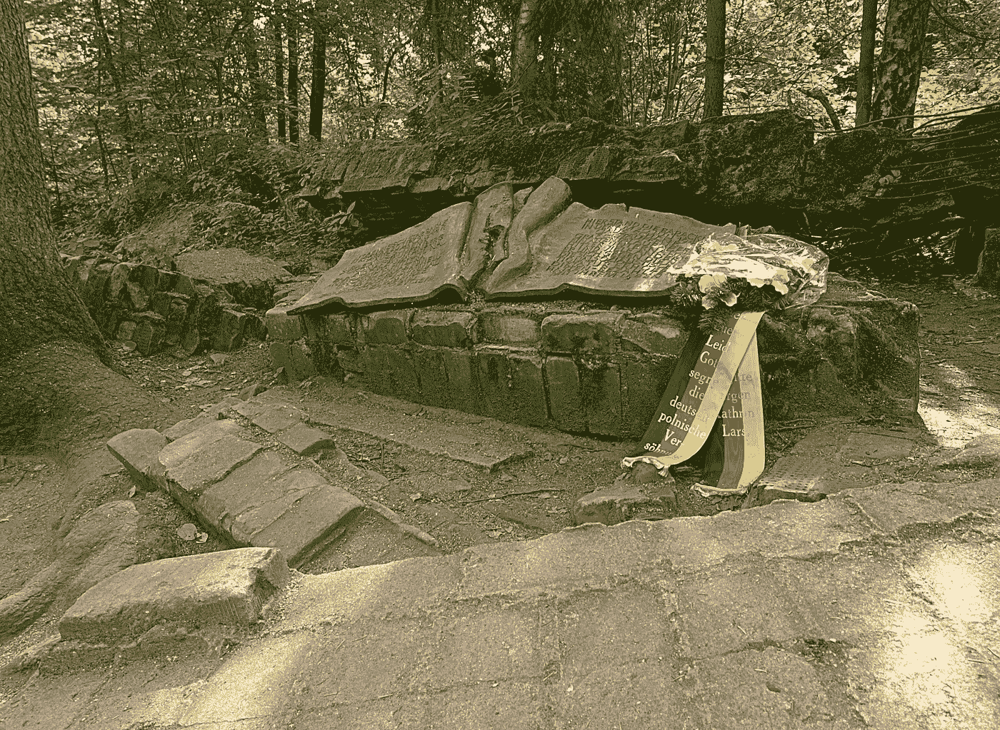

# 第三帝国的重新崛起

> 原文：<https://medium.com/swlh/the-reascension-of-the-third-reich-c8e9a9bc7d62>

一个伪证者会在我们的最高法院保留一个席位吗？布雷特·卡瓦诺的非法席位对美国民主构成了迄今为止最严重的威胁。

Aliza Janiv, mixed media, 2016

这个国家已经失去了最后一块民主盔甲:最高法院。与此同时，世界目睹了美国政治体系的不断崩溃。卡瓦诺担任最高法院助理大法官的新职位——尽管有性侵犯指控和候选人宣誓说谎的确凿证据，这一职位仍得以实现——是对我们民主制度曾经赖以存在的少数几个支柱的最新打击。

为了推进一小部分全球人口的议程，政治中的伦理道德已经被公然和无耻地扔出窗外，取而代之的是民主美国价值观的毁灭以及事情将变得多么糟糕的悲惨预兆。

自唐纳德·特朗普(Donald Trump)竞选总统以来，历史学家一直将美国与纳粹德国进行比较和对比，经常发现令人不安的相似之处。随着世界从纳粹德国吸取教训，现政权越来越极权的性质很容易产生不可想象的黑暗事件。

美国政治的超极化使得左派越来越难以团结起来，因为它可以保护国家免受法西斯主义的侵害——这种现象包括伯尼·桑德斯和希拉里在他们的政党与川普对抗后，无法将除了对方以外的任何人视为对手——并促使美国人民屈从于[“国外的威权主义者”](https://www.nybooks.com/articles/2018/10/25/suffocation-of-democracy/?fbclid=IwAR2W7FHWUaRlWf81u0nRfAbpA5vQuMihd_Cf_646H-StdrShGE23exeQA6k)

当今的美国和 20 世纪 30 年代的德国之间惊人的相似之处，引发了美国人正在经历相当于第三帝国重新崛起的恐慌。在这两个政权中，教育对选民偏好的惊人影响描绘了我们可以预期的当前和长期后果模式。

专家在特朗普当选后报告称，低教育水平与投票给他的人口相关。更令人担忧的是，随着我们下届总统选举的临近，他自上任以来一直在大力攻击教育系统，提议通过[大幅削减预算](https://www.usnews.com/opinion/knowledge-bank/articles/2017-05-23/donald-trump-and-betsy-devos-budget-would-destroy-public-schools)和[与劳工部合并](https://www.wsws.org/en/articles/2018/07/04/prop-j04.html)解散 DoE(美国教育部)。他的目标？来培养优秀的守法工人。希特勒通过用纳粹思想渗透德国教育达到了类似的目的。抵制灌输的教师被学校开除，学生们被要求行“希特勒万岁！”每天多达八次。

这两个暴君还迫害任何残疾人。希特勒最终甚至实施了安乐死计划，最终目的是“清洗”雅利安种族。特朗普上任仅两年，就在争取从特奥会中收回 1200 万美元的资金。这将导致非营利组织的捐款为零。

那么，白宫如何处理新政府与美国价值观完全脱节的问题呢？极差。迄今为止，最令人沮丧的进展之一是特朗普政府一名高级官员匿名提交的《纽约时报》专栏文章。

这位政治玩家是我们当前法西斯主义流行的缩影。*仅仅为了与历史的伦理方面保持一致而向公众发表的声明，与其对立的叙述是适得其反的* **。毫无疑问，这篇文章的写作意图是在后特朗普时代说，“嘿，那是我。”让我们不要忘记，在我们寻找这场噩梦即将结束的迹象时，论坛版的本质威胁着目前正在发生的任何抵抗运动。**

声明的匿名本身就是一个矛盾。它警告民主的敌人，他们正受到来自内部的破坏。另一方面，它假装白宫的人正在追求民主利益——降低了针对特朗普政策的广泛政治行动的可能性。

The ruins of the barracks and the obelisk in place to assassinate Adolf Hitler in 1944.

相比之下，策划暗杀希特勒的德国军官克劳斯·冯·施陶芬贝格上校为他的人民冒了生命危险。在针对希特勒的炸弹未能引爆后，他最终被处决。在这种情况下，抵抗是悄悄地、真诚地进行的，产生了真正的后果。我们的白宫专栏作家提供了一个与二战德国英雄的勇敢形成鲜明对比的例子——以国家的名义行事，而仅仅是推进一个自私的议程。

进步的幻觉是霸权操纵的一种危险而强大的策略。我们现在面临着另一个渗透到我们司法系统并逃避法律后果的罪犯。特朗普解雇了杰夫·赛辛斯，因为他拒绝干涉罗伯特·穆勒的调查，并任命右翼黑客马修·惠特克为代理司法部长。现在比以往任何时候都更需要你的声音。你可以悄悄地，单独地，或者通过集体行动来反抗，只要你在反对发生在美国土地上的独裁统治的斗争中保持积极和无私。

## 这篇文章发表在 [The Startup](https://medium.com/swlh) 上，这是 Medium 最大的创业刊物，拥有+398，714 名读者。

## 订阅接收[我们的头条新闻](http://growthsupply.com/the-startup-newsletter/)。

