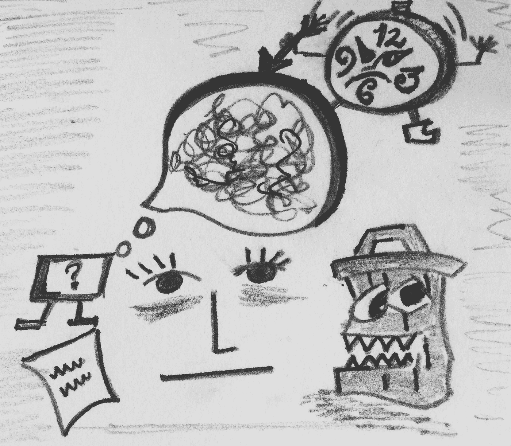

# 反叛者应对被封锁的创造力的技巧

> 原文：<https://medium.com/swlh/the-rebels-hacks-to-dealing-with-blocked-creativity-ba1ebd08863b>

没有什么比盯着屏幕，炫耀着创造力的苍白，消耗着大量的咖啡因，却什么都不做更让人目瞪口呆的了。当我们需要编织文字、创造艺术或设计一些东西作为我们日常生活中不可或缺的一部分，充满成年人的责任时，这种存在状态变得更加模糊。在这种情况下，我们凝视着白色的虚无…