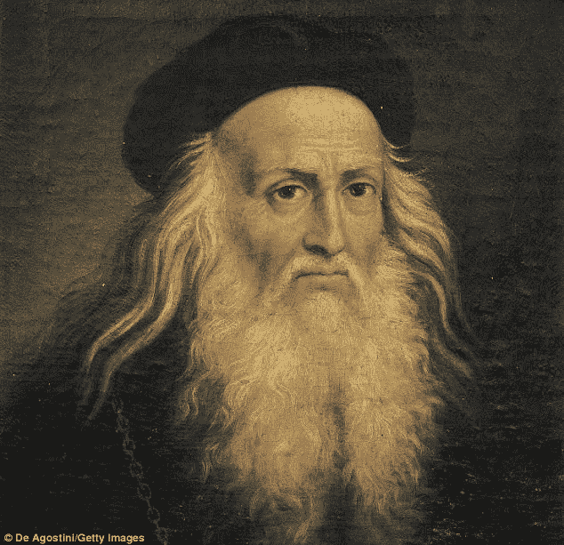

# 博学者的回归

> 原文：<https://medium.com/swlh/the-return-of-the-polymath-a860b0506c98>

## 在工业革命之前，将一个博学的人命名为博学的人似乎有点奇怪。

Da Vinci

如果你受过教育，你很可能在从哲学到生物学到数学的所有领域都有专长。

不同主题的分离似乎有点武断和不准确，因为每个现代主题领域在很大程度上都有重叠。

在三、四、五个领域拥有丰富的知识和技能是很正常的。

以达芬奇为例。一个以艺术品闻名的人，同时也是一个建筑和物理方面的天才，在科技发展之前就为现代直升机设计了蓝图。

然后是工业革命&思想和人的分隔化。

学校系统变得更加标准化，学科分开以简化课程设置过程。

在工作场所，专业化成为常态。无论是作为知识工作者还是工厂工人，工人都在一个特定的过程中专注于一个特定的任务。

因此，博学之士的想法就消失了，他对几个不同的领域了如指掌。

这种情况在很大程度上一直持续到今天，源于维多利亚时代的教育体系，我们未能对其进行现代化改造。

结果，这位学者成了一个罕见的现象。有些人很大程度上不得不依靠自己达到博学的地位，独立于学校或工作中的正规教育。

的确，我们确实学习了许多不同的学科领域，但是我们没有掌握任何一个领域。正如贝宝创始人彼得·泰尔指出的那样:

> “在中学，我们被鼓励开始囤积”课外活动。“在高中，雄心勃勃的学生为了显得无所不能而更加努力地竞争。当一个学生进入大学时，他已经花了十年时间整理令人眼花缭乱的多样化简历，为完全不可知的未来做准备。不管发生什么，他都准备好了——没什么特别的。”
> —彼得·泰尔

不管我们学了什么，大部分都与我们未来的工作无关。我们从事会计、法律、金融。作为成年人，我们变得越来越专业，就在这个时候，我们需要伟大的想法。

因为现代世界需要创新。需要发散思维。

你工作日重复和智力懒惰的日子已经一去不复返了。如果你继续这样，你就会被自动化。或者外包。

现代工作场所需要发散思维。它需要大的，创新的想法。

这些伟大的想法往往来自各种经验，以新的、有趣的方式结合在一起，其他人没有想到。

苹果来自于对编程、书法、乔布斯实验迷幻药的精通。

《战争与和平》来自托尔斯泰作为作家的高超技巧，同时也是拿破仑时代的历史学家。

好的产品设计可以来自用户体验设计或平面设计的背景，是的。但是通常伟大的产品会受到对行为心理学或文案的深刻理解的影响。

所以，无论是为了保护你的工作安全，还是为了让你的工作更伟大，问问自己下一步准备攻克什么技能？

## 这个故事发表在[的创业](https://medium.com/swlh)上，这是 Medium 最大的创业刊物，有 314，601+人关注。

## 订阅接收[我们的头条新闻](http://growthsupply.com/the-startup-newsletter/)。

