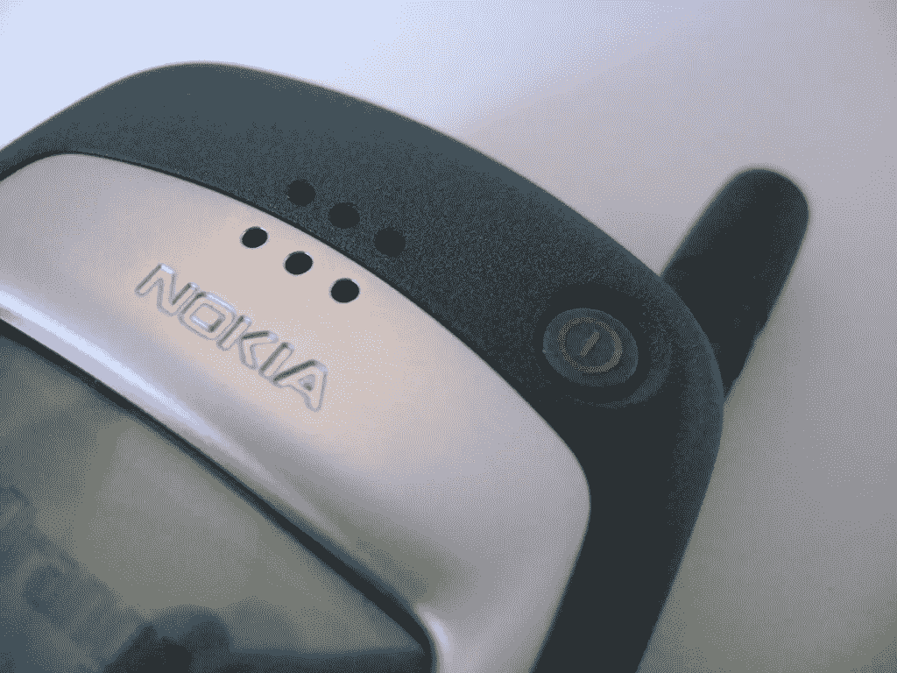

# 诺基亚的兴衰:一个发明家如何在手机上留下他的印记

> 原文：<https://medium.com/swlh/the-rise-and-fall-of-nokia-how-one-inventor-left-his-mark-on-mobile-c3adc945b76d>

Image Credit: [flickr](https://flic.kr/p/66eY22)

Christian Kraft *最近辞去了诺基亚首席创新和用户体验专家的职位，此前他曾在丹麦诺基亚担任了 14 年的概念创新和用户体验高级经理。*

在加入诺基亚之前，Kraft 在 Cetelco/Hagenuk 担任软件工程师和用户界面设计师，在索尼担任用户