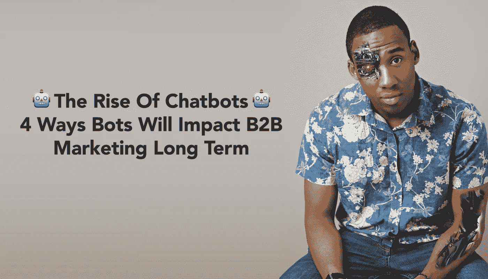
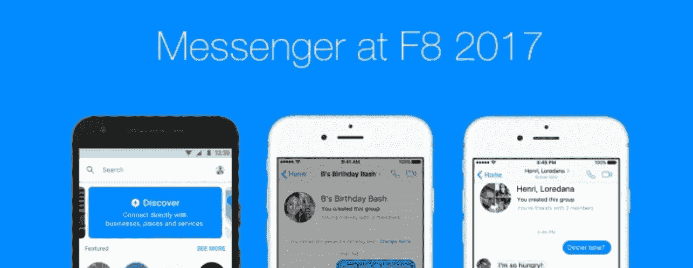
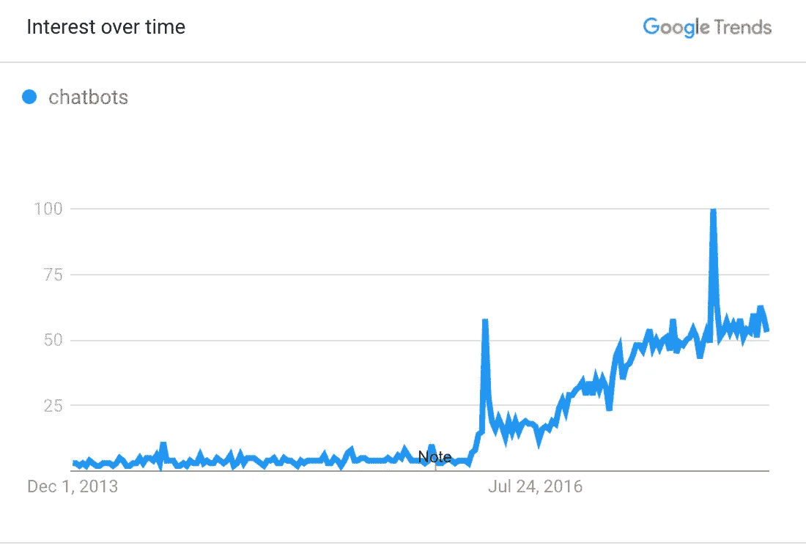
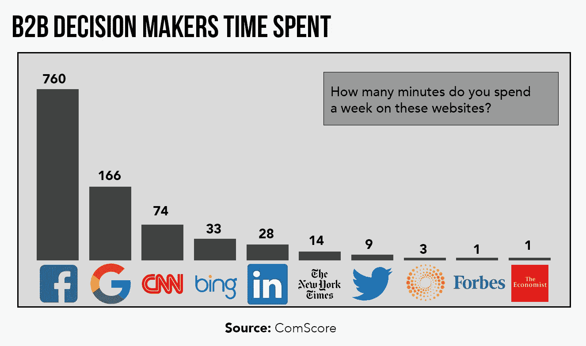
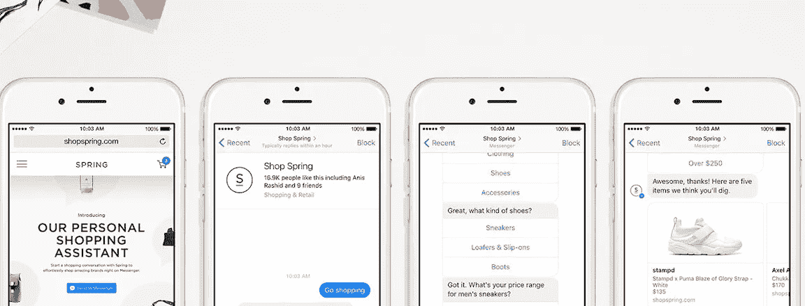
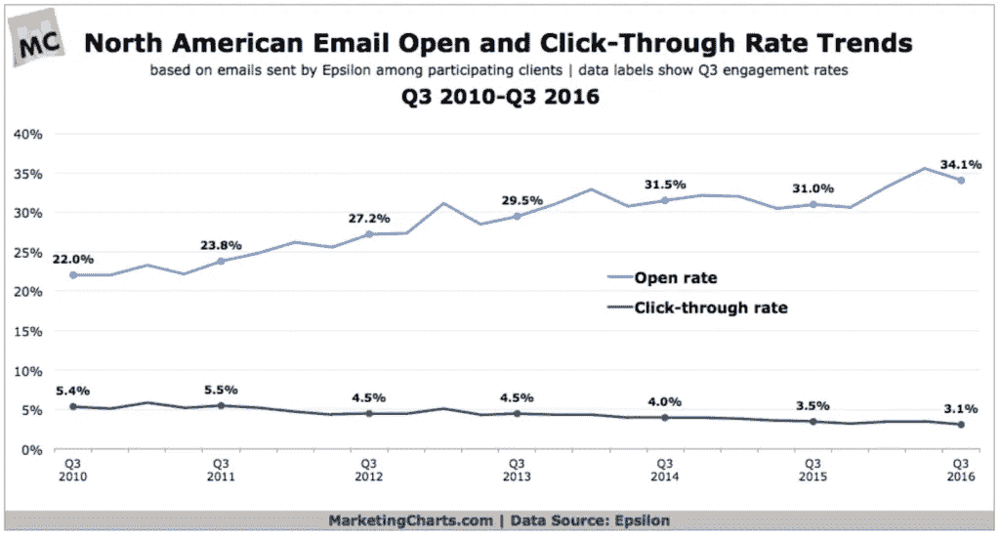
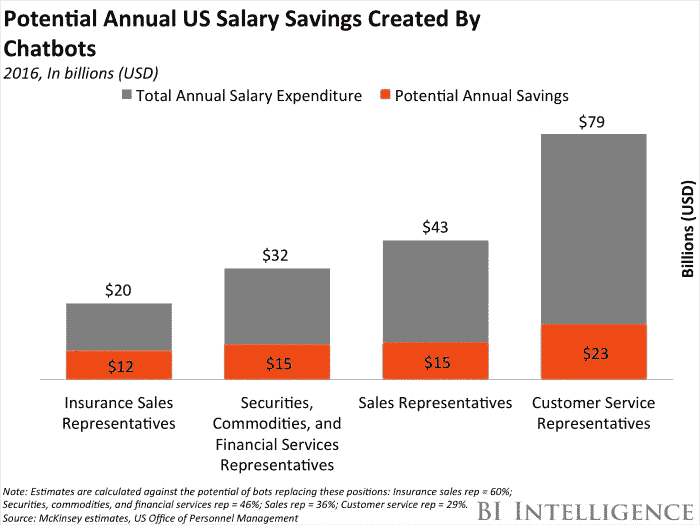
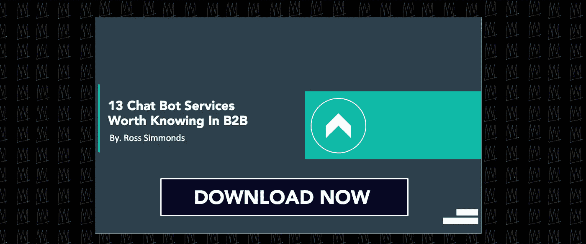

# 聊天机器人的兴起及其对 B2B 营销的长期影响

> 原文：<https://medium.com/swlh/the-rise-of-chatbots-and-how-they-will-impact-b2b-marketing-long-term-31c256c38a40>

到现在为止，我们大多数人都听说过这个故事。脸书创造了两个人工智能聊天机器人，这两个机器人在被关闭前变得不听话并创造了自己的语言。

**挺恐怖的对吧？**

事实是，这个标题并没有很好地描述当时的情况。

本质上，机器人的任务是交易球、帽子和书籍。他们要给每件物品赋值，然后互相交换。由于脸书团队没有奖励他们用英语谈判，机器人创造了他们自己的语言，这比使用英语更有效。

可怕吗？

**有点。**

激动人心？

**肯定。**

随着技术不断推动我们的想象力，它正在迅速将科幻小说的想法变成现实。聊天机器人的兴起带来了一些新的聊天驱动的商业模式，并且肯定会动摇更多的行业，而不仅仅是市场营销。但是说到 B2B，我觉得我们会看到相当大的影响。

想象一下，一个机器人可以管理你所有的对外销售工作。想象一下，一个机器人可以管理你的整个社交媒体。想象一下，你的绝大多数内向和外向营销工作都是完全自动化的。

**今天，这似乎有点牵强。**

但是已经有品牌和创业公司致力于创造一个与此完全相似的未来。B2B 品牌采用的更受欢迎的技术之一是聊天机器人的兴起。聊天机器人是一种服务，由规则驱动，有时由人工智能驱动，人们可以通过聊天界面进行互动。

# 1.机器人让脸书与 B2B 营销更加相关

在我们真正深入研究这些聊天机器人将会产生的影响之前，我们需要仔细看看它们最近的增长。就在去年，在脸书 2016 年 F8 会议上，脸书[宣布聊天机器人将成为 Messenger](https://techcrunch.com/2016/04/12/agents-on-messenger/) 的一部分，为世界各地的开发者在应用中创建自己的机器人打开了大门。在他们宣布之后的 6 个月里[，超过 30，000 个机器人被创造出来](https://chatbotsmagazine.com/facebook-messenger-2-0-the-game-changer-for-chatbots-e105cb18817b)。从那以后，脸书对聊天机器人的关注越来越强烈。

你可能会想:脸书不是 B2B 营销的地方。你为什么要告诉我这些？

我告诉你这个是因为根据 ComScore 的一项研究，B2B 专业人士实际上比任何其他渠道都更多地使用脸书:

这才有意义…不管你喜不喜欢，你卖给高管的人终究还是人。各行各业的人都通过脸书与朋友、家人和老同学保持联系。认识到这一现实，B2B 营销人员应该明白，脸书上的聊天机器人对他们来说可能和对 B2C 品牌一样重要。

在 F8 会议结束时，脸书的信息产品副总裁[在结束第一天的会议时说](https://chatbotsmagazine.com/facebook-messenger-2-0-the-game-changer-for-chatbots-e105cb18817b):

*“如果你将现有或未来的客户引导到 Messenger，而不是移动网页或应用程序，如果你建立了正确的体验，你肯定会看到提升。”*

这是一个明确的信号，表明他们认为这是品牌应该投资的东西。浏览一下[谷歌的趋势分析](https://trends.google.com/trends/explore?date=2013-11-30%202017-11-19&q=chatbots)工具，人们会注意到:

所以我们知道聊天机器人正在崛起。我们知道聊天机器人有能力撼动 B2B 营销。我们现在必须问的问题是，这到底会是什么样子，以及哪些区域会出现最大的中断。

让我们开始吧…

# 2.机器人可以加速 B2B 销售和营销过程

回顾脸书在他们的 Messenger 应用程序中使用机器人的情况，我们可以看到，这些聊天机器人正在成为领导者实际交流的第一个“人”。

让我们思考一下目前发生在 **B2B 购买流程**中的步骤。对于这个例子，让我们假设你正在寻找新的 CRM 软件，步骤是什么？

1.  **意识:**首先，你通过与一位同事交谈了解到这个问题，他提到他们有一个 CRM 工具，可以帮助他们更好地管理关系。
2.  **兴趣:**既然你已经意识到了这个问题，你就去谷歌上寻找顶级的 CRM 软件解决方案。
3.  **考虑:**结果铺天盖地。由于内容的激增，有数千页的搜索结果和一些突出不同选项的登录页面。
4.  **意图:**此时，你已经通过下载比较指南表明了购买 CRM 软件的明确意图，但是你必须回去工作了。
5.  **研究:**当你考虑要使用什么样的 CRM 软件时，无论你走到哪里，都会看到推销广告，你还会收到从你下载指南的网站发来的电子邮件。
6.  **决策:**这封邮件引起了你的注意，你决定安排一次通话。
7.  **购买:**在电话中，你被告知为什么这款 CRM 适合你，于是你注册了。

在整个购买过程中，聊天机器人有机会产生影响。在兴趣阶段，您可以利用任何登录页面上的聊天机器人来加快销售周期。虽然这个例子来自 B2C，但是 Spring 采用的方法是一个很好的例子来说明如何做到这一点:

登录页面 messenger 体验非常简单:

1.  用户会收到一个行动号召，告诉他们通过 Messenger 进行连接。
2.  聊天机器人可以向用户询问他们的需求。
3.  然后，机器人可以提供不同产品和服务的信息。
4.  机器人可以管理金融交易。

聊天机器人不需要实际导航到网站，搜索你想要的产品，然后通过本地购买过程，而是在不与任何人交谈的情况下轻松完成购买过程。

但是机器人真的能帮助完成销售吗？

绝对的。

机器人可以帮助完成 B2B 销售的几种方式包括:

1.  **领导资格:**如果你问了正确的问题，你就能获得对访问你的网站、查看你的产品和对聊天感兴趣的人有价值的洞察力。
2.  **安排会议:**一些机器人可以直接同步到你的销售团队日历，让你能够代表自己安排会议。
3.  **培养潜在客户:**想培养与潜在客户的关系？访问他们的 messenger 收件箱，这将开启一个新的联系机会。这有点像电子邮件…

这让我想到了下一点:

# 3.机器人有可能比电子邮件自动化更好

电子邮件自动化是 B2B 的一个巨大机遇。

你可以利用你的内容或广告来吸引人们的兴趣，获得潜在的选择加入的机会，然后带着他们通过你的渠道，所有这些都不需要你去接手沟通。聊天机器人有潜力让这种体验更好，并提供更多的结果。

这并不是说电子邮件营销将会消失。怀疑者已经说了几十年了，但我们还是来了。电子邮件仍然是营销人员所知的最好的转换工具之一，[尤其是在 B2B 方面](http://www.wordstream.com/blog/ws/2017/06/29/email-marketing-statistics)。但是，把所有鸡蛋都放在电子邮件营销篮子里最令人担忧的事情之一是，电子邮件的点击率逐年下降:

聊天机器人有潜力做到的是，采用你在电子邮件营销中使用的相同流程，使其速度提高一倍，并且在没有太多导航和点击的情况下做到 T2。

你可以在 Facebook Messenger 或你使用的任何聊天工具中进行对话，而不是要求某人提供电子邮件，然后让他们前往收件箱等待一两分钟，等待他们的邮件服务器启动。考虑到大多数**电子邮件自动化活动**的时间长度，你最终会从当前的自动化流程中节省大量时间。

在你抓住一个潜在的潜在客户后，你可以把他们发送到脸书信使，这将使他们有资格，带他们通过你的整个漏斗，让他们购买，然后给他们收据，所有这些都不需要离开脸书。

# 4.机器人提供了更有效地运行客户支持的能力

您的客户支持团队多久必须一遍又一遍地回答相同的问题？你的网站上是否有一个 FAQ 区，里面充满了问题，但很少被你的客户利用？多年来，我观察了许多 B2B 品牌的分析，人们很少花时间查看一个长长的 FAQ 页面。

有问题的人想把问题说出来。

对你的客户来说，做实际研究并试图在一系列问题中找到解决方案的想法从来都不理想。多亏了聊天机器人，你可以把你的 FAQ 页面变成更划算、更友好的页面。

这些来自[商业内幕情报](http://www.businessinsider.com/80-of-businesses-want-chatbots-by-2020-2016-12)的数字不言自明。聊天机器人有可能在客户服务代表方面为企业节省 230 亿美元，在销售代表方面节省 150 亿美元，总共节省 380 亿美元:

你不需要雇用一些 24 小时的客户支持和销售代表，或者将这些资源限制在“正常工作时间”，你只需要设置你的聊天机器人从头到尾进行客户支持对话，从它得到的每个响应中学习并做出相应的反应。

**让我们看一个简单的场景:**

如果我在凌晨 2 点做一些工作，遇到了我正在使用的工具的问题，而不是需要坐在那里几个小时，直到有人可以和我通电话，我可以通过聊天机器人发送消息，它可以使用自然语言处理来识别我面临的潜在问题。以下是 Drift 公司员工的总结，重点介绍了他们如何利用现有的**帮助资源实现这一目标:**

使用像 Driftbot 这样的服务，你可以将你的帮助文档与 bot 同步，bot 将使用这些信息来管理客户查询。因此，您可以为您的客户提供 24–7 全天候的优质客户服务，并为他们提供针对交谈而优化的体验。

# 你如何开始在你的营销组合中注入聊天机器人？

聊天机器人有潜力彻底改变 B2B 营销游戏。

由于通过聊天机器人更智能地产生潜在客户，世界各地的企业很可能会节省数百万美元的客户支持费用，并产生数百万美元的收入。

不要把它当成另一种时尚…在这篇文章的前面，我谈到了作为聊天机器人入门软件的 Drift，这是一个很棒的软件。但它肯定不是市场上唯一的解决方案。

事实上，我已经整理了一份简短的& [免费 PDF 格式的不同 B2B 聊天机器人工具&服务](https://rosssimmonds.com/b2b-chatbots)的清单，这些工具和服务试图撼动这个行业。

点击以下下载 PDF:

## 这篇文章发表在[《创业](https://medium.com/swlh)》上，这是 Medium 最大的创业刊物，有 273，384+人关注。

## 在这里订阅接收[我们的头条新闻](http://growthsupply.com/the-startup-newsletter/)。

