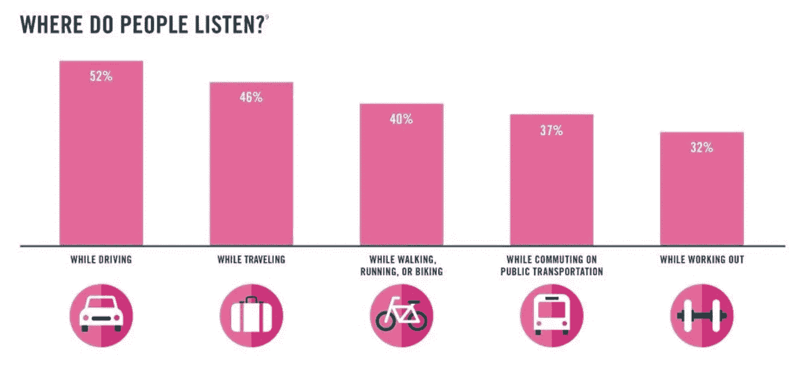
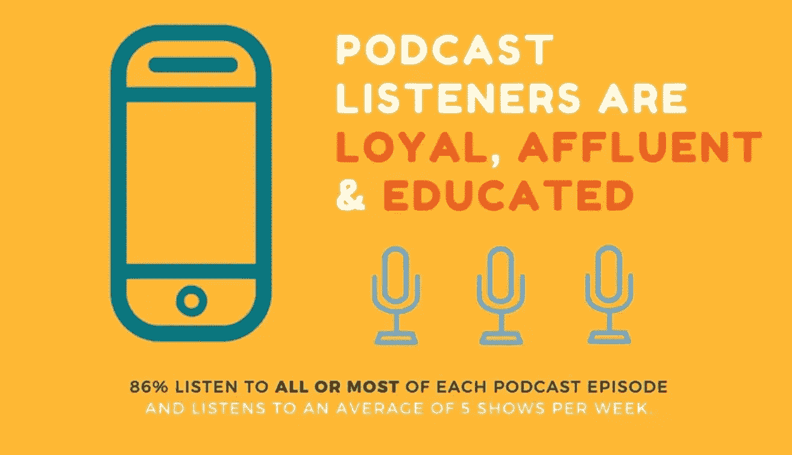

# 播客的兴起以及为什么“你”应该创建一个播客。

> 原文：<https://medium.com/swlh/the-rise-of-podcast-and-why-you-should-start-one-48e10a17b79e>

## 到 2020 年，数字语音激活设备市场预计将每年翻一番。

> 人们听播客有三个原因:非同寻常的亲密感，在开车或健身时高效处理多项任务的能力，以及精彩的故事——叙事的力量。

像许多皈依者一样，我在旅行和健身时听播客。**52%的人在开车时听播客，46%的人在旅行时听，40%的人在走路、跑步或骑自行车时听。**

## *奇怪的统计数据。*

**

*   *60%的美国人熟悉“播客”这个术语——高于 2016 年的 55%*
*   *50%的美国家庭是播客粉丝(尼尔森，2017 年 8 月)*
*   *40%(1.12 亿)的美国人听过播客，高于 2016 年的 36%*
*   *15%(4200 万人)每周收听播客，高于 2016 年的 13%*
*   *36%的播客听众是非白人，而 2010 年这一比例为 30%(尼尔森，2017 年 8 月)*
*   *播客听众在每一个社交媒体频道上都更加活跃(94%的人至少在一个频道上活跃——相比之下，整个人群中只有 81%的人活跃)*
*   *播客听众更有可能在社交媒体上关注公司和品牌*
*   *播客听众更有可能订阅网飞或亚马逊 Prime(这意味着他们不太可能接触到电视广告)*

## *这是什么意思？*

*这意味着语音支持技术的未来看起来是光明的，而且很明显播客正随着这项技术进入下一个阶段。*

**

*所有大型科技公司都在进入或计划进入这个市场，推出自己的设备:*

*   *使用亚马逊 Echo 系列设备的亚马逊(Alexa)*
*   *Google Home(以及 Android 上的个人助理)*
*   *苹果的 Homehub(以及 iPhone 和 iPad 上的个人助理 Siri)*
*   *微软推出基于 Cortana 的智能音箱 Invoke*
*   *阿里巴巴与天猫精灵*
*   *三星正在开发一款由新 Bixby 语音助手驱动的智能扬声器*
*   *联想正在开发其基于 Alexa 的智能设备(创造技能并从亚马逊的背后进行简介)*
*   *据报道，脸书正在打造一款类似亚马逊 Echo 的智能音箱，将于 2018 年底推出*
*   *Sonos 要发布一款可以支持多个语音助手的智能音箱。*

## *为什么你应该开始播客？*

*人类声音的力量通过音调和音调变化传达了比印刷文字更多的含义。*

**

***(1)移动移动&移动:***

*播客是智能手机的完美媒体，事实上，你可以在使用任何其他应用程序时收听播客。 [Anchr](http://anchrapp.com/) 在我看来，这是发布和记录的最快和最简单的方式——**这是一款允许你记录和分享自己谈话的应用**。这些声音片段被称为“波”。**主播的**口号是“世界上第一个真正的公共电台。不需要高科技设备，只需对着你的手机或耳机麦克风说话，就可以分发你的溢出物。*

***(2)数字评书“随时随地”。***

*podcast 讲故事的一个好处是它的移动性和可访问性:随着智能手机的出现，podcast 可以在任何地方听——在汽车里，在办公室，在咖啡店，在跑步机上和许多其他地方。*

***(3)品牌知名度和特定分销。这里有数以百万计的听众，他们想要全天候点播，想要便携、免费和定制的内容。提供常规的长篇内容可以让人们与你的品牌保持联系。播客正在成为品牌的代言人，并有助于品牌信息在其领域脱颖而出。***

> *你有没有想过，在你还不在场的平台上，不仅要接触读者，还要接触听众？这是可能的，通过简单的阅读内容。你已经发简讯了吗？如果你也发送音频简讯呢？我能给你的一个有趣的事实是，我的一些客户，仅仅通过在他们的时事通讯中插入音频，就记录了与最初预期相比高达 1600%的收听率增长。*

***(4)啮合&区别:***

*根据最近的一项研究，大约 85%的播客听众说他们听了全部或大部分剧集。通过开始一个播客，你不仅将自己从那些与你竞争某个特定领域的注意力的人中区分出来，而且你也给了书面内容一个选择。*

## *现在是时候了。*

*企业家加里·维纳查克总结如下:“请记住，音频和语音是迄今为止人类最自然的交互界面。我们喜欢说和听。根据尼尔森对 2016 年流媒体的统计，音频消耗大约是视频的 1.5 倍。这是巨大的。如果你是声音的媒介，现在是你的时候了。从今天开始创造。创建一个播客，将你的博客文章转换成音频，发展一项 Alexa 技能或者开始尝试 Google Home。在 AR、VR 和 AI 之前，音频将是消费者关注的下一个主要平台转移。今天就在这里！你要做什么？”*

**

> *音频的时间到了！*

# *我想做的是…*

****……就是写值得你花时间，能给你带来价值的东西。如果你喜欢阅读，请点击💚这样其他人也会看到它(你最多可以点击 50 次)！！****

*还有，如果你伸出手说‘嘿！’,那绝对会让我开心一天 via DM on[***insta gram***](https://www.instagram.com/iblamesid)***。真的很期待连接！*** 😊*

## *[-西德尼-](https://www.sidneypierucci.com/)*

**

## *这篇文章发表在 [The Startup](https://medium.com/swlh) 上，这是 Medium 最大的创业刊物，拥有 303，461+读者。*

## *在这里订阅接收[我们的头条新闻](http://growthsupply.com/the-startup-newsletter/)。*

**