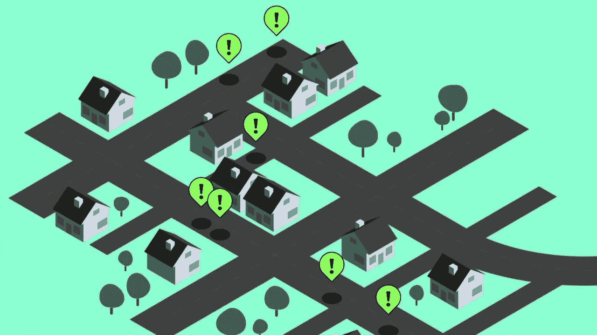

# 智能城市的兴起:弊大于利吗？

> 原文：<https://medium.com/swlh/the-rise-of-smart-cities-will-it-do-more-harm-than-good-e142346563ba>

## 实现实时城市更新的成本

“智慧城市”的最终目标是通过结合技术、数据分析和城市服务，提供城市的实时状态更新，以解决交通拥堵和环境污染等问题。然而，要实现这一目标，社会将面临不同的问题，如不同群体之间的不平等和利益冲突。这反过来需要制定政策来解决这些问题，同时促进智能城市的发展。

Rob Kitchin 在他 2014 年的文章《实时城市？《地理杂志》中的“大数据和城市化”指出，“实时”城市有各种优势，同时也关注了一个社会实现这一目标所需的牺牲。虽然与人力资本、教育和经济发展有关的政策有可能通过信息和通信技术得到加强，但与隐私、安全以及私营和公共部门之间的利益冲突有关的其他政策也有可能受到威胁。**政策制定者将承担微妙平衡潜在利益和威胁的任务，以确保智能城市的成功与保护公民权利相一致。**

**用户隐私和数据的收集**

了解用户隐私如何受到损害的一个方法是了解城市服务数据是如何收集的。Kitchin 指出，实时城市将主要依赖于自动数据收集。他特别提到，自动化形式的监控、通过物联网(IOT)创建的网络(使日常物品能够通过互联网通过传感器发送/接收数据)以及对人和物体的跟踪是管理城市最感兴趣的。城市中的这些网络的例子包括自动扫描车牌并将其与车主的详细信息进行匹配以跟踪车辆运动的摄像头，或者将小型廉价传感器(RFID 芯片)连接到垃圾桶上以检测它们是否被收集。随着不断收集关于人和事物的数据，一个城市可以被想象成一个不断增长的连接片段的星座。此外，捕捉这些数据流的能力有助于基于证据的政策分析，这对于客观衡量城市中正在发生的情况以及应该采取哪些措施来避免未来的城市问题至关重要。

> 这提供了一个诱人的未来愿景，但也引发了许多担忧。

**技术官僚治理**

作者提出的一个担忧是技术官僚治理。通过信息的反馈来管理一个城市导致了复杂的社会状况被分解成简单的可计算的问题。尽管这在理论上听起来很有吸引力，但技术官僚形式的治理范围非常狭窄，没有考虑到塑造和影响城市的文化、政治、政策、治理和资本的更广泛影响。智慧城市无法轻易解决植根于环境的结构性问题。相反，他们使用实时分析来解决这些根本问题的表现，方便地掩盖裂缝，而不是修复它们。

**错误红旗**

Streetbump App utilized in Boston to pinpoint pot holes

此外，智能城市容易发出错误的红旗。例如，Boston 发布了 street bump[【1】](#_ftn1)应用程序，利用智能手机中的加速度计和 GPS 来检测和报告路面坑洼。低收入群体和老年人不太可能拥有智能手机，这意味着该应用程序排除了该市大部分人口的数据，导致资金分配不平等。如果从智慧城市收集的数据不能准确反映城市中人们的活动，那么智慧城市使用数据的好处是否会超过成本？政策制定者必须采取措施确保数据收集的准确性和平等性，以确保公平和平等的代表性，无论公民属于哪个社会经济阶层、人口结构或城市地区。

**城市治理公司化**

Kitchin 认为，随着智能城市的创建，另一个可能出现的问题是城市治理的公司化。Kitchin 指出，人们已经担心政府由拥有巨大特殊利益的政客组成，并将放任开发智能城市相关技术的大公司自由开发。政策制定者应负责通过制定指导方针和监督手段以及确保公民数据的安全来减轻公民的担忧。

> **如果没有针对滥用和误用数据的监管和执法，市民很可能会对实时城市分析产生强烈的抵触和抵制。**

随着越来越多的生活方面和问题通过数据以动态的方式被捕获，支持更有效的治理模式的技术与公民的担忧之间的紧张关系将会加剧。对于政策制定者来说，考虑保护消费者数据隐私、数据中人口的准确表示以及监管智能基础设施的预算以充分获得城市分析的好处并获得社区的广泛接受将是至关重要的。

【http://www.cityofboston.gov/DoIT/apps/streetbump.asp】T2