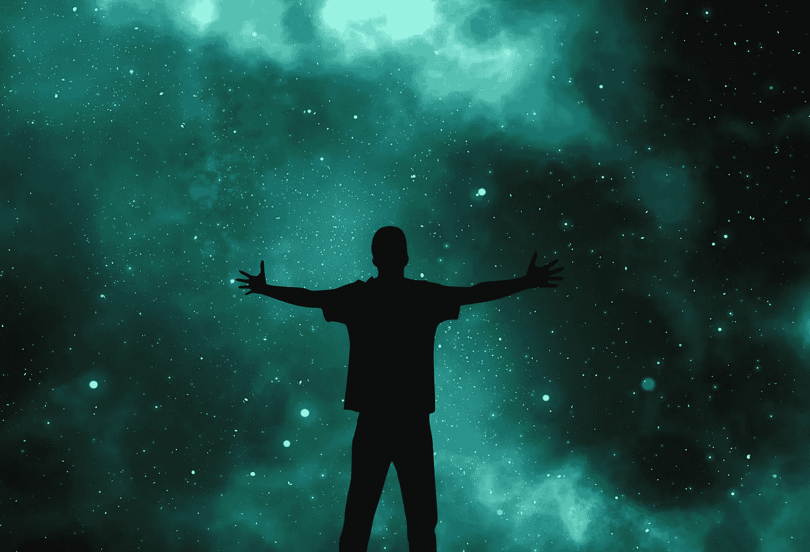

# 内容艺术家的崛起

> 原文：<https://medium.com/swlh/the-rise-of-the-content-artist-fb53d974511b>

***“一种艺术形式需要天才。天才总是麻烦制造者，这意味着他们从零开始，破坏公认的规范，重建一个新世界。”***

***~亨利·朗格卢瓦***

让我们开门见山吧。

**内容创作者正在成为内容艺术家。**

这种新的艺术形式正在出现。几个月前，我写了一篇关于社交媒体如何…